# 03 - Deep Learning

## Table of Contents
- [Neural Network Basics](#neural-network-basics)
- [Activation Functions](#activation-functions)
- [Forward & Backward Propagation](#forward--backward-propagation)
- [Convolutional Neural Networks (CNNs)](#convolutional-neural-networks)
- [CNN Architecture Evolution](#cnn-architecture-evolution)
- [Recurrent Neural Networks (RNNs)](#recurrent-neural-networks)
- [LSTMs and GRUs](#lstms-and-grus)
- [Transformers & Attention](#transformers--attention)
- [Optimization Algorithms](#optimization-algorithms)
- [Regularization in Deep Learning](#regularization-in-deep-learning)
- [Loss Functions](#loss-functions)
- [Transfer Learning](#transfer-learning)
- [Normalization Techniques](#normalization-techniques)

---

## Neural Network Basics

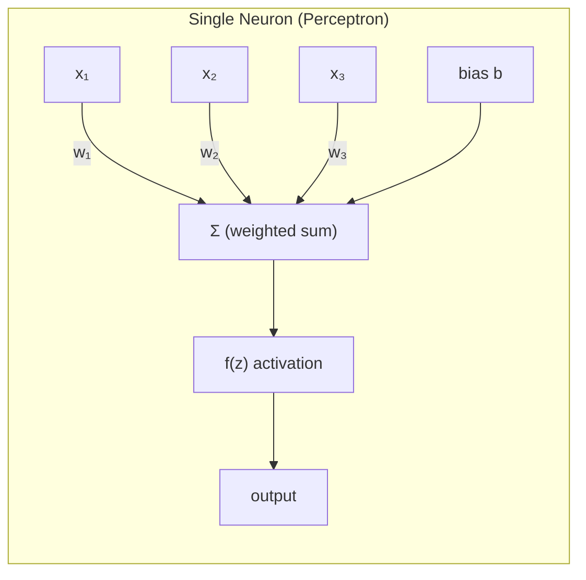

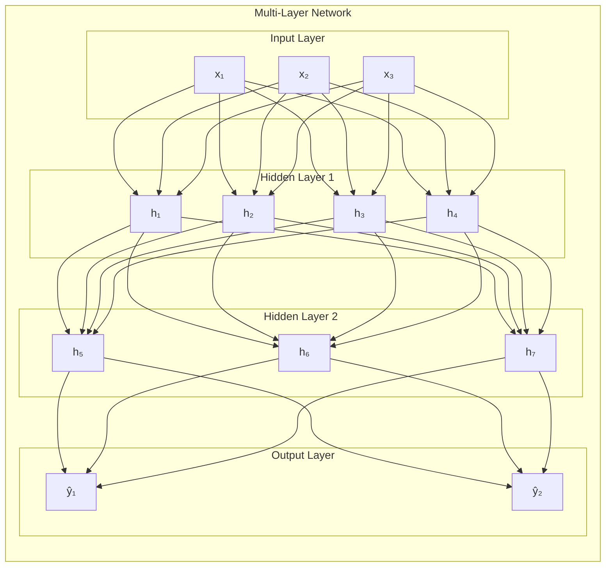

**Universal Approximation Theorem**: A neural network with a single hidden layer of sufficient width can approximate any continuous function. However, deeper networks are exponentially more efficient than shallow wide ones.

> **Q: Why do we need non-linear activation functions?**
>
> **A:** Without activation functions, stacking linear layers produces another linear function (composition of linear functions is linear): W₂(W₁x + b₁) + b₂ = W₂W₁x + W₂b₁ + b₂ = W'x + b'. The network would be equivalent to a single linear layer regardless of depth. Non-linear activations allow the network to learn complex, non-linear decision boundaries.

---

## Activation Functions

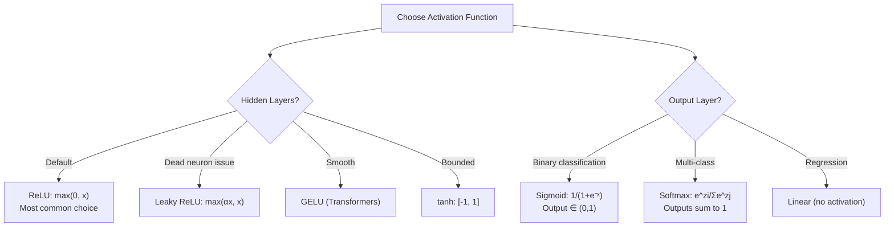

| Activation | Formula | Range | Pros | Cons |
|-----------|---------|-------|------|------|
| **Sigmoid** | 1/(1+e⁻ˣ) | (0, 1) | Probability output | Vanishing gradient, not zero-centered |
| **tanh** | (eˣ-e⁻ˣ)/(eˣ+e⁻ˣ) | (-1, 1) | Zero-centered | Vanishing gradient |
| **ReLU** | max(0, x) | [0, ∞) | Fast, no vanishing gradient | Dead neurons (output 0 forever) |
| **Leaky ReLU** | max(αx, x), α=0.01 | (-∞, ∞) | No dead neurons | Small α to tune |
| **ELU** | x if x>0, α(eˣ-1) if x≤0 | (-α, ∞) | Smooth, no dead neurons | Slower (exp) |
| **GELU** | x·Φ(x) | (-0.17, ∞) | Smooth, used in Transformers | Slower |
| **Swish/SiLU** | x·σ(x) | (-0.28, ∞) | Smooth, self-gated | Slightly slower |

> **Q: What is the vanishing gradient problem?**
>
> **A:** During backpropagation, gradients are multiplied through layers (chain rule). Sigmoid/tanh have max derivative of 0.25/1.0 respectively. Through many layers, gradients shrink exponentially → early layers barely update → network can't learn deep features.
>
> **Solutions:**
> - ReLU activation (gradient is 1 for positive inputs)
> - Residual connections (skip connections)
> - Proper initialization (Xavier, He)
> - Batch normalization
> - LSTM/GRU for sequences (gating mechanism)

> **Q: What is the dying ReLU problem?**
>
> **A:** If a neuron's input is always negative (due to large negative bias or learning), ReLU outputs 0 and gradient is 0 → neuron never updates → "dead." Can affect 10-40% of neurons. **Fix:** Leaky ReLU, ELU, or careful initialization + lower learning rate.

---

## Forward & Backward Propagation

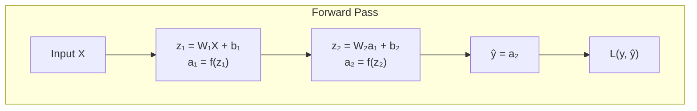

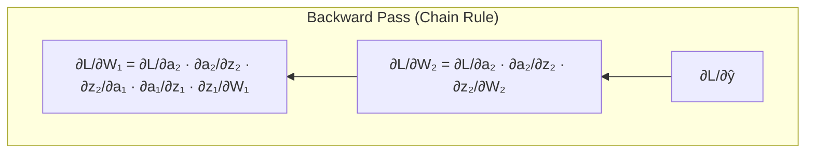

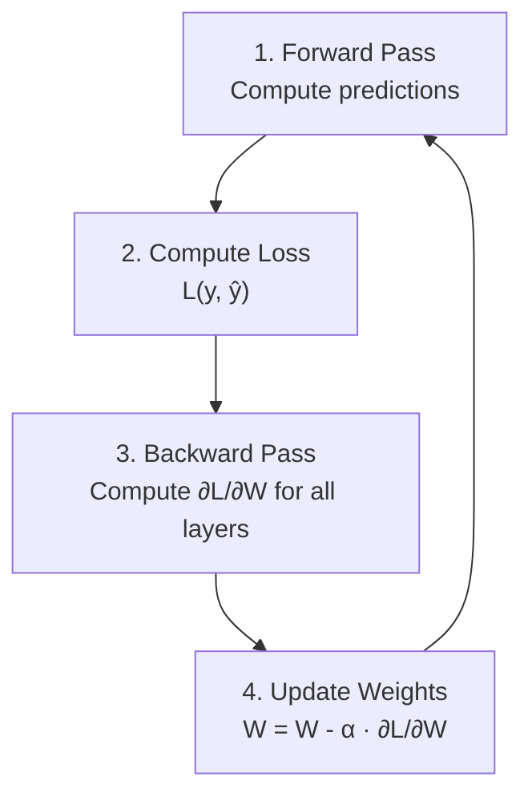

> **Q: Explain backpropagation step by step.**
>
> **A:**
> 1. **Forward pass**: Feed input through network layer by layer, computing activations. Store intermediate values.
> 2. **Compute loss**: Compare output with true label using loss function.
> 3. **Backward pass**: Apply chain rule from output to input:
>    - Compute gradient of loss w.r.t. output layer weights
>    - Propagate gradient backward through each layer
>    - At each layer: ∂L/∂W = (upstream gradient) × (local gradient)
> 4. **Update weights**: W_new = W_old - learning_rate × gradient
>
> **Key insight**: Backprop is just the chain rule applied recursively. Each layer needs to compute and pass back two things: gradient w.r.t. its weights (for update) and gradient w.r.t. its input (to pass to previous layer).

---

## Convolutional Neural Networks

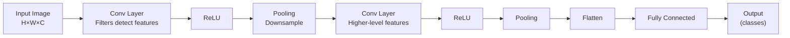

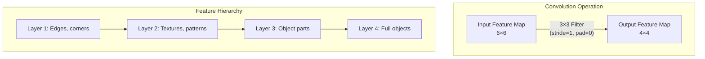

**Key Formulas:**
- **Output size**: (W - F + 2P) / S + 1, where W=input size, F=filter size, P=padding, S=stride
- **Parameters per conv layer**: F × F × C_in × C_out + C_out (bias)

| Component | Purpose |
|-----------|---------|
| **Convolution** | Extract local features via learnable filters |
| **Pooling (Max/Avg)** | Downsample, reduce computation, add translation invariance |
| **Stride > 1** | Alternative to pooling for downsampling |
| **Padding** | Preserve spatial dimensions (same padding) |
| **1×1 Convolution** | Channel mixing, dimensionality reduction |

> **Q: Why are CNNs better than fully connected networks for images?**
>
> **A:** Three key properties:
> 1. **Local connectivity**: Each neuron connects to a small region, not the entire image. Matches how visual features are local.
> 2. **Weight sharing**: Same filter applied across entire image → drastically fewer parameters. A 3×3 filter has 9 params regardless of image size.
> 3. **Translation invariance**: A cat detected in the corner is also detected in the center (same filters).
>
> Fully connected: 224×224×3 image = 150K input neurons × hidden neurons = billions of parameters. CNN: same image with shared 3×3 filters = thousands of parameters.

---

## CNN Architecture Evolution

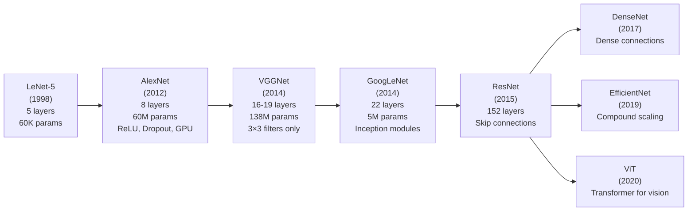

| Architecture | Key Innovation | Params | Top-5 Error |
|-------------|---------------|--------|-------------|
| **AlexNet** | ReLU, Dropout, GPU training | 60M | 16.4% |
| **VGGNet** | Small 3×3 filters stacked deep | 138M | 7.3% |
| **GoogLeNet** | Inception module (parallel filter sizes) | 5M | 6.7% |
| **ResNet** | Skip connections (residual learning) | 25M (50L) | 3.6% |
| **DenseNet** | Each layer connects to all previous | 20M | Similar to ResNet |
| **EfficientNet** | Compound scaling (depth×width×resolution) | 5-66M | Better efficiency |

> **Q: Why does ResNet work? What's the skip connection?**
>
> **A:** ResNet adds **skip (residual) connections** that bypass layers: output = F(x) + x
>
> Instead of learning the full mapping H(x), each block learns the residual F(x) = H(x) - x. Why this helps:
> 1. **Gradient flow**: Gradients can flow directly through skip connections, solving vanishing gradient in very deep networks
> 2. **Easy to learn identity**: If a layer isn't needed, weights can go to 0 (F(x) = 0, output = x). Without skip connections, learning the identity mapping is hard.
> 3. **Enables 100+ layer networks**: Before ResNet, networks > 20 layers degraded.
>
> **Identity shortcut**: x and F(x) must have same dimensions. If not, use 1×1 conv to match dimensions (projection shortcut).

---

## Recurrent Neural Networks

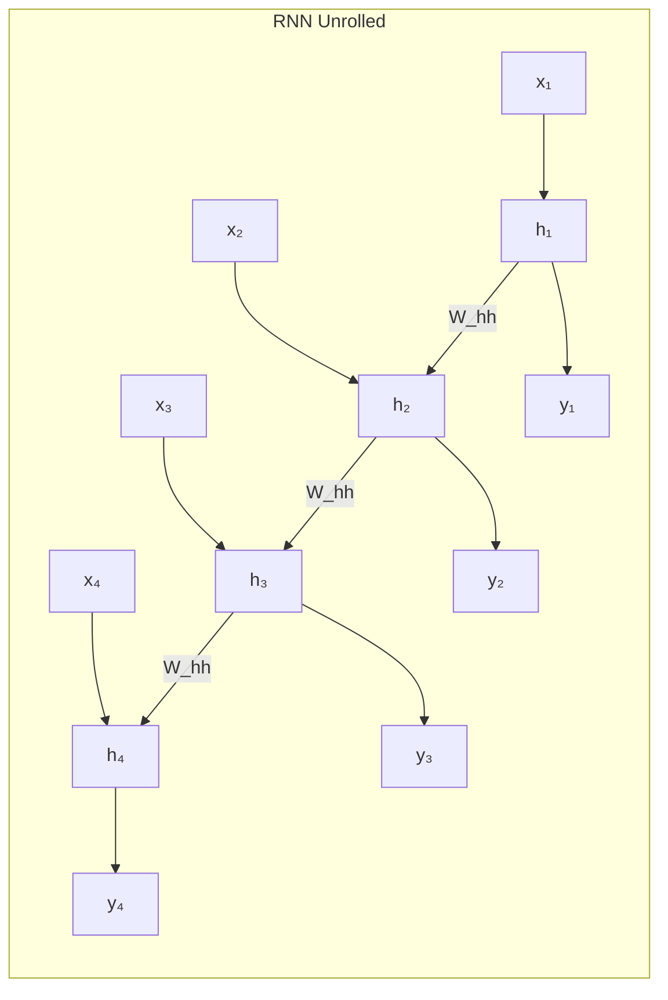

**Formula:** h_t = tanh(W_xh · x_t + W_hh · h_{t-1} + b)

**Problems:**
- **Vanishing gradient**: Gradient diminishes over long sequences → can't capture long-range dependencies
- **Exploding gradient**: Gradient grows exponentially → training instability (fix: gradient clipping)

> **Q: What problem do LSTMs solve that vanilla RNNs can't?**
>
> **A:** Vanilla RNNs can't learn **long-range dependencies** due to vanishing gradients. In a sentence like "The cat, which sat on the mat and purred loudly, **was** happy" — RNN can't connect "cat" to "was" through many timesteps.
>
> LSTM solves this with a **cell state** (memory highway) that can carry information across many timesteps with minimal gradient degradation. Gates control what to remember/forget.

---

## LSTMs and GRUs

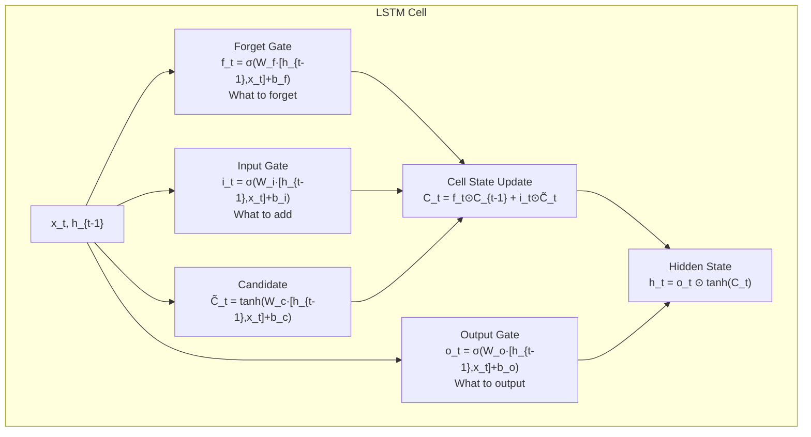

### LSTM vs GRU

| Feature | LSTM | GRU |
|---------|------|-----|
| **Gates** | 3 (forget, input, output) | 2 (reset, update) |
| **Memory** | Separate cell state + hidden state | Only hidden state |
| **Parameters** | More (4 weight matrices) | Fewer (3 weight matrices) |
| **Performance** | Better for long sequences | Comparable, sometimes better for small data |
| **Training Speed** | Slower | Faster (fewer params) |
| **Use When** | Long sequences, need more capacity | Shorter sequences, limited data/compute |

> **Q: Explain the gates in an LSTM.**
>
> **A:** LSTM has three gates, all using sigmoid (output 0-1 → how much to let through):
>
> 1. **Forget Gate (f_t)**: Decides what to remove from cell state. σ = 0 → forget completely, σ = 1 → keep everything. Example: when seeing a new subject in a sentence, forget the old subject's gender.
>
> 2. **Input Gate (i_t)**: Decides what new information to store. Works with candidate values (tanh) to update cell state. Example: store the new subject's properties.
>
> 3. **Output Gate (o_t)**: Decides what parts of cell state to output as hidden state. Example: if current word is a verb, output subject info that's relevant for conjugation.
>
> **Cell state** is the key innovation — it flows through time with only linear operations (multiply by forget gate, add from input gate), so gradients flow easily.

---

## Transformers & Attention

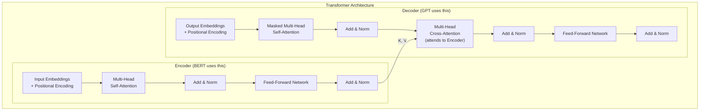

### Self-Attention Mechanism

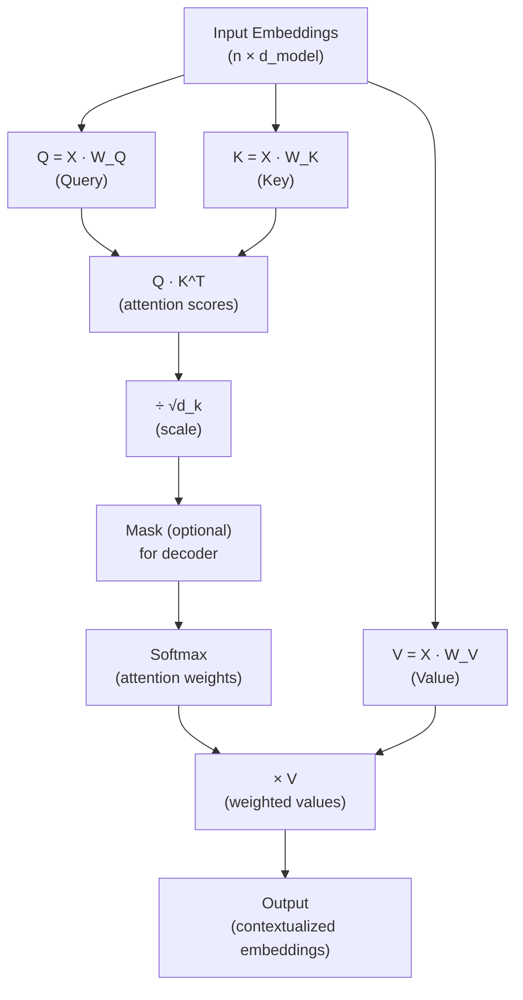

**Attention Formula:** Attention(Q, K, V) = softmax(QK^T / √d_k) · V

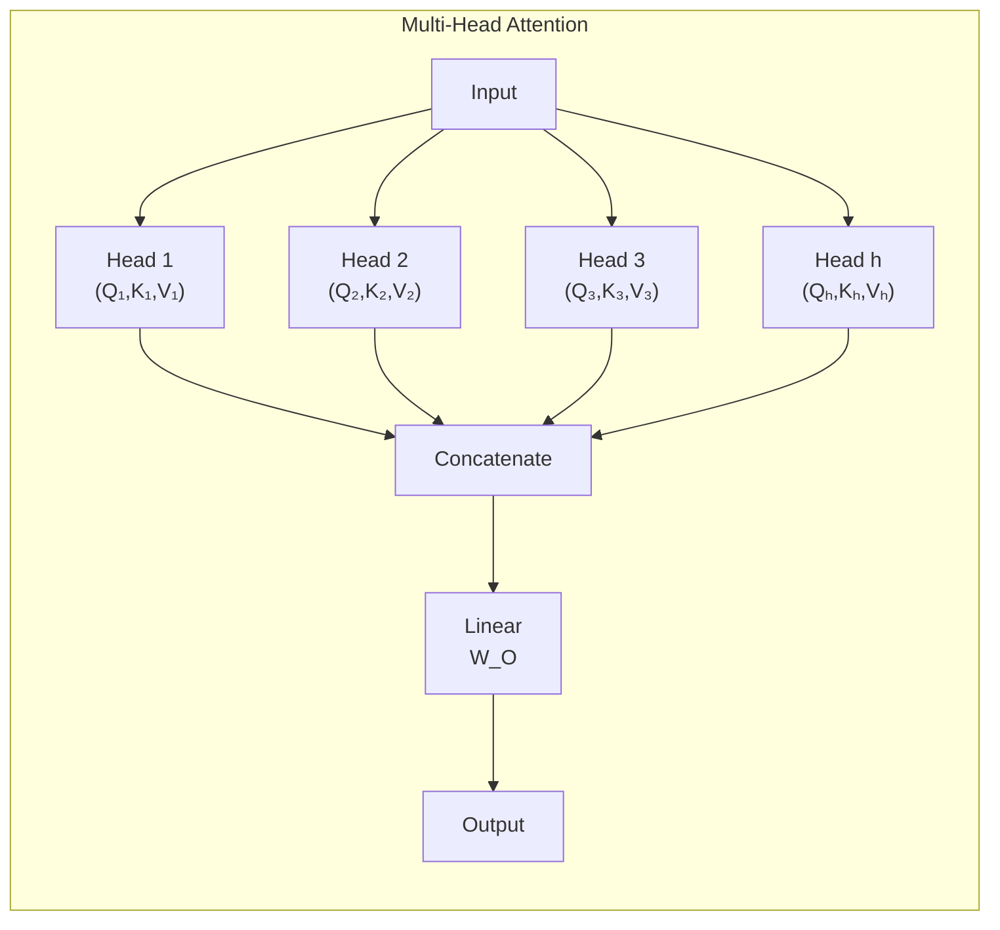

> **Q: Explain the Transformer architecture.**
>
> **A:** The Transformer (Vaswani et al., 2017) uses **self-attention** instead of recurrence:
>
> **Core components:**
> 1. **Input Embedding + Positional Encoding**: Since no recurrence, add position info via sinusoidal or learned embeddings
> 2. **Multi-Head Self-Attention**: Each token attends to all other tokens. Multiple heads capture different types of relationships.
> 3. **Feed-Forward Network**: Two linear layers with ReLU/GELU between. Applied position-wise.
> 4. **Add & Norm**: Residual connection + layer normalization after each sublayer
>
> **Encoder** (used by BERT): Bidirectional attention — each token sees all others
> **Decoder** (used by GPT): Masked attention — each token can only see previous tokens (autoregressive)
>
> **Advantages over RNNs:**
> - Parallel computation (no sequential dependency)
> - O(1) path length between any two positions (vs O(n) for RNN)
> - Captures long-range dependencies easily

> **Q: Explain self-attention mechanism step by step.**
>
> **A:**
> 1. For each token, compute three vectors using learned weight matrices:
>    - **Query (Q)**: "What am I looking for?"
>    - **Key (K)**: "What do I contain?"
>    - **Value (V)**: "What information do I provide?"
> 2. Compute attention scores: Q · K^T (dot product of each query with all keys)
> 3. Scale by √d_k to prevent softmax saturation in high dimensions
> 4. Apply softmax → attention weights (how much each token attends to every other)
> 5. Multiply weights by V → weighted combination of values
>
> **Multi-head**: Split Q, K, V into h heads, run attention in parallel, concatenate. This allows the model to jointly attend to information from different representation subspaces (e.g., one head for syntax, another for semantics).

> **Q: Why do we scale by √d_k in attention?**
>
> **A:** For large d_k, the dot products Q·K^T grow large in magnitude, pushing softmax into regions with extremely small gradients (saturated softmax outputs near 0 or 1). Scaling by √d_k keeps the variance of dot products at approximately 1, ensuring effective gradient flow.

### Positional Encoding

> **Q: Why do Transformers need positional encoding?**
>
> **A:** Self-attention is **permutation invariant** — it treats the input as a set, not a sequence. "Dog bites man" and "Man bites dog" would produce the same attention weights without position info. Positional encoding injects order information.
>
> **Sinusoidal** (original): PE(pos, 2i) = sin(pos/10000^(2i/d)), PE(pos, 2i+1) = cos(pos/10000^(2i/d)). Can generalize to unseen sequence lengths.
>
> **Learned** (BERT, GPT): Trainable position embeddings. Works well but limited to training sequence length.
>
> **RoPE** (Rotary, used in modern LLMs): Encodes relative position through rotation of Q and K vectors. Better extrapolation.

---

## Optimization Algorithms

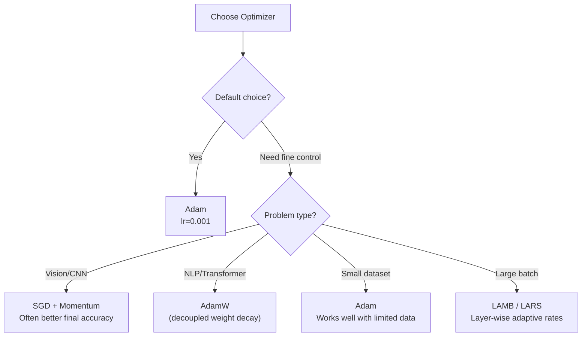

| Optimizer | Update Rule | Key Property |
|-----------|-----------|-------------|
| **SGD** | θ -= α·∇L | Simple, can converge to sharp minima |
| **SGD + Momentum** | v = βv - α·∇L; θ += v | Accelerates in consistent gradient direction |
| **Nesterov** | Look ahead, then correct | Faster convergence than standard momentum |
| **Adagrad** | Adapts lr per parameter (divides by sum of squared grads) | Good for sparse features, lr decays too fast |
| **RMSprop** | Like Adagrad but uses moving average | Fixes Adagrad's decaying lr |
| **Adam** | Momentum + RMSprop (first & second moment estimates) | Default choice, works well in most cases |
| **AdamW** | Adam with decoupled weight decay | Standard for Transformers |

> **Q: Explain Adam optimizer.**
>
> **A:** Adam = Adaptive Moment Estimation. Combines two ideas:
> 1. **Momentum (first moment m)**: Running average of gradients → smooths out oscillations
>    m_t = β₁·m_{t-1} + (1-β₁)·g_t
> 2. **RMSprop (second moment v)**: Running average of squared gradients → per-parameter learning rate
>    v_t = β₂·v_{t-1} + (1-β₂)·g_t²
> 3. **Bias correction**: m̂ = m/(1-β₁ᵗ), v̂ = v/(1-β₂ᵗ) (important in early steps)
> 4. **Update**: θ -= α · m̂ / (√v̂ + ε)
>
> Default: β₁=0.9, β₂=0.999, ε=1e-8
>
> **AdamW** decouples weight decay from the adaptive learning rate, which is important for proper regularization with adaptive optimizers.

### Learning Rate Scheduling

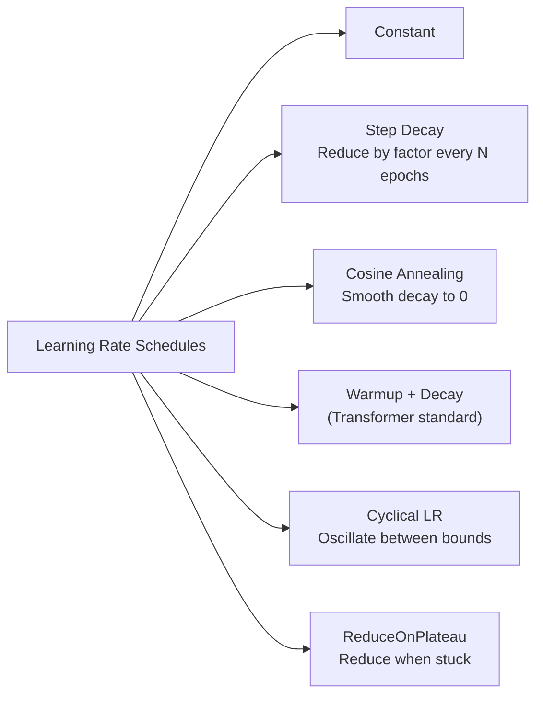

> **Q: Why use learning rate warmup?**
>
> **A:** In the first few steps, Adam's second moment estimate (v) is biased toward 0, causing large effective learning rates. Warmup starts with a small lr and linearly increases it, giving the optimizer time to build accurate moment estimates. Especially important for Transformers and large batch training.

---

## Regularization in Deep Learning

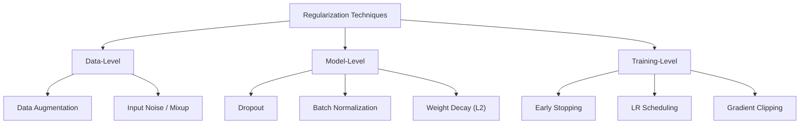

### Dropout

> **Q: How does Dropout work and why does it regularize?**
>
> **A:** During training, randomly set each neuron's output to 0 with probability p (typically 0.1-0.5).
>
> **Why it works:**
> 1. Prevents co-adaptation — neurons can't rely on specific other neurons
> 2. Implicit ensemble — each forward pass uses a different sub-network
> 3. Equivalent to training 2^n different networks and averaging
>
> **At test time:** Use all neurons but multiply outputs by (1-p) to compensate for the larger network. Or equivalently, multiply training outputs by 1/(1-p) (**inverted dropout**, more common).
>
> **Note:** Dropout is NOT used with BatchNorm typically. BatchNorm already provides regularization.

---

## Loss Functions

| Loss | Task | Formula | Notes |
|------|------|---------|-------|
| **MSE** | Regression | Σ(y-ŷ)²/n | Sensitive to outliers |
| **MAE** | Regression | Σ\|y-ŷ\|/n | Robust to outliers |
| **Huber** | Regression | MSE if small error, MAE if large | Best of both |
| **Binary Cross-Entropy** | Binary classification | -[y·log(p)+(1-y)·log(1-p)] | Use with sigmoid |
| **Categorical Cross-Entropy** | Multi-class | -Σ yᵢ·log(pᵢ) | Use with softmax |
| **Focal Loss** | Imbalanced classification | -(1-p)^γ · log(p) | Down-weights easy examples |
| **Hinge Loss** | SVM classification | max(0, 1-y·ŷ) | Margin-based |
| **Triplet Loss** | Metric learning | max(0, d(a,p)-d(a,n)+margin) | Embeddings |
| **Contrastive Loss** | Self-supervised | Pull similar, push dissimilar | SimCLR, CLIP |

---

## Transfer Learning

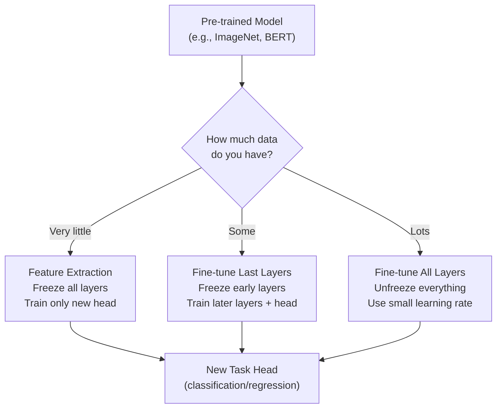

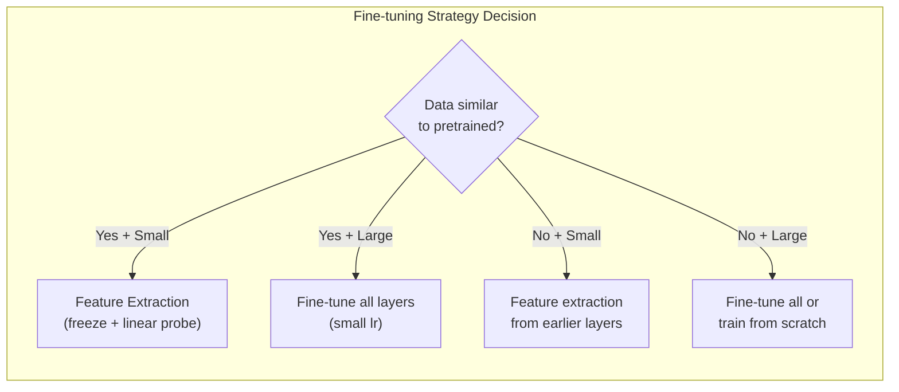

> **Q: When and how should you use transfer learning?**
>
> **A:** Transfer learning leverages knowledge from a pre-trained model. Steps:
> 1. Take a model pre-trained on a large dataset (ImageNet for vision, BookCorpus for NLP)
> 2. Replace the final layer(s) with task-specific head
> 3. Choose strategy based on your data:
>    - **Little data, similar domain**: Freeze everything, train only the head
>    - **More data, similar domain**: Unfreeze last few layers, fine-tune with small lr
>    - **Lots of data, different domain**: Fine-tune everything or train from scratch
>
> **Key tips:**
> - Use lower learning rate for pretrained layers (10-100x smaller) — "discriminative learning rates"
> - Gradually unfreeze layers (start from top, work down)
> - Always use the same preprocessing as the pretrained model

---

## Normalization Techniques

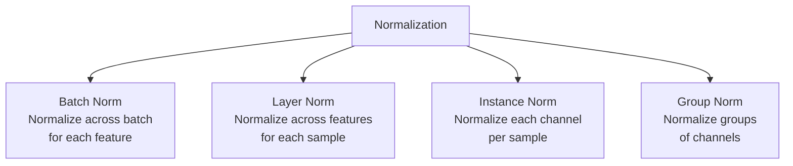

| Technique | Normalizes Across | Used In | Batch Size Dependent? |
|-----------|-------------------|---------|----------------------|
| **BatchNorm** | Batch dimension | CNNs | Yes (needs large batch) |
| **LayerNorm** | Feature dimension | Transformers, RNNs | No |
| **InstanceNorm** | Spatial dimensions per channel | Style transfer | No |
| **GroupNorm** | Groups of channels | Small batch CNNs | No |

> **Q: BatchNorm vs LayerNorm — when to use which?**
>
> **A:**
> - **BatchNorm**: Normalizes each feature across the batch. Works great for CNNs with large batches. Maintains running mean/variance for inference. But: depends on batch size (fails with small batches), inconsistent train/test behavior.
>
> - **LayerNorm**: Normalizes all features within each sample. No batch dependency. Standard for Transformers/RNNs. Consistent at train and test time.
>
> **Rule:** CNNs → BatchNorm. Transformers/RNNs → LayerNorm. Small batches → GroupNorm or LayerNorm.

> **Q: Why does BatchNorm help training?**
>
> **A:** BatchNorm normalizes layer inputs to zero mean, unit variance, then applies learnable scale (γ) and shift (β):
>
> Benefits:
> 1. **Reduces internal covariate shift**: Layer inputs stay stable even as earlier layers change
> 2. **Enables higher learning rates**: Normalized inputs → less risk of divergence
> 3. **Regularization effect**: Mini-batch statistics add noise → implicit regularization
> 4. **Smoother loss landscape**: Makes optimization easier

---

## Quick Recall Summary

| Concept | Key Point |
|---------|-----------|
| Activation Functions | ReLU for hidden (default), sigmoid for binary output, softmax for multi-class |
| Vanishing Gradient | Sigmoid/tanh in deep nets. Fix: ReLU, skip connections, LSTM gates |
| CNN | Local connectivity + weight sharing + pooling. Translation invariant. |
| ResNet | Skip connections: output = F(x) + x. Enables 100+ layers. |
| RNN | Sequential data. h_t = f(x_t, h_{t-1}). Vanishing gradient for long sequences. |
| LSTM | Cell state + 3 gates (forget, input, output). Solves long-range dependencies. |
| Transformer | Self-attention + positional encoding. Parallel, no recurrence. |
| Attention | softmax(QK^T/√d_k)V. Q=query, K=key, V=value. |
| Multi-Head | h parallel attention heads → different relationship types. |
| Adam | Momentum + RMSprop. Default optimizer. AdamW for Transformers. |
| Dropout | Randomly zero neurons during training. Regularization via implicit ensemble. |
| BatchNorm vs LayerNorm | BatchNorm for CNNs, LayerNorm for Transformers. |
| Transfer Learning | Pretrained model → fine-tune. Less data → freeze more layers. |
