# 04 - Natural Language Processing & Large Language Models

## Table of Contents
- [NLP Pipeline Overview](#nlp-pipeline-overview)
- [Text Preprocessing](#text-preprocessing)
- [Word Embeddings](#word-embeddings)
- [Tokenization](#tokenization)
- [BERT Architecture](#bert-architecture)
- [GPT Architecture](#gpt-architecture)
- [BERT vs GPT Comparison](#bert-vs-gpt-comparison)
- [Modern LLM Landscape](#modern-llm-landscape)
- [Retrieval-Augmented Generation (RAG)](#retrieval-augmented-generation)
- [Prompt Engineering](#prompt-engineering)
- [Fine-tuning Strategies](#fine-tuning-strategies)
- [NLP Tasks & Benchmarks](#nlp-tasks--benchmarks)

---

## NLP Pipeline Overview

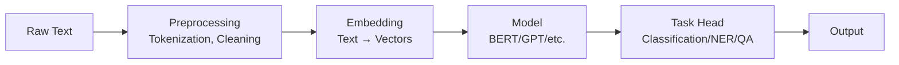

---

## Text Preprocessing

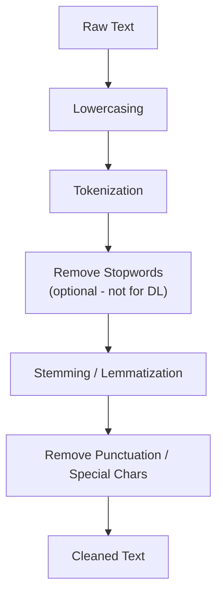

| Step | Description | Example |
|------|-------------|---------|
| **Lowercasing** | Normalize case | "Hello World" → "hello world" |
| **Tokenization** | Split into tokens | "I can't" → ["I", "can", "'t"] |
| **Stopword Removal** | Remove common words | Remove "the", "is", "at" |
| **Stemming** | Reduce to root form (rule-based) | "running" → "run", "better" → "better" |
| **Lemmatization** | Reduce to dictionary form | "running" → "run", "better" → "good" |

> **Q: When should you skip stopword removal?**
>
> **A:** Skip stopword removal when using deep learning models (BERT, GPT) because:
> 1. These models understand context — stopwords carry meaning ("not" is critical for sentiment)
> 2. Subword tokenizers handle vocabulary efficiently
> 3. Attention mechanism learns to ignore irrelevant words
>
> Stopword removal is more relevant for classical models (TF-IDF, Bag of Words) where every word has equal representation cost.

---

## Word Embeddings

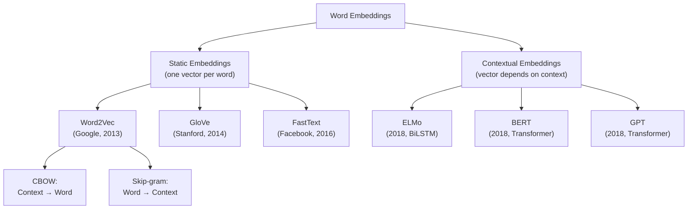

### Word2Vec: CBOW vs Skip-gram

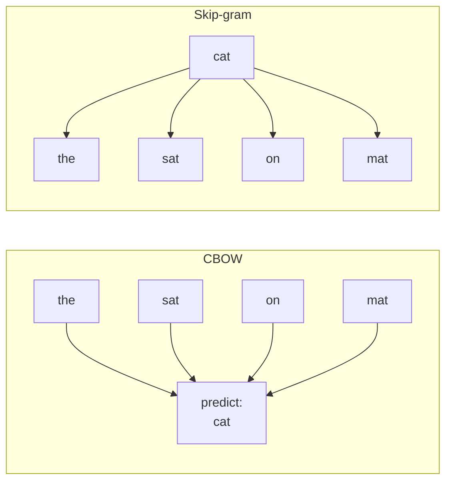

| Method | Input → Output | Speed | Rare Words |
|--------|---------------|-------|------------|
| **CBOW** | Context → Target word | Faster | Worse |
| **Skip-gram** | Target word → Context | Slower | Better |

| Embedding | Key Feature | Limitation |
|-----------|-------------|------------|
| **Word2Vec** | Learns from local context windows | No subword info, OOV problem |
| **GloVe** | Global co-occurrence statistics + local context | Same OOV problem |
| **FastText** | Subword n-grams (handles OOV) | Still static |
| **ELMo** | Contextualized (different vector per context) | BiLSTM-based, slower |
| **BERT** | Deep bidirectional context | Expensive to compute |

> **Q: What's the difference between static and contextual embeddings?**
>
> **A:**
> - **Static** (Word2Vec, GloVe): Each word gets ONE fixed vector regardless of context. "Bank" has the same vector in "river bank" and "bank account." Problem: can't handle polysemy.
> - **Contextual** (BERT, GPT): Each word gets a DIFFERENT vector based on its context. "Bank" in "river bank" ≠ "bank account." Captures nuanced meaning.
>
> Modern NLP almost exclusively uses contextual embeddings (from Transformers).

> **Q: How does Word2Vec work?**
>
> **A:** Word2Vec trains a shallow neural network to predict words from context (CBOW) or context from words (Skip-gram).
>
> **Key idea:** Words appearing in similar contexts get similar vectors. "King" and "Queen" appear near similar words → close in vector space.
>
> **Famous property:** Vector arithmetic works! king - man + woman ≈ queen.
>
> **Training:** Use negative sampling — for each positive (word, context) pair, sample random negative pairs. Model learns to distinguish real co-occurrences from random ones.

---

## Tokenization

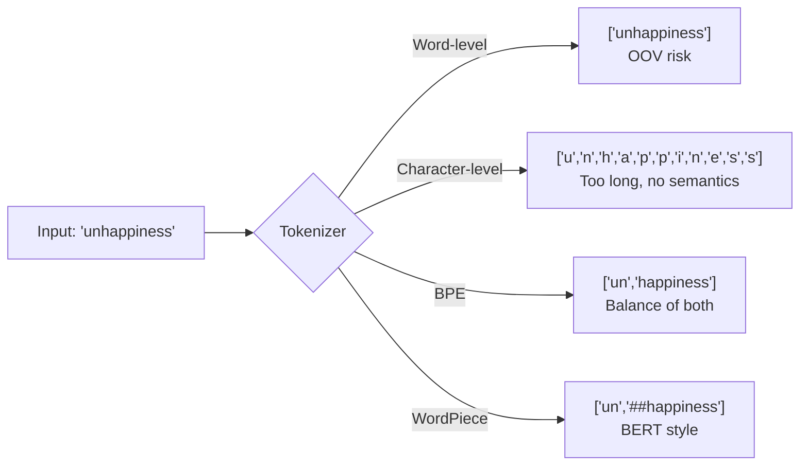

### Subword Tokenization Algorithms

| Algorithm | Used By | How It Works |
|-----------|---------|-------------|
| **BPE** (Byte-Pair Encoding) | GPT, RoBERTa, LLaMA | Start with characters, iteratively merge most frequent pairs |
| **WordPiece** | BERT, DistilBERT | Like BPE but merges based on likelihood increase, not frequency |
| **SentencePiece** | T5, ALBERT, XLNet | Language-independent, treats input as raw Unicode. Uses BPE or Unigram |
| **Unigram** | T5 (via SentencePiece) | Starts with large vocab, iteratively removes tokens that least affect loss |

> **Q: Explain BPE tokenization.**
>
> **A:** Byte-Pair Encoding builds vocabulary iteratively:
> 1. Start with all individual characters as vocabulary
> 2. Count all adjacent character pairs in training data
> 3. Merge the most frequent pair into a new token
> 4. Repeat until vocabulary reaches desired size (e.g., 50K tokens)
>
> **Example:**
> - Corpus has "l o w" (5 times), "l o w e r" (2 times), "n e w" (6 times)
> - Most frequent pair: "e w" → merge to "ew"
> - Next: "n ew" → merge to "new"
> - Continue...
>
> **Why BPE:** Balances vocabulary size with sequence length. Common words stay whole ("the"), rare words split into subwords ("unhappiness" → "un" + "happiness"). No OOV problem.

> **Q: Why use subword tokenization instead of word-level?**
>
> **A:**
> 1. **No OOV (out-of-vocabulary) problem**: Any word can be represented as subword combinations
> 2. **Morphological awareness**: "un" + "happy" + "ness" captures meaningful parts
> 3. **Compact vocabulary**: ~30K-50K tokens covers most text (vs millions for word-level)
> 4. **Cross-lingual sharing**: Subwords can be shared across related languages

---

## BERT Architecture

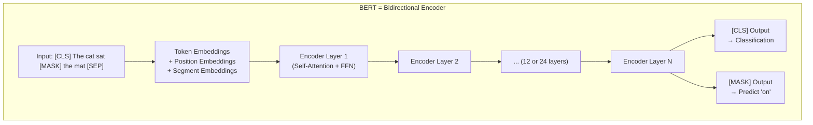

**Pre-training Tasks:**

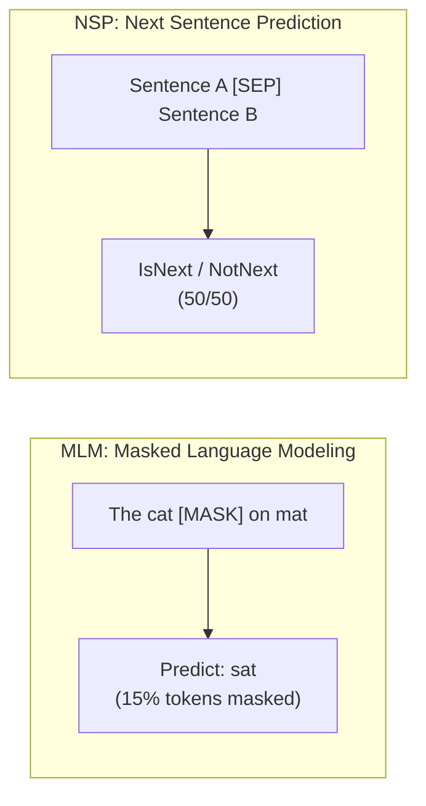

| BERT Variant | Layers | Hidden Size | Heads | Params |
|-------------|--------|-------------|-------|--------|
| **BERT-Base** | 12 | 768 | 12 | 110M |
| **BERT-Large** | 24 | 1024 | 16 | 340M |
| **DistilBERT** | 6 | 768 | 12 | 66M |
| **RoBERTa** | 12/24 | 768/1024 | 12/16 | 125M/355M |
| **ALBERT** | 12 | 768 | 12 | 12M |

> **Q: How does BERT work?**
>
> **A:** BERT = Bidirectional Encoder Representations from Transformers
>
> **Architecture:** Stack of Transformer **encoder** layers (self-attention is bidirectional — each token sees all other tokens).
>
> **Pre-training** (on large unlabeled text):
> 1. **MLM (Masked Language Modeling)**: Randomly mask 15% of tokens, predict them. Forces model to understand context from both directions.
> 2. **NSP (Next Sentence Prediction)**: Given two sentences, predict if B follows A. Teaches sentence-level relationships. (RoBERTa showed this isn't actually necessary.)
>
> **Fine-tuning** (on labeled task data):
> - Add task-specific head on top of BERT output
> - **Classification**: Use [CLS] token output → linear layer → softmax
> - **Token-level tasks (NER)**: Use each token's output → linear layer
> - **QA**: Predict start and end positions in the passage
>
> Fine-tuning is fast because BERT already understands language. Just need to teach it the task.

---

## GPT Architecture

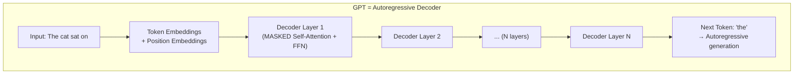

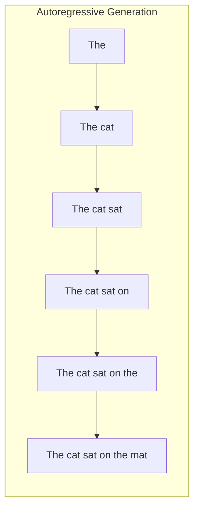

| GPT Version | Params | Key Innovation |
|------------|--------|---------------|
| **GPT-1** | 117M | Transformer decoder for language |
| **GPT-2** | 1.5B | Showed scaling works; zero-shot ability |
| **GPT-3** | 175B | Few-shot learning via in-context learning |
| **GPT-4** | ~1.8T (rumored) | Multimodal (text + vision), MoE |
| **GPT-4o** | Unknown | Native multimodal (text, audio, vision) |

> **Q: How does GPT generate text?**
>
> **A:** GPT uses **autoregressive generation**:
> 1. Feed input tokens through Transformer decoder layers
> 2. Each layer uses **masked self-attention** — each token can only attend to previous tokens (no peeking ahead)
> 3. Output layer predicts probability distribution over vocabulary for next token
> 4. Sample or pick the most likely next token
> 5. Append to input and repeat
>
> **Key:** Training objective is simply **next token prediction** on massive text corpora. This simple objective, at scale, produces remarkable capabilities (in-context learning, reasoning, code generation).
>
> **Decoding strategies:**
> - **Greedy**: Always pick most likely token (deterministic, can be repetitive)
> - **Beam search**: Explore top-k sequences (better quality, still can be repetitive)
> - **Top-k sampling**: Sample from top k tokens (more diverse)
> - **Top-p (nucleus) sampling**: Sample from smallest set whose cumulative probability ≥ p
> - **Temperature**: Scale logits before softmax. T < 1 → more confident, T > 1 → more random

---

## BERT vs GPT Comparison

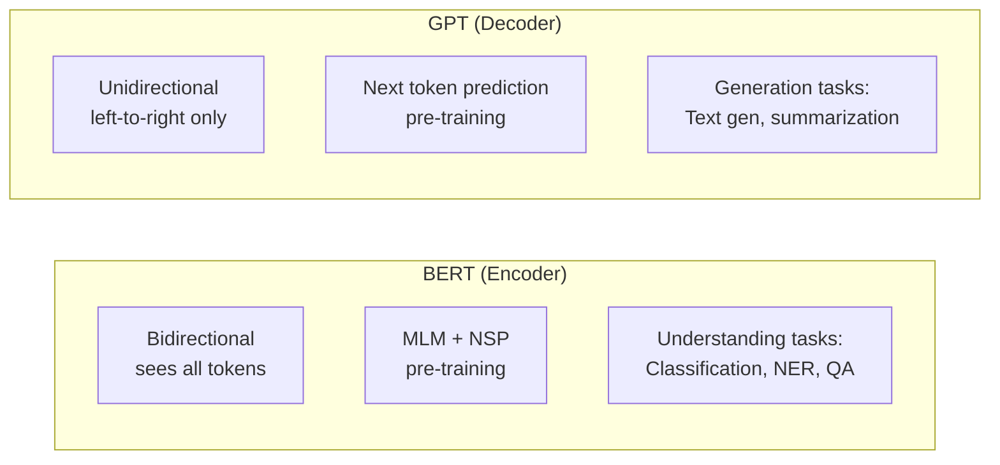

| Aspect | BERT | GPT |
|--------|------|-----|
| **Architecture** | Encoder only | Decoder only |
| **Attention** | Bidirectional (see all tokens) | Causal/Masked (see only left context) |
| **Pre-training** | MLM + NSP | Next token prediction |
| **Strengths** | Understanding, classification, NER, QA | Generation, few-shot, reasoning |
| **Fine-tuning** | Add task head, fine-tune | Prompt-based, few-shot, or fine-tune |
| **Output** | Contextual embeddings per token | Next token probability |
| **Modern Usage** | Embeddings, retrieval, classification | Chatbots, code gen, creative writing |

> **Q: Explain BERT vs GPT differences.**
>
> **A:** The fundamental difference is **directionality**:
> - **BERT** sees the full context (bidirectional). "The [MASK] sat on the mat" — BERT uses both left ("The") and right ("sat on the mat") to predict "cat." This makes it great at **understanding** — classification, NER, extractive QA.
> - **GPT** only sees left context (autoregressive). "The cat sat on the ___" — GPT only uses what came before to predict the next word. This makes it great at **generation** — text completion, summarization, dialogue.
>
> **Why not bidirectional generation?** You can't generate text by looking at words you haven't generated yet. Generation is inherently left-to-right (or more generally, autoregressive).
>
> **Modern trend:** GPT-style models (decoder-only) have dominated because scaling + next token prediction alone produces strong understanding AND generation.

---

## Modern LLM Landscape

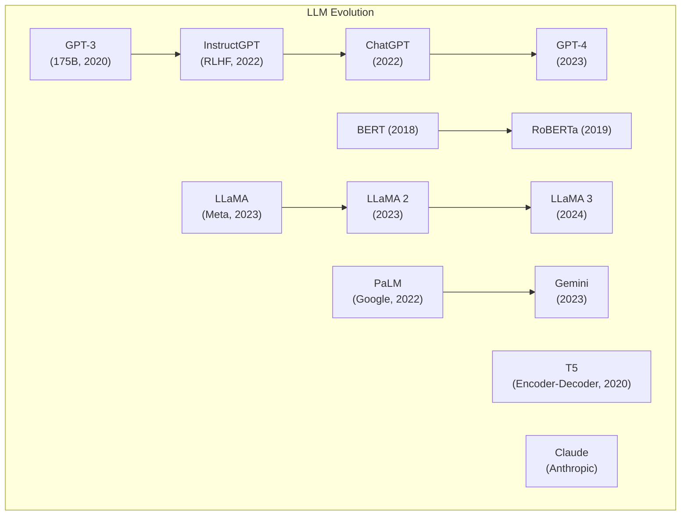

### Key Techniques in Modern LLMs

| Technique | Description | Why It Matters |
|-----------|-------------|---------------|
| **RLHF** | Reinforcement Learning from Human Feedback | Aligns model with human preferences |
| **Instruction Tuning** | Fine-tune on instruction-following data | Makes model follow instructions |
| **Chain-of-Thought** | Encourage step-by-step reasoning | Improves reasoning accuracy |
| **MoE** (Mixture of Experts) | Route tokens to specialized sub-networks | Scale params without proportional compute |
| **KV-Cache** | Cache key/value pairs during generation | Faster autoregressive inference |
| **Flash Attention** | IO-aware attention algorithm | Faster + less memory |
| **Quantization** | Reduce precision (FP32 → INT8/INT4) | Deploy large models on smaller hardware |
| **LoRA** | Low-Rank Adaptation for fine-tuning | Efficient fine-tuning with few params |

---

## Retrieval-Augmented Generation

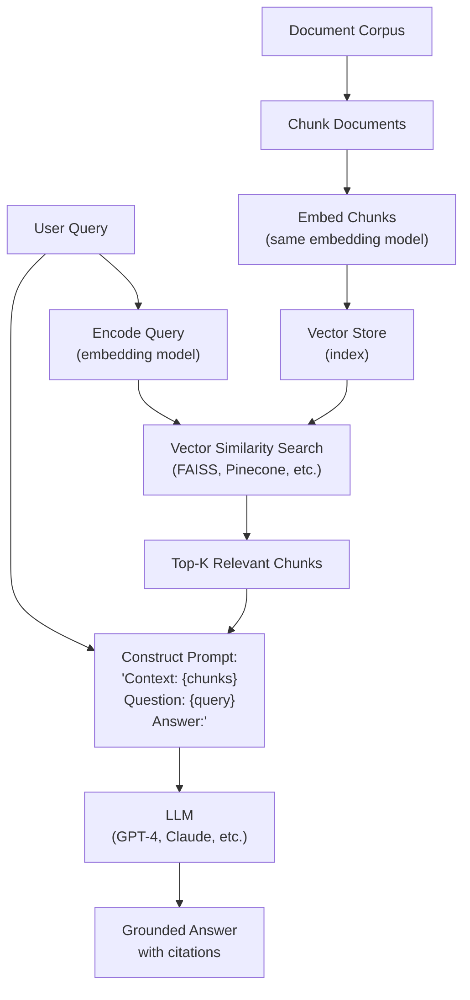

> **Q: What is RAG and why is it useful?**
>
> **A:** RAG (Retrieval-Augmented Generation) combines retrieval with generation:
>
> 1. **Retrieve**: Given a query, find relevant documents from a knowledge base using semantic search (embed query + documents, find nearest vectors)
> 2. **Augment**: Insert retrieved documents into the LLM's prompt as context
> 3. **Generate**: LLM generates answer grounded in the retrieved context
>
> **Why RAG over fine-tuning:**
> - **Up-to-date knowledge**: Just update the document store (no retraining)
> - **Reduces hallucination**: Model answers based on actual documents
> - **Source attribution**: Can cite which documents the answer came from
> - **Cost-effective**: No expensive fine-tuning needed
> - **Domain-specific**: Easy to add specialized knowledge
>
> **Challenges:** Retrieval quality is critical (garbage in, garbage out), chunk size matters, embedding model quality matters, context window limits.

> **Q: How do you evaluate a RAG system?**
>
> **A:**
> - **Retrieval metrics**: Recall@K (are relevant docs retrieved?), MRR (mean reciprocal rank)
> - **Generation metrics**: Faithfulness (is answer grounded in context?), Answer relevancy, Hallucination rate
> - **End-to-end**: RAGAS framework, human evaluation
> - **Key issues**: Context relevance, answer correctness, hallucination detection

---

## Prompt Engineering

| Technique | Description | Example |
|-----------|-------------|---------|
| **Zero-shot** | No examples, just instruction | "Classify this review as positive/negative: ..." |
| **Few-shot** | Provide examples in prompt | "Review: Great! → Positive\nReview: Terrible! → Negative\nReview: OK → " |
| **Chain-of-Thought (CoT)** | Ask for step-by-step reasoning | "Let's think step by step..." |
| **Self-Consistency** | Generate multiple CoT, take majority vote | Sample N answers, pick most common |
| **ReAct** | Reason + Act (interleave thinking with tool use) | Think → Act → Observe → Think → ... |
| **Tree-of-Thought** | Explore multiple reasoning paths | Branch and evaluate different approaches |
| **System Prompt** | Set behavior/role | "You are a helpful coding assistant..." |

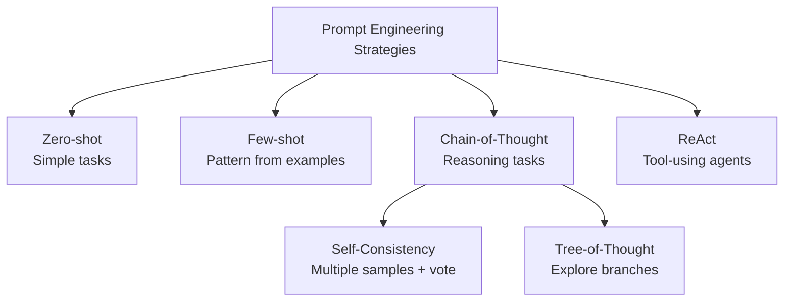

> **Q: What is Chain-of-Thought prompting and when does it help?**
>
> **A:** CoT prompting encourages the model to show intermediate reasoning steps before the final answer.
>
> **When it helps:** Math problems, logic puzzles, multi-step reasoning, coding problems. Basically any task where humans would need to "think through" steps.
>
> **When it doesn't help:** Simple factual recall, classification of short texts, tasks that are primarily pattern matching.
>
> **Why it works:** Forces the model to decompose complex problems, reduces errors from trying to "jump" to the answer. The intermediate tokens serve as a scratchpad.

---

## Fine-tuning Strategies

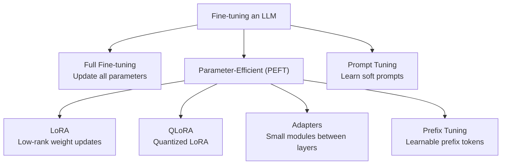

| Method | Trainable Params | Memory | Quality | Use Case |
|--------|-----------------|--------|---------|----------|
| **Full Fine-tuning** | 100% | Very high | Best | Large compute budget |
| **LoRA** | ~0.1-1% | Low | Near full | Most practical fine-tuning |
| **QLoRA** | ~0.1-1% | Very low | Good | Consumer GPUs |
| **Prompt Tuning** | ~0.01% | Minimal | OK | Multiple tasks, one model |
| **Adapters** | ~1-5% | Low | Good | Modular, swappable |

> **Q: What is LoRA and why is it popular?**
>
> **A:** LoRA (Low-Rank Adaptation) freezes the pretrained model weights and injects small trainable rank-decomposition matrices into each layer:
>
> Instead of updating W (d×d), learn two small matrices: A (d×r) and B (r×d) where r << d.
> W_new = W_frozen + A·B (the update is low-rank)
>
> **Why it's popular:**
> - Train only 0.1-1% of parameters → much less memory
> - Quality nearly matches full fine-tuning
> - Multiple LoRA adapters can share one base model
> - Can merge adapter into base model for zero inference overhead
> - QLoRA further reduces memory with 4-bit quantization

---

## NLP Tasks & Benchmarks

| Task | Description | Metrics | Example Models |
|------|-------------|---------|---------------|
| **Text Classification** | Assign label to text | Accuracy, F1 | BERT, RoBERTa |
| **NER** (Named Entity Recognition) | Identify entities in text | F1 (entity-level) | BERT + CRF |
| **Sentiment Analysis** | Detect opinion/emotion | Accuracy, F1 | BERT, fine-tuned LLMs |
| **Question Answering** | Answer questions from context | EM, F1 | BERT (extractive), GPT (generative) |
| **Summarization** | Condense text | ROUGE, BERTScore | T5, BART, GPT |
| **Machine Translation** | Translate between languages | BLEU, METEOR | T5, mBART, GPT-4 |
| **Text Generation** | Generate coherent text | Perplexity, human eval | GPT family |
| **Semantic Similarity** | Measure text similarity | Cosine similarity, Spearman | Sentence-BERT |

---

## Quick Recall Summary

| Concept | Key Point |
|---------|-----------|
| Word2Vec | Predict word↔context. king - man + woman ≈ queen. Static embeddings. |
| BERT | Encoder-only, bidirectional, MLM + NSP pre-training. Best for understanding. |
| GPT | Decoder-only, autoregressive, next-token prediction. Best for generation. |
| Tokenization | BPE (GPT), WordPiece (BERT). Subword = no OOV + compact vocab. |
| RAG | Retrieve relevant docs → augment prompt → generate grounded answer. |
| CoT Prompting | "Think step by step" → better reasoning on complex tasks. |
| LoRA | Low-rank fine-tuning. 0.1% params, near full quality. Practical and popular. |
| RLHF | Human feedback → reward model → RL to align model behavior. |
| Attention | softmax(QK^T/√d_k)V. Multi-head = parallel attention for different patterns. |
| Embeddings | Static (Word2Vec) vs Contextual (BERT). Modern = contextual always. |
