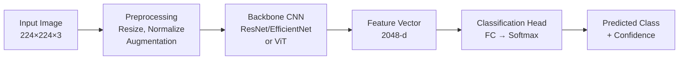
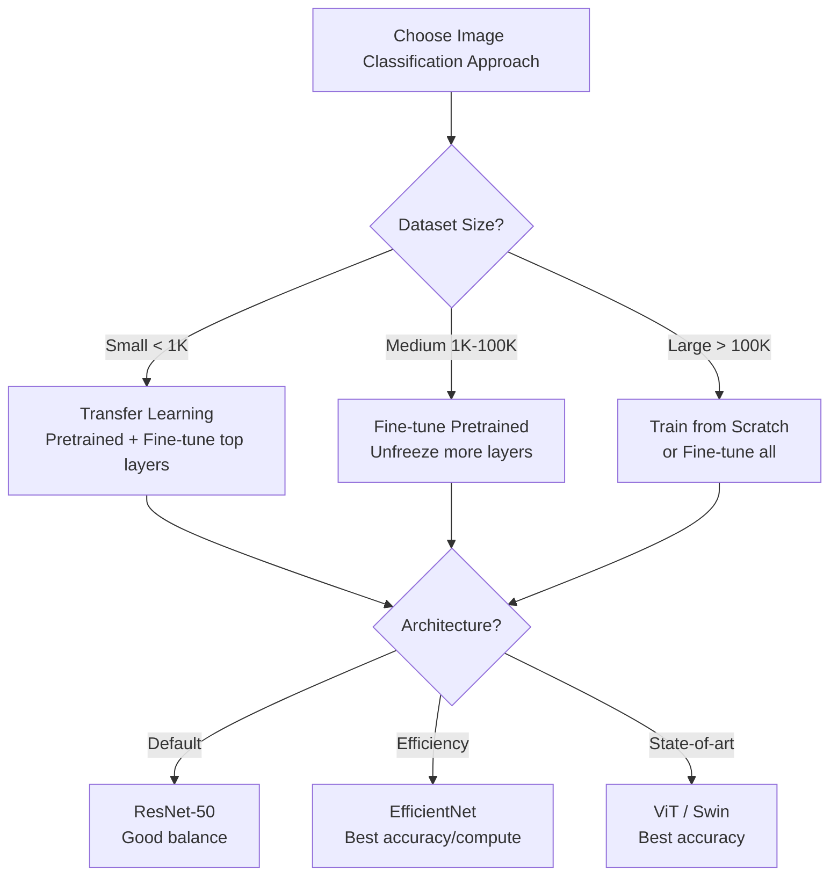
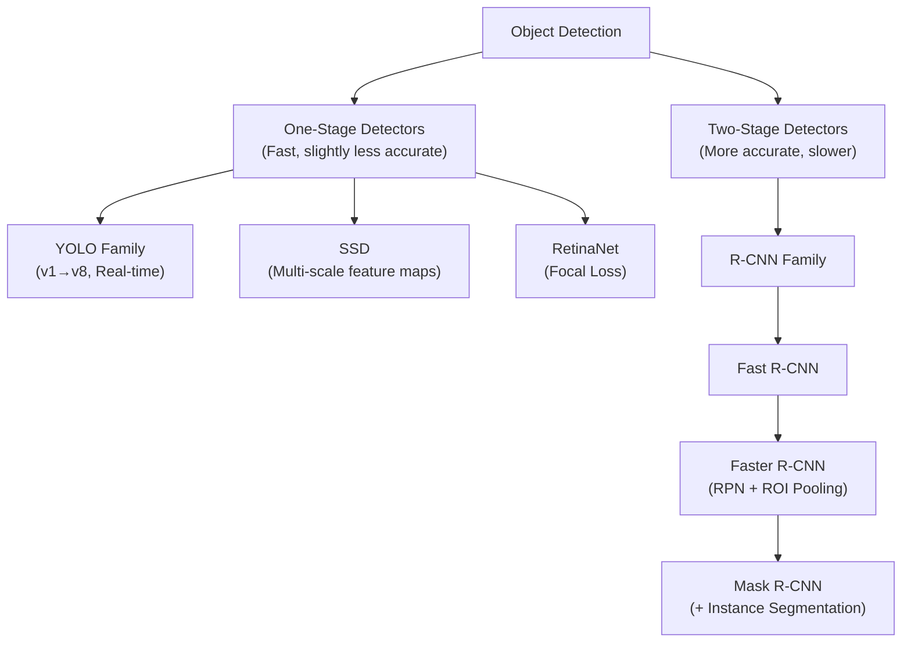
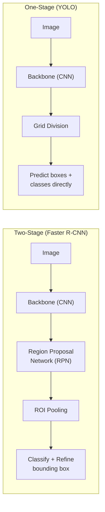
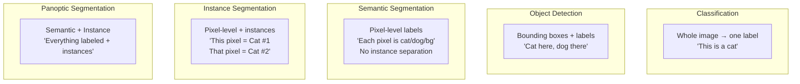
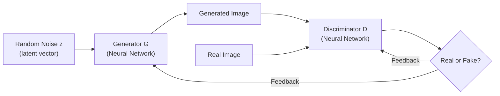
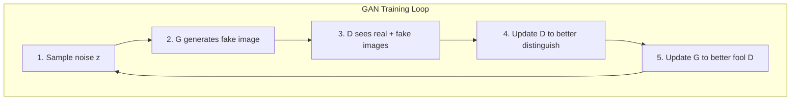

# 05 - Computer Vision

## Table of Contents
- [Image Classification Pipeline](#image-classification-pipeline)
- [Object Detection](#object-detection)
- [Semantic vs Instance Segmentation](#semantic-vs-instance-segmentation)
- [Generative Adversarial Networks (GANs)](#generative-adversarial-networks)
- [Vision Transformers (ViT)](#vision-transformers)
- [Data Augmentation](#data-augmentation)
- [Key CV Concepts](#key-cv-concepts)

---

## Image Classification Pipeline

> **Q: Walk me through building an image classification system.**
>
> **A:**
> 1. **Data collection & labeling**: Gather images, ensure quality labels, handle class imbalance
> 2. **Preprocessing**: Resize to model input size (224×224), normalize (ImageNet mean/std), augmentation (flips, rotations, color jitter)
> 3. **Model selection**: Start with pretrained ResNet-50 or EfficientNet-B0. Fine-tune if enough data.
> 4. **Training**: Cross-entropy loss, Adam/SGD optimizer, learning rate scheduling (cosine annealing), early stopping
> 5. **Evaluation**: Accuracy, F1, confusion matrix. Check per-class performance.
> 6. **Deployment**: ONNX export, TensorRT optimization, batch inference pipeline

---

## Object Detection

### One-Stage vs Two-Stage Detectors

| Detector | Stage | Speed | Accuracy | Use Case |
|----------|-------|-------|----------|----------|
| **YOLO (v5-v8)** | One | Very fast (30-150 FPS) | Good | Real-time (video, edge) |
| **SSD** | One | Fast | Moderate | Mobile deployment |
| **RetinaNet** | One | Medium | Good | Imbalanced detection (focal loss) |
| **Faster R-CNN** | Two | Slower (5-15 FPS) | High | When accuracy matters |
| **Mask R-CNN** | Two | Slower | High + Segmentation | Detection + segmentation |

**Key Concepts:**
- **IoU (Intersection over Union)**: Overlap between predicted and ground truth box. IoU > 0.5 is typically a "correct" detection.
- **NMS (Non-Maximum Suppression)**: Remove duplicate detections for same object. Keep highest confidence, remove overlapping boxes.
- **Anchor boxes**: Predefined box shapes at each grid cell. Model predicts offsets from anchors.
- **Feature Pyramid Network (FPN)**: Multi-scale feature maps for detecting objects at different sizes.

> **Q: How does YOLO work?**
>
> **A:** YOLO (You Only Look Once) treats detection as a regression problem:
> 1. Divide image into S×S grid
> 2. Each grid cell predicts B bounding boxes (x, y, w, h, confidence) + class probabilities
> 3. Single forward pass through CNN → all predictions at once
> 4. Apply NMS to remove duplicate detections
>
> **Why it's fast:** Single pass through the network (vs two stages in R-CNN family). Trades some accuracy for real-time speed.
>
> **YOLO evolution:** v1 (basic) → v2 (batch norm, anchors) → v3 (FPN, multi-scale) → v4/v5 (CSP backbone, improved training) → v8 (anchor-free, decoupled head)

> **Q: What is the difference between one-stage and two-stage detectors?**
>
> **A:**
> - **Two-stage** (R-CNN family): First stage proposes regions likely containing objects (RPN), second stage classifies and refines. More accurate but slower.
> - **One-stage** (YOLO, SSD): Directly predict boxes + classes from feature maps in one pass. Faster but historically less accurate.
>
> **RetinaNet** bridged the gap with **Focal Loss**: -(1-p)^γ · log(p). Down-weights easy negatives (background) so the model focuses on hard examples. This solved the class imbalance problem that made one-stage detectors less accurate.

---

## Semantic vs Instance Segmentation

| Type | Output | Distinguishes Instances? | Key Model |
|------|--------|------------------------|-----------|
| **Semantic Segmentation** | Class label per pixel | No (all cats = same) | FCN, U-Net, DeepLab |
| **Instance Segmentation** | Class + instance per pixel | Yes (Cat 1 ≠ Cat 2) | Mask R-CNN |
| **Panoptic Segmentation** | Both stuff + things | Yes | Panoptic FPN |

**Key Architectures:**
- **FCN** (Fully Convolutional Network): Replace FC layers with conv. Upsampling via transposed convolutions.
- **U-Net**: Encoder-decoder with skip connections. Great for medical imaging (works with small datasets).
- **DeepLab**: Atrous/dilated convolutions for larger receptive field + CRF post-processing.

> **Q: How does U-Net work and why is it popular for medical imaging?**
>
> **A:** U-Net has a symmetric encoder-decoder architecture:
> - **Encoder** (downsampling): Conv blocks + max pooling → extract features
> - **Decoder** (upsampling): Transposed convolutions → restore spatial resolution
> - **Skip connections**: Concatenate encoder features to decoder at each level → preserves fine-grained spatial details
>
> **Popular for medical imaging because:**
> 1. Works well with very small datasets (100s of images)
> 2. Skip connections preserve precise localization (important for tumors, cells)
> 3. Strong data augmentation (elastic deformations) compensates for small data

---

## Generative Adversarial Networks (GANs)

**GAN Variants:**
| Variant | Innovation | Use Case |
|---------|-----------|----------|
| **DCGAN** | Convolutional architecture | Basic image generation |
| **Conditional GAN** | Class-conditioned generation | Generate specific classes |
| **CycleGAN** | Unpaired image translation | Style transfer (horse↔zebra) |
| **Pix2Pix** | Paired image translation | Edges→photo, sketch→image |
| **StyleGAN** | Style-based generation | High-quality faces |
| **Diffusion Models** | Iterative denoising (not GAN) | DALL-E 2, Stable Diffusion |

> **Q: How do GANs work?**
>
> **A:** GANs have two competing networks:
> - **Generator (G)**: Takes random noise, produces fake images. Goal: fool the discriminator.
> - **Discriminator (D)**: Takes real and fake images, classifies them. Goal: detect fakes.
>
> **Training:** Minimax game — G minimizes and D maximizes: min_G max_D E[log(D(x))] + E[log(1-D(G(z)))]
>
> Over time, G gets better at generating realistic images, and D gets better at detecting fakes. At equilibrium, G produces images indistinguishable from real.
>
> **Challenges:**
> - Mode collapse: G only generates a few types of outputs
> - Training instability: Balancing G and D is difficult
> - Vanishing gradients: If D is too good, G gets no useful gradients
>
> **Modern trend:** Diffusion models have largely replaced GANs for image generation (more stable training, better diversity).

---

## Vision Transformers (ViT)

```mermaid
flowchart LR
    IMG2["Input Image<br/>224×224"] --> PATCH["Split into Patches<br/>16×16 = 196 patches"]
    PATCH --> FLAT["Flatten + Linear Projection<br/>→ Patch Embeddings"]
    FLAT --> CLS_TOK["Prepend [CLS] Token"]
    CLS_TOK --> POS["Add Position<br/>Embeddings"]
    POS --> TRANS["Transformer Encoder<br/>(Self-Attention × L layers)"]
    TRANS --> CLS_OUT["[CLS] Output"]
    CLS_OUT --> MLP["MLP Head"]
    MLP --> CLASS["Classification"]
```

> **Q: How does Vision Transformer (ViT) work?**
>
> **A:** ViT applies the Transformer architecture directly to images:
> 1. **Patch embedding**: Split image into fixed-size patches (e.g., 16×16). Each patch is a "token."
> 2. **Linear projection**: Flatten each patch and project to embedding dimension
> 3. **Position embeddings**: Add learnable position embeddings (patches lose spatial info when flattened)
> 4. **[CLS] token**: Prepend a special token whose final output represents the whole image
> 5. **Transformer encoder**: Standard multi-head self-attention + FFN layers
> 6. **Classification**: MLP head on [CLS] token output
>
> **Key insight:** Treats an image as a sequence of patches, just like NLP treats text as a sequence of tokens.
>
> **Limitations:** Needs large datasets (or pretrained on large data) to match CNNs. Less inductive bias than CNNs (no built-in translation invariance or locality). **Swin Transformer** adds hierarchical features and shifted windows to address this.

| Model | Architecture | Key Feature |
|-------|-------------|-------------|
| **ViT** | Pure Transformer | Simple, effective with large data |
| **DeiT** | ViT + distillation | Works with less data |
| **Swin Transformer** | Hierarchical ViT | Shifted windows, multi-scale |
| **ConvNeXt** | Modernized ConvNet | CNN matching ViT performance |
| **CLIP** | ViT + Text Transformer | Image-text alignment (zero-shot) |

---

## Data Augmentation

| Technique | Description | Effect |
|-----------|-------------|--------|
| **Random Horizontal Flip** | Mirror image left-right | Translation invariance |
| **Random Rotation** | Rotate by random angle | Rotation invariance |
| **Random Crop** | Crop random region, resize back | Scale invariance |
| **Color Jitter** | Random brightness, contrast, saturation | Lighting invariance |
| **Cutout / Random Erasing** | Black out random patch | Occlusion robustness |
| **Mixup** | Blend two images + labels | Smoother decision boundaries |
| **CutMix** | Replace patch with another image's patch | Region-level augmentation |
| **AutoAugment** | Learn best augmentation policy | Task-specific optimization |
| **RandAugment** | Random augmentation chain (simple, effective) | Simple to implement |

> **Q: Why is data augmentation important and when should you use it?**
>
> **A:** Data augmentation artificially increases dataset diversity, reducing overfitting and improving generalization.
>
> **Always use:** Random flip, crop, rotation for most CV tasks
> **Careful with:** Augmentations that change semantics (don't flip X-rays left-right if side matters; don't rotate digits 6→9)
> **Advanced:** Mixup/CutMix for better calibration and smoother boundaries
>
> **At test time:** Test-Time Augmentation (TTA) — run multiple augmented versions of test image, average predictions. Improves accuracy by ~1-2%.

---

## Key CV Concepts

| Concept | Definition |
|---------|-----------|
| **Receptive Field** | Region of input that affects a particular feature map output |
| **Stride** | Step size of filter movement. Stride > 1 downsamples. |
| **Dilation** | Gaps in filter. Increases receptive field without more params. |
| **Depthwise Separable Conv** | Depthwise (per-channel) + Pointwise (1×1). Much fewer params (MobileNet). |
| **Feature Pyramid Network** | Multi-scale features for detecting objects at different sizes |
| **Anchor-Free Detection** | Predict center + box directly without predefined anchors (FCOS, CenterNet) |
| **Non-Maximum Suppression** | Remove duplicate detections by suppressing overlapping lower-confidence boxes |
| **IoU** | Intersection / Union of two bounding boxes. Measure of overlap. |

---

## Quick Recall Summary

| Concept | Key Point |
|---------|-----------|
| Object Detection | One-stage (YOLO, fast) vs Two-stage (Faster R-CNN, accurate) |
| YOLO | Grid → predict boxes + classes in one pass. Real-time. |
| Focal Loss | -(1-p)^γ·log(p). Fixes class imbalance in one-stage detectors. |
| Segmentation | Semantic (per-pixel class) vs Instance (per-pixel class + ID) |
| U-Net | Encoder-decoder + skip connections. Great for medical imaging. |
| GAN | Generator vs Discriminator. Minimax game. Mode collapse risk. |
| Diffusion | Iterative denoising. Replaced GANs for generation. |
| ViT | Image → patches → Transformer. Needs large data or pretraining. |
| Data Augmentation | Always use flips, crops, rotation. Mixup/CutMix for advanced. |
| Transfer Learning | Start with ImageNet pretrained. Fine-tune based on data size. |
