# 06 - ML System Design & MLOps

## Table of Contents
- [ML System Design Framework](#ml-system-design-framework)
- [End-to-End ML Pipeline](#end-to-end-ml-pipeline)
- [Data Pipeline](#data-pipeline)
- [Feature Store](#feature-store)
- [Model Training Infrastructure](#model-training-infrastructure)
- [Model Serving](#model-serving)
- [A/B Testing for ML](#ab-testing-for-ml)
- [Monitoring & Drift Detection](#monitoring--drift-detection)
- [MLOps & CI/CD](#mlops--cicd)
- [Design Examples](#design-examples)

---

## ML System Design Framework

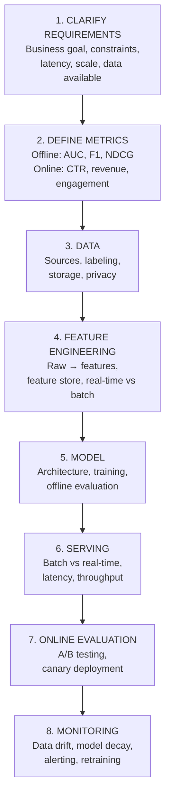

> **Q: How do you approach an ML system design interview?**
>
> **A:** Follow this framework (spend ~5 min on each):
> 1. **Clarify**: What's the business goal? What are the constraints (latency, scale, cost)? Who are the users?
> 2. **Metrics**: Define offline metrics (precision, recall, AUC) AND online/business metrics (CTR, revenue, user satisfaction). These often differ.
> 3. **Data**: What data is available? How to label? How much? Any privacy concerns?
> 4. **Features**: What signals are useful? Real-time vs pre-computed? Feature store?
> 5. **Model**: Start simple (logistic regression), then discuss complex (deep learning). Justify tradeoffs.
> 6. **Serving**: Batch predictions vs real-time inference? How to handle scale?
> 7. **Evaluation**: How to safely deploy? A/B test design.
> 8. **Monitoring**: How to detect issues? When to retrain?
>
> **Key tip:** Always start simple, then iterate. Interviewers want to see your thought process, not a perfect architecture on the first try.

---

## End-to-End ML Pipeline

```mermaid
flowchart LR
    subgraph "Data Layer"
        DS["Data Sources<br/>Logs, DB, APIs"] --> DI["Data Ingestion<br/>Kafka, Airflow"]
        DI --> DW["Data Warehouse<br/>S3, BigQuery"]
        DW --> DV["Data Validation<br/>Great Expectations"]
    end

    subgraph "Feature Layer"
        DV --> FE["Feature Engineering<br/>Transformations"]
        FE --> FS["Feature Store<br/>Feast, Tecton"]
    end

    subgraph "Training Layer"
        FS --> TRAIN["Model Training<br/>GPU Cluster"]
        TRAIN --> EVAL["Evaluation<br/>Offline Metrics"]
        EVAL --> REG["Model Registry<br/>MLflow, W&B"]
    end

    subgraph "Serving Layer"
        REG --> DEPLOY["Model Serving<br/>TF Serving, Triton"]
        DEPLOY --> PRED["Predictions<br/>API / Batch"]
    end

    subgraph "Monitoring"
        PRED --> MON["Monitoring<br/>Metrics, Drift"]
        MON -->|"Retrain trigger"| TRAIN
    end
```

---

## Data Pipeline

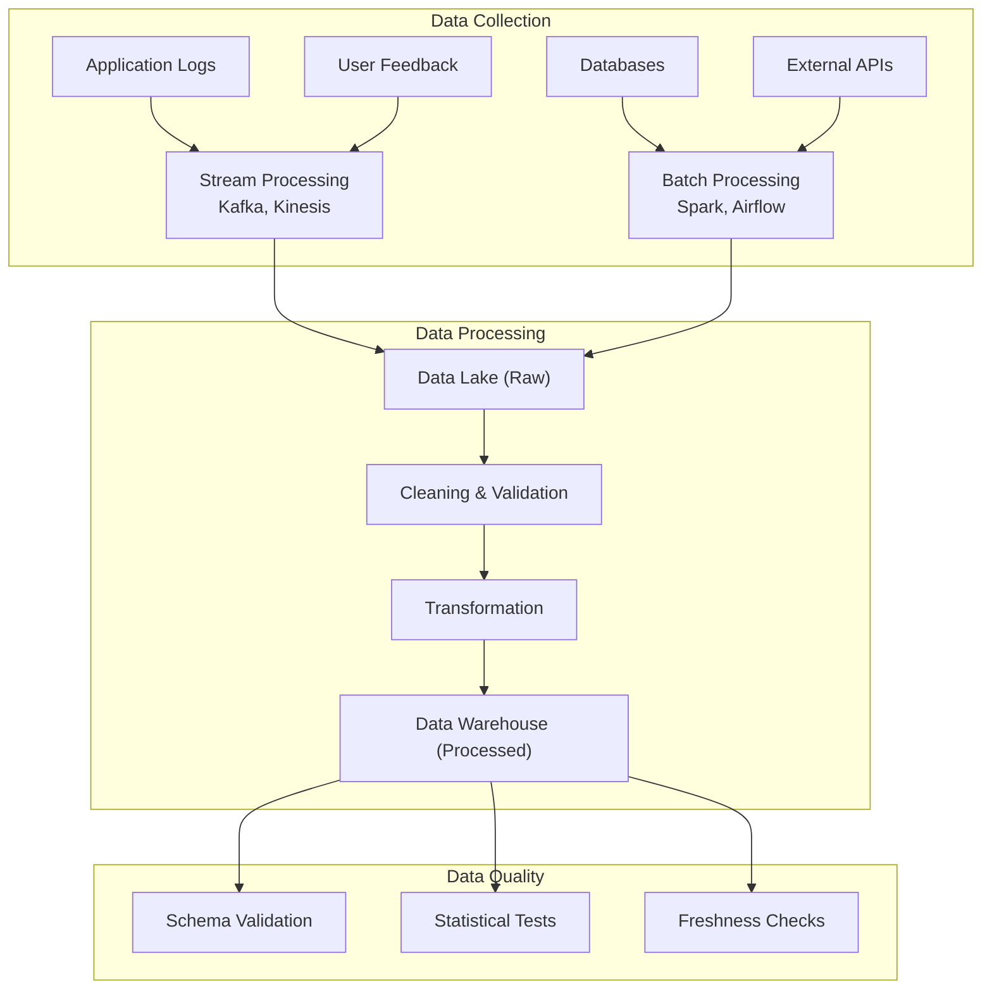

### Data Labeling Strategies

| Strategy | Description | Cost | Quality |
|----------|-------------|------|---------|
| **Manual (experts)** | Domain experts label data | Very high | Highest |
| **Crowdsourcing** | Mechanical Turk, Scale AI | Medium | Medium (need QC) |
| **Weak supervision** | Labeling functions + Snorkel | Low | Lower but scalable |
| **Semi-supervised** | Small labeled + large unlabeled | Low | Medium |
| **Active learning** | Model selects most informative samples to label | Medium | High efficiency |
| **Self-supervised** | Pretext tasks (BERT MLM, SimCLR) | Very low | Task-dependent |

> **Q: How do you handle data quality issues in production?**
>
> **A:**
> 1. **Schema validation**: Verify data types, ranges, allowed values
> 2. **Statistical monitoring**: Track distributions, detect drift (KL divergence, PSI)
> 3. **Freshness checks**: Ensure data arrives on time
> 4. **Completeness checks**: Monitor missing value rates
> 5. **Consistency checks**: Cross-reference between data sources
>
> Tools: Great Expectations, TFX Data Validation, Deequ (AWS)
>
> **Principle:** Bad data in → bad model out. Data quality is the #1 factor in ML system success.

---

## Feature Store

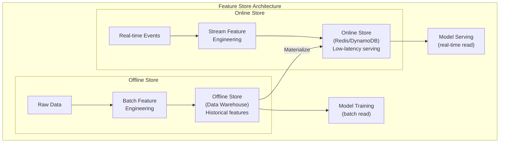

> **Q: What is a feature store and why do you need one?**
>
> **A:** A feature store is a centralized system for managing, storing, and serving ML features.
>
> **Problems it solves:**
> 1. **Train-serve skew**: Ensures same feature computation in training and serving
> 2. **Feature reuse**: Teams share features instead of recomputing
> 3. **Point-in-time correctness**: Prevents data leakage by ensuring features use only data available at prediction time
> 4. **Online/offline consistency**: Same feature, different latency requirements
>
> **Components:**
> - **Offline store**: For batch training (S3, BigQuery). Historical data.
> - **Online store**: For real-time serving (Redis, DynamoDB). Latest values, low latency.
> - **Feature registry**: Metadata, documentation, lineage tracking
>
> **Popular tools:** Feast (open source), Tecton, Databricks Feature Store

---

## Model Training Infrastructure

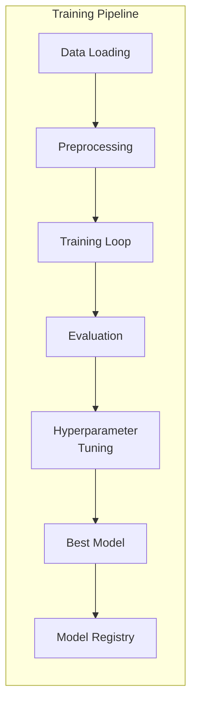

### Hyperparameter Tuning

| Method | Description | Pros | Cons |
|--------|-------------|------|------|
| **Grid Search** | Try all combinations | Thorough | Exponentially expensive |
| **Random Search** | Random sampling | Better than grid (more efficient) | Can miss optima |
| **Bayesian (Optuna)** | Model the objective, sample smartly | Most efficient | Complex setup |
| **Hyperband** | Early stopping of bad configs | Fast, resource-efficient | Needs good metric |

### Experiment Tracking

| Tool | Key Features |
|------|-------------|
| **MLflow** | Open source, model registry, tracking, deployment |
| **Weights & Biases** | Rich visualization, team collaboration |
| **Neptune** | Metadata management, comparison |
| **DVC** | Data version control, pipeline DAGs |

---

## Model Serving

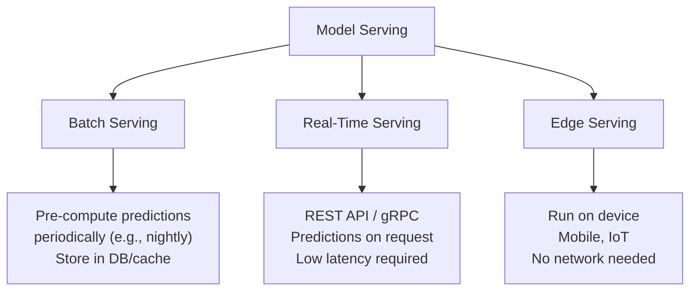

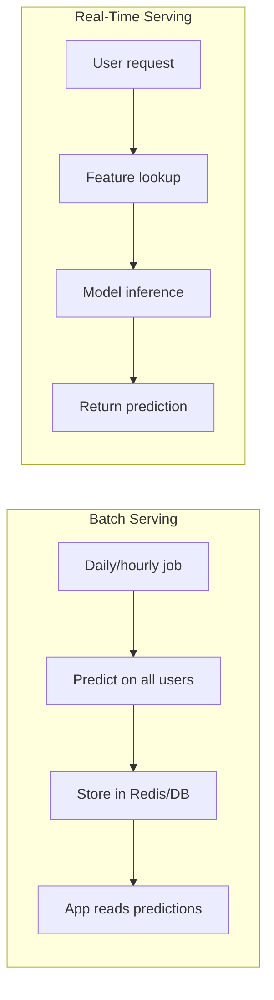

| Aspect | Batch Serving | Real-Time Serving |
|--------|--------------|-------------------|
| **Latency** | Minutes to hours | Milliseconds |
| **Freshness** | Stale (last batch run) | Up-to-date |
| **Complexity** | Simple (cron job) | Complex (API, scaling) |
| **Cost** | Predictable | Scales with traffic |
| **Use Cases** | Recommendations, reports | Search ranking, fraud detection |

> **Q: How would you deploy a model to production?**
>
> **A:** Steps:
> 1. **Export model**: Save as ONNX, TorchScript, SavedModel, or pickle
> 2. **Containerize**: Docker container with model + dependencies
> 3. **Serve**: TF Serving, Triton Inference Server, FastAPI, or cloud endpoint (SageMaker, Vertex AI)
> 4. **Optimize**: Quantization (FP32→INT8), pruning, distillation for latency
> 5. **Scale**: Load balancer, autoscaling, GPU/CPU fleet
> 6. **Deploy safely**: Canary deployment (route 5% traffic), shadow mode, A/B test
> 7. **Monitor**: Latency, throughput, error rates, prediction distributions

### Model Optimization for Serving

| Technique | Speedup | Quality Loss | Description |
|-----------|---------|-------------|-------------|
| **Quantization** | 2-4x | Minimal | FP32 → INT8/FP16 |
| **Pruning** | 2-10x | Small | Remove near-zero weights |
| **Distillation** | 3-10x | Small | Train small model to mimic large |
| **ONNX Runtime** | 1.5-3x | None | Optimized inference engine |
| **TensorRT** | 2-5x | Minimal | NVIDIA GPU optimization |
| **Batching** | 2-5x throughput | None | Group requests together |

---

## A/B Testing for ML

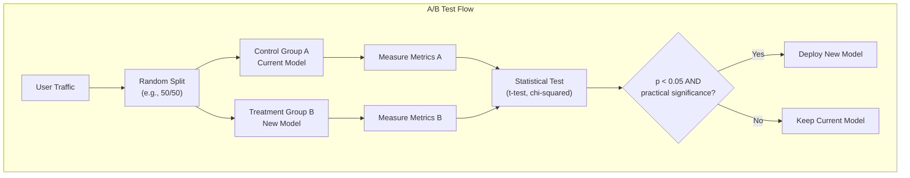

> **Q: How do you A/B test an ML model?**
>
> **A:**
> 1. **Hypothesis**: New model improves metric X by Y%
> 2. **Sample size calculation**: Determine how long to run based on expected effect size and traffic
> 3. **Randomization**: Randomly split users (not requests — same user should always see same variant)
> 4. **Guard rails**: Monitor for regressions in critical metrics (revenue, latency)
> 5. **Statistical analysis**: Check statistical significance (p < 0.05) AND practical significance (is the improvement meaningful?)
> 6. **Rollout**: Gradual increase (5% → 25% → 50% → 100%)
>
> **Pitfalls:**
> - Network effects (treatment affects control through social interactions)
> - Novelty effects (users initially engage more with anything new)
> - Multiple testing (testing many metrics inflates false positive rate → use Bonferroni correction)
> - Too short experiment duration (weekly/seasonal patterns)

### Deployment Strategies

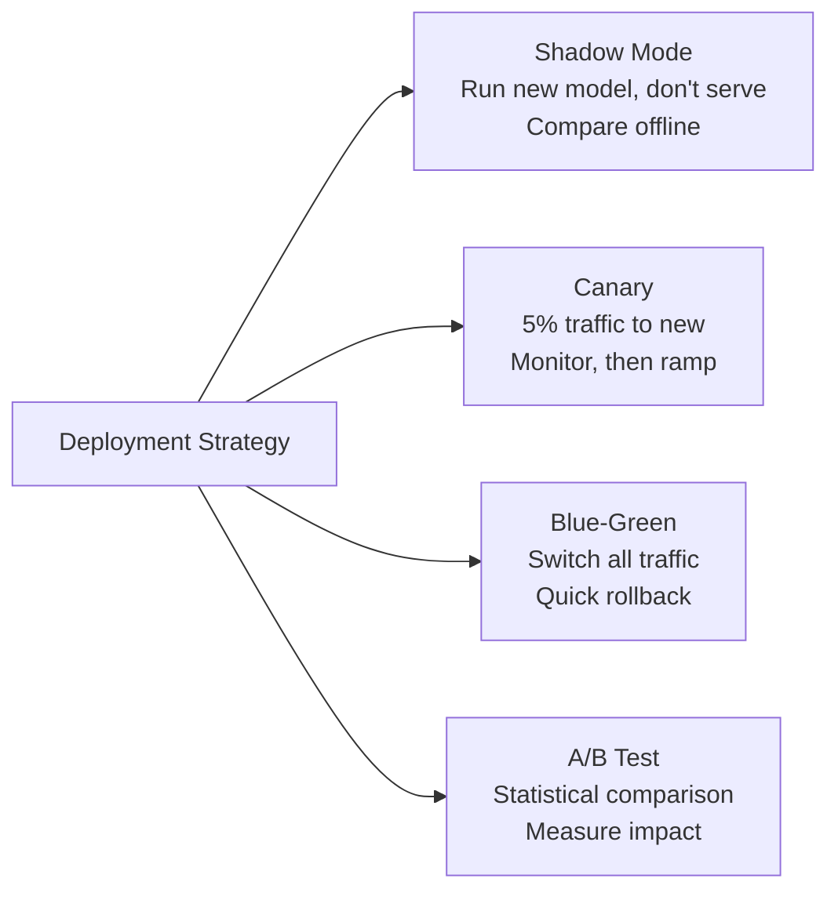

---

## Monitoring & Drift Detection

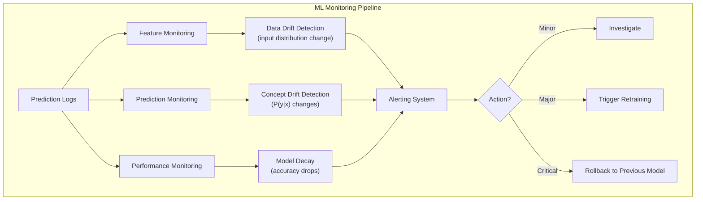

### Types of Drift

| Drift Type | What Changes | Detection Method | Example |
|-----------|-------------|-----------------|---------|
| **Data Drift** | P(X) — input distribution | KS test, PSI, KL divergence | User demographics shift |
| **Concept Drift** | P(Y\|X) — relationship | Monitor performance, label delay | User preferences change |
| **Prediction Drift** | P(Ŷ) — model outputs | Distribution comparison | Predicted scores shift |
| **Label Drift** | P(Y) — target distribution | Monitor labels | Fraud rate changes |

> **Q: How do you monitor a model in production?**
>
> **A:** Monitor at four levels:
>
> 1. **Infrastructure**: Latency (p50, p95, p99), throughput (QPS), error rate, CPU/GPU/memory utilization
> 2. **Data quality**: Input feature distributions, missing values, schema violations, freshness
> 3. **Model performance**: Prediction distribution shifts, confidence score distribution, offline metrics (when labels arrive)
> 4. **Business metrics**: CTR, conversion rate, revenue impact, user engagement
>
> **Retraining triggers:**
> - Scheduled (weekly/monthly retraining)
> - Performance-based (metric drops below threshold)
> - Data-driven (significant distribution drift detected)
>
> **Tools:** Prometheus + Grafana, Evidently AI, WhyLabs, Arize

---

## MLOps & CI/CD

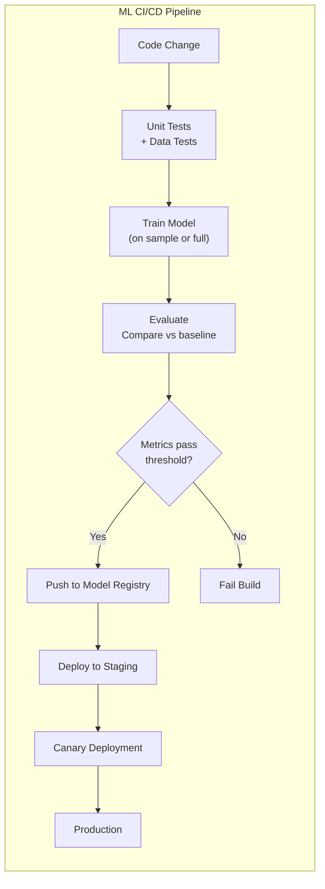

### MLOps Maturity Levels

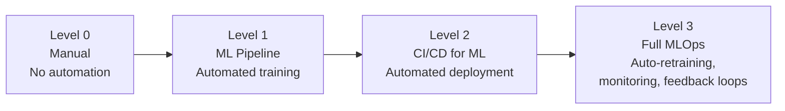

| Level | Description | Characteristics |
|-------|-------------|----------------|
| **0 - Manual** | Jupyter notebooks, manual deployment | No versioning, no automation |
| **1 - Pipeline** | Automated training pipeline | Feature store, experiment tracking |
| **2 - CI/CD** | Automated testing and deployment | Model registry, canary deployment |
| **3 - Full MLOps** | Automated retraining and monitoring | Drift detection, feedback loops, auto-rollback |

---

## Design Examples

### Example 1: Recommendation System

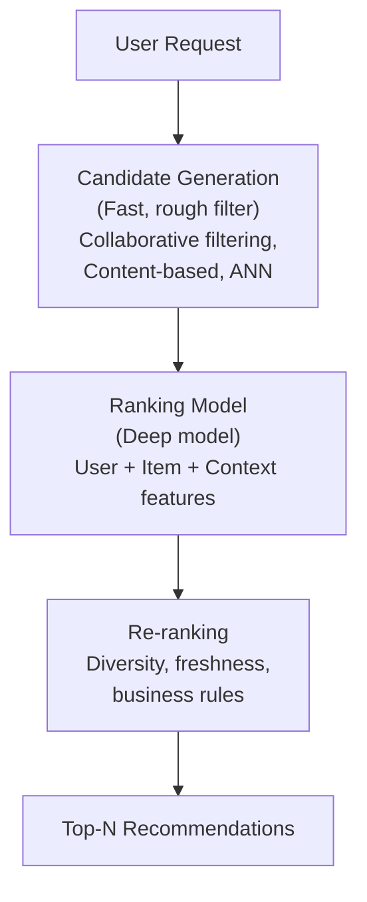

> **Q: Design a recommendation system.**
>
> **A:**
> 1. **Candidate generation** (retrieve ~1000 from millions):
>    - Collaborative filtering (similar users/items)
>    - Content-based (item features match user preferences)
>    - ANN search (approximate nearest neighbor in embedding space)
>
> 2. **Ranking** (score and rank ~1000 candidates):
>    - Two-tower model: user tower + item tower → dot product
>    - Or cross-network: concatenate user+item features → deep model
>    - Features: user history, item attributes, context (time, device)
>
> 3. **Re-ranking** (business logic):
>    - Diversity (don't show 10 similar items)
>    - Freshness boost
>    - Remove already-seen items
>
> **Metrics:** Offline (NDCG, recall@K, MAP), Online (CTR, engagement, revenue)

### Example 2: Fraud Detection System

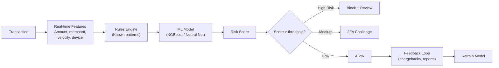

> **Q: Design a fraud detection system.**
>
> **A:**
> 1. **Data**: Transaction logs, user profiles, device fingerprints, historical fraud labels
> 2. **Features**: Transaction amount, frequency, location, time, merchant category, device change, velocity features (# transactions in last hour)
> 3. **Model**: Start with rules engine (known patterns) + XGBoost (tabular data, handles imbalance well). Graduate to neural network for complex patterns.
> 4. **Serving**: Must be real-time (< 100ms). Pre-compute user features, stream transaction features.
> 5. **Handling imbalance**: Class weights, SMOTE, adjust threshold based on cost of FP vs FN
> 6. **Metrics**: Precision@top-K (minimize false blocks), recall (catch fraud), $ saved
> 7. **Monitoring**: Track fraud rate, false positive rate, model latency, feature drift

---

## Quick Recall Summary

| Concept | Key Point |
|---------|-----------|
| Design Framework | Clarify → Metrics → Data → Features → Model → Serving → Evaluation → Monitoring |
| Feature Store | Offline (training) + Online (serving). Prevents train-serve skew. |
| Batch vs Real-time | Batch: simple, stale. Real-time: complex, fresh. Choose based on use case. |
| A/B Testing | Randomize users (not requests), check statistical + practical significance. |
| Data Drift | P(X) changes. Detect with KS test, PSI. |
| Concept Drift | P(Y\|X) changes. Monitor performance + labels. |
| Deployment | Shadow → Canary → A/B test → Full rollout. Always have rollback. |
| MLOps | Level 0 (manual) → Level 3 (automated everything). |
| Recommendation | Candidate generation → Ranking → Re-ranking. Two-tower model. |
| Fraud Detection | Real-time features + rules + ML. Handle imbalance, <100ms latency. |
| Model Optimization | Quantization, pruning, distillation, ONNX, TensorRT for faster inference. |
