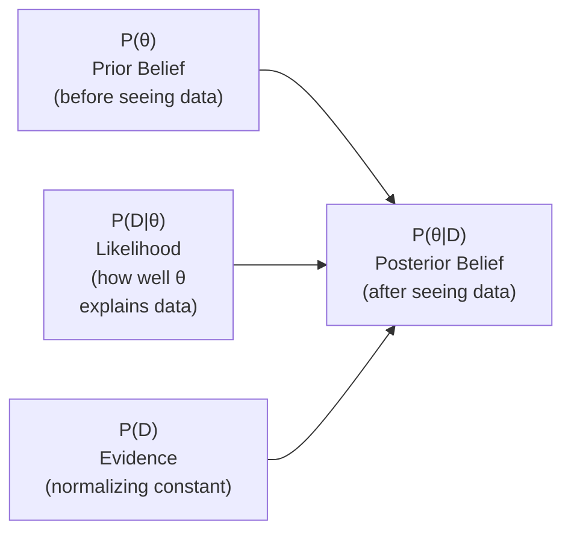
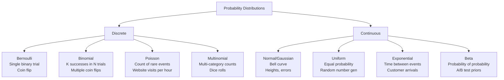
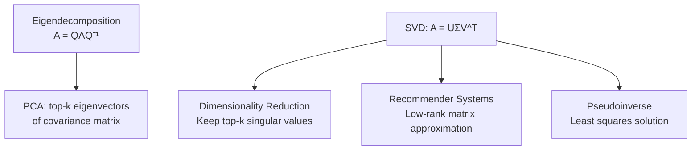
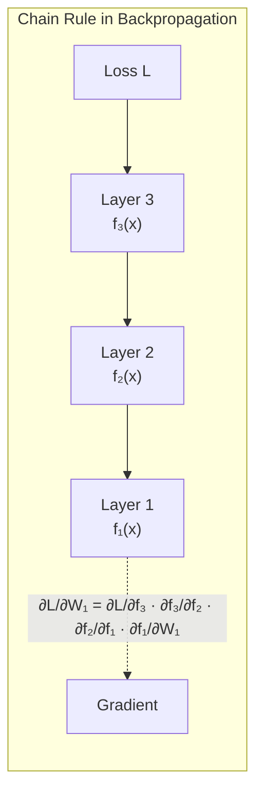

# 07 - Math & Statistics for ML

## Table of Contents
- [Probability](#probability)
- [Bayes Theorem](#bayes-theorem)
- [Probability Distributions](#probability-distributions)
- [Linear Algebra Essentials](#linear-algebra-essentials)
- [Calculus for ML](#calculus-for-ml)
- [Statistics & Hypothesis Testing](#statistics--hypothesis-testing)
- [Information Theory](#information-theory)
- [Sampling Methods](#sampling-methods)

---

## Probability

### Core Rules

| Rule | Formula | Example |
|------|---------|---------|
| **Addition** (OR) | P(A∪B) = P(A) + P(B) - P(A∩B) | P(rain OR snow) |
| **Multiplication** (AND) | P(A∩B) = P(A) · P(B\|A) | P(rain AND cold) |
| **Independence** | P(A∩B) = P(A) · P(B) iff independent | P(coin1=H AND coin2=H) |
| **Complement** | P(A') = 1 - P(A) | P(not rain) = 1 - P(rain) |
| **Conditional** | P(A\|B) = P(A∩B) / P(B) | P(rain\|cloudy) |
| **Total Probability** | P(A) = Σ P(A\|Bᵢ)·P(Bᵢ) | Marginalize over conditions |

> **Q: What is conditional probability vs joint probability?**
>
> **A:**
> - **Joint probability** P(A,B): Probability of A AND B occurring together. P(rain, cold) = probability it's both rainy and cold.
> - **Conditional probability** P(A|B): Probability of A GIVEN B has occurred. P(rain|cloudy) = probability of rain given it's already cloudy.
> - Relationship: P(A|B) = P(A,B) / P(B)
>
> **ML connection:** In classification, we want P(class|features) — the conditional probability of a class given the observed features.

### Expectation and Variance

| Concept | Discrete | Continuous | Meaning |
|---------|----------|-----------|---------|
| **Expectation E[X]** | Σ xᵢ·P(xᵢ) | ∫ x·f(x)dx | Average value (center) |
| **Variance Var(X)** | E[(X-μ)²] | E[(X-μ)²] | Spread around mean |
| **Std Dev σ** | √Var(X) | √Var(X) | Spread in original units |
| **Covariance** | E[(X-μx)(Y-μy)] | Same | Linear relationship |
| **Correlation** | Cov(X,Y)/(σx·σy) | Same | Normalized covariance [-1,1] |

---

## Bayes Theorem



**Bayes Theorem:** P(θ|D) = P(D|θ) · P(θ) / P(D)

> **Q: Explain Bayes' Theorem and give an ML example.**
>
> **A:** Bayes' theorem updates our belief about a hypothesis after observing evidence:
>
> P(hypothesis | evidence) = P(evidence | hypothesis) · P(hypothesis) / P(evidence)
>
> **Components:**
> - **Prior** P(θ): What we believe before seeing data
> - **Likelihood** P(D|θ): How probable the data is given our hypothesis
> - **Posterior** P(θ|D): Updated belief after seeing data
> - **Evidence** P(D): Normalizing constant (sum over all hypotheses)
>
> **ML Example — Spam Filter:**
> - Prior: P(spam) = 0.3 (30% of emails are spam)
> - Likelihood: P("buy now" | spam) = 0.8 (80% of spam contains "buy now")
> - Evidence: P("buy now") = 0.8·0.3 + 0.1·0.7 = 0.31
> - Posterior: P(spam | "buy now") = 0.8·0.3/0.31 = 0.77
>
> After seeing "buy now", our belief that the email is spam jumps from 30% to 77%.

> **Q: What's the difference between frequentist and Bayesian approaches?**
>
> **A:**
> - **Frequentist**: Parameters are fixed but unknown. Probability = long-run frequency. Uses MLE (Maximum Likelihood Estimation). Result: point estimate + confidence interval.
> - **Bayesian**: Parameters are random variables with distributions. Prior + data → posterior distribution. Result: full distribution over parameters (uncertainty quantified).
>
> **Bayesian is better when:** Prior knowledge exists, small data, uncertainty quantification needed.
> **Frequentist is simpler when:** Large data, no prior, computational simplicity needed.

---

## Probability Distributions



| Distribution | Type | Parameters | Mean | Variance | ML Use |
|-------------|------|-----------|------|----------|--------|
| **Bernoulli** | Discrete | p | p | p(1-p) | Binary classification |
| **Binomial** | Discrete | n, p | np | np(1-p) | Count of successes |
| **Poisson** | Discrete | λ | λ | λ | Count/rate data |
| **Normal** | Continuous | μ, σ² | μ | σ² | Errors, features, prior |
| **Exponential** | Continuous | λ | 1/λ | 1/λ² | Time between events |
| **Beta** | Continuous | α, β | α/(α+β) | complex | Bayesian priors for probabilities |

> **Q: Why is the Gaussian distribution so important in ML?**
>
> **A:**
> 1. **Central Limit Theorem**: Sum of many independent random variables → Normal, regardless of original distribution. This is why errors/noise are often Gaussian.
> 2. **Maximum entropy**: Among all distributions with known mean and variance, Normal has maximum entropy (least assumptions).
> 3. **Mathematical convenience**: Gaussian is closed under linear operations, makes math tractable.
> 4. **ML assumptions**: Many models assume Gaussian errors (linear regression), Gaussian features (Gaussian NB), or Gaussian priors.
> 5. **Initialization**: Neural network weights often initialized from N(0, σ²).

---

## Linear Algebra Essentials

### Key Concepts

| Concept | Definition | ML Application |
|---------|-----------|---------------|
| **Vectors** | 1D array of numbers | Feature vector, embeddings |
| **Matrices** | 2D array of numbers | Weight matrices, data matrices |
| **Dot Product** | a·b = Σaᵢbᵢ | Similarity, attention scores |
| **Matrix Multiplication** | (AB)ᵢⱼ = Σ Aᵢₖ Bₖⱼ | Linear transformations, layer computations |
| **Transpose** | Swap rows/columns (A^T) | Used throughout ML math |
| **Inverse** | A⁻¹: AA⁻¹ = I | Normal equation: w = (X^TX)⁻¹X^Ty |
| **Eigenvalues/vectors** | Av = λv | PCA, spectral methods |
| **SVD** | A = UΣV^T | Dimensionality reduction, recommender systems |
| **Rank** | Number of independent rows/columns | Determines solvability |
| **Norm** | \|\|x\|\| = measure of magnitude | L1 (Σ\|xᵢ\|), L2 (√Σxᵢ²), regularization |



> **Q: What are eigenvalues and eigenvectors? Why do they matter for ML?**
>
> **A:** For a matrix A, eigenvector v satisfies: **Av = λv** — the matrix only scales v, doesn't change direction. λ is the eigenvalue (the scaling factor).
>
> **ML importance:**
> - **PCA**: Eigenvectors of covariance matrix = principal components. Eigenvalues = variance explained by each component.
> - **Graph ML**: Eigenvectors of adjacency/Laplacian matrix reveal graph structure.
> - **Stability analysis**: Eigenvalues of weight matrices determine whether gradients explode or vanish.
>
> **SVD** (Singular Value Decomposition): Generalizes eigendecomposition to non-square matrices. A = UΣV^T where Σ contains singular values. Truncated SVD = low-rank approximation → used in matrix factorization for recommendations.

> **Q: Why does the dot product measure similarity?**
>
> **A:** a·b = ||a|| · ||b|| · cos(θ). The dot product is proportional to the cosine of the angle between vectors.
> - Same direction (similar): cos(0°) = 1 → large positive dot product
> - Perpendicular (unrelated): cos(90°) = 0
> - Opposite (dissimilar): cos(180°) = -1 → large negative
>
> **Cosine similarity** = a·b / (||a||·||b||) normalizes by magnitude, measuring only direction. Used in embeddings, retrieval, recommendation.

---

## Calculus for ML

### Gradient and Chain Rule



| Concept | Definition | ML Use |
|---------|-----------|--------|
| **Derivative** | Rate of change: f'(x) = lim Δf/Δx | Gradient of loss w.r.t. parameter |
| **Partial Derivative** | Derivative w.r.t. one variable | ∂L/∂wᵢ for each weight |
| **Gradient** | Vector of all partial derivatives: ∇f | Direction of steepest ascent |
| **Chain Rule** | (f∘g)' = f'(g(x))·g'(x) | Backpropagation through layers |
| **Jacobian** | Matrix of all partial derivatives | Multi-output function gradients |
| **Hessian** | Matrix of second derivatives | Curvature, optimizer analysis |

> **Q: Why does gradient descent work?**
>
> **A:** The gradient ∇f(x) points in the direction of steepest **increase** of function f. Therefore, moving in the **negative** gradient direction (-∇f) is the direction of steepest **decrease**.
>
> By iteratively updating: θ = θ - α·∇L(θ), we move toward a local minimum of the loss function.
>
> **Key concepts:**
> - **Learning rate α**: Step size. Too large → overshoot, too small → slow convergence.
> - **Local vs global minima**: For convex functions, local = global. For neural nets (non-convex), local minima are usually good enough.
> - **Saddle points**: More problematic than local minima in high dimensions. Momentum and Adam help escape them.

---

## Statistics & Hypothesis Testing

```mermaid
flowchart TD
    HT["Hypothesis Testing"] --> H0["H₀: Null Hypothesis<br/>'No effect / no difference'"]
    HT --> H1["H₁: Alternative Hypothesis<br/>'There IS an effect'"]

    H0 --> TEST["Collect Data & Compute<br/>Test Statistic"]
    H1 --> TEST

    TEST --> PVAL["Compute p-value<br/>P(data | H₀ is true)"]
    PVAL --> DECISION2{p < α?<br/>(typically α = 0.05)}
    DECISION2 -->|Yes| REJECT["Reject H₀<br/>(statistically significant)"]
    DECISION2 -->|No| FAIL["Fail to Reject H₀<br/>(not enough evidence)"]
```

| Error | Description | Also Called | Example |
|-------|-------------|------------|---------|
| **Type I** | Reject H₀ when it's true | False Positive | Approve ineffective drug |
| **Type II** | Fail to reject H₀ when it's false | False Negative | Miss effective drug |

| Concept | Definition | Note |
|---------|-----------|------|
| **p-value** | Probability of seeing data this extreme if H₀ is true | NOT probability H₀ is true |
| **α (significance level)** | Threshold for rejecting H₀ (typically 0.05) | Controls Type I error rate |
| **Power (1-β)** | Probability of detecting true effect | Higher is better, typically want > 0.8 |
| **Confidence Interval** | Range likely containing true parameter | 95% CI: if we repeated, 95% would contain truth |

### Common Statistical Tests

| Test | Use Case | Data Type |
|------|----------|-----------|
| **t-test** | Compare means of two groups | Continuous, normal |
| **Chi-squared** | Test independence of categories | Categorical |
| **ANOVA** | Compare means of 3+ groups | Continuous, normal |
| **Mann-Whitney U** | Compare two groups (non-parametric) | Ordinal/continuous |
| **KS Test** | Compare distributions | Continuous |
| **Paired t-test** | Before/after comparison (same subjects) | Continuous, paired |

> **Q: What is a p-value and what are common misconceptions?**
>
> **A:** p-value = probability of observing data as extreme as (or more extreme than) what we got, **assuming the null hypothesis is true**.
>
> **Common misconceptions:**
> 1. ~~"p-value is the probability that H₀ is true"~~ → No, it's P(data | H₀), not P(H₀ | data)
> 2. ~~"p < 0.05 means the effect is large/important"~~ → No, statistical significance ≠ practical significance. With enough data, tiny effects become significant.
> 3. ~~"p > 0.05 means there's no effect"~~ → No, absence of evidence ≠ evidence of absence. May just lack power.
> 4. ~~"p-value is reliable for a single experiment"~~ → Multiple comparisons inflate false positives (use Bonferroni correction).

> **Q: How does hypothesis testing relate to A/B testing in ML?**
>
> **A:** A/B testing IS hypothesis testing:
> - H₀: New model has no effect on metric (μ_A = μ_B)
> - H₁: New model improves metric (μ_B > μ_A)
> - Collect data from both groups
> - Compute t-test or z-test for difference in means
> - If p < 0.05 AND effect size is practically meaningful → deploy new model
>
> **Key considerations:**
> - Sample size: calculate upfront for desired power (80%)
> - Multiple testing: if testing many metrics, adjust α (Bonferroni: α/n)
> - Practical significance: a 0.01% CTR increase may be statistically significant with millions of users but not worth the engineering cost

---

## Information Theory

| Concept | Formula | Meaning | ML Use |
|---------|---------|---------|--------|
| **Entropy** | H(X) = -Σ p(x)·log₂p(x) | Uncertainty/disorder in distribution | Decision tree splits, loss |
| **Cross-Entropy** | H(p,q) = -Σ p(x)·log q(x) | Expected bits using q to encode p | Classification loss function |
| **KL Divergence** | D_KL(p\|\|q) = Σ p·log(p/q) | How different q is from p | VAEs, distribution matching |
| **Mutual Information** | I(X;Y) = H(X) - H(X\|Y) | Shared information between X and Y | Feature selection |

> **Q: What is cross-entropy and why is it used as a loss function?**
>
> **A:** Cross-entropy H(p,q) = -Σ p(x)·log q(x) measures how well distribution q approximates distribution p.
>
> In classification:
> - p = true distribution (one-hot label: [0, 0, 1, 0])
> - q = predicted distribution (softmax output: [0.1, 0.1, 0.7, 0.1])
> - Loss = -Σ pᵢ·log(qᵢ) = -log(0.7) ≈ 0.36
>
> **Why cross-entropy over MSE for classification:**
> - Cross-entropy has stronger gradients when predictions are wrong (fast learning)
> - MSE gradients vanish near 0 and 1 with sigmoid (slow learning)
> - Cross-entropy is the natural loss for probability outputs (derived from MLE)
>
> **Relationship:** Cross-Entropy = Entropy + KL Divergence. Minimizing cross-entropy = minimizing KL divergence (since entropy of labels is constant).

> **Q: What is KL Divergence?**
>
> **A:** KL(p||q) = Σ p(x)·log(p(x)/q(x)). Measures how much information is lost when using q to approximate p.
>
> Properties:
> - KL ≥ 0 (always non-negative)
> - KL = 0 iff p = q
> - **Asymmetric**: KL(p||q) ≠ KL(q||p) — not a true distance
>
> **ML uses:**
> - VAE loss: reconstruction loss + KL(encoder || prior)
> - Knowledge distillation: match student to teacher distributions
> - Drift detection: measure distribution shift

---

## Sampling Methods

| Method | Description | Use Case |
|--------|-------------|----------|
| **Simple Random** | Each sample equally likely | Basic sampling |
| **Stratified** | Sample proportionally from subgroups | Maintain class ratios |
| **Bootstrap** | Sample with replacement, same size | Confidence intervals, bagging |
| **MCMC** | Markov Chain Monte Carlo | Sample from complex distributions |
| **Importance Sampling** | Sample from proposal distribution, reweight | When target is hard to sample |
| **Reservoir Sampling** | Maintain fixed-size sample from stream | Online/streaming data |

> **Q: What is the bootstrap method?**
>
> **A:** Bootstrap generates many datasets by resampling with replacement from the original data:
> 1. From N samples, draw N samples WITH replacement → one bootstrap sample
> 2. Repeat B times (e.g., B=1000) → B bootstrap datasets
> 3. Compute statistic on each → get distribution of the statistic
>
> **Uses:** Confidence intervals without distributional assumptions, estimating uncertainty, bagging (Random Forest).
>
> **Key fact:** Each bootstrap sample contains ~63.2% unique samples (1 - 1/e). The remaining ~36.8% are the OOB (out-of-bag) samples — used for free validation in Random Forest.

---

## Quick Recall Summary

| Concept | Key Point |
|---------|-----------|
| Bayes Theorem | P(θ\|D) = P(D\|θ)·P(θ)/P(D). Update beliefs with evidence. |
| Normal Distribution | Bell curve. Central Limit Theorem → sums → Normal. Max entropy. |
| Eigenvalues | Av = λv. PCA uses eigenvectors of covariance matrix. |
| Dot Product | Measures similarity. cos(θ) = a·b/(\|\|a\|\|·\|\|b\|\|). |
| Gradient | Direction of steepest ascent. Descent = negative gradient. |
| Chain Rule | Backprop = chain rule. ∂L/∂w₁ = ∂L/∂f₃·∂f₃/∂f₂·∂f₂/∂f₁·∂f₁/∂w₁ |
| p-value | P(data \| H₀ true). NOT P(H₀ true \| data). |
| Type I/II Error | Type I = false positive. Type II = false negative. |
| Cross-Entropy | -Σ p·log(q). Standard classification loss. |
| KL Divergence | Measures distribution difference. Asymmetric. Used in VAE, distillation. |
| Bootstrap | Resample with replacement. ~63.2% unique. Free OOB validation. |
