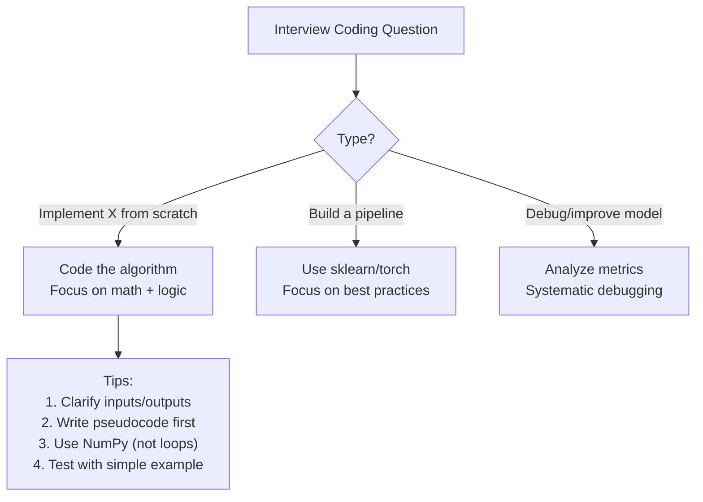
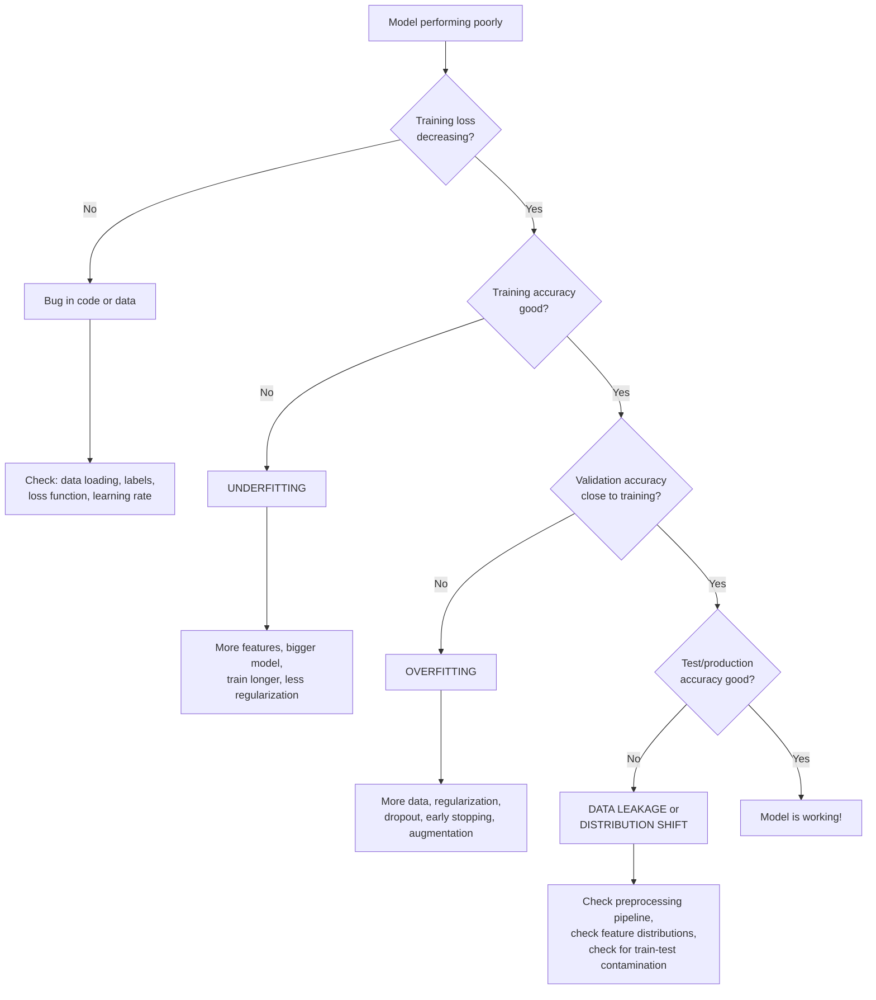

# 08 - Practical Coding for ML Interviews

## Table of Contents
- [From-Scratch Implementations](#from-scratch-implementations)
- [Linear Regression](#linear-regression-from-scratch)
- [Logistic Regression](#logistic-regression-from-scratch)
- [K-Nearest Neighbors](#knn-from-scratch)
- [K-Means Clustering](#k-means-from-scratch)
- [Decision Tree](#decision-tree-from-scratch)
- [Neural Network (Simple)](#simple-neural-network-from-scratch)
- [NumPy/Pandas Patterns](#numpypandas-patterns)
- [Scikit-learn Pipeline Patterns](#scikit-learn-pipeline-patterns)
- [Model Debugging Checklist](#model-debugging-checklist)

---

## From-Scratch Implementations



---

## Linear Regression From Scratch

**Algorithm:** Minimize MSE using gradient descent

```python
import numpy as np

class LinearRegression:
    def __init__(self, lr=0.01, n_iters=1000):
        self.lr = lr
        self.n_iters = n_iters
        self.weights = None
        self.bias = None

    def fit(self, X, y):
        n_samples, n_features = X.shape
        self.weights = np.zeros(n_features)
        self.bias = 0

        for _ in range(self.n_iters):
            # Forward pass
            y_pred = X @ self.weights + self.bias

            # Gradients
            dw = (2 / n_samples) * (X.T @ (y_pred - y))
            db = (2 / n_samples) * np.sum(y_pred - y)

            # Update
            self.weights -= self.lr * dw
            self.bias -= self.lr * db

    def predict(self, X):
        return X @ self.weights + self.bias
```

**Key points:**
- Gradient of MSE w.r.t. weights: dw = (2/n) · X^T · (ŷ - y)
- Gradient of MSE w.r.t. bias: db = (2/n) · Σ(ŷ - y)
- Alternative: Normal equation `w = np.linalg.inv(X.T @ X) @ X.T @ y` (no iteration needed)

---

## Logistic Regression From Scratch

**Algorithm:** Binary classification with sigmoid + cross-entropy loss

```python
import numpy as np

class LogisticRegression:
    def __init__(self, lr=0.01, n_iters=1000):
        self.lr = lr
        self.n_iters = n_iters
        self.weights = None
        self.bias = None

    def sigmoid(self, z):
        return 1 / (1 + np.exp(-np.clip(z, -500, 500)))

    def fit(self, X, y):
        n_samples, n_features = X.shape
        self.weights = np.zeros(n_features)
        self.bias = 0

        for _ in range(self.n_iters):
            # Forward pass
            z = X @ self.weights + self.bias
            y_pred = self.sigmoid(z)

            # Gradients (from cross-entropy loss)
            dw = (1 / n_samples) * (X.T @ (y_pred - y))
            db = (1 / n_samples) * np.sum(y_pred - y)

            # Update
            self.weights -= self.lr * dw
            self.bias -= self.lr * db

    def predict_proba(self, X):
        z = X @ self.weights + self.bias
        return self.sigmoid(z)

    def predict(self, X, threshold=0.5):
        return (self.predict_proba(X) >= threshold).astype(int)
```

**Key points:**
- Sigmoid: σ(z) = 1/(1+e^(-z)) squashes output to (0,1)
- Cross-entropy loss: L = -[y·log(p) + (1-y)·log(1-p)]
- Gradient is identical to linear regression gradient but with sigmoid applied: (1/n)·X^T·(σ(Xw+b) - y)
- np.clip prevents overflow in exp()

---

## KNN From Scratch

```python
import numpy as np
from collections import Counter

class KNN:
    def __init__(self, k=5):
        self.k = k

    def fit(self, X, y):
        # Lazy learner - just store the data
        self.X_train = X
        self.y_train = y

    def predict(self, X):
        predictions = [self._predict_single(x) for x in X]
        return np.array(predictions)

    def _predict_single(self, x):
        # Compute distances to all training points
        distances = np.sqrt(np.sum((self.X_train - x) ** 2, axis=1))

        # Get k nearest neighbor indices
        k_indices = np.argsort(distances)[:self.k]

        # Get their labels and vote
        k_labels = self.y_train[k_indices]
        most_common = Counter(k_labels).most_common(1)
        return most_common[0][0]
```

**Key points:**
- No training phase (instance-based/lazy learning)
- Euclidean distance: √Σ(xᵢ - yᵢ)²
- MUST normalize/scale features first
- For regression: average of k neighbors instead of vote
- Time complexity: O(n·d) per prediction (can optimize with KD-tree)

---

## K-Means From Scratch

```python
import numpy as np

class KMeans:
    def __init__(self, n_clusters=3, max_iters=100):
        self.n_clusters = n_clusters
        self.max_iters = max_iters

    def fit(self, X):
        n_samples = X.shape[0]

        # Initialize centroids randomly (K-means++ is better)
        random_indices = np.random.choice(n_samples, self.n_clusters, replace=False)
        self.centroids = X[random_indices]

        for _ in range(self.max_iters):
            # Assign each point to nearest centroid
            distances = self._compute_distances(X)
            self.labels = np.argmin(distances, axis=1)

            # Update centroids to mean of assigned points
            new_centroids = np.array([
                X[self.labels == k].mean(axis=0)
                for k in range(self.n_clusters)
            ])

            # Check convergence
            if np.allclose(self.centroids, new_centroids):
                break
            self.centroids = new_centroids

        return self.labels

    def _compute_distances(self, X):
        # Distance from each point to each centroid
        distances = np.zeros((X.shape[0], self.n_clusters))
        for k in range(self.n_clusters):
            distances[:, k] = np.sqrt(np.sum((X - self.centroids[k]) ** 2, axis=1))
        return distances

    def predict(self, X):
        distances = self._compute_distances(X)
        return np.argmin(distances, axis=1)
```

**Key points:**
- Initialize → Assign → Update → Repeat until convergence
- Random init can lead to poor results → run multiple times or use K-means++
- K-means++ picks initial centroids to be spread apart (first random, then weighted by distance²)
- Converges but not necessarily to global optimum

---

## Decision Tree From Scratch

```python
import numpy as np

class DecisionTree:
    def __init__(self, max_depth=10, min_samples_split=2):
        self.max_depth = max_depth
        self.min_samples_split = min_samples_split

    def fit(self, X, y):
        self.n_classes = len(np.unique(y))
        self.tree = self._build_tree(X, y, depth=0)

    def _gini(self, y):
        """Gini impurity: 1 - Σpᵢ²"""
        proportions = np.bincount(y) / len(y)
        return 1 - np.sum(proportions ** 2)

    def _best_split(self, X, y):
        best_gain, best_feature, best_threshold = -1, None, None
        parent_gini = self._gini(y)
        n = len(y)

        for feature in range(X.shape[1]):
            thresholds = np.unique(X[:, feature])
            for threshold in thresholds:
                left_mask = X[:, feature] <= threshold
                right_mask = ~left_mask

                if left_mask.sum() == 0 or right_mask.sum() == 0:
                    continue

                # Weighted average Gini of children
                left_gini = self._gini(y[left_mask])
                right_gini = self._gini(y[right_mask])
                weighted = (left_mask.sum()/n)*left_gini + (right_mask.sum()/n)*right_gini

                gain = parent_gini - weighted
                if gain > best_gain:
                    best_gain = gain
                    best_feature = feature
                    best_threshold = threshold

        return best_feature, best_threshold, best_gain

    def _build_tree(self, X, y, depth):
        # Stopping conditions
        if (depth >= self.max_depth or
            len(y) < self.min_samples_split or
            len(np.unique(y)) == 1):
            return {'leaf': True, 'class': np.bincount(y).argmax()}

        feature, threshold, gain = self._best_split(X, y)
        if gain <= 0:
            return {'leaf': True, 'class': np.bincount(y).argmax()}

        left_mask = X[:, feature] <= threshold
        return {
            'leaf': False,
            'feature': feature,
            'threshold': threshold,
            'left': self._build_tree(X[left_mask], y[left_mask], depth+1),
            'right': self._build_tree(X[~left_mask], y[~left_mask], depth+1)
        }

    def _predict_single(self, x, node):
        if node['leaf']:
            return node['class']
        if x[node['feature']] <= node['threshold']:
            return self._predict_single(x, node['left'])
        return self._predict_single(x, node['right'])

    def predict(self, X):
        return np.array([self._predict_single(x, self.tree) for x in X])
```

**Key points:**
- Recursive splitting based on information gain (parent impurity - weighted child impurity)
- Gini impurity: 1 - Σpᵢ² (fast, sklearn default)
- Stop when: max depth reached, pure node, min samples, no positive gain
- Leaf prediction: majority class vote

---

## Simple Neural Network From Scratch

```python
import numpy as np

class SimpleNN:
    """2-layer neural network for binary classification"""
    def __init__(self, input_dim, hidden_dim, lr=0.01):
        # Xavier initialization
        self.W1 = np.random.randn(input_dim, hidden_dim) * np.sqrt(2/input_dim)
        self.b1 = np.zeros(hidden_dim)
        self.W2 = np.random.randn(hidden_dim, 1) * np.sqrt(2/hidden_dim)
        self.b2 = np.zeros(1)
        self.lr = lr

    def sigmoid(self, z):
        return 1 / (1 + np.exp(-np.clip(z, -500, 500)))

    def relu(self, z):
        return np.maximum(0, z)

    def relu_derivative(self, z):
        return (z > 0).astype(float)

    def fit(self, X, y, epochs=1000):
        y = y.reshape(-1, 1)
        for _ in range(epochs):
            # Forward pass
            z1 = X @ self.W1 + self.b1
            a1 = self.relu(z1)
            z2 = a1 @ self.W2 + self.b2
            a2 = self.sigmoid(z2)

            # Backward pass
            m = X.shape[0]
            dz2 = a2 - y                           # (m, 1)
            dW2 = (1/m) * (a1.T @ dz2)             # (hidden, 1)
            db2 = (1/m) * np.sum(dz2, axis=0)      # (1,)

            da1 = dz2 @ self.W2.T                   # (m, hidden)
            dz1 = da1 * self.relu_derivative(z1)    # (m, hidden)
            dW1 = (1/m) * (X.T @ dz1)              # (input, hidden)
            db1 = (1/m) * np.sum(dz1, axis=0)      # (hidden,)

            # Update weights
            self.W2 -= self.lr * dW2
            self.b2 -= self.lr * db2
            self.W1 -= self.lr * dW1
            self.b1 -= self.lr * db1

    def predict(self, X):
        a1 = self.relu(X @ self.W1 + self.b1)
        a2 = self.sigmoid(a1 @ self.W2 + self.b2)
        return (a2 >= 0.5).astype(int).flatten()
```

---

## NumPy/Pandas Patterns

### NumPy Essentials

```python
# Array creation
a = np.array([1, 2, 3])
zeros = np.zeros((3, 4))
ones = np.ones((2, 3))
eye = np.eye(3)                    # Identity matrix
rand = np.random.randn(3, 4)      # Normal distribution

# Reshaping
a.reshape(3, 1)                    # Column vector
a.reshape(1, -1)                   # Row vector (-1 = infer)
a.flatten()                        # 1D

# Broadcasting
X = np.random.randn(100, 5)
mean = X.mean(axis=0)             # (5,) - column means
std = X.std(axis=0)               # (5,) - column stds
X_normalized = (X - mean) / std    # Broadcasting: (100,5) - (5,)

# Linear algebra
dot = a @ b                        # Matrix multiply
inv = np.linalg.inv(A)            # Inverse
evals, evecs = np.linalg.eigh(A)  # Eigendecomposition
U, S, Vt = np.linalg.svd(A)      # SVD

# Useful operations
np.argmax(a)                       # Index of max
np.argsort(a)                      # Indices that sort
np.clip(a, 0, 1)                  # Clip values
np.where(condition, x, y)         # Conditional select
np.concatenate([a, b], axis=0)    # Stack arrays
```

### Pandas Essentials

```python
import pandas as pd

# Loading
df = pd.read_csv('data.csv')

# Exploration
df.shape                           # (rows, cols)
df.info()                          # Data types, nulls
df.describe()                      # Statistics
df.isnull().sum()                  # Missing values per column
df['col'].value_counts()           # Class distribution

# Preprocessing
df.dropna()                        # Drop missing rows
df.fillna(df.mean())              # Fill with mean
df['col'].map({'a': 0, 'b': 1})  # Manual encoding
pd.get_dummies(df, columns=['cat_col'])  # One-hot

# Feature engineering
df['new'] = df['a'] * df['b']     # Interaction feature
df['log_col'] = np.log1p(df['col'])  # Log transform
df['binned'] = pd.cut(df['col'], bins=5)  # Binning

# Groupby
df.groupby('category')['value'].agg(['mean', 'std', 'count'])

# Time features
df['date'] = pd.to_datetime(df['date'])
df['day_of_week'] = df['date'].dt.dayofweek
df['month'] = df['date'].dt.month
df['hour'] = df['date'].dt.hour
```

---

## Scikit-learn Pipeline Patterns

```python
from sklearn.pipeline import Pipeline
from sklearn.compose import ColumnTransformer
from sklearn.preprocessing import StandardScaler, OneHotEncoder
from sklearn.impute import SimpleImputer
from sklearn.ensemble import RandomForestClassifier
from sklearn.model_selection import cross_val_score, GridSearchCV

# Define preprocessing for different column types
numeric_features = ['age', 'income', 'score']
categorical_features = ['city', 'gender']

numeric_transformer = Pipeline([
    ('imputer', SimpleImputer(strategy='median')),
    ('scaler', StandardScaler())
])

categorical_transformer = Pipeline([
    ('imputer', SimpleImputer(strategy='most_frequent')),
    ('encoder', OneHotEncoder(handle_unknown='ignore'))
])

# Combine into column transformer
preprocessor = ColumnTransformer([
    ('num', numeric_transformer, numeric_features),
    ('cat', categorical_transformer, categorical_features)
])

# Full pipeline: preprocessing + model
pipeline = Pipeline([
    ('preprocessor', preprocessor),
    ('classifier', RandomForestClassifier(n_estimators=100))
])

# Cross-validation (no data leakage!)
scores = cross_val_score(pipeline, X, y, cv=5, scoring='f1')
print(f"F1: {scores.mean():.3f} ± {scores.std():.3f}")

# Hyperparameter tuning
param_grid = {
    'classifier__n_estimators': [100, 200, 500],
    'classifier__max_depth': [5, 10, 20, None],
    'classifier__min_samples_leaf': [1, 2, 5]
}
grid_search = GridSearchCV(pipeline, param_grid, cv=5, scoring='f1', n_jobs=-1)
grid_search.fit(X_train, y_train)
print(f"Best params: {grid_search.best_params_}")
print(f"Best F1: {grid_search.best_score_:.3f}")
```

**Why use Pipelines:**
- Prevents data leakage (preprocessing fit only on training fold)
- Reproducible (entire workflow in one object)
- Easy to deploy (pickle the pipeline)
- Clean code (no manual step management)

---

## Model Debugging Checklist



### Systematic Debugging Steps

| Step | Check | Action |
|------|-------|--------|
| 1. **Data** | Class distribution, missing values, duplicates | Fix imbalance, clean data |
| 2. **Labels** | Label quality, label leakage | Audit labels, remove leaky features |
| 3. **Features** | Feature distributions, correlation with target | EDA, feature importance analysis |
| 4. **Baseline** | Does a simple model work? | LogReg or majority class baseline |
| 5. **Overfit first** | Can model memorize small subset? | Train on 100 samples, expect ~100% accuracy |
| 6. **Scale up** | Full data + regularization | Add complexity gradually |
| 7. **Error analysis** | Where does model fail? | Confusion matrix, error examples |
| 8. **Iterate** | Improve weakest area | More data for failing cases, feature engineering |

> **Q: Your model has high training accuracy but low test accuracy. What do you do?**
>
> **A:** This is classic **overfitting**. Systematic approach:
> 1. **Verify no data leakage**: Check preprocessing pipeline, ensure no test info leaks into training
> 2. **Add regularization**: L1/L2, dropout, weight decay
> 3. **Reduce model complexity**: Fewer layers/features, shallower trees
> 4. **Get more data**: Real data or augmentation
> 5. **Early stopping**: Stop training when validation loss starts increasing
> 6. **Cross-validation**: Ensure the problem is consistent across folds (not a lucky/unlucky split)
> 7. **Feature selection**: Remove noisy or irrelevant features

> **Q: Your model works well in development but poorly in production. What happened?**
>
> **A:** Common causes:
> 1. **Train-serve skew**: Different feature computation in training vs serving (fix: feature store)
> 2. **Data distribution shift**: Production data differs from training data (fix: monitoring + retraining)
> 3. **Data leakage**: Features available in training but not at prediction time (fix: audit features)
> 4. **Preprocessing mismatch**: Different scaling, encoding, or missing value handling (fix: pipeline)
> 5. **Temporal shift**: Model trained on old data, world has changed (fix: regular retraining)
> 6. **Edge cases**: Production has inputs not seen in training (fix: better test data, guardrails)

---

## Quick Recall Summary

| Implementation | Key Formula/Step | Gotcha |
|---------------|-----------------|--------|
| Linear Regression | ŷ = Xw + b, gradient = (2/n)·X^T·(ŷ-y) | Normalize features, check learning rate |
| Logistic Regression | σ(z) = 1/(1+e^-z), same gradient form | Clip sigmoid input to prevent overflow |
| KNN | Distance → sort → k nearest → vote | MUST scale features, O(n) per prediction |
| K-Means | Init → assign → update centroids → repeat | Run multiple times, use K-means++ |
| Decision Tree | Find best split (max info gain), recurse | Stop conditions prevent overfitting |
| Neural Network | Forward → loss → backward (chain rule) → update | Xavier init, ReLU hidden, proper shapes |
| Sklearn Pipeline | ColumnTransformer + Pipeline + CV | Prevents data leakage automatically |
