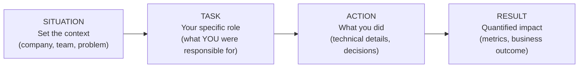
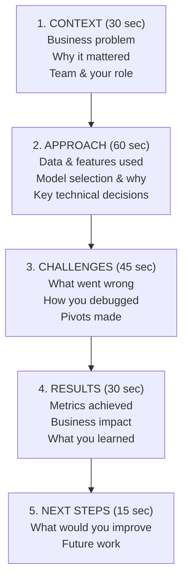
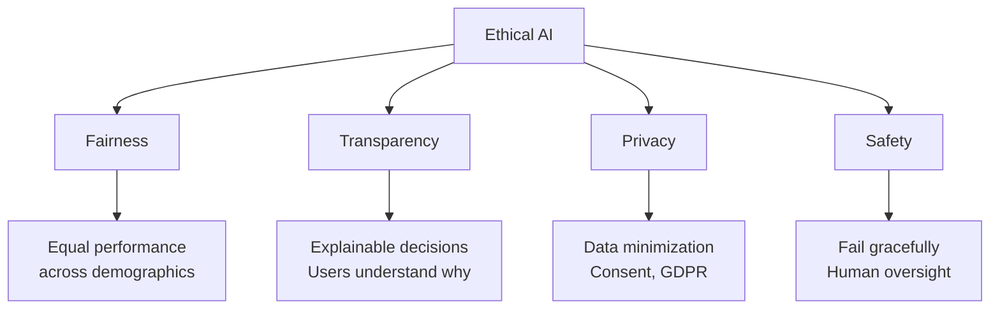

# 09 - Behavioral & Scenario-Based Questions

## Table of Contents
- [STAR Method for ML Projects](#star-method-for-ml-projects)
- [Walk Me Through a Project](#walk-me-through-a-project)
- [Common ML Scenarios](#common-ml-scenarios)
- [Ethical AI Considerations](#ethical-ai-considerations)
- [Leadership & Collaboration](#leadership--collaboration)
- [Sample Behavioral Questions](#sample-behavioral-questions)

---

## STAR Method for ML Projects

**Template for any ML project answer:**

> **Situation:** "At [Company], our [team/product] was facing [problem]."
> **Task:** "I was responsible for [specific role/goal]."
> **Action:** "I [approach taken] — specifically, I [technical details]. I chose [method X] over [method Y] because [reasoning]."
> **Result:** "This resulted in [quantified impact] — [metric] improved by [X%], which translated to [business impact]."

**Key tips:**
- Always quantify results (even estimates: "reduced latency by ~40%")
- Mention tradeoffs you considered
- Show your decision-making process
- Keep it to 2-3 minutes per answer
- Have 3-4 prepared project stories that cover different skills

---

## Walk Me Through a Project

> **Q: Walk me through an end-to-end ML project you worked on.**
>
> **A:** Structure your response as above. Example:
>
> **Context:** "At [Company], customer churn was costing $2M/year. I led the effort to build a churn prediction system."
>
> **Approach:** "We used 2 years of user behavioral data — login frequency, feature usage, support tickets, billing events. I started with a logistic regression baseline, then moved to XGBoost which performed best on our tabular data. Key decision: I used time-based splits instead of random splits to prevent data leakage."
>
> **Challenges:** "Initial model had great offline metrics but poor production performance. Turned out we had a train-serve skew — feature computation differed between training and serving. I implemented a feature store to ensure consistency."
>
> **Results:** "Final model achieved 0.85 AUC, identifying 70% of churning users 30 days in advance. The customer success team used this to proactively reach out, reducing churn by 15% — saving ~$300K/year."
>
> **Next steps:** "Would explore deep learning on sequence data (user event streams), and implement automated retraining."

---

## Common ML Scenarios

### Scenario 1: Class Imbalance

> **Q: You're building a fraud detection model and only 0.1% of transactions are fraudulent. How do you handle this?**
>
> **A:**
> 1. **Metrics**: Immediately switch from accuracy to precision-recall AUC, F1, or recall@precision=0.95
> 2. **Resampling**: SMOTE for synthetic minority oversampling. Or undersample majority with Tomek links.
> 3. **Algorithm-level**: Use `class_weight='balanced'` in sklearn. Cost-sensitive learning — make false negatives 1000x costlier.
> 4. **Threshold tuning**: Don't use default 0.5. Optimize threshold on PR curve based on business cost of FP vs FN.
> 5. **Anomaly detection**: Consider treating fraud as an anomaly — train on normal transactions only (Isolation Forest, Autoencoders).
> 6. **Ensemble**: BalancedRandomForest, EasyEnsemble — sample balanced subsets.
>
> **What I'd actually do:** Start with XGBoost + class_weight + AUC-PR metric. Then tune threshold based on cost analysis with the business team.

### Scenario 2: Train-Production Gap

> **Q: Your model had 95% accuracy in development but only 80% in production. What happened?**
>
> **A:** Systematic investigation:
> 1. **Data leakage**: Check if features used in training aren't available at prediction time (most common cause of inflated dev metrics)
> 2. **Train-serve skew**: Verify feature computation is identical in training and serving pipelines
> 3. **Distribution shift**: Compare production input distributions vs training data (use KS test, PSI)
> 4. **Temporal shift**: If model trained on old data, patterns may have changed
> 5. **Population shift**: Production users may differ from training population
> 6. **Preprocessing bugs**: Verify scaling, encoding, missing value handling matches
>
> **Prevention:** Feature store for consistency, monitoring for drift, regular retraining, shadow deployment before full rollout.

### Scenario 3: Data Quality Issues

> **Q: You receive a dataset with 30% missing values in key features. What do you do?**
>
> **A:**
> 1. **Understand WHY data is missing**: MCAR, MAR, or MNAR? (Different strategies for each)
> 2. **Analyze patterns**: Is missingness correlated with target? (If so, missingness itself is informative → add indicator feature)
> 3. **Domain consultation**: Talk to data owners — is the data recoverable from another source?
> 4. **Imputation strategy**:
>    - For MCAR: Mean/median imputation is fine
>    - For MAR: Model-based imputation (IterativeImputer, KNN imputer)
>    - For MNAR: Consider adding "is_missing" indicator features
> 5. **Model choice**: Tree-based models (XGBoost) handle missing values natively
> 6. **Validate**: Compare model performance with different imputation strategies

### Scenario 4: Conflicting Metrics

> **Q: Your model improves offline AUC by 5% but A/B test shows no improvement in CTR. What do you do?**
>
> **A:**
> 1. **Verify A/B test**: Check for bugs, sufficient sample size, correct randomization
> 2. **Metric alignment**: Offline AUC measures ranking quality, but CTR depends on the specific threshold and user behavior. They may not correlate.
> 3. **Segment analysis**: Maybe the model improved for some user segments but hurt others — check sub-group performance
> 4. **Position bias**: In recommender systems, users click top items regardless of quality. Model may be better but position dominates.
> 5. **Novelty/fatigue**: Users might react differently to new recommendations initially
> 6. **Business metric vs ML metric**: Consider whether the right online metric is being measured — maybe user engagement or session duration is a better proxy.
>
> **Lesson:** Always define online metrics that directly map to business goals before starting model development.

### Scenario 5: Limited Labeled Data

> **Q: You need to build a classification model but only have 500 labeled examples. What approaches do you consider?**
>
> **A:** In order of priority:
> 1. **Transfer learning**: Use a pretrained model (BERT for text, ResNet for images), fine-tune only the last layer(s)
> 2. **Data augmentation**: Create synthetic variants (flips, rotations for images; paraphrasing for text)
> 3. **Semi-supervised learning**: Use unlabeled data — pseudo-labeling, consistency regularization
> 4. **Active learning**: Have the model select which examples to label next (most uncertain or diverse)
> 5. **Weak supervision**: Write labeling functions (heuristics, regex), combine with Snorkel
> 6. **Few-shot learning**: Use models designed for few examples (Siamese networks, prototypical networks)
> 7. **Simpler model**: With 500 samples, logistic regression or Naive Bayes may outperform deep learning
> 8. **Get more labels**: Sometimes the best ML solution is better data — invest in labeling if possible

### Scenario 6: Scaling Challenges

> **Q: Your model takes 200ms per prediction but the requirement is <50ms. How do you optimize?**
>
> **A:**
> 1. **Profile first**: Where is the time spent? Feature computation? Model inference? Network?
> 2. **Model optimization**: Quantization (FP32→INT8), pruning, knowledge distillation to smaller model
> 3. **Caching**: Pre-compute and cache predictions for common inputs
> 4. **Batch predictions**: If possible, compute predictions in batch offline
> 5. **Simpler model**: Can a lighter model (logistic regression, small tree ensemble) achieve acceptable accuracy?
> 6. **Infrastructure**: GPU inference, TensorRT optimization, ONNX Runtime
> 7. **Feature optimization**: Reduce number of features, pre-compute expensive features
> 8. **Two-stage**: Fast model filters candidates, expensive model scores only top candidates

---

## Ethical AI Considerations

> **Q: How do you ensure your ML model is fair?**
>
> **A:**
> 1. **Define fairness**: Demographic parity? Equal opportunity? Equalized odds? (These can conflict — discuss with stakeholders)
> 2. **Audit data**: Check for representation bias (underrepresented groups), historical bias (biased labels)
> 3. **Evaluate per group**: Measure metrics (precision, recall, FPR) for each demographic group
> 4. **Mitigation techniques**:
>    - Pre-processing: Rebalance data, remove sensitive features
>    - In-processing: Adversarial debiasing, fairness constraints
>    - Post-processing: Adjust thresholds per group
> 5. **Ongoing monitoring**: Fairness can degrade over time as data shifts
>
> **Key insight:** There's no single definition of "fair." The right choice depends on context. A credit model needs equal opportunity; a hiring model needs demographic parity. Always involve stakeholders in this decision.

> **Q: How do you handle the explainability vs accuracy tradeoff?**
>
> **A:** It depends on the use case:
> - **High-stakes decisions** (healthcare, finance, criminal justice): Explainability is critical → use interpretable models (logistic regression, decision trees) or add explanation layers (SHAP, LIME)
> - **Low-stakes decisions** (content recommendation, ad ranking): Accuracy can take priority
> - **Hybrid approach**: Use a complex model for accuracy, but generate explanations with SHAP values for stakeholders
>
> **SHAP** (SHapley Additive exPlanations): Based on game theory, assigns each feature a contribution to the prediction. Model-agnostic, theoretically grounded.
> **LIME**: Locally approximates any model with an interpretable one (linear) around each prediction.

---

## Leadership & Collaboration

> **Q: How do you communicate ML results to non-technical stakeholders?**
>
> **A:**
> 1. **Start with business impact**: "This model will save $X" or "reduce churn by Y%"
> 2. **Use analogies**: "The model is like a spam filter for fraud"
> 3. **Visualize**: Confusion matrix as "out of 100 fraud cases, we catch 85"
> 4. **Avoid jargon**: No "AUC-ROC" — instead "the model correctly ranks 85% of cases"
> 5. **Show confidence**: "The model is X% confident" → helps stakeholders understand uncertainty
> 6. **Discuss limitations**: Be upfront about what the model can and cannot do

> **Q: Tell me about a time you disagreed with a teammate on a technical approach.**
>
> **A:** (Use STAR method)
> - **Situation**: Teammate wanted to use deep learning for a tabular prediction problem
> - **Task**: I believed gradient boosting would be more appropriate
> - **Action**: I proposed we run a fair comparison. We both implemented our approaches with the same data split and evaluation metrics. I also presented research showing gradient boosting typically outperforms deep learning on structured data.
> - **Result**: The XGBoost model outperformed the neural network and was 10x faster to train and serve. We went with it, and my teammate appreciated the data-driven approach. We documented the comparison for future reference.

> **Q: How do you prioritize multiple ML projects?**
>
> **A:** Framework:
> 1. **Business impact**: Expected revenue/cost impact
> 2. **Feasibility**: Data availability, technical complexity, team expertise
> 3. **Time to value**: Quick wins vs long-term investments
> 4. **Risk**: What happens if it fails? (start with lower-risk projects)
> 5. **Dependencies**: Does this unblock other work?
>
> I use a 2x2 matrix of Impact vs Effort. Start with high-impact, low-effort projects. Then tackle high-impact, high-effort. Avoid low-impact, high-effort.

---

## Sample Behavioral Questions

### About Your Technical Skills

| Question | What They're Testing | Focus Your Answer On |
|----------|---------------------|---------------------|
| "Walk me through an ML project" | End-to-end ability | Full pipeline, decisions, impact |
| "Tell me about a model that failed" | Learning from failure | Root cause analysis, what you learned |
| "How do you stay current in ML?" | Growth mindset | Papers, courses, implementations |
| "Describe a time you improved a model" | Optimization skills | Systematic approach, metrics |

### About Collaboration

| Question | What They're Testing | Focus Your Answer On |
|----------|---------------------|---------------------|
| "How do you work with product managers?" | Cross-functional | Translating ML to business value |
| "How do you handle ambiguous requirements?" | Problem structuring | Clarifying questions, prototyping |
| "Describe a disagreement with a teammate" | Conflict resolution | Data-driven resolution, respect |
| "How do you mentor junior engineers?" | Leadership | Teaching approach, patience |

### About Decision-Making

| Question | What They're Testing | Focus Your Answer On |
|----------|---------------------|---------------------|
| "How do you decide between approaches?" | Systematic thinking | Evaluation criteria, experiments |
| "When have you chosen a simpler solution?" | Pragmatism | Business constraints, maintainability |
| "How do you handle tight deadlines?" | Prioritization | MVP approach, scope management |
| "How do you deal with poor data quality?" | Practical experience | Systematic debugging, domain knowledge |

---

## Quick Recall Summary

| Topic | Key Framework |
|-------|--------------|
| **STAR Method** | Situation → Task → Action → Result. Always quantify results. |
| **Project Walkthrough** | Context → Approach → Challenges → Results → Next Steps. 2-3 min max. |
| **Class Imbalance** | Metrics (AUC-PR) + Resampling (SMOTE) + Class weights + Threshold tuning |
| **Train-Prod Gap** | Data leakage → Train-serve skew → Distribution shift → Preprocessing bugs |
| **Limited Data** | Transfer learning → Augmentation → Semi-supervised → Active learning |
| **Latency Optimization** | Profile → Quantize/Prune → Cache → Simpler model → Better infra |
| **Fairness** | Define it → Audit data → Measure per group → Mitigate → Monitor |
| **Communicating ML** | Business impact first, no jargon, visualize, discuss limitations |
| **Disagreements** | Data-driven comparison, fair evaluation, respect, document learnings |
| **Prioritization** | Impact x Feasibility matrix. High impact + low effort first. |
