# AI/ML Interview Prep — Beginner Essentials (2-3 Hours)

> **Read this one file. Skip everything else.**
> Each section has: Simple explanation → Diagram → Interview Q&A

---

## Study Plan (2-3 hours)

| Time        | Section                                                                        | Why It Matters                 |
| ----------- | ------------------------------------------------------------------------------ | ------------------------------ |
| 0:00 - 0:30 | [Part 1: What is ML?](#part-1-what-is-ml)                                      | Foundation for everything      |
| 0:30 - 1:00 | [Part 2: Key Algorithms](#part-2-key-algorithms-simplified)                    | Most asked in interviews       |
| 1:00 - 1:30 | [Part 3: Deep Learning Basics](#part-3-deep-learning-basics)                   | Hot topic in every interview   |
| 1:30 - 2:00 | [Part 4: Must-Know Concepts](#part-4-must-know-concepts)                       | The tricky interview questions |
| 2:00 - 2:30 | [Part 5: How to Answer Any ML Question](#part-5-how-to-answer-any-ml-question) | Interview strategy             |

---

# Part 1: What is ML?

## The Simplest Explanation

**Machine Learning = Teaching computers to learn from examples instead of writing explicit rules.**

Traditional programming: You write rules → computer follows them.
Machine Learning: You give examples → computer figures out the rules.

```
Traditional: IF email contains "buy now" AND sender unknown → spam
ML: Show 10,000 emails labeled spam/not-spam → model learns what spam looks like
```

## 3 Types of ML (This WILL be asked)

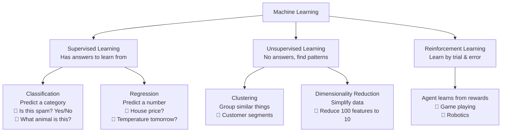

> **Q: What are the types of machine learning?**
>
> **A:** Three main types:
>
> - **Supervised Learning** — You have labeled data (input + correct answer). Model learns to predict the answer for new inputs. Two subtypes: **Classification** (predict a category like spam/not-spam) and **Regression** (predict a number like house price).
> - **Unsupervised Learning** — You only have inputs, no answers. Model finds hidden patterns. Example: grouping customers into segments.
> - **Reinforcement Learning** — An agent takes actions in an environment and gets rewards/penalties. Learns the best strategy over time. Example: a robot learning to walk.

> **Q: What's the difference between classification and regression?**
>
> **A:** **Classification** predicts categories (spam or not spam, cat or dog). **Regression** predicts numbers (house price = $350,000, temperature = 25°C). Simple way to remember: if the answer is a label → classification. If the answer is a number → regression.

---

## Training a Model — The Basic Flow

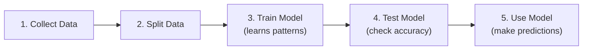

**Key idea:** You split your data into:

- **Training set (70-80%)** — model learns from this
- **Test set (20-30%)** — you check how well it learned (never shown during training)

**Why split?** If you test on the same data the model trained on, it's like giving a student the exam answers beforehand — the grade means nothing. The test set tells you how the model performs on **new, unseen data**.

> **Q: Why do we split data into training and testing sets?**
>
> **A:** To check if the model **generalizes** — meaning it works on data it hasn't seen before. If we test on training data, the model could just memorize answers and still score well. The test set simulates real-world data the model will encounter in production.

---

# Part 2: Key Algorithms (Simplified)

## The 6 Algorithms You Must Know

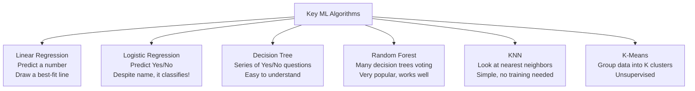

---

### 1. Linear Regression

**What:** Draw the best straight line through data points to predict a number.

**Formula:** `y = mx + b` (just like school math!)

- y = prediction, x = input, m = slope (weight), b = intercept (bias)

**Example:** Predict house price based on size.

- More square feet → higher price → positive slope

> **Q: Explain Linear Regression simply.**
>
> **A:** Linear Regression finds the best straight line through your data. It learns a weight for each input feature and sums them up: prediction = w₁×feature₁ + w₂×feature₂ + ... + bias. "Best" means the line that minimizes the total error (difference between predicted and actual values). The error metric is usually **MSE** (Mean Squared Error) = average of (prediction - actual)².

---

### 2. Logistic Regression

**What:** Predicts probability of Yes/No (binary classification). NOT regression!

**How:** Same as linear regression BUT passes result through **sigmoid function** to squeeze output between 0 and 1 (a probability).

```
Linear Regression:  output = w·x + b  → any number
Logistic Regression: output = sigmoid(w·x + b) → number between 0 and 1
```

**Sigmoid function:** Turns any number into a probability (0 to 1).

- Big positive number → close to 1 (confident Yes)
- Big negative number → close to 0 (confident No)
- Zero → 0.5 (unsure)

> **Q: Why is it called Logistic "Regression" if it does classification?**
>
> **A:** Historical naming. It actually predicts a continuous probability (0 to 1), which is technically a regression. But we use it for classification by setting a threshold (usually 0.5) — if probability > 0.5 → predict Yes, otherwise No.

---

### 3. Decision Tree

**What:** Makes predictions by asking a series of Yes/No questions, like a flowchart.

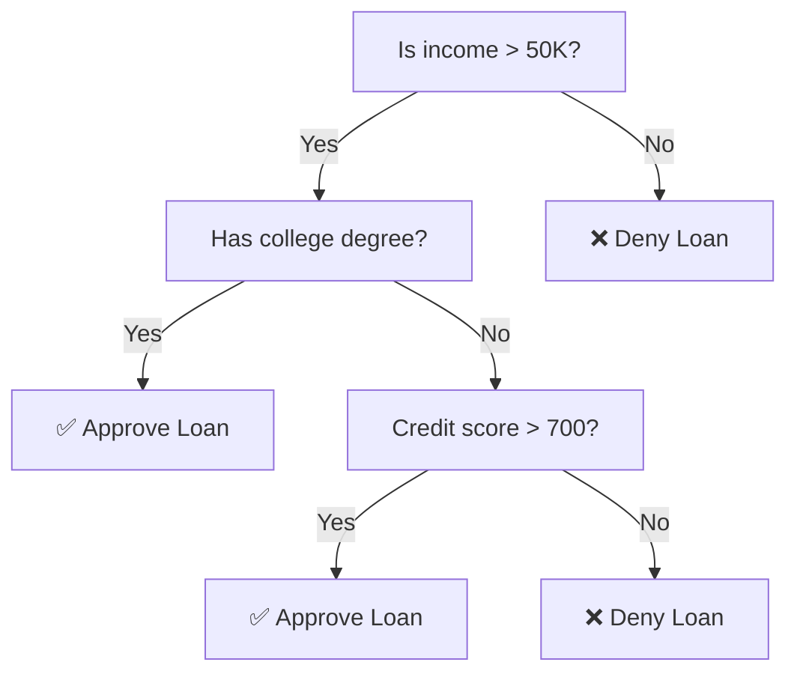

**Pros:** Easy to understand and explain (you can literally show the tree).
**Cons:** Tends to **overfit** (memorizes training data, bad on new data).

> **Q: What is a Decision Tree and what's its main weakness?**
>
> **A:** A Decision Tree splits data using if-then rules to make predictions. At each node, it asks a question about a feature (e.g., "Is age > 30?") and splits data accordingly. Its main weakness is **overfitting** — it can create very complex trees that memorize training data perfectly but perform poorly on new data. Fix: limit tree depth, or use Random Forest.

---

### 4. Random Forest (Very Important!)

**What:** Creates many decision trees, each trained on a random subset of data. Final prediction = majority vote.

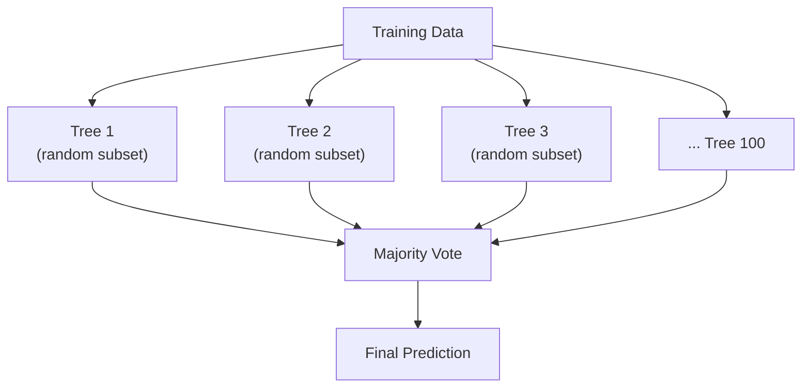

**Why it works:** One tree can be wrong, but 100 trees voting together are usually right. (Wisdom of crowds!)

> **Q: Why is Random Forest better than a single Decision Tree?**
>
> **A:** A single tree tends to overfit (memorize noise in data). Random Forest reduces this by:
>
> 1. Training each tree on a **random sample** of data (called bagging)
> 2. Each tree only sees a **random subset of features** at each split
> 3. Averaging/voting across many trees cancels out individual tree errors
>
> Result: much more robust and accurate. It's often the best "default" algorithm for structured data.

---

### 5. KNN (K-Nearest Neighbors)

**What:** To predict for a new point, look at the K closest training points and take a vote.

**Example:** K=3. New point's 3 nearest neighbors are: Cat, Cat, Dog → Predict Cat.

**Key detail:** You MUST **scale your features** first (normalize them), because KNN uses distance.

> **Q: How does KNN work?**
>
> **A:** For a new data point, KNN finds the K closest points in the training data (using a distance measure like Euclidean distance), then predicts the majority class (for classification) or average value (for regression). K is a hyperparameter you choose — small K = complex boundary (overfit risk), large K = smooth boundary (underfit risk). No actual "training" happens — it just stores data and computes distances at prediction time.

---

### 6. K-Means Clustering

**What:** Groups data into K clusters. Unsupervised (no labels needed).

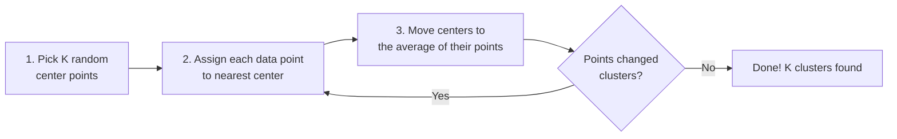

> **Q: How does K-Means work?**
>
> **A:** Three steps repeated until stable:
>
> 1. Initialize K cluster centers (randomly)
> 2. Assign each point to the nearest center
> 3. Update each center to the mean of its assigned points
>
> Repeat 2-3 until assignments stop changing. **Choosing K:** Use the "elbow method" — plot error vs K, pick K where the error stops dropping significantly.

---

# Part 3: Deep Learning Basics

## What is Deep Learning?

**Deep Learning = Machine Learning using Neural Networks with many layers.**

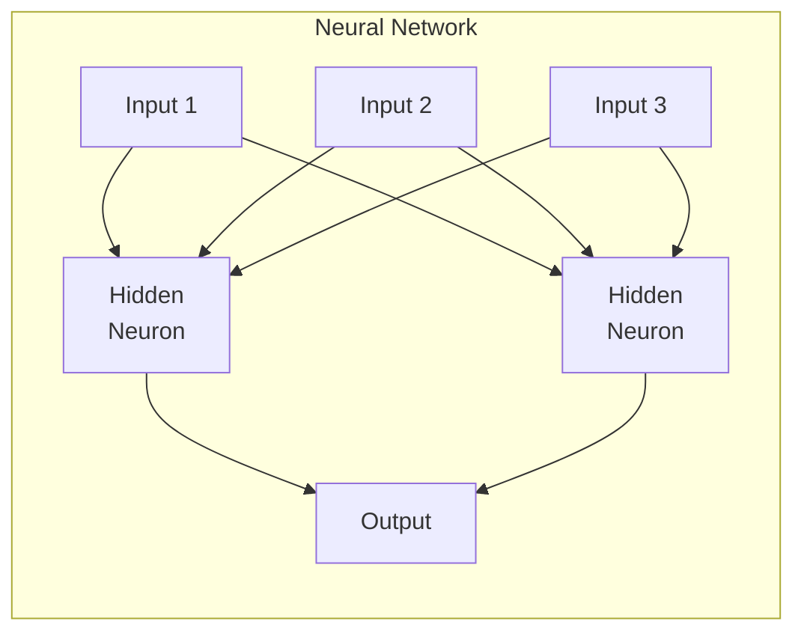

**How a single neuron works:**

1. Takes inputs, multiplies each by a weight
2. Adds them up (+ a bias)
3. Passes through an **activation function** (adds non-linearity)
4. Produces output

**Why "deep"?** Many hidden layers stacked. More layers = can learn more complex patterns.

> **Q: What is a neural network?**
>
> **A:** A neural network is layers of interconnected "neurons." Each neuron takes inputs, multiplies by weights, sums them, adds a bias, and passes through an activation function. **Input layer** receives features, **hidden layers** learn patterns, **output layer** makes predictions. The network learns by adjusting weights to minimize prediction error (using backpropagation).

---

## 3 Key Architectures to Know

### CNN (Convolutional Neural Network) — For Images

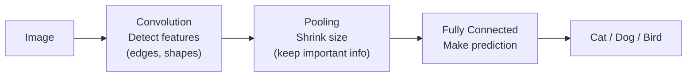

> **Q: What is a CNN and why is it used for images?**
>
> **A:** CNN (Convolutional Neural Network) uses special **filters** that slide across an image to detect patterns — first edges, then shapes, then objects. It's better than a regular neural network for images because: (1) it shares weights across the image (fewer parameters), (2) it detects features regardless of position, (3) it respects the spatial structure of images.

### RNN / LSTM — For Sequences

**RNN** (Recurrent Neural Network) processes data one step at a time, passing information from one step to the next. Good for text, time series.

**Problem:** RNNs forget early inputs in long sequences (vanishing gradient).

**LSTM** (Long Short-Term Memory) solves this with a "memory cell" that can remember important info for a long time using gates (forget, remember, output).

> **Q: What's the difference between RNN and LSTM?**
>
> **A:** RNN processes sequences step-by-step but **forgets early information** in long sequences (vanishing gradient problem). LSTM adds a **memory cell** with gates that control what to remember and forget — allowing it to capture long-range dependencies. Example: in the sentence "The cat, which was very fluffy, **sat**" — LSTM remembers "cat" (singular) to correctly predict "sat."

### Transformer — The Most Important Architecture Today

**Key idea:** Instead of processing words one-by-one (like RNN), the Transformer looks at **all words at once** using **attention** ("which words should I focus on?").

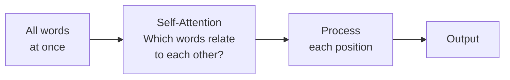

**Attention in simple terms:** For each word, the model asks "which other words are most relevant to understanding this word?" and assigns weights accordingly.

Example: "The **cat** sat on the **mat**" — when processing "sat", attention focuses on "cat" (who sat?) and "mat" (where?).

> **Q: What is a Transformer and why is it important?**
>
> **A:** The Transformer processes all input tokens in **parallel** using **self-attention** (instead of one-by-one like RNNs). This makes it faster to train and better at capturing relationships between distant words. Almost all modern AI is built on Transformers:
>
> - **BERT** = Transformer encoder. Sees all words at once (bidirectional). Good for understanding text — classification, Q&A.
> - **GPT** = Transformer decoder. Sees only previous words (left-to-right). Good for generating text.

> **Q: What is attention?**
>
> **A:** Attention is a mechanism that lets the model focus on the most relevant parts of the input when making a prediction. For each word, it computes a score with every other word (how related are they?), then takes a weighted combination. This means each word's representation is informed by the entire context — a word's meaning changes based on surrounding words.

---

# Part 4: Must-Know Concepts

## Overfitting vs Underfitting (Top Interview Topic!)

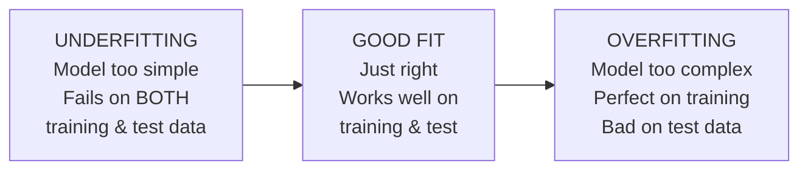

**Analogy:**

- **Underfitting** = A student who didn't study enough. Fails both practice and real exams.
- **Overfitting** = A student who memorized practice answers word-for-word. Aces practice but fails the real exam because questions are slightly different.
- **Good fit** = A student who understood the concepts. Does well on both.

> **Q: What is overfitting and how do you fix it?**
>
> **A:** Overfitting = model memorizes training data instead of learning general patterns. Signs: great training accuracy, poor test accuracy.
>
> **Fixes:**
>
> 1. **Get more data** (best solution)
> 2. **Simplify the model** (fewer parameters/features)
> 3. **Regularization** (penalize large weights — L1 or L2)
> 4. **Dropout** (randomly turn off neurons during training)
> 5. **Early stopping** (stop training when test error starts increasing)
> 6. **Cross-validation** (test on multiple data splits)

---

## Bias-Variance Tradeoff

**Simple version:**

- **Bias** = How far off the model's predictions are on average (systematic error). High bias → underfitting.
- **Variance** = How much predictions change with different training data. High variance → overfitting.

**Total Error = Bias + Variance + Noise (unavoidable)**

You want both low — but reducing one usually increases the other. The goal is finding the sweet spot.

> **Q: Explain the bias-variance tradeoff.**
>
> **A:** Simple model (like linear regression) → high bias (too simple to capture patterns), low variance (stable predictions). Complex model (like deep tree) → low bias (can fit anything), high variance (changes a lot with different data). The tradeoff: as you make the model more complex, bias decreases but variance increases. Best model balances both.

---

## Evaluation Metrics (Will Be Asked!)

### For Classification

| Metric        | What It Measures                                       | When to Use                                     |
| ------------- | ------------------------------------------------------ | ----------------------------------------------- |
| **Accuracy**  | % of correct predictions                               | Only if classes are balanced (50/50)            |
| **Precision** | Of things I predicted positive, how many actually are? | When false alarms are costly (spam filter)      |
| **Recall**    | Of actual positives, how many did I find?              | When missing cases is costly (cancer detection) |
| **F1 Score**  | Balance of Precision and Recall                        | When classes are imbalanced                     |

**Memory trick:**

- **Precision** = "Don't cry wolf" (when you say yes, be right)
- **Recall** = "Don't miss anything" (find all the actual yeses)

```
              Predicted Positive    Predicted Negative
Actually Positive    TP (correct!)        FN (missed! bad)
Actually Negative    FP (false alarm!)    TN (correct!)

Precision = TP / (TP + FP)    → "Of my YES predictions, how many were right?"
Recall    = TP / (TP + FN)    → "Of all actual YESes, how many did I find?"
F1        = 2 × (P × R) / (P + R)  → Harmonic mean of both
```

> **Q: When would you use precision vs recall?**
>
> **A:**
>
> - **Precision matters** when false positives are expensive: Spam filter (marking real email as spam is bad), legal case search (irrelevant results waste lawyer time).
> - **Recall matters** when false negatives are dangerous: Cancer screening (missing cancer = life-threatening), fraud detection (missing fraud = financial loss).
> - **F1** when you need to balance both, especially with imbalanced classes.

> **Q: Why is accuracy misleading sometimes?**
>
> **A:** If 99% of emails are not spam, a model that always predicts "not spam" gets 99% accuracy — but catches zero spam! With imbalanced data, accuracy is useless. Use F1, precision, or recall instead.

---

## Gradient Descent (How Models Learn)

**Simple explanation:** Gradient descent is how a model finds the best weights.

**Analogy:** You're blindfolded on a hilly landscape, trying to reach the lowest point. You feel the slope under your feet and take a step downhill. Repeat until you reach the bottom.

1. Make a prediction with current weights
2. Calculate how wrong it is (loss)
3. Figure out which direction to adjust weights (gradient)
4. Take a small step in that direction
5. Repeat

**Learning rate** = size of each step.

- Too big → overshoot the bottom, never converge
- Too small → takes forever to reach the bottom

> **Q: What is gradient descent?**
>
> **A:** An optimization algorithm that finds the best model parameters by iteratively moving in the direction that reduces the error (loss). The "gradient" tells us the direction of steepest increase — we go the opposite direction (steepest decrease). The learning rate controls step size. Variants: **SGD** (one sample at a time, noisy), **Mini-batch** (small batch, standard), **Adam** (adaptive learning rate, most popular default).

---

## Regularization (L1 vs L2)

**Problem:** Model weights get too large → overfitting.
**Solution:** Add a penalty for large weights to the loss function.

|             | L1 (Lasso)                                       | L2 (Ridge)                                  |
| ----------- | ------------------------------------------------ | ------------------------------------------- |
| **Penalty** | Sum of absolute weights                          | Sum of squared weights                      |
| **Effect**  | Some weights become exactly 0                    | All weights become small                    |
| **Use for** | **Feature selection** (removes useless features) | Preventing overfitting (keeps all features) |

> **Q: What's the difference between L1 and L2 regularization?**
>
> **A:** Both add a penalty to prevent overfitting. **L1** drives some weights to exactly zero (removing features — good for feature selection). **L2** shrinks all weights toward zero but never to exactly zero (keeps all features). Use L1 when you suspect many features are irrelevant. Use L2 when all features might be useful.

---

# Part 5: How to Answer Any ML Question

## The Framework

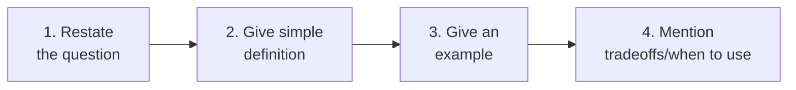

**Example:**

> Interviewer: "What is Random Forest?"
>
> You: "Random Forest is an **ensemble method** that trains many decision trees on random subsets of data and combines their predictions through voting. For example, in fraud detection, each tree might focus on different patterns — one looks at transaction amount, another at location — and the majority vote gives a more reliable prediction than any single tree. It's great because it rarely overfits and works well out of the box, but it can be slower and less interpretable than a single decision tree."

## Top 10 Questions You'll Likely Face

1. **"What types of ML are there?"** → Supervised, Unsupervised, Reinforcement (see Part 1)
2. **"What is overfitting?"** → Model memorizes training data, fails on new data (see Part 4)
3. **"Explain bias-variance tradeoff"** → Simple model = high bias, complex = high variance (see Part 4)
4. **"Precision vs Recall?"** → Precision = don't cry wolf. Recall = don't miss anything (see Part 4)
5. **"How does a Decision Tree work?"** → Series of yes/no questions that split data (see Part 2)
6. **"What is a neural network?"** → Layers of neurons that learn by adjusting weights (see Part 3)
7. **"What is a Transformer/attention?"** → Process all words at once, focus on relevant ones (see Part 3)
8. **"What is gradient descent?"** → Find best weights by iteratively stepping toward lower error (see Part 4)
9. **"BERT vs GPT?"** → BERT = understands text (bidirectional). GPT = generates text (left-to-right).
10. **"How do you handle overfitting?"** → More data, regularization, dropout, simpler model, early stopping.

## If You Don't Know The Answer

Say: "I'm not deeply familiar with [X], but based on what I know about [related concept], I believe it works like [your best understanding]. I'd love to learn more about it."

This shows:

- Honesty (huge plus)
- Ability to reason from first principles
- Growth mindset

---

## Quick Cheat Sheet (Read 5 min before interview)

| Term                  | One-Line Definition                               |
| --------------------- | ------------------------------------------------- |
| Supervised Learning   | Learn from labeled data (has answers)             |
| Unsupervised Learning | Find patterns in unlabeled data                   |
| Classification        | Predict a category                                |
| Regression            | Predict a number                                  |
| Overfitting           | Too complex, memorizes training data              |
| Underfitting          | Too simple, misses patterns                       |
| Bias                  | Systematic error (model too simple)               |
| Variance              | Sensitivity to training data (model too complex)  |
| Precision             | Of predicted positives, how many correct?         |
| Recall                | Of actual positives, how many found?              |
| F1 Score              | Balance of precision and recall                   |
| Gradient Descent      | Find best weights by following the slope downhill |
| Learning Rate         | Step size in gradient descent                     |
| Regularization        | Penalize large weights to prevent overfitting     |
| L1 (Lasso)            | Makes some weights zero (feature selection)       |
| L2 (Ridge)            | Makes all weights small                           |
| Decision Tree         | If-then rules, easy to understand                 |
| Random Forest         | Many trees voting together                        |
| Neural Network        | Layers of neurons learning from data              |
| CNN                   | Neural network for images                         |
| RNN/LSTM              | Neural network for sequences (text, time)         |
| Transformer           | Processes all words at once with attention        |
| BERT                  | Transformer that understands text (bidirectional) |
| GPT                   | Transformer that generates text (left-to-right)   |
| Attention             | Focus on relevant parts of input                  |
| Epoch                 | One complete pass through training data           |
| Batch Size            | Number of samples processed at once               |
| Dropout               | Randomly disable neurons to prevent overfitting   |
| Transfer Learning     | Use pre-trained model on new task                 |
| Feature               | An input variable to the model                    |
| Label                 | The answer/target the model tries to predict      |

---

**You've got this. Remember: interviewers care more about your thinking process than perfect answers. Think out loud, ask clarifying questions, and be honest about what you know.**
