# AI/ML 5-Hour Visual Crash Course

> A visual-first, SWE-friendly guide to ace AI/ML interviews. Every concept gets a diagram, an analogy, and an example.

---

## How to Use This Guide

- **Time**: 5 hours, split into 5 blocks. Each block is independent but builds on the previous.
- **Format**: Every concept follows: **One-liner** | **Visual** | **SWE Analogy** | **Example** | **Connect the dots**
- **Visuals**: Mermaid diagrams render in VS Code and GitHub. ASCII art works everywhere.
- **Cross-references**: Concepts link to each other. Follow the "Connect the dots" callouts to see how everything fits together.

| Hour | Topic                    | What You'll Learn                                            |
| ---- | ------------------------ | ------------------------------------------------------------ |
| 1    | **Foundations**          | ML types, the ML pipeline, evaluation metrics, overfitting   |
| 2    | **Classical Algorithms** | Linear models, trees, ensembles, SVMs, clustering            |
| 3    | **Modern AI**            | Neural nets, CNNs, Transformers, BERT, GPT, RAG, RLHF        |
| 4    | **ML in Production**     | ML system design, MLOps, monitoring, deployment              |
| 5    | **Interview Mastery**    | Concept map, answer framework, top 25 questions, cheat sheet |

---

## The AI/ML Landscape Map

```mermaid
graph TD
    ML[ML Foundations] --> CA[Classical Algorithms]
    ML --> DL[Deep Learning]
    ML --> PIPE[ML Pipeline]
    ML --> EVAL[Evaluation]

    CA --> LIN[Linear/Logistic Regression]
    CA --> TREE[Decision Trees]
    CA --> ENS[Ensembles: RF & XGBoost]
    CA --> SVM[SVMs]
    CA --> CLUST[Clustering: K-Means, DBSCAN]
    CA --> KNN[KNN & Naive Bayes]

    DL --> FFN[Feedforward Networks]
    DL --> CNN[CNNs - Vision]
    DL --> RNN[RNNs & LSTMs - Sequences]
    DL --> TRANS[Transformers - Attention]

    TRANS --> BERT[BERT - Bidirectional]
    TRANS --> GPT[GPT - Autoregressive]
    TRANS --> LLM[Large Language Models]

    LLM --> RAG[RAG - Retrieval Augmented]
    LLM --> FT[Fine-tuning & LoRA]
    LLM --> RLHF[RLHF - Alignment]
    LLM --> PE[Prompt Engineering]

    PIPE --> DATA[Data Collection & Cleaning]
    PIPE --> FE[Feature Engineering]
    PIPE --> TRAIN[Training & Tuning]
    PIPE --> DEPLOY[Deployment & Serving]
    PIPE --> MON[Monitoring & Drift]

    EVAL --> METRICS[Metrics: P/R/F1/AUC]
    EVAL --> BV[Bias-Variance Tradeoff]
    EVAL --> CV[Cross-Validation]

    style ML fill:#4a90d9,stroke:#333,color:#fff
    style DL fill:#7b68ee,stroke:#333,color:#fff
    style LLM fill:#e74c3c,stroke:#333,color:#fff
    style PIPE fill:#2ecc71,stroke:#333,color:#fff
    style EVAL fill:#f39c12,stroke:#333,color:#fff
```

> Every topic in this map connects to at least two others. ML is not a tree of isolated concepts -- it is a graph. This guide follows the edges.

---

## Hour 1: Foundations (60 min)

### 1.1 What is Machine Learning?

**One-liner**: ML is writing programs that improve automatically through experience, instead of being explicitly coded.

```
Traditional Programming:    Rules + Data   --> Answers
Machine Learning:           Data + Answers --> Rules (Model)
```

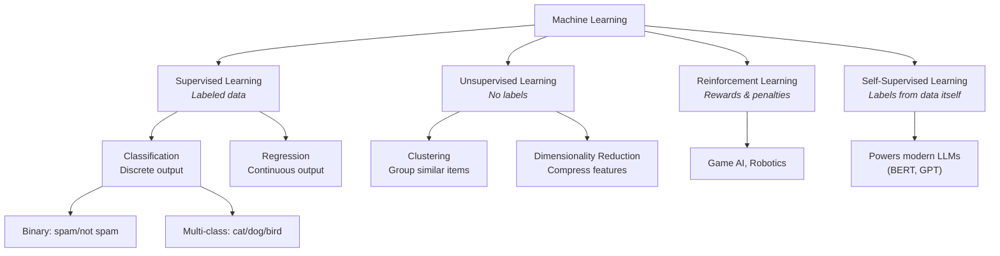

| Type                              | SWE Analogy                                                             | Example                                        |
| --------------------------------- | ----------------------------------------------------------------------- | ---------------------------------------------- |
| **Supervised** (Classification)   | Typed function signatures -- the model knows what output type to expect | Spam filter: `email -> spam \| not_spam`       |
| **Supervised** (Regression)       | A function returning a float instead of an enum                         | House price prediction: `features -> $450,000` |
| **Unsupervised** (Clustering)     | Auto-grouping log entries by pattern without predefined categories      | Customer segmentation: find natural groups     |
| **Unsupervised** (Dim. Reduction) | Compressing a bloated API response to only the fields you need          | PCA: 100 features -> 10 principal components   |
| **Reinforcement**                 | A/B testing on steroids -- agent explores, gets reward signal, adapts   | AlphaGo, robotic arm control                   |
| **Self-Supervised**               | Auto-generated unit tests from code structure (the data labels itself)  | BERT: mask a word, predict it from context     |

> **Connect the dots:** Supervised learning dominates classical ML. Self-supervised learning dominates modern AI (LLMs). Understanding both is non-negotiable. See [Transformers](#33-transformers----the-architecture-that-changed-everything-25-min) for how self-supervised pretraining enables GPT/BERT.

---

### 1.2 The ML Pipeline

**One-liner**: The ML pipeline is the CI/CD of machine learning -- a repeatable process from raw data to deployed model.

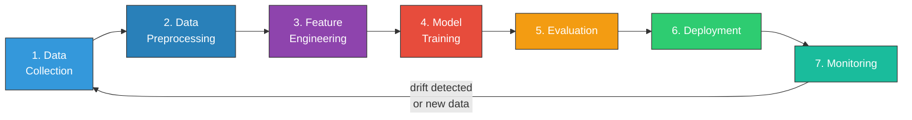

**The SWE Parallel -- ML Pipeline vs. CI/CD Pipeline:**

| ML Pipeline Step    | CI/CD Equivalent                   | What Happens                                         |
| ------------------- | ---------------------------------- | ---------------------------------------------------- |
| Data Collection     | `git clone` / pull source code     | Gather raw data from databases, APIs, logs           |
| Data Preprocessing  | Linting & formatting               | Clean nulls, handle outliers, normalize formats      |
| Feature Engineering | Writing an API adapter layer       | Transform raw data into meaningful model inputs      |
| Model Training      | `gcc` / compilation                | Source code (data) becomes compiled binary (model)   |
| Evaluation          | Running the test suite             | Measure accuracy, precision, recall on held-out data |
| Deployment          | `docker push` + deploy to prod     | Serve model via API, batch pipeline, or edge device  |
| Monitoring          | Alerting & observability (Datadog) | Track prediction drift, latency, data quality        |

```
Training Data  -->  [ML Algorithm]  -->  Trained Model
     |                                        |
  (Source Code)                        (Compiled Binary)
     |                                        |
  You can read it,                     It "just runs",
  understand it,                       you can't easily
  and modify it                        reverse-engineer it
```

> **Connect the dots:** Every interview question about ML systems maps to one of these pipeline stages. "How would you improve model performance?" means: which stage is the bottleneck? Data quality issues? Feature engineering gaps? Wrong model? Bad evaluation? See [Hour 4](#hour-4-ml-in-production-45-min) for pipeline design at scale.

---

### 1.3 Evaluation Metrics That Actually Matter

**One-liner**: A model is only as good as the metric you measure it with. Pick the wrong metric, and a broken model looks perfect.

#### The Confusion Matrix

```
                      PREDICTED
                  Positive    Negative
              +------------+------------+
   Actual     |    TRUE     |   FALSE    |
   Positive   |  POSITIVE   |  NEGATIVE  |
              |    (TP)     |    (FN)    |
              +------------+------------+
   Actual     |   FALSE     |    TRUE    |
   Negative   |  POSITIVE   |  NEGATIVE  |
              |    (FP)     |    (TN)    |
              +------------+------------+

   Precision = TP / (TP + FP)   "Of everything I flagged, how much was right?"
   Recall    = TP / (TP + FN)   "Of everything that was actually positive, how much did I find?"
   F1        = 2 * P * R / (P + R)   Harmonic mean -- balances both
```

#### When Precision vs. Recall Matters -- Two Real Examples

**Example 1: Spam Filter (Precision matters more)**

You send a critical contract to a client. The spam filter marks it as spam. Your client never sees it. That false positive just cost your company a deal. Optimize for **precision**: when you flag something, be sure about it.

**Example 2: Cancer Screening (Recall matters more)**

A patient has early-stage cancer. Your model says "negative." The patient goes home thinking they are healthy. That false negative could be fatal. Optimize for **recall**: do not miss any positives, even if you get some false alarms.

| Metric        | Formula              | When to Use                      | SWE Analogy                                                |
| ------------- | -------------------- | -------------------------------- | ---------------------------------------------------------- |
| **Accuracy**  | (TP+TN) / Total      | Balanced classes only            | Overall test pass rate                                     |
| **Precision** | TP / (TP+FP)         | FP is costly (spam filter)       | False alerts in PagerDuty -- each one wastes eng time      |
| **Recall**    | TP / (TP+FN)         | FN is costly (cancer, fraud)     | Bug escape rate -- how many real bugs did your tests miss? |
| **F1 Score**  | 2PR / (P+R)          | Imbalanced classes               | Balancing alert noise vs. bug escapes                      |
| **AUC-ROC**   | Area under ROC curve | Comparing models, threshold-free | Benchmark score across all configurations                  |

#### AUC-ROC: The Threshold-Independent View

```
  True                                  AUC = 1.0: Perfect
  Positive  1.0 +---------.............     (hugs top-left corner)
  Rate           |       .'
  (Recall)       |     .'              AUC = 0.5: Random
                 |   .'  ___......---      (diagonal line)
                 | .'  .'
            0.0  +--+--+--+--+--+--+
                 0.0               1.0
                  False Positive Rate

  AUC answers: "If I pick a random positive and a random negative,
  what's the probability the model scores the positive higher?"
```

AUC-ROC sweeps across ALL classification thresholds. A model with AUC = 0.92 is better than one with AUC = 0.85, regardless of what threshold you eventually pick.

**When AUC-ROC lies:** With heavily imbalanced data (99.9% negative), even a bad model can have a low false positive rate. Use **AUC-PR** (Precision-Recall curve) instead -- it focuses on the minority class.

> **Connect the dots:** Metrics guide every modeling decision. When an interviewer asks "how would you evaluate this?", your answer should be: (1) what errors are more costly, (2) is the data balanced, (3) do I need threshold independence? This framework covers 90% of evaluation questions. See also [Bias-Variance Tradeoff](#14-overfitting-underfitting--the-bias-variance-tradeoff) for understanding _why_ errors happen.

---

### 1.4 Overfitting, Underfitting & The Bias-Variance Tradeoff

**One-liner**: Overfitting memorizes the training data; underfitting fails to learn from it. The art of ML is finding the balance.

#### Diagnostic Flowchart

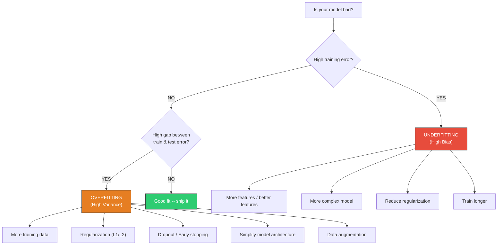

#### The SWE Analogy That Sticks

```
OVERFITTING = Tests that test implementation details, not behavior

  Your test suite passes 100% on your exact code structure,
  but breaks on ANY refactor. The tests memorized the code
  instead of testing the actual behavior.

  Similarly, an overfit model memorizes training data instead
  of learning the underlying pattern. It "passes" on training
  but "breaks" on new data.

UNDERFITTING = A test suite with only 1 test

  if response.status_code == 200: pass    # that's it?

  Too simple to catch real bugs. The model is too simple
  to capture the patterns in the data.
```

#### Bias-Variance Decomposition

```
  Total Error  =  Bias²  +  Variance  +  Irreducible Noise
                   |            |              |
              Assumptions    Sensitivity     Noise in data
              too strong?    to training     (can't fix)
                             data changes?

  Error
    |
    |  \         Variance
    |   \       /
    |    \    /            Total Error
    |     \/              /
    |     /\            /
    |   /    \        /
    |  /  Bias  \   /
    | /          \/
    +--+--+--+--+--+--+--> Model Complexity
     Simple          Complex
            ^
         Sweet spot
```

As you increase model complexity:

- **Bias decreases** (model captures more patterns)
- **Variance increases** (model becomes sensitive to training data noise)
- The **sweet spot** minimizes total error

#### Regularization = YAGNI for Models

Regularization penalizes model complexity. It is the ML equivalent of YAGNI (You Ain't Gonna Need It) -- do not add complexity unless you have evidence it helps.

|                        | L1 (Lasso)                                                         | L2 (Ridge)                                                                       |
| ---------------------- | ------------------------------------------------------------------ | -------------------------------------------------------------------------------- |
| **Penalty**            | Sum of absolute weights: `lambda * sum(\|w\|)`                     | Sum of squared weights: `lambda * sum(w^2)`                                      |
| **Effect**             | Drives some weights to exactly 0                                   | Shrinks all weights toward 0                                                     |
| **SWE Analogy**        | `Remove unused imports` -- eliminates irrelevant features entirely | `Simplify complex functions` -- keeps all code but makes each piece simpler      |
| **Use when**           | You suspect many features are irrelevant                           | All features might matter but you want to prevent any single one from dominating |
| **Feature selection?** | Yes (sparse model)                                                 | No (keeps all features)                                                          |
| **Geometry**           | Diamond constraint (corners force zeros)                           | Circle constraint (smooth, no corners)                                           |

```
  L1 (Diamond)                L2 (Circle)
        |                          |
    . / | \ .                  .---.---.
   /   |   \                 /    |    \
  /----|----\               |-----|-----|
   \   |   /                 \    |    /
    ' \ | / '                  '---'---'
        |                          |

  The loss function contour       Smooth boundary means
  is likely to hit a corner       weights shrink but
  where some weight = 0           rarely hit exactly 0
```

#### Cross-Validation: Running Tests on Different Data Subsets

```
  K-Fold Cross-Validation (K=5):

  Fold 1:  [TEST] [train] [train] [train] [train]  --> Score 1
  Fold 2:  [train] [TEST] [train] [train] [train]  --> Score 2
  Fold 3:  [train] [train] [TEST] [train] [train]  --> Score 3
  Fold 4:  [train] [train] [train] [TEST] [train]  --> Score 4
  Fold 5:  [train] [train] [train] [train] [TEST]  --> Score 5

  Final Score = mean(Score 1..5) +/- std(Score 1..5)
```

**SWE Analogy**: K-fold is like running your test suite on K different environments (different OS versions, different configs). If your tests pass on all 5 environments, you have much higher confidence than passing on just one. A model that scores well across all 5 folds generalizes better than one evaluated on a single random split.

| CV Method              | When to Use                                 | Watch Out                             |
| ---------------------- | ------------------------------------------- | ------------------------------------- |
| **K-Fold (K=5 or 10)** | General purpose, most problems              | Shuffled data, assumes i.i.d.         |
| **Stratified K-Fold**  | Imbalanced classification                   | Preserves class ratio in each fold    |
| **Time Series Split**  | Time-ordered data (stocks, logs)            | Never use future data to predict past |
| **Leave-One-Out**      | Very small datasets (< 50 samples)          | Expensive: N training runs            |
| **Group K-Fold**       | Grouped data (e.g., multiple rows per user) | Prevents data leakage across groups   |

> **Connect the dots:** Bias-variance tradeoff is the _why_ behind most modeling decisions. Chose a simpler model? You traded variance for bias. Added regularization? You are constraining the model to reduce variance at the cost of slightly higher bias. Every algorithm in [Hour 2](#hour-2-classical-ml-algorithms-60-min) can be understood through this lens. Evaluation metrics from [Section 1.3](#13-evaluation-metrics-that-actually-matter) tell you _what_ is wrong; bias-variance analysis tells you _why_.

---

## Hour 2: Classical ML Algorithms (60 min)

The **9 classical algorithms** every ML engineer must know cold. Each gets: a one-liner, a visual, an SWE analogy, and when to reach for it.

### 2.1 The Classical ML Greatest Hits

#### Linear Regression

**One-liner:** Fit the best straight line through your data to predict a continuous value.

```
    y
    |          .  .
    |       ./
    |     ./ .        y_hat = wx + b
    |   /.
    |  /. .
    | / .
    +------------------ x
       The line minimizes sum(y - y_hat)^2
```

**SWE Analogy:** Literally `y = mx + b` from algebra. Fitting a slope and intercept -- the simplest possible model.

**When to use:** Baseline for any regression task, roughly linear relationships, interpretable coefficients needed. **Key hyperparameters:** Regularization (Ridge/L2, Lasso/L1, Elastic Net), alpha.

> **Connect the dots:** Linear regression is the "hello world" of ML. If it doesn't work, the relationship is non-linear -- try tree-based methods. See [Decision Trees](#decision-trees) or [XGBoost](#xgboost--gradient-boosting).

---

#### Logistic Regression

**One-liner:** Linear regression piped through a sigmoid function -- outputs a probability for classification.

```
  P(y=1)
  1.0 |                  .........
      |               .
  0.5 | - - - - - . - - - - - -   <- decision boundary
      |         .
  0.0 |.......
      +-------------------------- z
         sigma(z) = 1 / (1 + e^(-z))
```

**SWE Analogy:** Pipe a linear score through sigmoid to squash into [0, 1] -- a normalization function that outputs a probability.

**Gotcha:** Despite the name, it is a **classification** algorithm, not regression.

**When to use:** Binary classification baseline, probabilities needed, interpretability matters. **Key hyperparameters:** C (inverse regularization), penalty (L1/L2).

> **Connect the dots:** A single logistic regression unit is mathematically identical to a single neuron. Stack them and you get a neural network. This is the bridge to [Hour 3: Deep Learning](#hour-3-modern-ai----deep-learning--llms-75-min).

---

#### Decision Trees

**One-liner:** A flowchart of if/else rules learned from data.

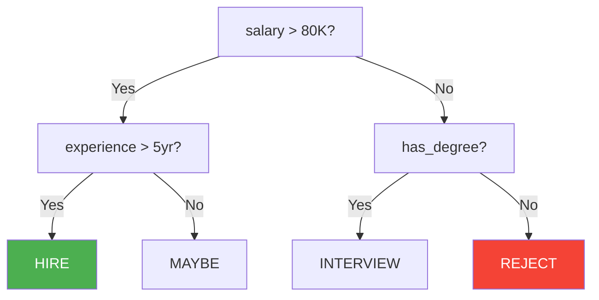

**SWE Analogy:** Literally an `if/else` chain. The tree learns which conditions to check and in what order -- like auto-generating business logic from data.

**When to use:** Interpretable decisions (explaining to stakeholders), small-to-medium data, mixed feature types.

**Watch out:** Prone to overfitting. Fix with `max_depth`, `min_samples_leaf`, or use an ensemble (next two sections).

**Key hyperparameters:** max_depth, min_samples_split, min_samples_leaf, criterion (gini vs entropy).

> **Connect the dots:** Decision trees are the building block for Random Forests and XGBoost -- the two most powerful tabular-data algorithms. See [Random Forest](#random-forest) and [XGBoost](#xgboost--gradient-boosting).

---

#### Random Forest

**One-liner:** Train many decision trees on random subsets of data and features, then let them vote.

```
  Training Data
    |-----> Bootstrap 1 --> Tree 1 --\
    |-----> Bootstrap 2 --> Tree 2 ---+--> VOTE / AVERAGE --> Prediction
    |-----> Bootstrap 3 --> Tree 3 --/         ^
    |-----> ...         --> Tree N --/    majority rules
  (random samples with replacement)
```

**SWE Analogy:** Code review by committee. One reviewer might miss a bug, but 100 reviewers independently voting produces a far more reliable consensus.

**Key insight:** Bagging (bootstrap aggregating) **reduces variance**. Each tree overfits differently; their average cancels out the noise.

**When to use:** First algorithm to try on tabular data. Great out-of-the-box with minimal tuning. **Key hyperparameters:** n_estimators (100-500), max_depth, max_features (sqrt for classification).

> **Connect the dots:** Random Forest trains trees in parallel (horizontal scaling). Gradient Boosting trains them sequentially (iterative refinement). Both are ensembles, but they attack different problems -- variance vs bias. See [XGBoost](#xgboost--gradient-boosting).

---

#### XGBoost / Gradient Boosting

**One-liner:** Train trees sequentially -- each new tree fixes the mistakes the previous ensemble got wrong.

```
  Round 1         Round 2         Round 3
  +-----+        +-----+        +-----+
  |Tree 1|--err-->|Tree 2|--err-->|Tree 3|--> ...
  |fit Y |       |fix R1|       |fix R2|
  +-----+        +-----+        +-----+

  Final = Tree1 + eta*Tree2 + eta*Tree3 + ...
                 ^
           learning rate
```

**SWE Analogy:** Iterative debugging. Run your code, find the bugs (residuals), fix them in the next patch. Each cycle, remaining bugs shrink.

**Key insight:** Boosting **reduces bias** (and variance). Wins most Kaggle competitions on tabular data. Three major implementations: **XGBoost** (general purpose), **LightGBM** (fastest, large datasets), **CatBoost** (best for categorical features).

**When to use:** Maximum accuracy on tabular data with hyperparameter tuning budget. **Key hyperparameters:** learning_rate (0.01-0.3), n_estimators, max_depth (3-8, shallower than RF).

> **Connect the dots:** Random Forest = many independent reviewers voting (parallel, reduces variance). XGBoost = one reviewer iteratively refining (sequential, reduces bias). For unstructured data (images, text), neither works -- you need deep learning ([Hour 3](#hour-3-modern-ai----deep-learning--llms-75-min)).

---

#### K-Nearest Neighbors (KNN)

**One-liner:** To classify a new point, find the K closest training points and take a majority vote.

```
         .B    .B
       .B   *?    .A
         .A     .A
       .B    .A

  K=3 -> 2 A's, 1 B -> predict A
  K=5 -> 3 A's, 2 B's -> predict A
  K=7 -> 3 A's, 4 B's -> predict B  <- K matters!
```

**SWE Analogy:** Stack Overflow search. Find the K most similar answered questions, go with whatever solution the majority used.

**Key insight:** No training phase -- stores the dataset and computes distances at prediction time. A **lazy learner**: fast to "train", slow to predict. Suffers from the **curse of dimensionality** -- must scale features first.

**Key hyperparameters:** K (number of neighbors), distance metric (Euclidean, Manhattan, cosine).

> **Connect the dots:** KNN is the only algorithm here with zero training cost. The tradeoff is O(n) prediction cost. If you need fast inference, use tree-based methods instead.

---

#### K-Means Clustering

**One-liner:** Partition data into K groups by iteratively assigning points to nearest centroids and updating centroids.

```
  1. Pick K random centroids
  2. Assign each point to nearest centroid
  3. Recompute centroids as cluster means
  4. Centroids moved? --> Yes: go to step 2
                     --> No:  Done! K clusters found
```

**SWE Analogy:** Auto-assigning servers to data center regions. Assign each server to nearest data center, recompute optimal locations, repeat until stable.

**Key insight:** **Unsupervised** -- no labels needed. Specify K upfront. Use the **elbow method** or **silhouette score** to choose K.

**When to use:** Customer segmentation, document grouping, image compression. **Key hyperparameters:** K, init (K-means++), n_init.

> **Connect the dots:** K-Means assumes spherical clusters of similar size. For irregular shapes, look at DBSCAN. For a supervised alternative with labels, see [KNN](#k-nearest-neighbors-knn).

---

#### Support Vector Machines (SVM)

**One-liner:** Find the decision boundary that maximizes the margin (gap) between classes.

```
  Class B       |  margin  |       Class A
                |<-------->|
    x    x      | [support]|       o    o
      x     x   | vectors  |    o    o
    x       x   |          |  o      o
         -------+----------+------ hyperplane
```

**SWE Analogy:** Drawing the widest possible line between two groups. Not just separating -- finding the boundary with maximum breathing room. Only the points on the edge (support vectors) matter.

**Key insight:** The **kernel trick** handles non-linear boundaries by implicitly mapping data to higher dimensions. RBF kernel is most popular.

**When to use:** Small-to-medium datasets, high-dimensional data (text classification). **Key hyperparameters:** C (regularization), kernel (linear, RBF, poly), gamma.

> **Connect the dots:** SVM scales poorly to large datasets (O(n^2) to O(n^3) training). For large-scale classification, use logistic regression or tree-based methods. SVM + TF-IDF was the go-to for text before transformers.

---

#### Naive Bayes

**One-liner:** Apply Bayes' theorem assuming all features are independent.

```
  P(Spam | words) = P(words | Spam) x P(Spam)
                    -------------------------
                          P(words)

  Email: "Buy cheap watches now!"
  P(Spam) = 0.4       (prior)
  P("buy"|Spam)    = 0.8
  P("cheap"|Spam)  = 0.9
  P("watches"|Spam)= 0.3
  Naive: multiply all  ->  High posterior  ->  SPAM
```

**SWE Analogy:** A spam filter with word frequency counts. For each word, look up how often it appears in spam vs ham. Multiply individual probabilities (assuming independence) and classify.

**Why "naive"?** Assumes features are conditionally independent. "Buy" and "cheap" are correlated in spam, but Naive Bayes ignores that. Still works because classification only needs correct **ranking**, not exact probabilities.

**When to use:** Text classification, small datasets, fast baseline. **Key hyperparameters:** alpha (Laplace smoothing), variant (Gaussian, Multinomial, Bernoulli).

> **Connect the dots:** Naive Bayes is the fastest classifier -- both to train and predict. First thing to try on text classification before heavier models. Understanding Bayes' theorem is foundational for all of ML.

---

### The Comparison Table

| Algorithm               | Type           | Interpretable? | Non-Linear?  | Training Speed    | Prediction Speed | Best For                   |
| ----------------------- | -------------- | -------------- | ------------ | ----------------- | ---------------- | -------------------------- |
| **Linear Regression**   | Regression     | Yes            | No           | Very Fast         | Very Fast        | Baseline, interpretability |
| **Logistic Regression** | Classification | Yes            | No           | Very Fast         | Very Fast        | Probability baseline       |
| **Decision Tree**       | Both           | Yes            | Yes          | Fast              | Very Fast        | Explainable models         |
| **Random Forest**       | Both           | Moderate       | Yes          | Medium            | Medium           | General-purpose first try  |
| **XGBoost**             | Both           | Low            | Yes          | Slow (sequential) | Fast             | Max accuracy, tabular data |
| **KNN**                 | Both           | Yes            | Yes          | None (lazy)       | Slow O(n)        | Small data, similarity     |
| **K-Means**             | Clustering     | Moderate       | No           | Fast              | Fast             | Segmentation, unsupervised |
| **SVM**                 | Classification | Low            | Yes (kernel) | Slow O(n^2)       | Fast             | High-dim, small data       |
| **Naive Bayes**         | Classification | Moderate       | No           | Very Fast         | Very Fast        | Text, fast baseline        |

---

### 2.2 Algorithm Selection Flowchart

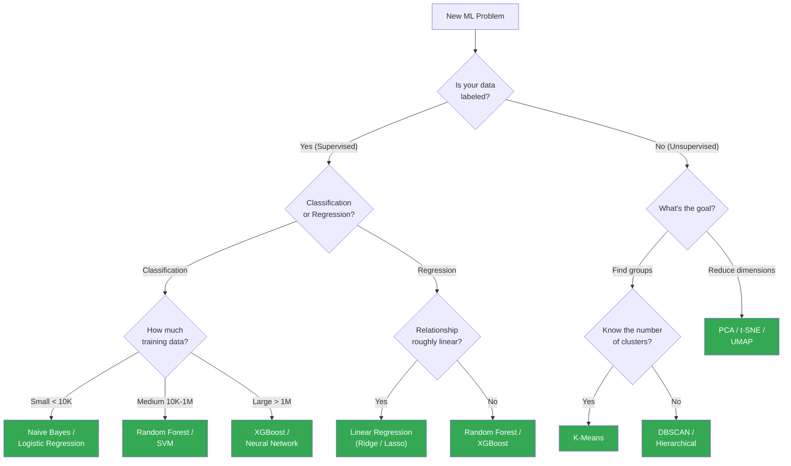

| Situation                      | Start With                        | Why                                                                             |
| ------------------------------ | --------------------------------- | ------------------------------------------------------------------------------- |
| Tabular data, accuracy matters | XGBoost / LightGBM                | Wins most benchmarks on structured data                                         |
| Need a fast baseline           | Logistic / Linear Regression      | Minutes to train, easy to interpret                                             |
| Need to explain decisions      | Decision Tree / Logistic Reg      | White-box models                                                                |
| Text classification            | Naive Bayes, then LogReg + TF-IDF | Strong baselines before transformers                                            |
| Images, audio, long text       | Skip classical ML entirely        | Go to deep learning ([Hour 3](#hour-3-modern-ai----deep-learning--llms-75-min)) |

> **Connect the dots:** This flowchart gets you 80% of the way. Always start with the simplest model that could work, then increase complexity only if metrics demand it.

---

### 2.3 Bridge to Deep Learning

All these algorithms struggle with **raw unstructured data** -- images, audio, long text. That is where deep learning enters. **The key insight: a single neuron IS logistic regression.**

```
  LOGISTIC REGRESSION              SINGLE NEURON
  x1 --w1--\                      x1 --w1--\
            +-> sum+b -> sigma()            +-> sum+b -> activation()
  x2 --w2--/         -> output    x2 --w2--/         -> output
  x3 --w3--/                      x3 --w3--/
  Same math. Different name.

  Stack neurons -> layer. Stack layers -> deep network:
  INPUT        HIDDEN 1       HIDDEN 2      OUTPUT
  x1 -------->[n] [n] [n] -->[n] [n] -----> y
  x2 --------> (3 neurons)    (2 neurons)
  x3 -------->
  Each arrow = a weight. "Deep" = multiple hidden layers.
```

**When classical ML is not enough:**

| Data Type      | Why Classical Fails                | Deep Learning Solution         |
| -------------- | ---------------------------------- | ------------------------------ |
| Images         | Flat pixels lose spatial structure | CNNs learn spatial hierarchies |
| Text sequences | Bag-of-words loses word order      | Transformers model sequences   |
| Audio          | Raw waveform too high-dimensional  | CNNs on spectrograms, wav2vec  |
| Video          | Temporal + spatial complexity      | 3D CNNs, Vision Transformers   |

Classical ML treats features as a flat table. Deep learning **learns the features themselves** from raw data -- this is **representation learning**, the fundamental difference.

> **Connect the dots:** Hour 2 gave you algorithms for structured/tabular data. Hour 3 takes the single-neuron concept from logistic regression and scales it to millions of parameters for unstructured data. The math is the same -- just more of it.

---

## Hour 3: Modern AI -- Deep Learning & LLMs (75 min)

> This is the most important hour. Transformers and LLMs dominate modern AI interviews.

---

### 3.1 Deep Learning Mechanics (15 min)

#### Gradient Descent -- The Blindfolded Hiker

You are blindfolded on a hilly landscape. You feel the slope under your feet and step downhill. Learning rate = step size.

```
    Loss
     ^
     |   *  <-- start here
     |    \
     |     \   * <-- overshoot (LR too big)
     |      \ / \
     |       *   \        * <-- stuck (LR too small)
     |        \   \      /
     |         \   '----*
     |          \
     |           *  <-- optimal
     |____________\_________> Parameters
```

- **Too big:** overshoot the valley, bounce back and forth
- **Too small:** barely move, stuck in shallow dips
- **Just right:** smooth convergence

| Variant           | Batch Size    | Trade-off                         |
| ----------------- | ------------- | --------------------------------- |
| **Batch GD**      | All N samples | Stable but slow, high memory      |
| **Stochastic GD** | 1 sample      | Fast, noisy, escapes local minima |
| **Mini-batch GD** | 32-512        | Best of both -- fast and stable   |

**Adam = the smart hiker.** Combines momentum (remembers direction) with adaptive step size (bigger steps on flat terrain, smaller on steep). Default for most DL. **AdamW** is the standard for Transformers.

```
SGD:    param_1: ------>      Adam:  param_1: ---------> (flat = bigger step)
        param_2: ------>             param_2: -->         (steep = smaller step)
```

#### Activation Functions

| Function    | Range            | When to Use                 |
| ----------- | ---------------- | --------------------------- |
| **ReLU**    | [0, inf)         | Default for hidden layers   |
| **Sigmoid** | (0, 1)           | Binary output probabilities |
| **Tanh**    | (-1, 1)          | Zero-centered output        |
| **Softmax** | (0,1), sums to 1 | Multi-class probabilities   |
| **GELU**    | ~(-0.17, inf)    | Transformer hidden layers   |

#### Regularization

**Dropout** -- randomly zero out neurons during training so no single neuron becomes a bottleneck.

**SWE analogy:** Disabling random team members during practice so no one is a single point of failure. At game time (inference), everyone plays.

**Batch Normalization:** auto-scaling your data at every layer. **Early Stopping:** timeout on your build -- stop when validation loss plateaus.

> **Connect the dots:** Gradient descent is _how_ networks learn. Activations give them non-linear power. Regularization prevents memorization. These mechanics underpin everything in [3.2](#32-cnns----convolutional-neural-networks-10-min) through [3.4](#34-llms--the-modern-ai-stack-20-min).

---

### 3.2 CNNs -- Convolutional Neural Networks (10 min)

**One-liner:** CNNs use sliding filters to detect visual patterns, from edges to objects.

**SWE analogy:** Convolution = sliding regex for images -- a small pattern detector scanning across the input, matching visual patterns instead of text patterns.

```
Raw Pixels       Edges & Corners    Textures        Parts           Objects
+---------+     +---------+       +---------+    +---------+    +---------+
| [image] | --> | / | \ - | -->   | .:.:.:  | -->|  /\     | -->|  /^^\   |
+---------+     +---------+       +---------+    +---------+    +---------+
  Layer 1         Layer 2           Layer 3        Layer 4        Layer 5
```

Each layer builds on the previous. Early layers detect edges, later layers combine them into objects. This is **hierarchical feature learning**.

| Component           | What It Does                                    | SWE Analogy                   |
| ------------------- | ----------------------------------------------- | ----------------------------- |
| **Convolution**     | Slides learnable filters, produces feature maps | Pattern matcher scanning data |
| **Pooling**         | Downsamples (max or average)                    | Thumbnail / lossy compression |
| **Fully Connected** | Final classification from flattened features    | Decision layer                |

**Output size:** (W - F + 2P) / S + 1

| Architecture     | Year | Key Idea                                                        |
| ---------------- | ---- | --------------------------------------------------------------- |
| **AlexNet**      | 2012 | Deep CNNs + GPUs work -- launched the DL era                    |
| **VGG**          | 2014 | Stack 3x3 filters, go deeper                                    |
| **ResNet**       | 2015 | **Skip connections** (output = F(x) + x) -- enabled 100+ layers |
| **EfficientNet** | 2019 | Compound scaling of depth, width, resolution                    |
| **ViT**          | 2020 | Ditch convolutions -- Transformers on image patches             |

> **Connect the dots:** CNNs dominated vision (2012-2022). Vision Transformers (ViT) showed that attention from [section 3.3](#33-transformers----the-architecture-that-changed-everything-25-min) works on images too -- split images into patches, treat each as a "token."

---

### 3.3 Transformers -- The Architecture That Changed Everything (25 min)

> This is THE topic. If you understand Transformers, you understand modern AI.

#### Why RNNs Failed

```
RNN: Sequential (slow)
  "The" --> "cat" --> "sat" --> "on" --> "the" --> "mat"
  t=1       t=2       t=3       t=4      t=5      t=6
  (must finish each step before starting the next)

Transformer: Parallel (fast)
  "The"  "cat"  "sat"  "on"  "the"  "mat"
    |      |      |      |      |      |
  [========= ALL PROCESSED SIMULTANEOUSLY =========]
```

| Problem               | RNN                                       | Transformer                          |
| --------------------- | ----------------------------------------- | ------------------------------------ |
| **Speed**             | Sequential O(n), no parallelism           | All tokens in parallel, GPU-friendly |
| **Long-range memory** | Vanishing gradients forget distant tokens | Direct attention to every token      |
| **Path length**       | O(n) steps between distant tokens         | O(1) -- direct connection            |

#### The Attention Mechanism -- 3 Ways to Understand It

**1. Intuitive:** In _"The cat sat on the mat because it was tired"_, what does "it" refer to? Attention learns to focus on "cat" with high weight when processing "it."

```
Attention weights for "it":
  The   cat   sat   on   the   mat   because   it   was   tired
  0.05  0.62  0.03  0.01 0.02  0.08  0.04     0.10 0.02  0.03
        ^^^^  highest -- "it" attends most to "cat"
```

**2. Visual -- The Attention Matrix:**

```
           The   cat   sat   on   mat
       +-------------------------------+
 The   |  0.8   0.1   0.05  0.03  0.02 |
 cat   |  0.1   0.5   0.2   0.1   0.1  |
 sat   |  0.05  0.3   0.4   0.15  0.1  |
 on    |  0.02  0.08  0.1   0.5   0.3  |
 mat   |  0.03  0.07  0.1   0.3   0.5  |
       +-------------------------------+
 rows = query, cols = key, each row sums to 1 (softmax)
```

**3. Q/K/V as a Fuzzy Hashmap (THE Key Analogy):**

```
REGULAR HASHMAP:                     ATTENTION (FUZZY HASHMAP):
+------------------+                 +-----------------------------+
| query: "cat"     |                 | query: "it"                 |
|     |            |                 |     |                       |
|     v            |                 |  compare to ALL keys        |
| exact match:     |                 |     |                       |
| key="cat" found  |                 |  key="cat"  score=0.62      |
|     |            |                 |  key="mat"  score=0.08      |
|     v            |                 |  key="sat"  score=0.03      |
| return ONE value |                 |     |                       |
+------------------+                 |  weighted avg of ALL values |
                                     |  (0.62*V_cat + 0.08*V_mat) |
                                     +-----------------------------+

Hashmap:    1 query -> 1 exact key   -> 1 value
Attention:  1 query -> ALL keys (fuzzy) -> weighted sum of ALL values
```

- **Q (Query):** "What am I looking for?"
- **K (Key):** "What do I contain?" (used for matching)
- **V (Value):** "What information do I provide?" (used for output)

**The formula:**

```
Attention(Q, K, V) = softmax(Q * K^T / sqrt(d_k)) * V

Step 1: Q * K^T       -> raw similarity scores (dot products)
Step 2: / sqrt(d_k)   -> scale to prevent softmax saturation
Step 3: softmax(...)   -> normalize to probabilities (sum to 1)
Step 4: * V            -> weighted combination of values
```

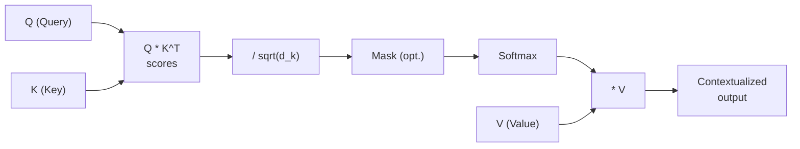

**Why scale by sqrt(d_k)?** Large d_k makes dot products large, pushing softmax into near-zero gradient regions. Scaling keeps gradients healthy.

#### Multi-Head Attention

One head captures one relationship type. Language has many (syntax, semantics, coreference). Solution: run h heads in parallel, each on d_k = d_model/h dimensions.

```
                      Input
               /    /    |    \    \
             H1   H2    H3   H4   Hh     (h parallel heads)
             |     |     |    |     |
          syntax  sem  position coref     (each learns different patterns)
             \     \     |    /    /
                Concatenate all heads
                      |
                 Linear (W_O)
                      |
                    Output
```

**SWE analogy:** Multiple fuzzy hashmaps in parallel, each configured for a different relationship type. Concatenate all results into one rich representation.

#### Positional Encoding

Transformers process all tokens in parallel -- **no inherent sense of order**. "Dog bites man" = "Man bites dog" without position info.

**SWE analogy:** Someone shuffled your source code lines. Tokens are all there, but without line numbers you cannot reconstruct the program. Positional encoding adds those line numbers.

```
Token embeddings:    [The]  [cat]  [sat]  [on]  [the]  [mat]
                       +      +      +      +      +      +
Position encodings:  [p0]   [p1]   [p2]   [p3]   [p4]   [p5]
                       =      =      =      =      =      =
Final input:         [The   [cat   [sat   [on    [the   [mat
                     +p0]   +p1]   +p2]   +p3]   +p4]   +p5]
```

**Methods:** Sinusoidal (original, generalizes to unseen lengths), Learned (BERT/GPT-2, simple but fixed), RoPE (LLaMA, best extrapolation via rotation of Q/K).

#### Full Transformer Architecture

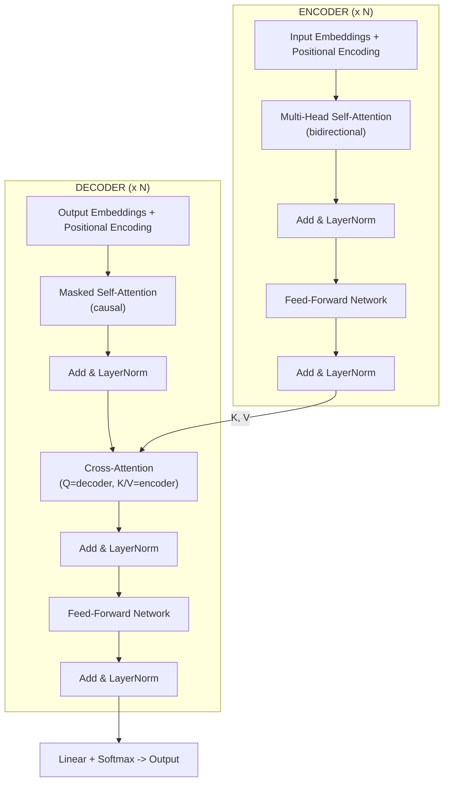

| Component            | Purpose                                                                 |
| -------------------- | ----------------------------------------------------------------------- |
| **Self-Attention**   | Each token attends to all others -- captures any-distance relationships |
| **Cross-Attention**  | Decoder attends to encoder output -- connects input to output           |
| **Masked Attention** | Prevents peeking at future tokens -- valid autoregressive generation    |
| **Add & Norm**       | Residual connection + LayerNorm -- stable deep stacking                 |
| **Feed-Forward**     | Two linear layers + activation -- per-position capacity                 |

Modern specializations: **Encoder only** (BERT) for understanding, **Decoder only** (GPT) for generation, **Encoder-decoder** (T5) for seq2seq.

> **Connect the dots:** Attention lets Transformers process sequences in parallel while capturing long-range relationships. Multi-head gives multiple "perspectives." This is the foundation of every model in [section 3.4](#34-llms--the-modern-ai-stack-20-min).

---

### 3.4 LLMs & The Modern AI Stack (20 min)

#### BERT vs GPT -- Side by Side

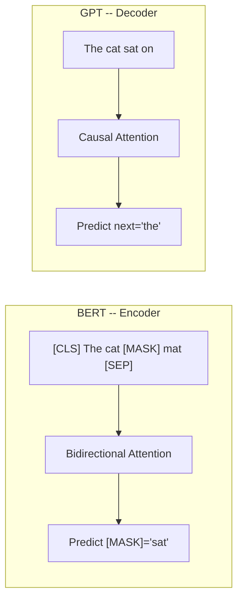

| Aspect           | BERT                                      | GPT                                              |
| ---------------- | ----------------------------------------- | ------------------------------------------------ |
| **Architecture** | Encoder only                              | Decoder only                                     |
| **Attention**    | Bidirectional (sees all tokens)           | Causal/left-to-right (sees only past)            |
| **Training**     | Masked Language Model                     | Next Token Prediction                            |
| **Best at**      | Understanding: classification, NER, QA    | Generation: text, code, chat                     |
| **SWE analogy**  | **Read-only access** -- see the full file | **Append-only log** -- only see what came before |

**Why GPT won:** decoder-only scales better. Next token prediction alone produces models that both understand and generate.

#### Embeddings -- Semantic Hash Functions

```
Traditional hash:             Embedding (semantic hash):
  "cat"  --> 0x7A3F            "cat"  --> [0.21, 0.85, -0.12, ...]
  "cats" --> 0xB291            "cats" --> [0.22, 0.84, -0.11, ...]
  (completely different!)      (almost identical!)

  "king" - "man" + "woman" = "queen"   <-- vector arithmetic works!
```

**SWE analogy:** Like a hash function, but similar inputs produce similar outputs instead of wildly different ones. Used for search, recommendations, RAG, and classification.

#### RAG (Retrieval-Augmented Generation)

**SWE analogy:** Giving the LLM a search engine instead of expecting it to memorize everything. Developers use docs instead of memorizing APIs -- same idea.

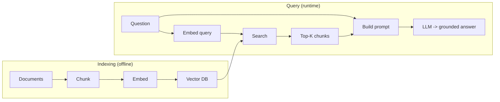

| Concern           | Fine-tuning        | RAG                     |
| ----------------- | ------------------ | ----------------------- |
| **Updates**       | Must retrain       | Update doc store        |
| **Hallucination** | May confabulate    | Grounded in documents   |
| **Citations**     | Not possible       | Points to source chunks |
| **Cost**          | GPU training hours | Embedding + retrieval   |

#### Fine-tuning & RLHF

**SWE analogy:** Transfer learning = using an open-source library instead of writing from scratch. Fine-tuning = forking it and customizing for your use case.

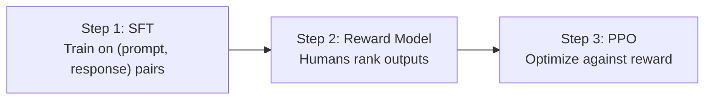

| Step             | What Happens                           | Analogy                                    |
| ---------------- | -------------------------------------- | ------------------------------------------ |
| **SFT**          | Teach instruction-following format     | New hire learns the style guide            |
| **Reward Model** | Humans label "A better than B"         | Code review rubric from senior preferences |
| **PPO**          | Optimize generations for higher reward | Iterate code based on automated review     |

**LoRA** (Low-Rank Adaptation): freeze base, inject tiny trainable matrices (~0.1% of params). Near full quality. **QLoRA**: LoRA + 4-bit quantization -- fine-tune 65B on a single GPU.

```
Full fine-tuning:  [W] all trainable (7B params)
LoRA:              [W_frozen] + [A*B] trainable (~7M params, 1000x fewer)
```

#### Prompt Engineering Basics

| Technique            | When to Use             | Example                                       |
| -------------------- | ----------------------- | --------------------------------------------- |
| **Be specific**      | Always                  | "List 3 pros and 3 cons" vs "tell me about X" |
| **Few-shot**         | Pattern from examples   | "Q: ... A: ... Q: [yours]"                    |
| **Chain-of-Thought** | Math, logic, reasoning  | "Let's think step by step..."                 |
| **System prompt**    | Role/constraint setting | "You are a senior backend engineer..."        |

> **Connect the dots:** BERT and GPT are two sides of the Transformer coin from [section 3.3](#33-transformers----the-architecture-that-changed-everything-25-min). Embeddings turn everything into vectors. RAG grounds LLMs in real knowledge. RLHF turns raw models into helpful assistants. Together, these form the modern AI stack.

---

### Hour 3 Cheat Sheet

```
+-------------------------------------------------------------------+
|                    MODERN AI - QUICK RECALL                       |
+-------------------------------------------------------------------+
| Gradient Descent  | Blindfolded hiker. LR = step size.            |
|                   | Adam = momentum + adaptive LR (default).      |
+-------------------+-----------------------------------------------+
| CNN               | Sliding filters: edges -> textures -> objects. |
|                   | ResNet skip connections enabled deep nets.     |
+-------------------+-----------------------------------------------+
| Transformer       | Self-attention replaces recurrence.             |
|                   | Attention = fuzzy hashmap (Q->all K->sum V).  |
|                   | Multi-head = parallel attention perspectives.  |
|                   | Positional encoding = line numbers for code.   |
+-------------------+-----------------------------------------------+
| BERT vs GPT       | Encoder (read-only, bidir) vs Decoder          |
|                   | (append-only, autoregressive). GPT won.        |
+-------------------+-----------------------------------------------+
| Embeddings        | Semantic hash: similar input -> similar vector. |
| RAG               | LLM + search engine. Retrieve, augment, gen.  |
| RLHF              | SFT -> Reward Model -> PPO. Human alignment.  |
| LoRA              | Freeze base, train tiny matrices. 0.1% params. |
+-------------------------------------------------------------------+
```

---

## Hour 4: ML in Production (45 min)

You can train a perfect model in a notebook. Shipping it is the hard part.

### 4.1 ML System Design Framework (20 min)

Every ML system design interview follows the same skeleton. Memorize these 8 steps and you can tackle any prompt.

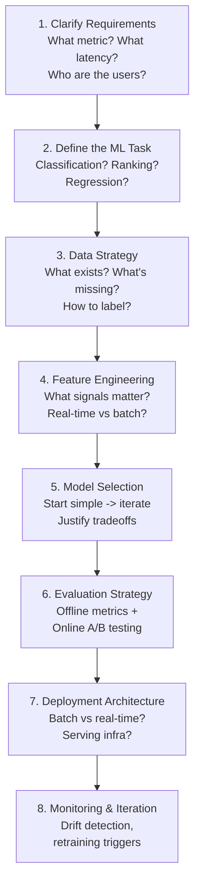

**SWE analogy:** This is the ML equivalent of a system design interview. Instead of "Design Twitter," you get "Design a recommendation feed." Same structure, different building blocks.

#### Worked Example: E-Commerce Recommendation System

| Step                | Question                | Concrete Answer                                                                                                                           |
| ------------------- | ----------------------- | ----------------------------------------------------------------------------------------------------------------------------------------- |
| **1. Requirements** | What are we optimizing? | Increase purchase conversion. Latency < 200ms. Serve 10M daily users.                                                                     |
| **2. ML Task**      | What kind of problem?   | Two-stage ranking: retrieve candidates, then rank them by purchase probability.                                                           |
| **3. Data**         | What do we have?        | Click logs, purchase history, product catalog, user profiles. 6 months of data.                                                           |
| **4. Features**     | What signals matter?    | User: browse history, purchase recency, category affinity. Item: price, rating, popularity. Context: time of day, device.                 |
| **5. Model**        | Start simple            | Baseline: logistic regression on hand-crafted features. Iterate: two-tower neural net (user tower + item tower) with dot-product scoring. |
| **6. Evaluation**   | How to measure?         | Offline: Recall@K, NDCG. Online: A/B test measuring conversion rate and revenue per session.                                              |
| **7. Deployment**   | How to serve?           | Candidate generation via ANN (approximate nearest neighbor) in batch. Ranking model serves real-time via gRPC.                            |
| **8. Monitoring**   | What can go wrong?      | Track prediction distribution shifts, click-through rate drops, feature freshness. Retrain weekly.                                        |

```
+---------------------------------------------------+
|              REQUEST FLOW (< 200ms)               |
|                                                   |
|  User --> Candidate Gen --> Ranking --> Re-rank    |
|           (ANN: ~1000)     (Score top  (Diversity  |
|                             1000)       + rules)   |
|                                     --> Top 20     |
+---------------------------------------------------+
```

#### Mini-Example: Content Moderation System

| Step           | Answer                                                                                                        |
| -------------- | ------------------------------------------------------------------------------------------------------------- |
| **Task**       | Multi-label classification (spam, hate speech, nudity, violence)                                              |
| **Data**       | User-reported content + human-labeled samples. Active learning to prioritize labeling.                        |
| **Model**      | Text: fine-tuned BERT classifier. Images: fine-tuned ResNet. Multi-modal: late fusion.                        |
| **Serving**    | Real-time (block before publishing). Must be < 100ms.                                                         |
| **Monitoring** | Track false positive rate (wrongly blocked content erodes user trust). Escalation queue for borderline cases. |

> **Connect the dots:** The 8-step framework is your checklist. In an interview, spend ~5 minutes per step. If you cover all 8, you demonstrate end-to-end thinking even if any single answer is imperfect. See the [full system design deep-dive](../deep-dive/06-ml-system-design.md) for more worked examples.

---

### 4.2 MLOps -- DevOps for ML (10 min)

**SWE analogy:** MLOps is DevOps, but your source code is also a 2TB dataset that changes daily and your compiler takes 8 hours on a GPU cluster.

#### DevOps vs MLOps

| Aspect                       | DevOps                  | MLOps                                      |
| ---------------------------- | ----------------------- | ------------------------------------------ |
| **Versioning**               | Code                    | Code + Data + Model + Config               |
| **Testing**                  | Unit / Integration      | + Data validation + Model quality checks   |
| **CI/CD**                    | Build -> Test -> Deploy | Train -> Validate -> Deploy -> Monitor     |
| **Rollback**                 | Previous code version   | Previous model + feature store snapshot    |
| **Artifacts**                | Container image         | Container + model weights + feature schema |
| **"It works on my machine"** | Env differences         | Env + data differences + GPU quirks        |

#### Key MLOps Concepts

**Feature Store** = Shared library registry for ML features.
One place to define, compute, and serve features. Training and serving read from the same store, eliminating train-serve skew.

**Model Registry** = Container registry but for trained models.
Stores model artifacts, metadata, metrics, and lineage. Think Docker Hub for `.pkl` files.

**Experiment Tracking** = `git log` for model experiments.
Every training run logs hyperparameters, metrics, and artifacts. Tools: MLflow, Weights & Biases.

**Data Versioning** = `git` for datasets.
DVC (Data Version Control) tracks dataset versions alongside code commits. You can `dvc checkout` to reproduce any past experiment.

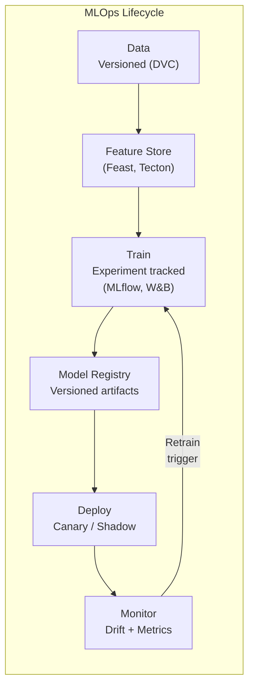

> **Connect the dots:** If you only remember one thing -- the feature store prevents train-serve skew by sharing feature logic between training and serving. This is the single most impactful MLOps investment a team can make. See [Section 4.3](#43-common-production-gotchas-15-min) for why train-serve skew is so dangerous.

---

### 4.3 Common Production Gotchas (15 min)

Five failure modes that catch even experienced teams. Each one maps to a concept software engineers already understand.

#### 1. Data Leakage

|                 |                                                                                         |
| --------------- | --------------------------------------------------------------------------------------- |
| **What**        | Future or target-correlated information leaks into training features                    |
| **SWE Analogy** | Using prod data in test fixtures -- your tests pass but mean nothing                    |
| **Example**     | Using `time_since_purchase` to predict `will_purchase`. The feature encodes the answer. |
| **Detection**   | Suspiciously high offline metrics. Feature importance shows "too good" features.        |
| **Fix**         | Strict temporal train/test splits. Feature auditing. Point-in-time feature stores.      |

#### 2. Train-Serve Skew

|                 |                                                                                                          |
| --------------- | -------------------------------------------------------------------------------------------------------- |
| **What**        | Model behaves differently in prod because features are computed differently                              |
| **SWE Analogy** | Different build configs for dev vs prod -- it works locally, breaks in prod                              |
| **Example**     | Training computes `avg_session_length` with pandas. Serving computes it with SQL. Rounding differs.      |
| **Detection**   | Large gap between offline metrics and online performance.                                                |
| **Fix**         | Shared feature computation code. Feature store. Integration tests comparing training vs serving outputs. |

#### 3. Class Imbalance

|                      |                                                                                  |
| -------------------- | -------------------------------------------------------------------------------- |
| **What**             | 99% negative, 1% positive. Model just predicts "negative" and gets 99% accuracy. |
| **SWE Analogy**      | A test suite where 99% of tests are trivial -- high pass rate, no real coverage  |
| **Techniques**       | Oversampling (SMOTE), undersampling, class weights, focal loss, threshold tuning |
| **Key Metric Shift** | Stop using accuracy. Use Precision-Recall AUC, F1, or Recall@Precision.          |

#### 4. Model Drift

|                 |                                                                                                       |
| --------------- | ----------------------------------------------------------------------------------------------------- |
| **What**        | Data distribution changes over time, model performance degrades silently                              |
| **SWE Analogy** | API contract changing without versioning -- downstream breaks with no warning                         |
| **Types**       | **Data drift** (inputs change) vs **Concept drift** (relationship between inputs and outputs changes) |
| **Example**     | COVID-19 changed all consumer behavior. Every e-commerce model trained on 2019 data broke.            |
| **Fix**         | Statistical monitoring (KS test, PSI), automated retraining triggers, scheduled retraining windows.   |

#### 5. Feedback Loops

|                 |                                                                                                                     |
| --------------- | ------------------------------------------------------------------------------------------------------------------- |
| **What**        | Model predictions influence the data it will be retrained on                                                        |
| **SWE Analogy** | Circular dependency -- module A depends on B, B depends on A                                                        |
| **Example**     | Recommendation system only shows popular items -> only collects data on popular items -> reinforces popularity bias |
| **Fix**         | Exploration/exploitation strategies. Inject controlled randomness. Hold-out groups that see unbiased results.       |

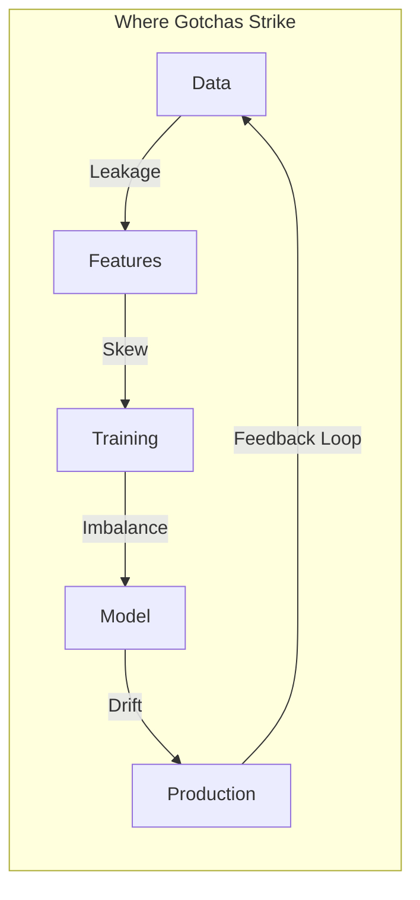

> **Connect the dots:** These five gotchas form a cycle. Leakage corrupts training. Skew corrupts serving. Imbalance corrupts evaluation. Drift corrupts predictions over time. Feedback loops corrupt future data. A mature ML system has defenses at every stage.

---

## Hour 5: Interview Mastery (35 min)

### 5.1 Master Concept Map

Everything from Hours 1-4 connects. This is the same landscape from the beginning, but now you understand every node.

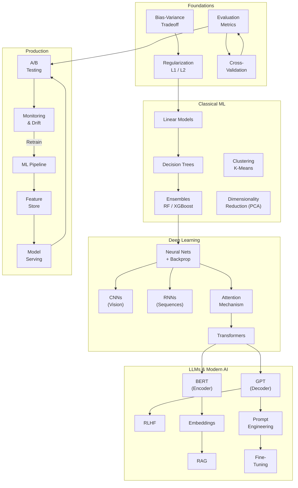

You started at the top-left. Now you can trace a path from bias-variance all the way to production monitoring. That path is the story of building an ML system.

---

### 5.2 The Answer Framework

Use **RDET** for every technical question. It keeps your answers structured and complete.

| Letter | Step      | What to say                                     |
| ------ | --------- | ----------------------------------------------- |
| **R**  | Restate   | Repeat the question to confirm understanding    |
| **D**  | Define    | Technical definition in 1-2 sentences           |
| **E**  | Example   | Concrete example or SWE analogy                 |
| **T**  | Tradeoffs | Alternatives, when you would choose differently |

#### Worked Example

**Q:** "What is overfitting?"

> **R:** "So you're asking about when a model performs well on training data but poorly on unseen data."
>
> **D:** "Overfitting occurs when a model memorizes noise in the training data instead of learning the underlying pattern. It has low bias but high variance -- it fits the training set tightly but generalizes poorly."
>
> **E:** "It's like writing tests that are tightly coupled to the current implementation. They pass on the existing code but break on any refactor because they're testing artifacts, not behavior."
>
> **T:** "We can address it with regularization (L1/L2), dropout, early stopping, more data, or simpler model architectures. The tradeoff is that too much regularization leads to underfitting -- the model becomes too simple to capture real patterns. The goal is the sweet spot on the bias-variance curve."

This framework keeps you from rambling. Restate, define, exemplify, discuss tradeoffs. Done.

---

### 5.3 Top 25 Questions with Model Answers

Each answer follows the RDET framework. Cross-references point to where you can review the full concept.

#### Foundations (Questions 1-5)

**Q1: What is the bias-variance tradeoff?**

Bias is error from oversimplifying (underfitting). Variance is error from over-sensitivity to training data (overfitting). You cannot minimize both -- reducing one increases the other. A linear model on complex data has high bias; a deep decision tree has high variance. The goal is the sweet spot: enough complexity to capture real patterns, not so much that it memorizes noise. Regularization, cross-validation, and ensembles help navigate this.

**Q2: Explain the difference between L1 and L2 regularization.**

Both penalize large weights. L1 (Lasso) adds the sum of absolute weights -- drives some to exactly zero, performing feature selection. L2 (Ridge) adds the sum of squared weights -- shrinks toward zero but rarely reaches it. Use L1 when many features are irrelevant. Use L2 when all features may contribute. Elastic Net combines both.

**Q3: When would you use precision vs recall as your metric?**

Precision: "of everything flagged positive, how many actually were?" Recall: "of all actual positives, how many did we catch?" Use precision when false positives are costly (spam filter). Use recall when false negatives are costly (cancer screening). Tune the decision threshold based on business costs. F1 is the harmonic mean when you need one number, but the full PR curve is more informative.

**Q4: What is cross-validation and why is it important?**

Split data into K folds, train on K-1, evaluate on the held-out fold, rotate. Every point gets used for both training and evaluation, giving a more reliable performance estimate than a single split. 5-fold or 10-fold is standard. For time-series, use temporal splits to avoid leakage.

**Q5: Explain the ML pipeline end to end.**

Data collection, cleaning, feature engineering, training, evaluation, deployment, monitoring. Data flows from raw sources through a feature store into training. The model is evaluated offline, deployed via canary/shadow, then monitored for drift. When metrics degrade, retraining kicks in. Key insight: training is ~10% of the work. Data pipelines, serving, and monitoring are the other 90%.

#### Algorithms (Questions 6-10)

**Q6: How does a random forest work?**

Train many decision trees on random bootstrap samples with random feature subsets. Each tree votes; majority (classification) or average (regression) wins. Randomness decorrelates trees so errors cancel out. Like code review by committee -- each reviewer sees a different angle, and the group verdict beats any individual. Hard to overfit, handles mixed types, and gives feature importance for free.

**Q7: What's the difference between bagging and boosting?**

Bagging trains models independently in parallel on random subsets, then averages. Reduces variance (Random Forest). Boosting trains sequentially, each model focusing on previous mistakes. Reduces bias (XGBoost). Bagging = asking 10 consultants and averaging. Boosting = iterative debugging where each round fixes the last round's bugs. Boosting achieves higher accuracy but is more prone to overfitting.

**Q8: When would you choose XGBoost over a neural network?**

XGBoost wins on structured/tabular data: trains faster, less tuning, handles missing values, interpretable. Neural networks win on unstructured data (images, text, audio) with massive datasets where representation learning matters. CSV with 50 features and 100K rows? XGBoost. 10M images? Neural network. XGBoost is also simpler to deploy and faster at inference.

**Q9: How does K-means clustering work?**

(1) Initialize K centroids randomly. (2) Assign each point to nearest centroid. (3) Recompute centroids as mean of assigned points. (4) Repeat until convergence. Choose K via elbow method or silhouette score. Limitations: assumes spherical clusters, sensitive to initialization (use K-means++), requires K upfront. For non-spherical clusters, use DBSCAN or GMMs.

**Q10: What is the kernel trick in SVMs?**

SVMs find the maximum-margin hyperplane separating classes. When data is not linearly separable, the kernel trick implicitly maps it to higher dimensions where a linear separator exists -- without computing the actual coordinates. RBF kernel is most common. You only need dot products in the high-dimensional space, which the kernel computes directly. Elegant but scales poorly past ~100K samples, largely replaced by gradient boosting and neural nets.

#### Deep Learning & Transformers (Questions 11-17)

**Q11: Explain the attention mechanism.**

Attention lets a model dynamically focus on the most relevant parts of its input when producing each output. Instead of compressing an entire sequence into a fixed-size vector (the bottleneck in older RNNs), attention computes a weighted sum over all input positions, where the weights reflect relevance. Think of it as a fuzzy hashmap lookup -- the query is what you are looking for, the keys are what is available, and the values are what you retrieve. The weights are `softmax(QK^T / sqrt(d_k))`, applied to V. This is the core building block of transformers.

**Q12: What are the Q, K, V matrices in transformers?**

Q (Query) = "what am I looking for." K (Key) = "what do I contain." V (Value) = "what information do I provide." Dot product of Q and K gives attention weights; those weights produce a weighted sum of V. Multi-head attention runs this multiple times with different projections, letting the model attend to different relationship types simultaneously (syntax in one head, semantics in another).

**Q13: How does BERT differ from GPT?**

BERT is an encoder model trained with masked language modeling -- it sees the full context (left and right) and learns bidirectional representations. It excels at understanding tasks: classification, NER, question answering. GPT is a decoder model trained with next-token prediction -- it only sees left context (autoregressive) and excels at generation tasks. BERT is like a reader who sees the whole page. GPT is like a writer who can only see what has been written so far. BERT is "read-only," GPT is "append-only." In practice, GPT-style models (scaled up as LLMs) have become dominant because generation subsumes understanding at sufficient scale.

**Q14: What is transfer learning and why does it matter?**

Transfer learning means taking a model pretrained on a large general dataset and adapting it to a specific downstream task. Instead of training from scratch (which requires massive data and compute), you fine-tune the pretrained model on your smaller dataset. It is like using a well-tested open-source library instead of writing everything from scratch. This is why BERT, GPT, and ResNet changed ML -- they provide pretrained "knowledge" that transfers to new domains. Fine-tuning the last few layers on 1,000 labeled examples often outperforms training a custom model on 100,000 examples from scratch.

**Q15: Explain backpropagation in simple terms.**

Compute the loss, then propagate gradients backward through the network using the chain rule. Each weight gets a gradient: "if you increase by a tiny amount, here is how much the loss changes." Gradient descent updates weights to reduce the loss. It is like debugging by tracing an error backward through the call stack to find the root cause.

**Q16: What is the vanishing gradient problem?**

Gradients are multiplied through each layer during backprop. Sigmoid/tanh squash into small ranges, so repeated multiplication makes gradients exponentially small in early layers -- they stop learning. Like a game of telephone where the signal degrades each relay. Solutions: ReLU (gradient = 1 for positive), residual connections, batch normalization, careful initialization (He/Xavier).

**Q17: Why do we use ReLU over sigmoid?**

Three reasons. (1) No vanishing gradient -- gradient is 1 for positive inputs. (2) Cheaper to compute (threshold vs exponentiation). (3) Sparse activations act as regularization. Sigmoid squashes to (0, 1), causing vanishing gradients for extreme inputs. Tradeoff: ReLU can "die" (neurons stuck at zero). Leaky ReLU and GELU fix this.

#### LLMs & Modern AI (Questions 18-21)

**Q18: What is RAG and when would you use it?**

Retrieval-Augmented Generation (RAG) gives an LLM access to external knowledge by retrieving relevant documents and including them in the prompt context. Instead of relying solely on what the model memorized during training, RAG searches a knowledge base at inference time. It is like giving the LLM a search engine. Use RAG when: the knowledge changes frequently (company docs), domain-specific accuracy matters (medical, legal), or you need citations. RAG avoids the cost and data requirements of fine-tuning and reduces hallucinations because the model can ground its answers in retrieved text.

**Q19: How does RLHF work?**

Three steps to align LLMs with human preferences. (1) Supervised fine-tuning on demonstrations. (2) Train a reward model from human rankings of outputs. (3) Use PPO to fine-tune the LLM to maximize the reward model's score, with a KL penalty to prevent catastrophic drift. RLHF is why ChatGPT feels helpful compared to raw GPT -- it learned preferences beyond next-token prediction.

**Q20: What are embeddings and why are they useful?**

Embeddings are dense, low-dimensional vector representations of discrete objects (words, sentences, users, products). They capture semantic similarity -- items that are similar in meaning are close in vector space. They function like a semantic hash function: similar inputs produce similar outputs, but unlike hashing, the distance between outputs is meaningful. Embeddings power search (find similar documents), recommendations (find similar users/items), clustering, and RAG (retrieve relevant context). They are the bridge between human concepts and mathematical operations.

**Q21: When would you fine-tune vs use prompt engineering?**

Start with prompt engineering (zero-shot, few-shot, chain-of-thought). It requires no training data, no compute, and can be iterated in minutes. Fine-tune when: you need consistent formatting or behavior the base model does not exhibit, you have domain-specific data that significantly differs from the pretraining distribution, or latency/cost matters (a fine-tuned small model can replace a prompted large model). The spectrum is: prompt engineering (cheapest, most flexible) -> few-shot examples -> RAG (adds knowledge) -> fine-tuning (most expensive, highest control). Each step adds cost and complexity but also capability.

#### Production (Questions 22-25)

**Q22: What is data leakage and how do you prevent it?**

Information from outside the training set contaminates the model -- features that encode the target or use future data. Like using prod data in test fixtures: metrics look amazing but mean nothing. Common causes: features derived from the label, wrong temporal splits, fitting preprocessors on full data before splitting. Prevention: strict temporal splits, point-in-time feature stores, and always asking "would this feature be available at prediction time?"

**Q23: How do you handle class imbalance?**

First, change your metric -- accuracy is meaningless. Use PR-AUC, F1, or recall@precision. Then attack at three levels. Data: oversample (SMOTE) or undersample. Algorithm: `class_weight='balanced'` or focal loss. Decision: tune threshold using PR curve and business cost of FP vs FN. For extreme imbalance (0.01%), consider anomaly detection (Isolation Forest).

**Q24: What is model drift and how do you detect it?**

Performance degrades because real-world distributions changed. Data drift: inputs shift (P(X)). Concept drift: input-output relationship shifts (P(Y|X)). Detect with KS test, PSI on feature distributions, and prediction distribution monitoring. When drift is detected, trigger retraining. Schedule regular retraining as a safety net. COVID-19 was the ultimate concept drift -- every pre-2020 model broke simultaneously.

**Q25: Walk me through designing an ML system for X.**

Use the 8-step framework. (1) Clarify requirements: metric, latency, scale. (2) Define ML task: classification, ranking, regression, generation. (3) Data strategy: what exists, labeling, privacy. (4) Features: user, item, context; real-time vs batch. (5) Model: simple baseline first, iterate with justification. (6) Evaluation: offline metrics + online A/B test. (7) Deploy: batch vs real-time, canary rollout. (8) Monitor: drift detection, retraining triggers. Always start simple.

---

### 5.4 Quick-Reference Cheat Sheet

#### Vocabulary

| Term                    | One-Line Definition                                    |
| ----------------------- | ------------------------------------------------------ |
| **Epoch**               | One full pass through the training dataset             |
| **Batch Size**          | Number of samples processed before a weight update     |
| **Learning Rate**       | Step size for gradient descent updates                 |
| **Overfitting**         | Model memorizes training data, fails on new data       |
| **Underfitting**        | Model too simple to capture underlying patterns        |
| **Regularization**      | Penalizing model complexity to reduce overfitting      |
| **Gradient Descent**    | Iteratively adjusting weights to minimize loss         |
| **Feature Engineering** | Creating input signals that help the model learn       |
| **Hyperparameter**      | Setting chosen before training (not learned from data) |
| **Inference**           | Using a trained model to make predictions              |
| **Embedding**           | Dense vector representing a discrete object            |
| **Fine-tuning**         | Adapting a pretrained model to a new task              |
| **Latent Space**        | Learned internal representation space                  |
| **Attention**           | Mechanism to focus on relevant parts of input          |
| **Token**               | Smallest unit of text a language model processes       |
| **Hallucination**       | LLM generating confident but factually wrong output    |
| **Epoch vs Iteration**  | Epoch = full dataset; Iteration = one batch update     |

#### Key Formulas

| Formula            | Expression                       |
| ------------------ | -------------------------------- |
| Precision          | TP / (TP + FP)                   |
| Recall             | TP / (TP + FN)                   |
| F1 Score           | 2 _ (P _ R) / (P + R)            |
| Accuracy           | (TP + TN) / Total                |
| Bayes' Theorem     | P(A\|B) = P(B\|A) \* P(A) / P(B) |
| Cross-Entropy Loss | -Sum( y \* log(y_hat) )          |
| Softmax            | e^zi / Sum(e^zj)                 |
| Attention          | softmax(QK^T / sqrt(d_k)) \* V   |
| Gradient Update    | theta = theta - alpha \* grad(L) |
| L2 Regularization  | Loss + lambda \* Sum(w^2)        |

#### Key Comparisons

| X                 | Y                  | Choose X When                                | Choose Y When                                    |
| ----------------- | ------------------ | -------------------------------------------- | ------------------------------------------------ |
| Random Forest     | XGBoost            | You want less tuning, more robust to noise   | You want max accuracy on tabular data            |
| XGBoost           | Neural Network     | Structured/tabular data, moderate size       | Unstructured data (images, text), massive scale  |
| Precision         | Recall             | False positives are expensive (spam filter)  | False negatives are expensive (cancer screening) |
| Batch Serving     | Real-Time Serving  | Freshness not critical, simpler infra        | Low-latency required, user-facing                |
| L1 Regularization | L2 Regularization  | Feature selection needed, sparse models      | All features may contribute, smooth solution     |
| Fine-tuning       | Prompt Engineering | Need consistent behavior, have training data | Want fast iteration, no training data            |
| BERT (Encoder)    | GPT (Decoder)      | Understanding tasks (NER, classification)    | Generation tasks (text completion, chat)         |
| RAG               | Fine-tuning        | Knowledge changes frequently, need citations | Need behavioral change, fixed knowledge          |

#### The SWE-to-ML Translation Table

Every analogy from this guide in one place.

| ML Concept             | SWE Analogy                                            |
| ---------------------- | ------------------------------------------------------ |
| Training data -> Model | Source code -> Compiled binary                         |
| Overfitting            | Tests coupled to implementation                        |
| Regularization         | YAGNI principle -- don't add complexity you don't need |
| Cross-validation       | Running tests on multiple environments                 |
| Random Forest          | Code review by committee                               |
| Gradient Boosting      | Iterative debugging -- each round fixes previous bugs  |
| Transfer learning      | Using a library vs writing from scratch                |
| Embeddings             | Semantic hash function                                 |
| Attention mechanism    | Fuzzy hashmap lookup                                   |
| BERT vs GPT            | Read-only mode vs append-only mode                     |
| RAG                    | Giving an LLM a search engine                          |
| Data leakage           | Using prod data in test fixtures                       |
| Train-serve skew       | Different build configs for dev vs prod                |
| MLOps                  | DevOps but source code is also a 2TB dataset           |
| Model drift            | API contract changing without versioning               |
| Feature store          | Shared library registry                                |
| Feedback loops         | Circular dependency between modules                    |
| Hyperparameter tuning  | Config file optimization                               |
| Model registry         | Container registry for trained models                  |
| Experiment tracking    | git log for model training runs                        |

---

> _You've completed the crash course. Go ace that interview._

[Back to Crash Course](./00-README.md) | [Deep Dive Guides](../deep-dive/00-README.md)
