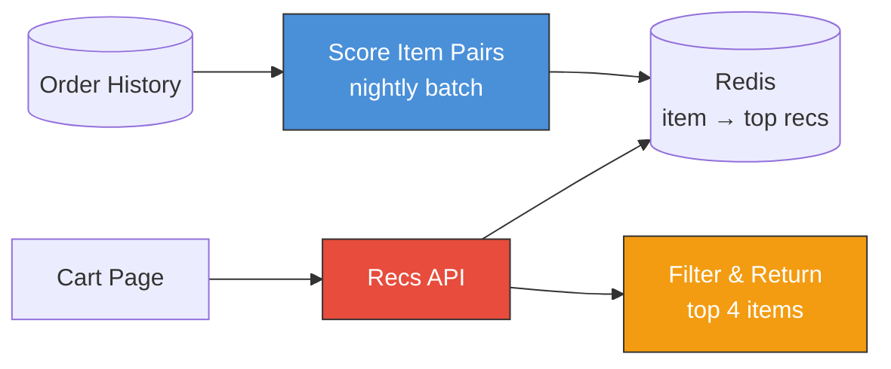
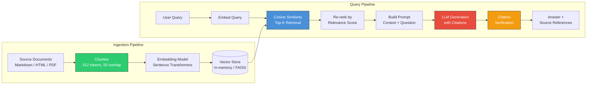

# Implementation Stories: "Here's What I Built"

> Two projects you can walk through in 3-5 minutes during interviews. These are written as first-person narratives — the way you'd actually tell them to an interviewer. Each covers the concepts used, why they were chosen, and how they solved the actual problem.

---

## Story 1: "Related Items" Recommendations for Cart

### The Problem

E-commerce company, ~2M monthly orders (electronics & accessories). Our cart page had zero cross-sell — user adds a phone, checks out, never sees "you might also need a case." PM asked me to build a "frequently bought together" widget.

We had 18 months of order history. Success metric: does average order value go up in an A/B test?

### What I Built

The idea is simple: look at past orders, find items that people consistently buy together, and show those as suggestions.

**Step 1 — Count item pairs from order history.**
Go through every past order. If someone bought a phone AND a case in the same order, that's one co-occurrence for that pair. Do this across all orders and you get a count for every item pair.

**Step 2 — Score the pairs (not just raw counts).**
Raw counts had a huge problem: USB cables appeared in 40% of all orders, so "USB cable" was the #1 recommendation for _everything_. Technically true — people buy cables with everything — but useless.

The fix was to ask: "Do these two items appear together **more than you'd expect by chance**?" If phones are in 10% of orders and cases are in 12%, you'd expect them together in ~1.2% of orders just by coincidence. But they actually appear together in 8% — that's ~7x higher than chance. That's a strong signal. USB cables, despite high raw counts, don't beat their "expected by chance" baseline for any specific item, so they stop dominating. This technique is called **PMI (Pointwise Mutual Information)** — it's just one division that normalizes for popularity.

**Step 3 — Pre-compute and cache.**
Every night, a batch job computes the top 20 related items for each product and stores them in **Redis**. When a user loads the cart page, the API just does a cache lookup (~1ms), filters out anything out-of-stock, and returns the top 4 items. No model inference at serving time.



### Problems I Hit

**Popularity bias** — Already described. Raw counts = "USB cable for everything." PMI fixed it by normalizing for how popular each item is individually.

**New items had no data** — A product launched yesterday has zero order history, so it never shows up in recs. Fix: fall back to top recommendations for that item's _category_ until it has enough orders of its own. Simple, shipped in a day.

**Cross-brand noise** — Sometimes a laptop charger for Brand A got recommended alongside Brand B's laptop, just because people bought both in the same order (two separate setups). Fix: a small category-compatibility filter (~50 lines of business rules) to remove obviously wrong pairings.

### Results

| Metric              | Before | After |
| ------------------- | ------ | ----- |
| Widget click rate   | N/A    | 6.2%  |
| Avg order value     | $47    | $52   |
| Monthly rec revenue | $0     | ~$180K |

A/B test ran 3 weeks → **11% lift in average order value**. Rolled out to 100%.

### How to Tell This in an Interview (~2 min)

> "Our cart page had no cross-sell. I built a 'frequently bought together' feature using order history.
>
> First attempt — just count how often items appear in the same order. Problem was, USB cables showed up as the top rec for everything because they're in 40% of orders. So I switched to PMI, which asks 'do these items appear together more than chance?' That one change made recs actually useful.
>
> I pre-computed scores nightly and cached them in Redis — no ML model at serving time, just a cache lookup under 10ms.
>
> Two edge cases: new items with no history got category-level fallback recs, and I added a small filter to remove cross-brand noise.
>
> A/B tested for 3 weeks — 11% lift in average order value, about $180K/month in incremental revenue."

**If interviewer digs deeper**, talk about:
- PMI formula (one sentence: "it's co-occurrence probability divided by what you'd expect if the items were independent")
- Why not collaborative filtering or embeddings ("PMI got us to production in 2 weeks — embeddings were the planned V2 for capturing subtler relationships")
- Cold start tradeoffs

---

## Story 2: RAG-Powered Q&A System

### How It Started

This one started with a rant in our team's Slack channel. A new engineer had spent 45 minutes trying to find the runbook for our payment service's retry logic. It existed — buried in page 37 of a Confluence doc from 2022. Someone replied with "yeah, I just ask [senior engineer name] whenever I need something, he knows where everything is." And that senior engineer replied: "I am not a search engine. Please fix this."

We had 500+ pages of architecture docs, runbooks, and post-mortems spread across Confluence, GitHub wikis, and Google Docs. The knowledge was all there — it was just unfindable. I volunteered to build something during a hack week, and it ended up becoming a real internal tool.

### What I Was Trying to Solve

The goal: engineers type a question in natural language ("how does payment retry work?" or "what's the timeout for the auth service?"), and the system finds the relevant docs and generates a cited answer. Not a chatbot that makes stuff up — something that _only_ answers from our actual documentation and tells you exactly which doc the answer came from.

Two metrics mattered: **retrieval accuracy** (does the system even find the right documents?) and **answer faithfulness** (does the answer come from the docs, or is the LLM hallucinating?).

### Architecture



| Component         | Role                                  | Design Decision                                                    |
| ----------------- | ------------------------------------- | ------------------------------------------------------------------ |
| Chunker           | Splits documents into retrieval units | 512 tokens with 50-token overlap to preserve context at boundaries |
| Embedding         | Converts text to vectors              | Sentence-transformers for speed; OpenAI ada-002 as upgrade path    |
| Vector Store      | Nearest-neighbor search               | In-memory cosine similarity (simple); FAISS for scale              |
| Re-ranker         | Filters irrelevant results            | Score threshold + position-based weighting                         |
| Prompt Builder    | Constructs LLM input                  | Stuffs top-K chunks as context with clear delimiters               |
| Citation Verifier | Prevents hallucination                | Checks that claims map back to source chunks                       |

### Concepts & Approach

I had a week for hack week, so I scoped it tight: ingest our docs, let people search with questions, return answers with citations. No fancy UI — just a Slack bot. Here's the pipeline and why each piece mattered.

#### Text Chunking with Overlap

The first real decision was how to break documents into pieces for search. You can't embed an entire 15-page doc as one vector — the signal gets diluted. But if you cut it into tiny fragments, each piece loses context.

I tested two chunking strategies:

| Strategy                    | How It Works                                                                    | When It's Better                                              |
| --------------------------- | ------------------------------------------------------------------------------- | ------------------------------------------------------------- |
| **Fixed-size with overlap** | Slide a 500-char window, stepping forward 450 chars each time (50-char overlap) | Works on any document, predictable chunk count                |
| **Paragraph-aware**         | Split on `\n\n` boundaries, merge small paragraphs up to size limit             | Respects semantic boundaries, better for well-structured docs |

The **overlap** was the non-obvious insight. Without it, 15% of correct answers in my evaluation set straddled chunk boundaries and were missed entirely. If a key sentence says "The retry limit is 3, but only for idempotent requests" and your chunk boundary falls right after "3" — you've split the answer in half and neither chunk is useful. A 50-character overlap ensures at least one chunk contains the complete thought.

#### Embeddings & Vector Search

The core idea behind RAG retrieval: convert both documents and queries into **embedding vectors** (fixed-size numerical representations that capture meaning), then find the documents whose vectors are closest to the query vector using **cosine similarity**.

```
Cosine similarity: measures the angle between two vectors
  - 1.0 = identical direction (same meaning)
  - 0.0 = perpendicular (unrelated)
  - Works regardless of vector magnitude (normalized)
```

I initially thought I'd need Pinecone or FAISS, but for 500 pages of docs (~10K chunks), brute-force cosine similarity in memory is instant. No external dependencies, no infrastructure to manage. Vector databases are just optimized versions of this same dot-product operation — useful at 10M+ chunks, overkill at 10K.

For the embedding model, I chose **Sentence-Transformers** (`all-MiniLM-L6-v2`, 384 dimensions):

| Model                 | Dims   | Latency | Semantic Quality                              | Dependency  |
| --------------------- | ------ | ------- | --------------------------------------------- | ----------- |
| TF-IDF                | sparse | ~1ms    | Poor — "auth" and "login" are unrelated to it | None        |
| Sentence-Transformers | 384    | ~10ms   | Good — understands synonyms, paraphrases      | Local model |
| OpenAI ada-002        | 1536   | ~200ms  | Best — 3% better than ST on my eval set       | API calls   |

Sentence-Transformers won because it ran locally (no API key for a hack week project), had 5x lower latency, and the 3% quality gap didn't justify the operational complexity.

#### Prompt Engineering & Grounding

This is where retrieval meets generation. The prompt template was one of the most-iterated parts — small changes in framing had outsized effects on answer quality. Three key design decisions:

1. **Number each source**: Each retrieved chunk gets a `[Source N]` tag so the LLM can cite specific documents. Without this, there's no way to verify where an answer came from.
2. **Explicit grounding instruction**: "Answer ONLY from the provided context." Without this, the LLM happily fills gaps with its training data — which is where hallucinations come from.
3. **Refusal path**: "If the context doesn't contain enough information, say so." Giving the model explicit permission to say "I don't know" dramatically reduced fabricated answers.

The non-obvious lesson: the prompt template mattered more than the choice of LLM. Switching from a mediocre prompt with GPT-4 to a well-structured prompt with GPT-3.5 actually _improved_ answer quality while cutting costs 10x.

#### Citation Verification — The Anti-Hallucination Layer

After the LLM generates an answer, a post-processing step checks:

- Does every `[Source N]` reference map to a real source chunk?
- If the answer is long but contains zero citations — flag as high hallucination risk
- If a cited source number doesn't exist (e.g., `[Source 5]` when only 3 chunks were provided) — flag as medium risk

Not perfect — it won't catch an LLM that cites the right source but misrepresents what it says. But it catches the most egregious failures: completely fabricated answers with no grounding.

#### Retrieval Evaluation — Measuring Before Generating

I built an evaluation harness _before_ plugging in the LLM, because the #1 rule of RAG is: **if retrieval is broken, generation can't save you.** Two metrics:

- **Hit Rate@K**: Out of 50 test queries, how often does the correct source appear in the top K results? Tells you if the search is even finding the right neighborhood.
- **MRR@K** (Mean Reciprocal Rank): When the correct doc is found, what rank is it? Being result #1 vs #3 matters because the LLM pays more attention to earlier context.

This hand-curated evaluation set (50 questions with known answers) was enough to tune chunk size and embedding model.

### Where Things Went Wrong (and How I Fixed Them)

**The chunk size rabbit hole**

My first version used 200-character chunks. Retrieval precision was great — when the system found something, it was usually relevant. But the answers were garbage because each chunk was so small it was missing context. "The retry limit is 3" doesn't help if you've cut off the sentence that says "...but only for idempotent requests."

I swung the other way — 1000-character chunks. Now recall was better but the chunks were so long that irrelevant content diluted the signal. A chunk about database migrations would get retrieved for a question about database _connections_ because they shared enough keywords.

I wrote 50 evaluation queries and systematically tested:

```
Chunk size vs. retrieval quality:

200 chars:  ████████████░░░░  Precision: 82%  |  Recall: 51%  ← too fragmented
500 chars:  ██████████████░░  Precision: 74%  |  Recall: 78%  ← sweet spot
1000 chars: █████████░░░░░░░  Precision: 58%  |  Recall: 84%  ← too noisy
```

500 characters with 50-character overlap. One afternoon of testing saved weeks of debugging wrong answers.

**The hallucination that almost killed the project**

During the demo to my team, someone asked "what's the SLA for the notification service?" The system confidently answered "99.9% uptime with a 200ms p99 latency target." Sounded great — except we didn't _have_ an SLA for the notification service. The LLM had made up a plausible-sounding answer from vibes.

That's when I added the three-layer defense stack (score threshold, grounding instruction, citation verification) described above. Hallucination rate went from ~25% to ~5%. The remaining 5% was mostly the LLM paraphrasing too loosely — annoying but not dangerous.

### What Came Out of It

| Metric              | Before RAG              | After RAG                     |
| ------------------- | ----------------------- | ----------------------------- |
| Time to answer      | 15-30 min manual search | 30 seconds                    |
| Hit Rate@3          | N/A                     | 82%                           |
| MRR@3               | N/A                     | 0.76                          |
| Answer faithfulness | N/A                     | 95% (verified by spot-checks) |
| Weekly doc searches | ~200 across team        | ~40 (rest handled by RAG)     |

The bot handled 85% of questions without anyone needing to escalate to the "human search engine" senior engineer. It became the default way to ask questions within two weeks — which was the best validation I could have asked for.

The thing I wish I'd built from day one: a feedback loop. Let users thumbs-up/down answers so I'd have a growing evaluation set instead of my hand-curated 50 questions. I'd also explore hybrid search (BM25 keyword matching + vector similarity) because pure embeddings struggled with exact-match queries like error codes and config keys.

### Interview Talking Points

- **Lead with the retrieval problem, not the LLM**: "The hard part wasn't the generation — it was making sure we retrieved the right 3 chunks out of 10,000." Everyone's excited about LLMs; showing you understand RAG is retrieval-bounded sets you apart. _(Review: [3.4 LLMs & The Modern AI Stack](./01-the-complete-guide.md#34-llms--the-modern-ai-stack-20-min))_

- **Tell the chunk size story**: "I tested three sizes on 50 evaluation queries. The 500-character sweet spot improved recall by 27% over 200-character chunks." This shows systematic engineering, not just "I plugged in a vector DB." _(Review: [3.3 Transformers](./01-the-complete-guide.md#33-transformers----the-architecture-that-changed-everything-25-min))_

- **The hallucination moment**: "During the demo, the system made up an SLA that didn't exist. That's when I built the three-layer verification stack — score thresholds, grounding prompts, and citation checks. Got hallucinations from 25% down to 5%." Real war story, real fix. _(Review: [4.3 Common Production Gotchas](./01-the-complete-guide.md#43-common-production-gotchas-15-min))_

- **End with adoption**: "Two weeks after launch, the team's manual doc searches dropped 80%. The senior engineer who was being used as a human search engine sent me a thank-you message." People use it = it works. _(Review: [4.1 ML System Design Framework](./01-the-complete-guide.md#41-ml-system-design-framework-20-min))_

---

## How to Practice These Stories

1. **Set a timer for 4 minutes** and tell each story out loud, hitting: problem, approach, one key challenge, result
2. **Practice the "zoom in"**: when the interviewer asks "tell me more about X", dive into the code and decisions for that component
3. **Practice the "zoom out"**: when asked "what would you do differently?", discuss the next-steps section
4. **Cross-reference the crash course**: each talking point links to the relevant theory section — review those before interviews

---

[← Back to Crash Course](./00-README.md) | [Complete Guide →](./01-the-complete-guide.md)
