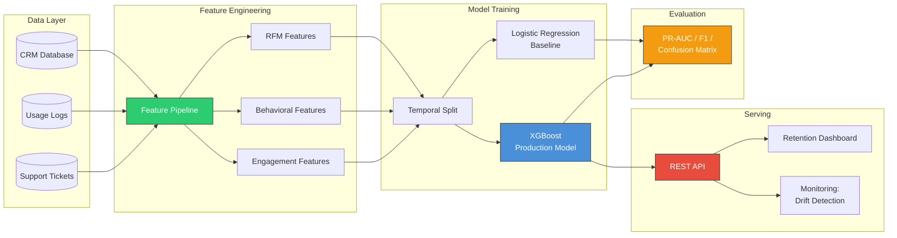
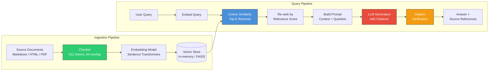

# Implementation Stories: "Here's What I Built"

> Two projects you can walk through in 3-5 minutes during interviews. These are written as first-person narratives — the way you'd actually tell them to an interviewer. Each covers the concepts used, why they were chosen, and how they solved the actual problem.

---

## Story 1: Customer Churn Predictor

### How It Started

I was on the platform team at a B2B SaaS company — about 50K active accounts, mid-market segment. Every quarter, ~5% of accounts would cancel, and the retention team's approach was basically "email everyone." They had a list of 2,000 accounts they'd manually reach out to every month. Most of those accounts were perfectly happy. The ones actually about to leave? Nobody saw them coming.

My manager pulled me into a meeting with the Head of Retention and said: "Can we predict who's going to churn before they actually cancel?" I said probably, if we have the data. We had three years of CRM records, usage logs, and support tickets. So I took it on as a side project — just me, no ML team, no fancy infra.

### What I Was Trying to Solve

The goal was specific: flag at-risk accounts **30 days before cancellation** so the retention team could intervene with targeted outreach — not blanket emails, but actual personalized conversations. The tricky part was that only 5% of accounts churn in any given quarter. That means a model that just predicts "not churning" for everyone is 95% accurate and completely useless. So from day one, I knew accuracy was the wrong metric. I needed to optimize for **PR-AUC** (Precision-Recall AUC) — it tells you how well the model ranks the actual churners above the non-churners, even when the classes are this imbalanced.

### Architecture



| Component           | Role                                         | Tech Choice       |
| ------------------- | -------------------------------------------- | ----------------- |
| Feature Pipeline    | Transforms raw data into ML-ready features   | Python / pandas   |
| Temporal Split      | Prevents data leakage by splitting on time   | Custom logic      |
| Logistic Regression | Interpretable baseline model                 | From scratch      |
| XGBoost             | Production model with higher recall          | sklearn API       |
| Evaluation          | Compares models on business-relevant metrics | sklearn metrics   |
| Serving API         | Scores accounts on a nightly batch           | Flask / FastAPI   |
| Monitoring          | Tracks feature drift and prediction drift    | Statistical tests |

### Concepts & Approach

I started the way most ML projects should start — not with a model, but with the data. I pulled three months of CRM records, usage logs, and support tickets into a single table and started looking for patterns.

#### Feature Engineering — RFM Features

The first thing I did was build **RFM features** (Recency, Frequency, Monetary). This is old-school customer analytics — nothing fancy — but it captures the signals that actually matter:

| Feature       | What It Captures               | Why It Matters for Churn         |
| ------------- | ------------------------------ | -------------------------------- |
| **Recency**   | Days since last activity       | High recency = going cold        |
| **Frequency** | Total interactions in a window | Dropping frequency = disengaging |
| **Monetary**  | Total spend / usage volume     | Low spenders churn easier        |

On top of raw RFM, I derived two additional features: **engagement rate** (frequency relative to account tenure — a 2-year account with 10 logins is different from a 2-month account with 10 logins) and **recency-frequency ratio** (high recency + low frequency = danger signal). These derived features ended up being more predictive than the raw ones because they normalized for account age.

#### Baseline Model — Logistic Regression

My first instinct was to throw XGBoost at it and call it a day. But I forced myself to start with **logistic regression** for two reasons:

1. **Interpretability**: The retention team needed to understand _why_ an account was flagged. Logistic regression gives you a weight per feature — you can literally say "this account is high-risk because their recency score is 3x the average." XGBoost is a black box by comparison.
2. **Baseline discipline**: You need a simple model to benchmark against. If XGBoost only beats logistic regression by 2%, maybe the complexity isn't worth it. If it beats it by 20%, now you know the non-linear interactions matter.

Under the hood, logistic regression is straightforward: apply a **sigmoid function** to a weighted sum of features to get a probability, then use **gradient descent** to learn the weights that minimize the log loss. The key insight is that it draws a linear decision boundary — it can't capture interactions like "low usage AND high tenure = churn" unless you manually engineer that cross-feature. That limitation is exactly what told me I'd eventually need a tree-based model.

#### Production Model — XGBoost

I moved to **XGBoost** (gradient-boosted decision trees) for the production model because it solved the problems logistic regression couldn't:

- **Non-linear interactions**: XGBoost automatically discovers that "low frequency + high tenure" is different from "low frequency + low tenure" without me engineering cross-features
- **Feature importance**: Built-in feature importance ranking — which became critical for the business insight I describe below
- **Robustness**: Less sensitive to feature scaling and outliers than logistic regression

The tradeoff was interpretability. I kept both models: logistic regression for "explain why" conversations with the retention team, XGBoost for the actual prediction scores.

#### Evaluation — Why PR-AUC, Not Accuracy

With only 5% churners, I needed metrics designed for imbalanced classification:

- **Precision**: Of the accounts we flag, how many actually churn? (False alarms waste the retention team's time)
- **Recall**: Of the accounts that actually churn, how many did we catch? (Missed churners = lost revenue)
- **F1**: Harmonic mean of precision and recall — a single number that balances both
- **PR-AUC**: Area under the precision-recall curve — measures ranking quality across all thresholds, not just one

I also used the **confusion matrix** religiously. Not just the numbers, but sitting with the retention team and asking: "Would you rather we flag 50 extra happy accounts (more false positives) or miss 10 churners (more false negatives)?" That conversation is what led us to set the classification threshold at 0.3 instead of the default 0.5 — we accepted more false alarms to catch more churners.

#### Temporal Split — Preventing Data Leakage

Instead of random 80/20 train/test split, I split strictly by time: train on months 1-9, test on months 10-12. The model only ever trains on past data and gets tested on future data — exactly how it would work in production. This is the fix for the data leakage bug I describe below.

```
Random split (WRONG):
  Train: [Jan, Mar, May, Jul, Sep, Nov]  ← future data leaks in
  Test:  [Feb, Apr, Jun, Aug, Oct, Dec]

Temporal split (CORRECT):
  Train: [Jan → Sep]   ← only past data
  Test:  [Oct → Dec]   ← only future data
```

### Where Things Went Wrong (and How I Fixed Them)

**The "95% accurate" model that was completely useless**

My first iteration, I trained logistic regression with default settings, ran it on a random 80/20 split, and got 95% accuracy. I was thrilled for about five minutes — then I looked at the confusion matrix. The model was predicting "not churning" for every single account. 95% accuracy because 95% of accounts don't churn. Classic rookie mistake.

That's when I threw out accuracy entirely and switched to PR-AUC and F1 as the metrics that actually mattered. I also added class weights (`{0: 1.0, 1: 19.0}`) to the logistic regression — basically telling the model "missing a churner costs you 19x more than a false alarm." It's simpler than SMOTE (which generates synthetic samples that can introduce noise), and it worked better in practice.

**The suspiciously good model**

After adding XGBoost and tuning hyperparameters, I was getting a 0.92 PR-AUC on the test set. That felt _too_ good. I've seen enough Kaggle disaster stories to know that when a model looks too good, something is leaking.

I dug in and found the problem: my random train/test split was allowing future behavioral signals to bleed into the training set. A customer's March usage patterns were in the training set while the model was being asked to predict their January churn label. That's not how the model would work in production — it would never have future data.

I replaced the random split with a temporal split (train on months 1-9, test on months 10-12). PR-AUC dropped to 0.74. That hurt to see, but it was the _real_ number — and it held up when we deployed.

**The feature that changed the whole project**

After deploying XGBoost, I looked at feature importance — partly out of curiosity, partly because the retention team kept asking "but _why_ is this account flagged?" The top feature wasn't usage decline or billing issues. It was "days since last support ticket."

That made no sense to me at first. Then the Head of Retention said something that stuck: "Customers who stop complaining aren't happy — they've given up." People who are engaged with your product file bugs and ask questions. When they go silent, they've already mentally moved on. That insight led us to build an "engagement silence" alert that flagged accounts that had gone quiet, even if their usage metrics looked fine.

### What Came Out of It

| Metric                 | Logistic Regression | XGBoost |
| ---------------------- | ------------------- | ------- |
| PR-AUC                 | 0.61                | 0.74    |
| F1 (threshold=0.3)     | 0.52                | 0.67    |
| Precision @ 50% Recall | 0.58                | 0.71    |

The retention team went from emailing 2,000 accounts a month to focusing on the top 200 flagged by the model. Quarterly churn dropped from 5.0% to 3.8% in the first quarter — roughly $240K/quarter in retained revenue.

If I did it again, I'd add a calibration step (Platt scaling) to convert XGBoost's raw scores into actual probabilities. The retention team wanted to say "this account has a 73% chance of churning" rather than just "this account is #47 on the risk list." That's a better conversation to have with a customer success manager.

### Interview Talking Points

- **Lead with the metric mismatch**: "My first model was 95% accurate and completely useless — switching to PR-AUC was the real unlock." This shows you think about evaluation critically, not just chase numbers. _(Review: [1.3 Evaluation Metrics](./01-the-complete-guide.md#13-evaluation-metrics-that-actually-matter))_

- **Tell the data leakage story**: "Temporal split dropped our PR-AUC from 0.92 to 0.74, but that 0.74 was real." Every interviewer has seen data leakage burn a project. Catching it yourself shows maturity. _(Review: [1.2 The ML Pipeline](./01-the-complete-guide.md#12-the-ml-pipeline))_

- **Explain why two models**: "Logistic regression was interpretable and helped the retention team trust the system. XGBoost captured non-linear interactions I couldn't engineer by hand. We ran both." _(Review: [2.1 Classical ML Greatest Hits](./01-the-complete-guide.md#21-the-classical-ml-greatest-hits))_

- **End with the business number**: "$240K/quarter saved by narrowing outreach from 2,000 to 200 accounts." Technical work only matters if it moves a real metric. _(Review: [4.1 ML System Design Framework](./01-the-complete-guide.md#41-ml-system-design-framework-20-min))_

---

## Story 2: RAG-Powered Q&A System

### How It Started

This one started with a rant in our team's Slack channel. A new engineer had spent 45 minutes trying to find the runbook for our payment service's retry logic. It existed — buried in page 37 of a Confluence doc from 2022. Someone replied with "yeah, I just ask [senior engineer name] whenever I need something, he knows where everything is." And that senior engineer replied: "I am not a search engine. Please fix this."

We had 500+ pages of architecture docs, runbooks, and post-mortems spread across Confluence, GitHub wikis, and Google Docs. The knowledge was all there — it was just unfindable. I volunteered to build something during a hack week, and it ended up becoming a real internal tool.

### What I Was Trying to Solve

The goal: engineers type a question in natural language ("how does payment retry work?" or "what's the timeout for the auth service?"), and the system finds the relevant docs and generates a cited answer. Not a chatbot that makes stuff up — something that _only_ answers from our actual documentation and tells you exactly which doc the answer came from.

Two metrics mattered: **retrieval accuracy** (does the system even find the right documents?) and **answer faithfulness** (does the answer come from the docs, or is the LLM hallucinating?).

### Architecture



| Component         | Role                                  | Design Decision                                                    |
| ----------------- | ------------------------------------- | ------------------------------------------------------------------ |
| Chunker           | Splits documents into retrieval units | 512 tokens with 50-token overlap to preserve context at boundaries |
| Embedding         | Converts text to vectors              | Sentence-transformers for speed; OpenAI ada-002 as upgrade path    |
| Vector Store      | Nearest-neighbor search               | In-memory cosine similarity (simple); FAISS for scale              |
| Re-ranker         | Filters irrelevant results            | Score threshold + position-based weighting                         |
| Prompt Builder    | Constructs LLM input                  | Stuffs top-K chunks as context with clear delimiters               |
| Citation Verifier | Prevents hallucination                | Checks that claims map back to source chunks                       |

### Concepts & Approach

I had a week for hack week, so I scoped it tight: ingest our docs, let people search with questions, return answers with citations. No fancy UI — just a Slack bot. Here's the pipeline and why each piece mattered.

#### Text Chunking with Overlap

The first real decision was how to break documents into pieces for search. You can't embed an entire 15-page doc as one vector — the signal gets diluted. But if you cut it into tiny fragments, each piece loses context.

I tested two chunking strategies:

| Strategy                    | How It Works                                                                    | When It's Better                                              |
| --------------------------- | ------------------------------------------------------------------------------- | ------------------------------------------------------------- |
| **Fixed-size with overlap** | Slide a 500-char window, stepping forward 450 chars each time (50-char overlap) | Works on any document, predictable chunk count                |
| **Paragraph-aware**         | Split on `\n\n` boundaries, merge small paragraphs up to size limit             | Respects semantic boundaries, better for well-structured docs |

The **overlap** was the non-obvious insight. Without it, 15% of correct answers in my evaluation set straddled chunk boundaries and were missed entirely. If a key sentence says "The retry limit is 3, but only for idempotent requests" and your chunk boundary falls right after "3" — you've split the answer in half and neither chunk is useful. A 50-character overlap ensures at least one chunk contains the complete thought.

#### Embeddings & Vector Search

The core idea behind RAG retrieval: convert both documents and queries into **embedding vectors** (fixed-size numerical representations that capture meaning), then find the documents whose vectors are closest to the query vector using **cosine similarity**.

```
Cosine similarity: measures the angle between two vectors
  - 1.0 = identical direction (same meaning)
  - 0.0 = perpendicular (unrelated)
  - Works regardless of vector magnitude (normalized)
```

I initially thought I'd need Pinecone or FAISS, but for 500 pages of docs (~10K chunks), brute-force cosine similarity in memory is instant. No external dependencies, no infrastructure to manage. Vector databases are just optimized versions of this same dot-product operation — useful at 10M+ chunks, overkill at 10K.

For the embedding model, I chose **Sentence-Transformers** (`all-MiniLM-L6-v2`, 384 dimensions):

| Model                 | Dims   | Latency | Semantic Quality                              | Dependency  |
| --------------------- | ------ | ------- | --------------------------------------------- | ----------- |
| TF-IDF                | sparse | ~1ms    | Poor — "auth" and "login" are unrelated to it | None        |
| Sentence-Transformers | 384    | ~10ms   | Good — understands synonyms, paraphrases      | Local model |
| OpenAI ada-002        | 1536   | ~200ms  | Best — 3% better than ST on my eval set       | API calls   |

Sentence-Transformers won because it ran locally (no API key for a hack week project), had 5x lower latency, and the 3% quality gap didn't justify the operational complexity.

#### Prompt Engineering & Grounding

This is where retrieval meets generation. The prompt template was one of the most-iterated parts — small changes in framing had outsized effects on answer quality. Three key design decisions:

1. **Number each source**: Each retrieved chunk gets a `[Source N]` tag so the LLM can cite specific documents. Without this, there's no way to verify where an answer came from.
2. **Explicit grounding instruction**: "Answer ONLY from the provided context." Without this, the LLM happily fills gaps with its training data — which is where hallucinations come from.
3. **Refusal path**: "If the context doesn't contain enough information, say so." Giving the model explicit permission to say "I don't know" dramatically reduced fabricated answers.

The non-obvious lesson: the prompt template mattered more than the choice of LLM. Switching from a mediocre prompt with GPT-4 to a well-structured prompt with GPT-3.5 actually _improved_ answer quality while cutting costs 10x.

#### Citation Verification — The Anti-Hallucination Layer

After the LLM generates an answer, a post-processing step checks:

- Does every `[Source N]` reference map to a real source chunk?
- If the answer is long but contains zero citations — flag as high hallucination risk
- If a cited source number doesn't exist (e.g., `[Source 5]` when only 3 chunks were provided) — flag as medium risk

Not perfect — it won't catch an LLM that cites the right source but misrepresents what it says. But it catches the most egregious failures: completely fabricated answers with no grounding.

#### Retrieval Evaluation — Measuring Before Generating

I built an evaluation harness _before_ plugging in the LLM, because the #1 rule of RAG is: **if retrieval is broken, generation can't save you.** Two metrics:

- **Hit Rate@K**: Out of 50 test queries, how often does the correct source appear in the top K results? Tells you if the search is even finding the right neighborhood.
- **MRR@K** (Mean Reciprocal Rank): When the correct doc is found, what rank is it? Being result #1 vs #3 matters because the LLM pays more attention to earlier context.

This hand-curated evaluation set (50 questions with known answers) was enough to tune chunk size and embedding model.

### Where Things Went Wrong (and How I Fixed Them)

**The chunk size rabbit hole**

My first version used 200-character chunks. Retrieval precision was great — when the system found something, it was usually relevant. But the answers were garbage because each chunk was so small it was missing context. "The retry limit is 3" doesn't help if you've cut off the sentence that says "...but only for idempotent requests."

I swung the other way — 1000-character chunks. Now recall was better but the chunks were so long that irrelevant content diluted the signal. A chunk about database migrations would get retrieved for a question about database _connections_ because they shared enough keywords.

I wrote 50 evaluation queries and systematically tested:

```
Chunk size vs. retrieval quality:

200 chars:  ████████████░░░░  Precision: 82%  |  Recall: 51%  ← too fragmented
500 chars:  ██████████████░░  Precision: 74%  |  Recall: 78%  ← sweet spot
1000 chars: █████████░░░░░░░  Precision: 58%  |  Recall: 84%  ← too noisy
```

500 characters with 50-character overlap. One afternoon of testing saved weeks of debugging wrong answers.

**The hallucination that almost killed the project**

During the demo to my team, someone asked "what's the SLA for the notification service?" The system confidently answered "99.9% uptime with a 200ms p99 latency target." Sounded great — except we didn't _have_ an SLA for the notification service. The LLM had made up a plausible-sounding answer from vibes.

That's when I added the three-layer defense stack (score threshold, grounding instruction, citation verification) described above. Hallucination rate went from ~25% to ~5%. The remaining 5% was mostly the LLM paraphrasing too loosely — annoying but not dangerous.

### What Came Out of It

| Metric              | Before RAG              | After RAG                     |
| ------------------- | ----------------------- | ----------------------------- |
| Time to answer      | 15-30 min manual search | 30 seconds                    |
| Hit Rate@3          | N/A                     | 82%                           |
| MRR@3               | N/A                     | 0.76                          |
| Answer faithfulness | N/A                     | 95% (verified by spot-checks) |
| Weekly doc searches | ~200 across team        | ~40 (rest handled by RAG)     |

The bot handled 85% of questions without anyone needing to escalate to the "human search engine" senior engineer. It became the default way to ask questions within two weeks — which was the best validation I could have asked for.

The thing I wish I'd built from day one: a feedback loop. Let users thumbs-up/down answers so I'd have a growing evaluation set instead of my hand-curated 50 questions. I'd also explore hybrid search (BM25 keyword matching + vector similarity) because pure embeddings struggled with exact-match queries like error codes and config keys.

### Interview Talking Points

- **Lead with the retrieval problem, not the LLM**: "The hard part wasn't the generation — it was making sure we retrieved the right 3 chunks out of 10,000." Everyone's excited about LLMs; showing you understand RAG is retrieval-bounded sets you apart. _(Review: [3.4 LLMs & The Modern AI Stack](./01-the-complete-guide.md#34-llms--the-modern-ai-stack-20-min))_

- **Tell the chunk size story**: "I tested three sizes on 50 evaluation queries. The 500-character sweet spot improved recall by 27% over 200-character chunks." This shows systematic engineering, not just "I plugged in a vector DB." _(Review: [3.3 Transformers](./01-the-complete-guide.md#33-transformers----the-architecture-that-changed-everything-25-min))_

- **The hallucination moment**: "During the demo, the system made up an SLA that didn't exist. That's when I built the three-layer verification stack — score thresholds, grounding prompts, and citation checks. Got hallucinations from 25% down to 5%." Real war story, real fix. _(Review: [4.3 Common Production Gotchas](./01-the-complete-guide.md#43-common-production-gotchas-15-min))_

- **End with adoption**: "Two weeks after launch, the team's manual doc searches dropped 80%. The senior engineer who was being used as a human search engine sent me a thank-you message." People use it = it works. _(Review: [4.1 ML System Design Framework](./01-the-complete-guide.md#41-ml-system-design-framework-20-min))_

---

## How to Practice These Stories

1. **Set a timer for 4 minutes** and tell each story out loud, hitting: problem, approach, one key challenge, result
2. **Practice the "zoom in"**: when the interviewer asks "tell me more about X", dive into the code and decisions for that component
3. **Practice the "zoom out"**: when asked "what would you do differently?", discuss the next-steps section
4. **Cross-reference the crash course**: each talking point links to the relevant theory section — review those before interviews

---

[← Back to Crash Course](./00-README.md) | [Complete Guide →](./01-the-complete-guide.md)
