# AI/ML Deep Dive - Comprehensive Study Guide

This is the detailed, comprehensive version of the AI/ML interview prep material. Each topic is covered in depth with thorough explanations, examples, and interview-ready insights.

For a faster visual crash course, see [The Complete Guide (Crash Course)](../crash-course/01-the-complete-guide.md).

---

## Quick Navigation

| #                                              | Topic                    | Time   | Priority |
| ---------------------------------------------- | ------------------------ | ------ | -------- |
| [00](./BEGINNER-START-HERE.md)                 | Beginner Start Here      | 15 min | START    |
| [01](./01-ml-fundamentals.md)                  | ML Fundamentals          | 45 min | HIGH     |
| [02](./02-classical-algorithms.md)             | Classical ML Algorithms  | 50 min | HIGH     |
| [03](./03-deep-learning.md)                    | Deep Learning            | 60 min | HIGH     |
| [04](./04-nlp-and-llms.md)                     | NLP & LLMs              | 40 min | HIGH     |
| [05](./05-computer-vision.md)                  | Computer Vision          | 30 min | MEDIUM   |
| [06](./06-ml-system-design.md)                 | ML System Design & MLOps | 45 min | HIGH     |
| [07](./07-math-and-statistics.md)              | Math & Statistics        | 30 min | MEDIUM   |
| [08](./08-practical-coding.md)                 | Practical Coding         | 40 min | HIGH     |
| [09](./09-behavioral-scenarios.md)             | Behavioral & Scenarios   | 20 min | MEDIUM   |

---

## 5-Hour Study Schedule

```mermaid
gantt
    title Study Schedule Timeline
    dateFormat HH:mm
    axisFormat %H:%M

    section HIGH Priority
    ML Fundamentals           :a1, 00:00, 45m
    Classical ML Algorithms   :a2, after a1, 50m
    Deep Learning             :a3, after a2, 60m
    NLP & LLMs               :a4, after a3, 40m
    ML System Design          :a6, after a5, 45m
    Practical Coding          :a8, after a7, 40m

    section MEDIUM Priority
    Computer Vision           :a5, after a4, 30m
    Math & Statistics         :a7, after a6, 30m
    Behavioral Scenarios      :a9, after a8, 20m
```

| Block | Time        | File                                                    | Focus                                          |
| ----- | ----------- | ------------------------------------------------------- | ---------------------------------------------- |
| 1     | 0:00 - 0:45 | [ML Fundamentals](./01-ml-fundamentals.md)              | Bias-variance, metrics, cross-validation       |
| 2     | 0:45 - 1:35 | [Classical Algorithms](./02-classical-algorithms.md)    | All classical algorithms + selection flowchart |
| 3     | 1:35 - 2:35 | [Deep Learning](./03-deep-learning.md)                  | Neural nets, CNNs, RNNs, **Transformers**      |
| 4     | 2:35 - 3:15 | [NLP & LLMs](./04-nlp-and-llms.md)                     | BERT, GPT, RAG, embeddings                     |
| 5     | 3:15 - 3:45 | [Computer Vision](./05-computer-vision.md)              | Detection, segmentation, ViT                   |
| 6     | 3:45 - 4:30 | [ML System Design](./06-ml-system-design.md)            | ML pipelines, MLOps, monitoring                |
| 7     | 4:30 - 5:00 | [Math & Statistics](./07-math-and-statistics.md)        | Probability, linear algebra, stats             |
| 8     | 5:00 - 5:40 | [Practical Coding](./08-practical-coding.md)            | From-scratch implementations                   |
| 9     | 5:40 - 6:00 | [Behavioral Scenarios](./09-behavioral-scenarios.md)    | STAR method, project walkthroughs              |

> **Tip:** If short on time, focus only on HIGH priority files (blocks 1-4, 6, 8).

---

## Last 30 Minutes Before Interview - Cheat Sheet

### The Big 5 Concepts You MUST Know

1. **Bias-Variance Tradeoff** → High bias = underfitting, High variance = overfitting. Balance via regularization, ensemble methods, more data.

2. **Transformer Architecture** → Self-attention computes Q·K^T/√d_k then softmax, multiply by V. Multi-head = parallel attention. Positional encoding adds sequence info. BERT = encoder-only (bidirectional), GPT = decoder-only (autoregressive).

3. **Evaluation Metrics** → Precision = TP/(TP+FP) "of predicted positives, how many correct?". Recall = TP/(TP+FN) "of actual positives, how many found?". F1 = harmonic mean. AUC-ROC = threshold-independent.

4. **Gradient Descent & Backprop** → Forward pass computes loss, backward pass computes gradients via chain rule, optimizer updates weights. Adam = momentum + RMSprop.

5. **ML System Design Framework** → Requirements → Data → Features → Model → Evaluation → Deployment → Monitoring

### Quick Formula Reference

| Formula         | Expression                    |
| --------------- | ----------------------------- |
| Precision       | TP / (TP + FP)                |
| Recall          | TP / (TP + FN)                |
| F1 Score        | 2 × (P × R) / (P + R)         |
| Accuracy        | (TP + TN) / Total             |
| Bayes Theorem   | P(A\|B) = P(B\|A)·P(A) / P(B) |
| Cross-Entropy   | -Σ y·log(ŷ)                   |
| Softmax         | e^zi / Σe^zj                  |
| Attention       | softmax(QK^T/√d_k)V           |
| Gradient Update | θ = θ - α·∇L                  |

### Key Comparisons to Remember

| vs                       | Left                       | Right                       |
| ------------------------ | -------------------------- | --------------------------- |
| Bias vs Variance         | Underfitting, simple model | Overfitting, complex model  |
| L1 vs L2                 | Sparse, feature selection  | Small weights, no zeros     |
| Bagging vs Boosting      | Parallel, reduce variance  | Sequential, reduce bias     |
| Batch vs Stochastic GD   | Stable, slow               | Noisy, fast                 |
| BERT vs GPT              | Bidirectional, encoder     | Autoregressive, decoder     |
| Precision vs Recall      | Minimize false positives   | Minimize false negatives    |
| BatchNorm vs LayerNorm   | Across batch dim           | Across feature dim          |
| Random Forest vs XGBoost | Easy tuning, parallel      | Better accuracy, sequential |

### Interview Response Framework

> **Remember:** Think out loud. Interviewers want to see your thought process, not just the answer.

---

[← Back to AI/ML Hub](../00-README.md)
