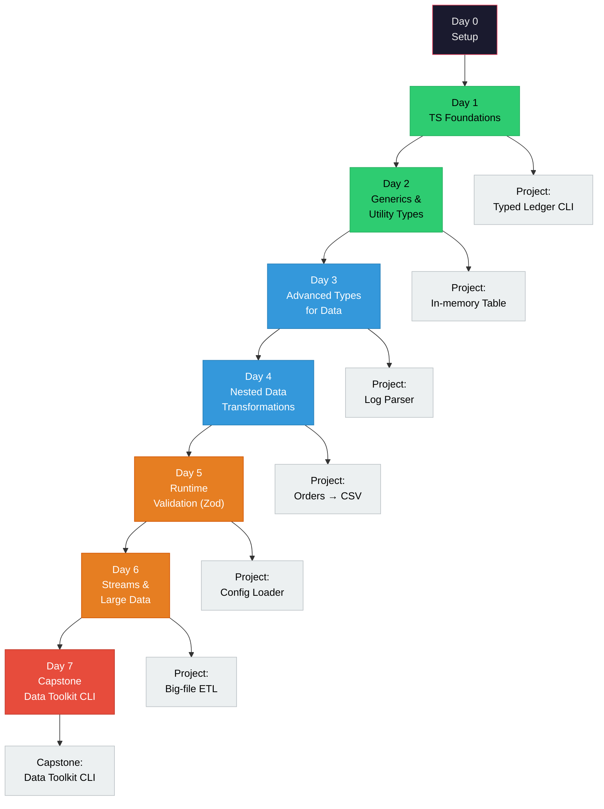

# 06 — Node.js & TypeScript: Data Handling Intensive

A **7-day, 6–7 hours/day** intensive that takes a complete TypeScript beginner to someone who can confidently ingest messy nested data, validate it, reshape it, stream it, and emit clean tables — all with a Node.js CLI.

> **Who this is for:** Engineers who want to add TypeScript + Node to their toolkit specifically for data-intensive work. This is not a generic TS tutorial — every concept is taught through a data-handling lens.

---

## Visual Overview



---

## What You Will Be Able To Do

By the end of day 7, given any realistic data-handling ask, you will be able to:

- ✅ Model any shape of data with TypeScript types (nested, recursive, union, discriminated)
- ✅ Take `unknown` input from a file, API, or DB and **safely** narrow it to a typed structure using Zod
- ✅ Flatten, unflatten, group, pivot, and join nested datasets with pure TypeScript
- ✅ Stream gigabyte-scale NDJSON and CSV files without blowing up memory
- ✅ Compose small functions into a real-world CLI that reads → validates → transforms → writes
- ✅ Write tests for data transformations using `node:test`
- ✅ Read a stack trace, understand a TS error, and fix it fast

---

## Daily Cadence (6–7 hrs)

Every day follows the same rhythm so you don't have to re-plan:

| Block | Duration | Activity |
|-------|----------|----------|
| **1. Concept reading** | 90 min | Read `concepts.md` end-to-end. Try inline examples in a scratch file. |
| **2. Guided drills** | 90 min | Exercises 1–4. Each file has inline `assert` tests. Make them pass. |
| — | 30 min | Break. Step away. |
| **3. Harder drills** | 90 min | Exercises 5+. More open-ended, less hand-holding. |
| **4. Mini-project** | 120–150 min | Build the day's project from the spec in `project/*/README.md`. |
| **5. Review** | 20 min | Reread the sections that tripped you up. Jot 3 gotchas in your notes. |

Every `concepts.md` is **self-contained** — if you can't solve an exercise, the answer is in the concept file, not on Google.

---

## The 7 Days

| Day | Topic | Concept Focus | End-of-day Project |
|----:|-------|---------------|--------------------|
| **1** | [TypeScript Foundations](./day1-typescript-foundations/concepts.md) | Types, inference, narrowing, interfaces, tsconfig | [Typed Ledger CLI](./day1-typescript-foundations/project/ledger-cli/README.md) |
| **2** | [Generics & Utility Types](./day2-generics-and-utility-types/concepts.md) | Generics, constraints, `Pick`/`Omit`/`Partial`/`Record`, `keyof`/`typeof` | [In-memory Typed Table](./day2-generics-and-utility-types/project/in-memory-table/README.md) |
| **3** | [Advanced Types for Data](./day3-advanced-types-for-data/concepts.md) | Discriminated unions, literal types, template literals, type guards, `unknown` vs `any` | [Heterogeneous Log Parser](./day3-advanced-types-for-data/project/log-parser/README.md) |
| **4** | [Nested Data Transformations](./day4-nested-data-transformations/concepts.md) | Recursive types, flatten/unflatten, groupBy, pivot, joins | [Orders → Flat CSV](./day4-nested-data-transformations/project/orders-to-csv/README.md) |
| **5** | [Runtime Validation with Zod](./day5-runtime-validation-zod/concepts.md) | Schema-first design, `safeParse`, transforms, refinements, error formatting | [Config & API Loader](./day5-runtime-validation-zod/project/config-and-api-loader/README.md) |
| **6** | [Streams & Large Data](./day6-streams-and-large-data/concepts.md) | Node streams, async iterators, pipeline, backpressure, NDJSON, CSV streaming | [Big-file ETL Pipeline](./day6-streams-and-large-data/project/big-file-etl/README.md) |
| **7** | [Capstone: Data Toolkit CLI](./day7-capstone-data-toolkit/concepts.md) | Composition, CLI ergonomics, testing data transforms, error strategy | [Full Data Toolkit CLI](./day7-capstone-data-toolkit/project/data-toolkit-cli/README.md) |

---

## Setup (Do This First)

Before day 1, read [`setup.md`](./setup.md) and run:

```bash
cd 06-nodejs
npm install
```

One install, zero per-day setup friction. Every exercise and project shares the same `package.json` and `tsconfig.json`.

---

## How to Run Any File

```bash
# From the 06-nodejs/ directory:
npx tsx day1-typescript-foundations/exercises/01_primitives_and_inference.ts
```

A passing file ends with `All tests passed!`. See [`setup.md`](./setup.md) section 3 for more run commands.

---

## Progress Tracker

### Day 1 — TypeScript Foundations
- [ ] Read `concepts.md`
- [ ] Exercises 01–07
- [ ] Project: Typed Ledger CLI

### Day 2 — Generics & Utility Types
- [ ] Read `concepts.md`
- [ ] Exercises 01–06
- [ ] Project: In-memory Typed Table

### Day 3 — Advanced Types for Data
- [ ] Read `concepts.md`
- [ ] Exercises 01–06
- [ ] Project: Heterogeneous Log Parser

### Day 4 — Nested Data Transformations
- [ ] Read `concepts.md`
- [ ] Exercises 01–07
- [ ] Project: Orders → Flat CSV

### Day 5 — Runtime Validation with Zod
- [ ] Read `concepts.md`
- [ ] Exercises 01–06
- [ ] Project: Config & API Loader

### Day 6 — Streams & Large Data
- [ ] Read `concepts.md`
- [ ] Exercises 01–06
- [ ] Project: Big-file ETL Pipeline

### Day 7 — Capstone
- [ ] Read `concepts.md`
- [ ] Capstone: Data Toolkit CLI
- [ ] All tests green

---

## What This Course Is NOT

- ❌ **Not an HTTP server course.** No Express/Fastify/REST. The end goal is a data-CLI, not a backend.
- ❌ **Not a database course.** No SQL, ORM, migrations. DB-shaped data is represented as JSON fixtures.
- ❌ **Not a TypeScript compiler internals course.** You'll learn enough to *use* the type system, not how it's implemented.
- ❌ **Not a framework tour.** Zod and csv-parse are the only third-party libs, introduced where they earn their keep.
- ❌ **Not deep on advanced types.** We touch conditional types and template literals on day 3, but we don't descend into variadic tuple gymnastics. The goal is fluency, not flexing.

If you want backend/API/DB work, that's a future `07-backend` pillar. This one is data-first.

---

## The One Rule

**Don't skip the concept reading.** Every exercise is answerable from that day's `concepts.md` alone. If you're Googling, something is wrong — reread the concept section that covers it.
