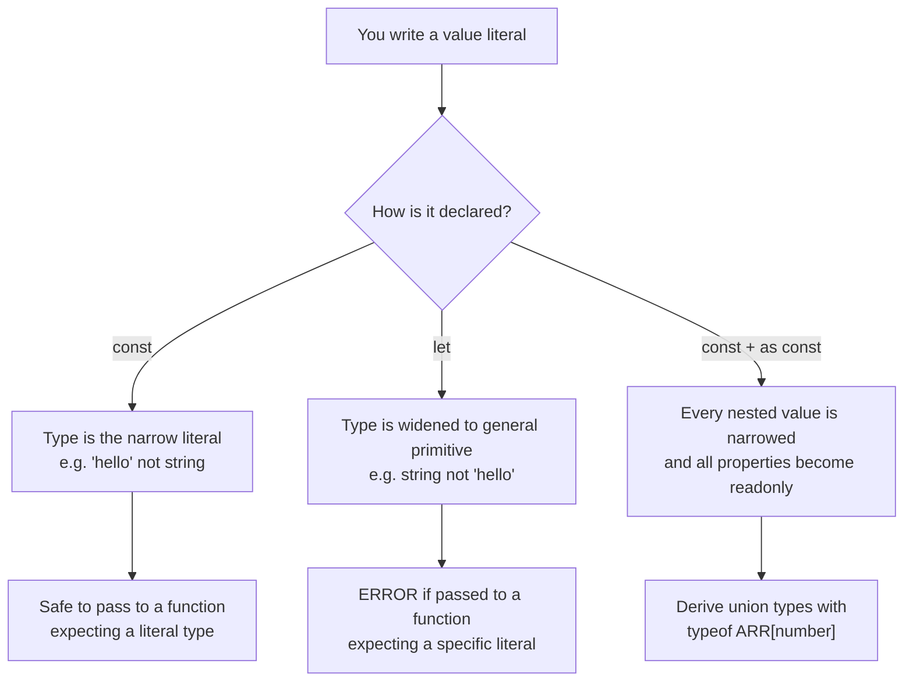
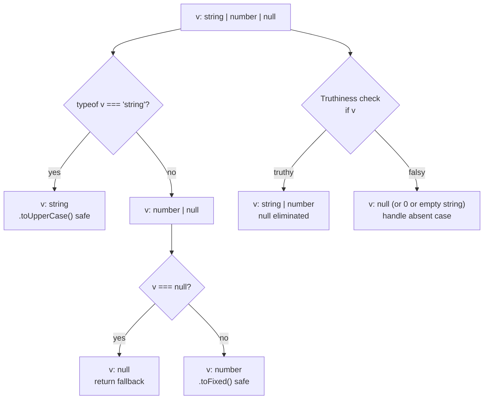
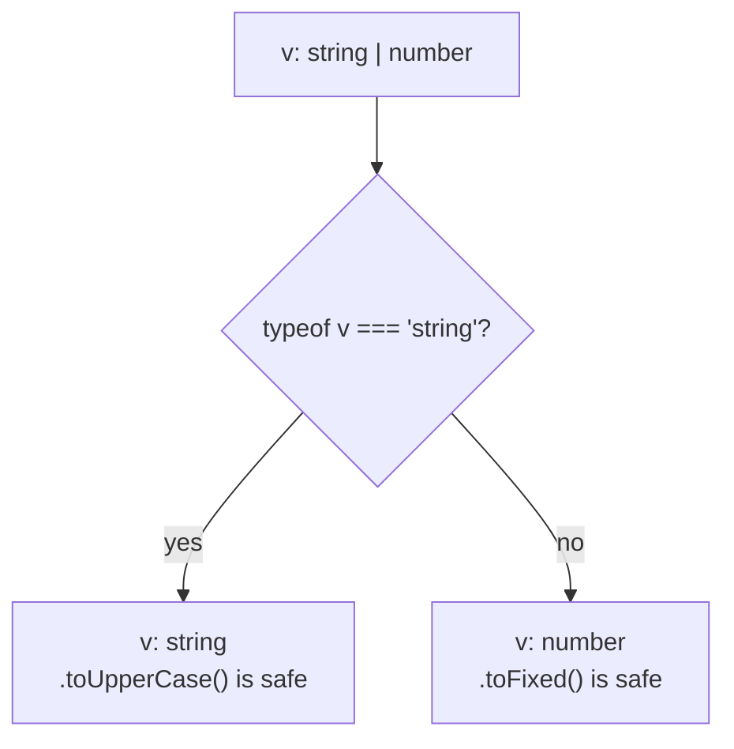
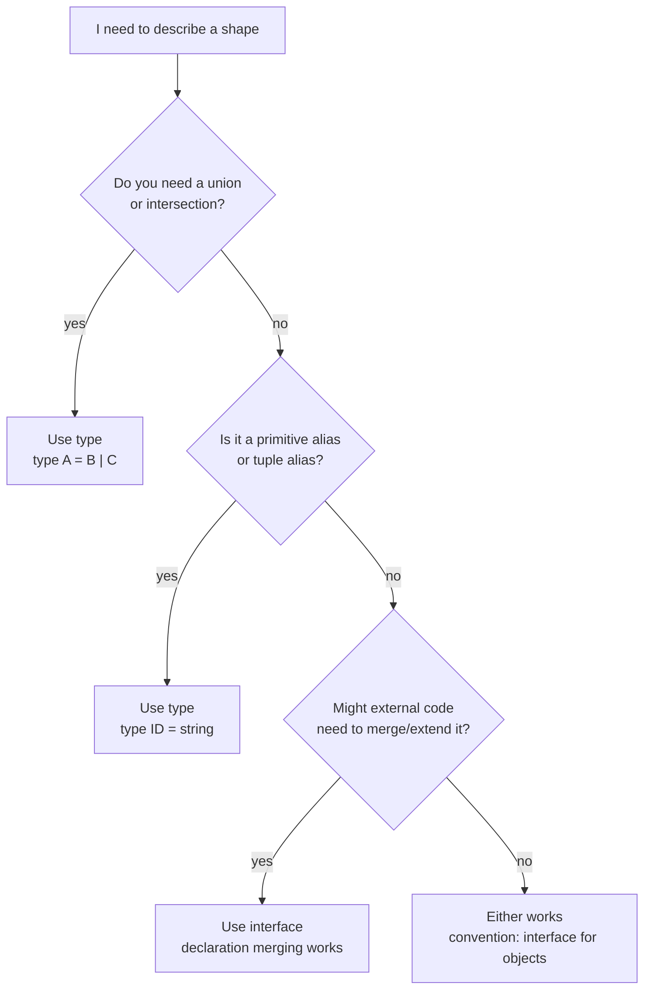
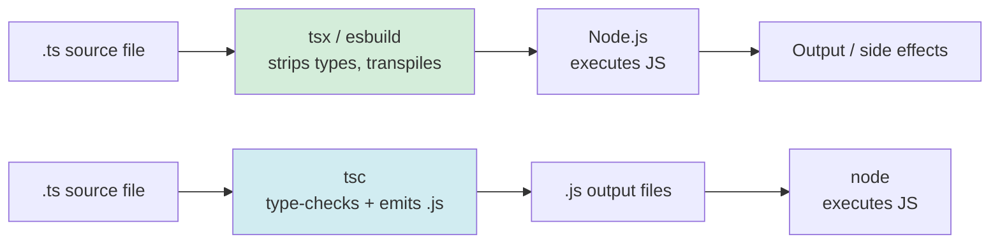

# Day 1 — TypeScript Foundations

## What you already know that applies here

- Nothing yet — this is Day 1 and the start of the course.
- You should have installed Node and run `npm install` per `setup.md`. If not, do that now.
- The only tool you need is an editor and a terminal.

---

## Why TypeScript for Data Work

Data pipelines, CLIs, and APIs all share a common failure mode: a value you expected to be a number turns out to be `undefined`, or a JSON field you assumed was always present is missing in 3% of records. TypeScript does not prevent bad data from arriving — that is Zod's job (Day 5) — but it makes every assumption explicit inside your own code. When you write `amount: number` in an interface, the compiler enforces that you never accidentally pass a string to a function that adds amounts. Over the course of this seven-day course you will build progressively more capable data-handling programs; TypeScript is the foundation that makes them maintainable as they grow.

---

## Primitives and Inference

### The mental model

TypeScript's primitive types are a one-to-one mapping onto JavaScript's built-in value types. You already know these from JavaScript — TypeScript just gives them names you can write in source code. Think of primitive types as the atoms: everything else is built from these.

TypeScript's inference engine watches what value you assign and figures out the type automatically. You only need to write a type annotation when inference would get it wrong — which is less often than you might think.

**`let` vs `const` vs `as const` widening decision tree**



**I do**

```ts
// Seven primitives — you rarely annotate these; inference handles them
const name = "Alice";        // inferred: "Alice" (literal), not string
let age = 30;                // inferred: number (widened from 30)
let active = true;           // inferred: boolean

// The widening difference matters when literals are used as values
type Direction = "north" | "south" | "east" | "west";

function move(d: Direction) { /* ... */ }

const dir = "north";         // type: "north" — literal preserved by const
let dir2 = "north";          // type: string — widened by let

move(dir);                   // OK: "north" is assignable to Direction
// move(dir2);               // ERROR: string is not assignable to Direction

// as const freezes objects and arrays into literal readonly types
const config = {
  host: "localhost",
  port: 5432,
} as const;
// config.host is "localhost", not string
// config.port is 5432, not number
// attempting config.host = "other" is a compile error
```

**We do**

Consider this code:

```ts
const STATUSES = ["active", "inactive", "pending"];
type Status = (typeof STATUSES)[number];
```

What is the type of `Status`?

<details>
<summary>Click to reveal</summary>

Without `as const`, `STATUSES` has type `string[]`, so `(typeof STATUSES)[number]` is just `string` — not a useful union.

Add `as const`:

```ts
const STATUSES = ["active", "inactive", "pending"] as const;
type Status = (typeof STATUSES)[number];
// type Status = "active" | "inactive" | "pending"
```

Now you have a proper union derived from the array. This is a common pattern for enumerations.
</details>

**You do**

Open a scratch file. Declare a `const` and a `let` with the same string value. Hover over each in your editor and observe the difference in their inferred types.

---

TypeScript has seven primitive types that map directly onto JavaScript primitives:

| Type        | Example value       | Notes                                          |
| ----------- | ------------------- | ---------------------------------------------- |
| `string`    | `"hello"`           | UTF-16 string                                  |
| `number`    | `42`, `3.14`, `NaN` | 64-bit float                                   |
| `boolean`   | `true`, `false`     |                                                |
| `null`      | `null`              | must be explicit when `strictNullChecks` is on |
| `undefined` | `undefined`         | uninitialized variable                         |
| `bigint`    | `9007199254740993n` | arbitrary precision integer                    |
| `symbol`    | `Symbol("tag")`     | unique opaque value                            |

---

## Objects and Interfaces

### The mental model

An interface is a named contract: "any value that satisfies this shape is acceptable here." Think of it like a customs form — you declare what fields must be present and what types they must hold. The compiler checks every value you pass against the contract and rejects mismatches before your code ever runs.

**I do**

```ts
// Inline object type — works, but verbose at call sites
function greet(user: { name: string; age: number }): string {
  return `Hello ${user.name}`;
}

// Named interface — reusable, readable, extendable
interface User {
  id: string;
  email: string;
  displayName?: string;   // optional: type inside body is string | undefined
  readonly createdAt: Date; // cannot be reassigned after the object is created
}

// Using the interface
const alice: User = {
  id: "u1",
  email: "alice@example.com",
  createdAt: new Date(),
  // displayName omitted — that is fine because it is optional
};

// alice.createdAt = new Date(); // ERROR: readonly
alice.email = "new@example.com"; // OK: not readonly
```

**We do**

Here is an index signature used to track counts by category:

```ts
interface CountByCategory {
  [category: string]: number;
}

const counts: CountByCategory = { groceries: 5, utilities: 2 };
const g = counts["groceries"]; // what is the type of g?
```

<details>
<summary>Click to reveal</summary>

With `noUncheckedIndexedAccess` enabled (which this project uses), `g` has type `number | undefined`, not `number`. The compiler acknowledges that `counts["anything"]` might not exist.

```ts
const g = counts["groceries"]; // type: number | undefined
if (g !== undefined) {
  console.log(g * 2); // safe
}
```
</details>

**You do**

Write an interface for a `Transaction` with `id`, `amount`, `category`, and an optional `note`. Create one object that satisfies it and one that intentionally omits a required field — observe the error.

---

## Arrays and Tuples

### The mental model

An array type says "zero or more values of this shape, in a sequence." A tuple says "exactly this many values, in this order, with these types." Tuples are arrays with a fixed contract at each position — useful when a function needs to return two related values without defining a full object.

**I do**

```ts
// Two equivalent syntaxes — prefer T[] for simple cases
const ids: string[] = ["a", "b", "c"];
const ids2: Array<string> = ["a", "b", "c"]; // easier to read when T is complex

// Common array operations — TypeScript infers return types automatically
const amounts: number[] = [100, -50, 200, -30];

const income: number[] = amounts.filter((n) => n > 0);  // inferred: number[]
const doubled: number[] = amounts.map((n) => n * 2);    // inferred: number[]
const total: number = amounts.reduce((acc, n) => acc + n, 0); // inferred: number

// Tuple — each position has a declared type
type NameAge = [string, number];

const person: NameAge = ["Alice", 30]; // OK
// const bad: NameAge = [30, "Alice"]; // ERROR: types swapped

// Tuples for multi-value returns
function splitAmount(total: number): [number, number] {
  return [total * 0.8, total * 0.2]; // net, tax
}

const [net, tax] = splitAmount(100); // net: number, tax: number

// readonly arrays — the function promises not to mutate its input
function sumAll(values: readonly number[]): number {
  return values.reduce((a, b) => a + b, 0);
  // values.push(99); // ERROR inside this function
}

const mutableAmounts: number[] = [10, 20, 30];
sumAll(mutableAmounts); // OK — mutable array is assignable to readonly parameter
```

**We do**

```ts
function parseRow(row: string): [string, number] {
  const parts = row.split(",");
  // parts[0] and parts[1] have type string | undefined here (noUncheckedIndexedAccess)
  // Fill in: how do you safely extract them?
}
```

<details>
<summary>Click to reveal</summary>

```ts
function parseRow(row: string): [string, number] {
  const parts = row.split(",");
  const label = parts[0] ?? "unknown";      // string | undefined → string
  const raw = parts[1] ?? "0";              // string | undefined → string
  return [label, Number(raw)];
}
```

The `??` operator (nullish coalescing) replaces `undefined` with a fallback value, narrowing the type to `string`.
</details>

**You do**

Write a function `minMax(nums: number[]): [number, number]` that returns the minimum and maximum of an array. What happens if you return three values by mistake?

---

## Union Types and Narrowing

### The mental model

A union type is TypeScript's way of saying "this value is one of these shapes — you pick." Think of it like a vending machine slot that accepts either a coin or a bill: the machine has to check which one it received before it decides what to do. Narrowing is the act of making that check — after the check, TypeScript knows exactly which branch you are in.

**Type-narrowing flow**



**I do**

```ts
// typeof narrowing — distinguishes primitive types
function formatValue(v: string | number): string {
  if (typeof v === "string") {
    // v is string here — TypeScript knows
    return v.toUpperCase();
  }
  // v is number here — the string branch is exhausted
  return v.toFixed(2);
}

// Truthiness narrowing — eliminates null/undefined
interface User { email: string }

function greetUser(user: User | null): string {
  if (!user) {
    return "Hello, guest"; // user is null here
  }
  // user is User here — null is eliminated
  return `Hello, ${user.email}`;
}

// in narrowing — distinguishes object shapes
type EmailContact = { kind: "email"; address: string };
type SmsContact   = { kind: "sms";   phone: string };
type Contact      = EmailContact | SmsContact;

function notify(contact: Contact): string {
  if ("address" in contact) {
    // contact is EmailContact — only EmailContact has "address"
    return `Email to ${contact.address}`;
  }
  // contact is SmsContact
  return `SMS to ${contact.phone}`;
}

// Discriminated union — narrowing on a literal property
function notifyV2(contact: Contact): string {
  if (contact.kind === "email") {
    return `Email to ${contact.address}`; // TypeScript knows address exists
  }
  return `SMS to ${contact.phone}`;
}
```

**We do**

```ts
type Result = { ok: true; value: number } | { ok: false; error: string };

function display(result: Result): string {
  // How do you safely access result.value?
}
```

<details>
<summary>Click to reveal</summary>

```ts
function display(result: Result): string {
  if (result.ok) {
    // result is { ok: true; value: number } here
    return `Value: ${result.value}`;
  }
  // result is { ok: false; error: string } here
  return `Error: ${result.error}`;
}
```

The `ok` boolean property is the discriminant. Narrowing on `result.ok === true` restricts the union to the success branch.
</details>

**You do**

Write a function that accepts `string | number | boolean` and returns a formatted string. Use `typeof` to handle each branch. What does TypeScript tell you if you forget one branch and try to call a method that only exists on one type?

---

The original narrowing diagram from the `typeof` section is preserved inline in the I do example above. Below is the standalone version for reference:



---

## Functions

### The mental model

A function's type signature is a contract between the caller and the implementer. The caller promises to pass the right types; the function promises to return the declared type. Writing explicit return types on non-trivial functions catches mistakes at the definition rather than at every call site — the earlier an error surfaces, the cheaper it is to fix.

**I do**

```ts
// Explicit parameter and return types
function add(a: number, b: number): number {
  return a + b;
}

// Optional parameter — inside the body, title is string | undefined
function greet(name: string, title?: string): string {
  if (title) {
    return `Hello, ${title} ${name}`;
  }
  return `Hello, ${name}`;
}

// Default parameter — title is never undefined inside the body
function greetWithDefault(name: string, title = "Dr."): string {
  return `Hello, ${title} ${name}`;
}

// Rest parameters — values is number[]
function sum(...values: number[]): number {
  return values.reduce((a, b) => a + b, 0);
}

sum(1, 2, 3);   // 6
sum(10, 20);    // 30

// void return — function does not produce a useful value
function logError(message: string): void {
  console.error(message);
}

// Function type alias — describes the shape of a function value
type Formatter = (value: number) => string;

const formatCurrency: Formatter = (n) => `$${n.toFixed(2)}`;

// Higher-order function — takes a function as a parameter
function applyToAll(values: number[], fn: (n: number) => number): number[] {
  return values.map(fn);
}

applyToAll([1, 2, 3], (n) => n * 2); // [2, 4, 6]
```

**We do**

```ts
// This function is missing its return type annotation.
// What should it be, and what does TypeScript infer without it?
function partition(nums: number[], threshold: number) {
  const below = nums.filter((n) => n < threshold);
  const above = nums.filter((n) => n >= threshold);
  return [below, above];
}
```

<details>
<summary>Click to reveal</summary>

TypeScript infers the return type as `number[][]` — an array of number arrays. That is correct but loose: the caller cannot tell from the type alone that the result always has exactly two elements.

A more precise annotation uses a tuple:

```ts
function partition(nums: number[], threshold: number): [number[], number[]] {
  const below = nums.filter((n) => n < threshold);
  const above = nums.filter((n) => n >= threshold);
  return [below, above];
}

const [below, above] = partition([1, 5, 3, 8, 2], 4);
```

Now destructuring is safe and the tuple contract is enforced.
</details>

**You do**

Write a higher-order function `transform<T, U>(items: T[], fn: (item: T) => U): U[]`. Try calling it with a `string[]` and a function that returns `number`. Does TypeScript infer the return type correctly?

---

## `type` vs `interface`

### The mental model

Both `type` and `interface` describe object shapes and are interchangeable in most situations. The practical difference comes down to two capabilities: `interface` supports declaration merging (two declarations with the same name fuse into one), and `type` supports unions, intersections, and primitive aliases. A simple decision rule: reach for `interface` when describing a "thing", reach for `type` when you need a union or when `interface` cannot express the shape.

**Interface vs type decision tree**



**I do**

```ts
// Same shape, two syntaxes — interchangeable for simple objects
interface UserInterface {
  id: string;
  email: string;
}

type UserType = {
  id: string;
  email: string;
};

// Extending an interface
interface BaseRecord {
  id: string;
  createdAt: Date;
}

interface Transaction extends BaseRecord {
  amount: number;
  category: string;
}

// Intersecting a type — produces the same shape
type BaseRecordT = {
  id: string;
  createdAt: Date;
};

type TransactionT = BaseRecordT & {
  amount: number;
  category: string;
};

// Declaration merging — only possible with interface
interface Config {
  host: string;
}

interface Config {
  port: number;
}

// Config is now { host: string; port: number } — the two declarations merged
const cfg: Config = { host: "localhost", port: 5432 };

// type CANNOT be redeclared — this would be an error:
// type Config = { host: string };
// type Config = { port: number }; // ERROR: Duplicate identifier 'Config'

// type excels at unions and aliases
type ID = string;
type Status = "active" | "inactive" | "pending";
type StringOrNumber = string | number;
```

**We do**

You have a union of two event types and need to add a shared `timestamp` property to both:

```ts
type ClickEvent = { kind: "click"; x: number; y: number };
type KeyEvent   = { kind: "key";   key: string };
type AppEvent   = ClickEvent | KeyEvent;

// How do you add timestamp: number to every member of AppEvent?
```

<details>
<summary>Click to reveal</summary>

Use an intersection with a base type:

```ts
type WithTimestamp = { timestamp: number };
type AppEvent = (ClickEvent | KeyEvent) & WithTimestamp;

// Or equivalently, add it to each member:
type ClickEvent = { kind: "click"; x: number; y: number; timestamp: number };
type KeyEvent   = { kind: "key";   key: string; timestamp: number };
```

The intersection approach is cleaner when the shared field is added later and you do not want to modify each member individually.
</details>

**You do**

Declare two `interface Window` blocks (or an interface that you then extend) and observe declaration merging. Then try the same with `type` and observe the error.

---

## `readonly` and Immutability

### The mental model

`readonly` is a compile-time promise: "this value will not change after it is set." It does not freeze the value at runtime — JavaScript objects remain mutable. Think of it as a "do not touch" label that TypeScript enforces for you within your own code, but that disappears at runtime. Use it on interface properties that should be set once, and on array parameters that a function should not mutate.

**I do**

```ts
// readonly property — enforced at compile time only
interface Transaction {
  readonly id: string;  // cannot be changed after creation
  amount: number;
}

const tx: Transaction = { id: "abc", amount: 100 };
tx.amount = 200; // OK — amount is not readonly
// tx.id = "xyz"; // ERROR: Cannot assign to 'id' because it is a read-only property

// readonly array parameter — function cannot mutate the array
function totalSpend(amounts: readonly number[]): number {
  return amounts.reduce((a, b) => a + b, 0);
  // amounts.push(99); // ERROR inside this function
}

const bills: number[] = [50, 30, 20];
totalSpend(bills); // OK — mutable array is assignable to readonly parameter

// Readonly<T> utility type — makes every property readonly at once
interface User {
  id: string;
  email: string;
  displayName?: string;
  createdAt: Date;
}

type ReadonlyUser = Readonly<User>;
// equivalent: { readonly id: string; readonly email: string; ... }

// as const on arrays — freezes the entire structure
const CATEGORIES = ["groceries", "utilities", "transport", "dining"] as const;
// type: readonly ["groceries", "utilities", "transport", "dining"]
// CATEGORIES[0] has type "groceries", not string

// Deriving a union from a const array
type Category = (typeof CATEGORIES)[number];
// type: "groceries" | "utilities" | "transport" | "dining"
```

**We do**

```ts
const ROLES = ["admin", "editor", "viewer"] as const;
type Role = (typeof ROLES)[number];

function assignRole(userId: string, role: Role): void {
  console.log(`Assigning ${role} to ${userId}`);
}

// Will this call compile?
assignRole("u1", "superuser");
```

<details>
<summary>Click to reveal</summary>

No. `"superuser"` is not in `ROLES`, so it is not assignable to `Role = "admin" | "editor" | "viewer"`. The error is:

```
Argument of type '"superuser"' is not assignable to parameter of type '"admin" | "editor" | "viewer"'.
```

This is exactly the safety `as const` + derived union types provide — adding a new role requires updating `ROLES`, and all call sites that pass invalid strings break immediately.
</details>

**You do**

Add a `readonly` modifier to an array property on an interface. Then try to call `.push()` on it inside a function. What error do you get?

---

## `noUncheckedIndexedAccess`

### The mental model

By default, TypeScript assumes `arr[0]` always gives you a `T`. But arrays can be empty. This compiler option makes TypeScript honest: `arr[0]` returns `T | undefined` because TypeScript acknowledges the array might not have an element at that index. It is a small discipline tax that prevents a class of runtime `undefined` crashes.

**`noUncheckedIndexedAccess` safe access flow**


**I do**

```ts
const names: string[] = ["Alice", "Bob"];

// Without noUncheckedIndexedAccess (default TS):
// const first: string = names[0]; // TypeScript trusts you

// With noUncheckedIndexedAccess (this project):
const first = names[0]; // type: string | undefined

// Narrow with an explicit check
if (first !== undefined) {
  console.log(first.toUpperCase()); // safe — first is string here
}

// Narrow with nullish coalescing
const display = names[0] ?? "anonymous"; // type: string

// for...of is always safe — never produces T | undefined
for (const name of names) {
  console.log(name.toUpperCase()); // name is string, not string | undefined
}

// Index signatures also return T | undefined
interface CountByCategory {
  [category: string]: number;
}

const counts: CountByCategory = { groceries: 5 };
const g = counts["groceries"]; // type: number | undefined
const safe = g ?? 0;           // type: number
```

**We do**

```ts
const rows: string[][] = [["Alice", "30"], ["Bob", "25"]];

for (const row of rows) {
  const name = row[0];
  const age  = row[1];
  console.log(`${name} is ${age}`);
  // Is this safe? What are the types of name and age?
}
```

<details>
<summary>Click to reveal</summary>

With `noUncheckedIndexedAccess`, `row[0]` and `row[1]` are `string | undefined`, so this is not safe — `console.log` will print `undefined` if a row has fewer than two elements, and string methods would crash.

Safe version:

```ts
for (const row of rows) {
  const name = row[0] ?? "unknown";
  const age  = row[1] ?? "0";
  console.log(`${name} is ${age}`);
}
```
</details>

**You do**

Create a `string[]`, access its first element, and try to call `.toUpperCase()` on it without checking for `undefined` first. Read the error message TypeScript gives you.

---

## tsconfig.json Essentials

### The mental model

`tsconfig.json` is the configuration contract for your TypeScript project. It tells the compiler which features to enforce, which JavaScript version to target, and how to resolve modules. Think of it as the project's "house rules" — stricter rules catch more bugs at the cost of writing slightly more defensive code.

**I do**

```ts
// These are the key flags in this project's tsconfig.json and what they do:

// "strict": true
// Enables: strictNullChecks, noImplicitAny, strictFunctionTypes, and others.
// Without strictNullChecks, null and undefined can be assigned to any type.
// With it, you must handle them explicitly.

// "target": "ES2022"
// TypeScript compiles down to this JS version.
// ES2022 gives top-level await, Array.at(), Object.hasOwn().
// Node 20+ supports all of these natively.

// "module": "ES2022" and "moduleResolution": "Bundler"
// Controls import/export emit and path resolution.
// "Bundler" resolution allows .ts extensions in imports, which tsx supports.

// "noUncheckedIndexedAccess": true
// arr[0] returns T | undefined instead of T. Explained in the section above.

// "noImplicitReturns": true
// Every code path in a non-void function must return a value.
// Prevents accidentally returning undefined from a function typed as string.

// "resolveJsonModule": true
// Allows: import data from "./data.json"
// TypeScript infers the type from the JSON structure automatically.
```

**We do**

If you remove `"strict": true` from `tsconfig.json` and replace it with just `"noImplicitAny": true`, which protections do you lose?

<details>
<summary>Click to reveal</summary>

`"strict": true` is a shorthand that enables all of:

- `strictNullChecks` — null/undefined must be handled explicitly
- `noImplicitAny` — parameters without types default to `any` otherwise
- `strictFunctionTypes` — function parameter types are checked contravariantly
- `strictBindCallApply` — checks arguments to `.bind()`, `.call()`, `.apply()`
- `strictPropertyInitialization` — class properties must be initialized in the constructor
- `noImplicitThis` — `this` must have an explicit type in functions

Removing `strict` and keeping only `noImplicitAny` loses `strictNullChecks`, which is arguably the single most valuable check — it is what prevents `null` and `undefined` from silently passing type checks.
</details>

**You do**

Open `tsconfig.json` in this project and find all the flags listed above. Note which ones would be covered by `"strict": true` alone.

---

## Running TypeScript with `tsx`

### The mental model

`tsx` is a Node.js wrapper that strips TypeScript types on the fly using `esbuild`. There is no separate compile step: you run a `.ts` file directly and it executes immediately. The trade-off is that `tsx` does not check types — it just removes them. Type errors are caught by your editor and by running `tsc --noEmit` separately.

**TS to Node runtime pipeline**



The top path (tsx) is the development workflow used in this course. The bottom path (tsc + node) is the traditional build pipeline used in production deployments. Both result in Node executing JavaScript; only the tooling differs.

**I do**

```bash
# Run a single exercise file directly
npx tsx day1-typescript-foundations/exercises/01_primitives_and_inference.ts

# Type-check all files without running them
npx tsc --noEmit

# Type-check and watch for changes
npx tsc --noEmit --watch
```

**We do**

If `tsx` does not type-check, what is the point of running `tsc --noEmit`?

<details>
<summary>Click to reveal</summary>

`tsx` (via esbuild) only strips types — it does not verify them. You can have a type error in your file and `tsx` will run it anyway, often crashing at runtime on the invalid assumption the type error was flagging.

`tsc --noEmit` runs the full TypeScript type checker across all files according to your `tsconfig.json`. It catches errors that `tsx` silently ignores. The workflow is: use `tsx` for fast iteration, use `tsc --noEmit` before committing to confirm your types are correct.
</details>

**You do**

Run `npx tsc --noEmit` in the project root. If there are errors, read the output: find the file name, line number, and error message. Practice parsing the error format before you encounter it mid-exercise.

---

## Reading TypeScript Errors

### The mental model

TypeScript errors follow a consistent structure: "you gave me X but I expected Y, and here is why they do not match." Reading from the bottom of a nested error chain up to the top is the most efficient approach — the innermost message is usually the actionable one.

**I do**

```ts
// Deliberately broken example — missing required property
interface User {
  id: string;
  email: string;
}

function sendEmail(user: User): void {
  console.log(user.email);
}

const partial = { id: "1" }; // 'email' is missing
sendEmail(partial);
// ERROR:
// Argument of type '{ id: string; }' is not assignable to parameter of type 'User'.
//   Property 'email' is missing in type '{ id: string; }' but required in type 'User'.

// How to read this:
// 1. "Argument of type ... is not assignable to parameter of type ..." — wrong type passed
// 2. "Property 'email' is missing..." — the specific mismatch
// 3. The error points to the call site (sendEmail(partial)), not the function definition

// Another common error: T | undefined not narrowed
const items: string[] = ["a", "b"];
const first = items[0]; // type: string | undefined
// console.log(first.toUpperCase()); // ERROR: 'first' is possibly 'undefined'
// Fix: check before use
if (first !== undefined) {
  console.log(first.toUpperCase());
}
```

**We do**

You see this error:

```
Type 'string' is not assignable to type 'number'.
```

on a line that looks like:

```ts
const result: number = getValue();
```

Where is the bug — in the annotation or in `getValue`?

<details>
<summary>Click to reveal</summary>

It depends. TypeScript is telling you the inferred return type of `getValue()` is `string`, but you declared `result` as `number`.

Two possible fixes:

1. If `getValue` should return a number, fix its implementation or its return type annotation.
2. If the annotation is wrong (the value really is a string), change `const result: number` to `const result: string` or remove the annotation and let inference work.

The error message tells you what types conflict, not which one is "right" — that is a judgment call you make based on your intent.
</details>

**You do**

Introduce a deliberate type error into one of the exercise files (pass a string where a number is expected). Read the full error output from `tsc --noEmit`. Practice identifying the file, line, and the two conflicting types.

---

## Gotchas for Day 1

- **`any` is a bug.** Using `any` turns off type checking for that value. Every `any` is a place where TypeScript cannot protect you. Treat `any` like a suppressed compiler warning — it will bite you.
- **Non-null assertion `!` is a smell.** Writing `user!.email` tells TypeScript "trust me, this is not null." If you are wrong, you get a runtime crash. Narrow with `if` instead.
- **Array access returns `T | undefined`.** With `noUncheckedIndexedAccess` enabled, `arr[0]` is not guaranteed to be `T`. Always check, or use `for...of` which is always safe.
- **`null` and `undefined` are different.** `null` means "intentionally absent." `undefined` means "not set." TypeScript treats them as distinct types when `strictNullChecks` is on.
- **Prefer `unknown` over `any` at boundaries.** When you do not know what type a value has (e.g., parsed JSON, error objects), use `unknown`. You cannot do anything with an `unknown` value until you narrow it — which forces you to write safe code. This is covered in depth on Day 5.
- **Literal types narrow on `const`, widen on `let`.** Assign to `const` when a value should not change.

---

## Mental-model summary

```mermaid
mindmap
  root((Day 1: TypeScript Foundations))
    Primitives
      Seven primitive types
      Inference from initialization
      const narrows to literal
      let widens to general type
      as const freezes everything
    Objects
      Interface defines a shape
      Optional properties with ?
      readonly prevents reassignment
      Index signatures with noUncheckedIndexedAccess
    Arrays and Tuples
      T[] or Array<T>
      Tuple fixes length and position types
      readonly T[] prevents mutation
      for..of is always safe
    Unions and Narrowing
      string | number | null
      typeof narrows primitives
      Truthiness narrows null/undefined
      in narrows object shapes
      Discriminated union on literal kind
    Functions
      Explicit return types on exports
      Optional params with ?
      Default params never undefined
      Rest params as T[]
      Function type aliases
    type vs interface
      interface for objects and things
      type for unions and aliases
      Declaration merging on interface
      Intersection with ampersand
    Immutability
      readonly property modifier
      Readonly utility type
      as const on arrays
      Derive union with typeof ARR[number]
    Tooling
      tsx runs TS directly via esbuild
      tsc --noEmit for type checking
      tsconfig strict enables all checks
      noUncheckedIndexedAccess honest arrays
```

---

## Check your understanding

<details>
<summary>1. Why does <code>const x = "hello"</code> have type <code>"hello"</code> but <code>let x = "hello"</code> has type <code>string</code>?</summary>

Because `const` can never be reassigned, so TypeScript narrows the type to the literal value `"hello"`. `let` can be reassigned to any other string, so TypeScript widens it to the general `string` type. This matters when passing values to functions that expect a specific string literal type.
</details>

<details>
<summary>2. You have a function typed as returning <code>string</code> but one branch returns nothing. Which tsconfig flag catches this, and what error do you get?</summary>

`"noImplicitReturns": true` catches it. The error is:

```
Not all code paths return a value.
```

It fires at the function definition, not at the call sites — you get one error to fix instead of potentially many.
</details>

<details>
<summary>3. You call <code>arr[0]</code> and get type <code>string | undefined</code>. What are two ways to narrow it to <code>string</code> safely?</summary>

Option 1 — explicit check:
```ts
const val = arr[0];
if (val !== undefined) {
  // val is string here
}
```

Option 2 — nullish coalescing with a fallback:
```ts
const val = arr[0] ?? "default"; // type: string
```

Option 3 (bonus) — use `for...of` instead of index access; loop variable is always `T`, never `T | undefined`.
</details>

<details>
<summary>4. What is the key practical difference between <code>interface</code> and <code>type</code> when describing object shapes?</summary>

`interface` supports declaration merging: two `interface Foo` blocks in the same scope fuse into one. This is used in library type augmentation. `type` cannot be redeclared.

For object shapes in your own code, they are interchangeable. Reach for `type` when you need a union, intersection, primitive alias, or mapped type — things `interface` cannot express.
</details>

<details>
<summary>5. You use <code>tsx</code> to run a file and it executes without errors, but your editor shows a red underline. What is happening and how do you resolve it?</summary>

`tsx` strips types without checking them, so it will run a file even if it contains type errors. The editor (via `tsserver`) is showing a real type violation that `tsx` silently ignored.

Resolve it by running `npx tsc --noEmit` to see all type errors across the project, then fix the flagged issue. The rule of thumb: `tsx` for execution speed during development, `tsc --noEmit` before committing.
</details>

---

## Mini Q&A

**Q: What is the difference between `any` and `unknown`?**

A: `any` disables type checking entirely — you can call methods, index it, and pass it anywhere. `unknown` is the safe alternative: you can hold a value of unknown type, but TypeScript will not let you do anything with it until you narrow the type (with `typeof`, `instanceof`, etc.). At data boundaries (JSON parsing, API responses), prefer `unknown`.

**Q: Why does `const arr = [1, 2, 3]` give type `number[]` instead of `[1, 2, 3]`?**

A: Without `as const`, TypeScript widens array literals to mutable `T[]` because you might call `push`. Use `as const` to get `readonly [1, 2, 3]` with literal element types.

**Q: What is the difference between `interface` and `type`?**

A: Both describe object shapes. `interface` supports declaration merging (two `interface Foo` blocks merge into one) and is preferred for "things." `type` supports unions, intersections, mapped types, and primitives. In practice, either works for most shapes — the community convention is `interface` for public API shapes, `type` for complex compositions.

**Q: When should I write an explicit return type on a function?**

A: Always on exported functions and any function longer than a few lines. It turns logic errors at the return statement into errors at the definition site rather than at every call site. For short private helpers, inference is fine.

**Q: What does `noUncheckedIndexedAccess` actually protect against?**

A: It prevents you from assuming an array is non-empty. Without it, `arr[0]` has type `T` even if `arr` is empty — you would get `undefined` at runtime but TypeScript would not warn you. With it enabled, `arr[0]` is `T | undefined`, forcing you to handle the empty case.
