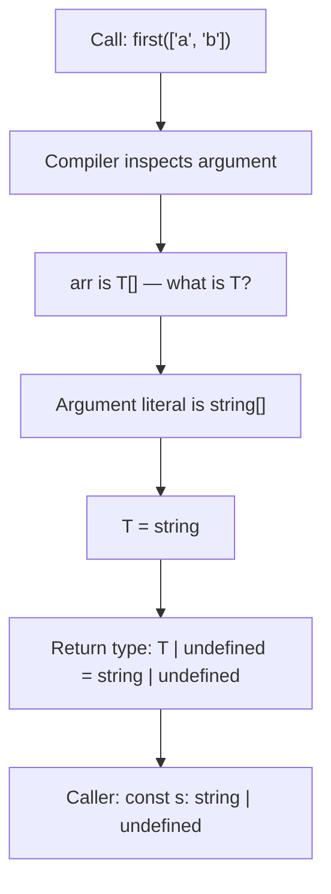
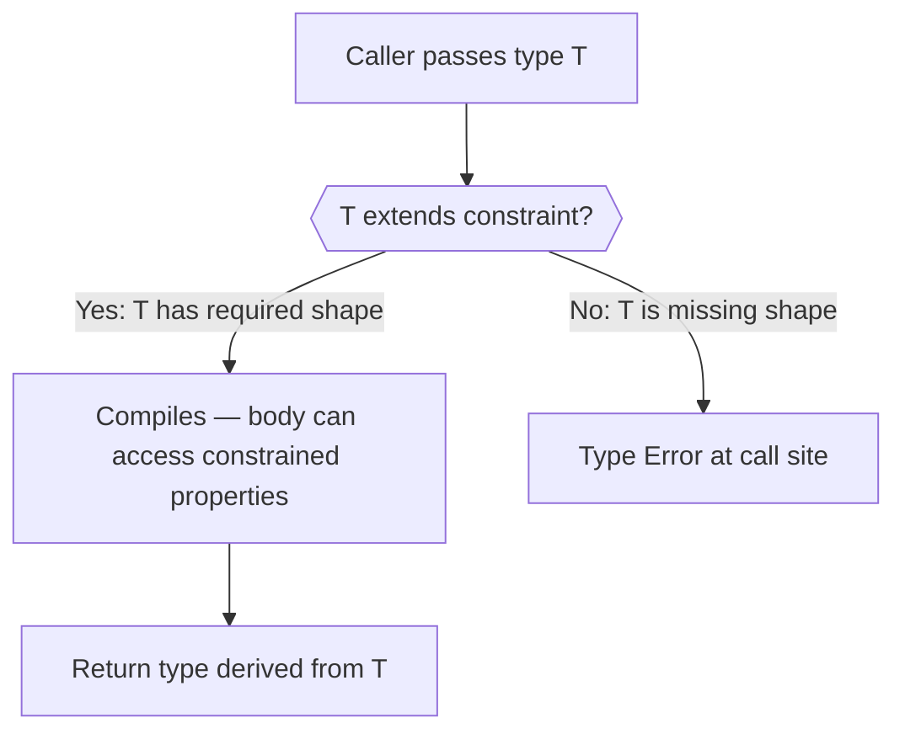
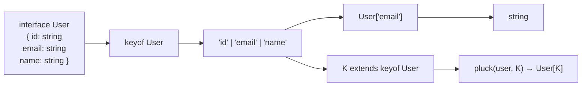
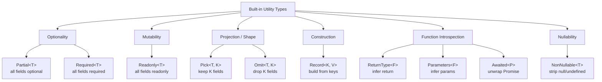
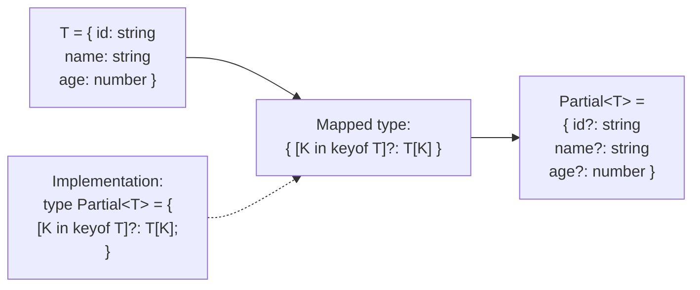
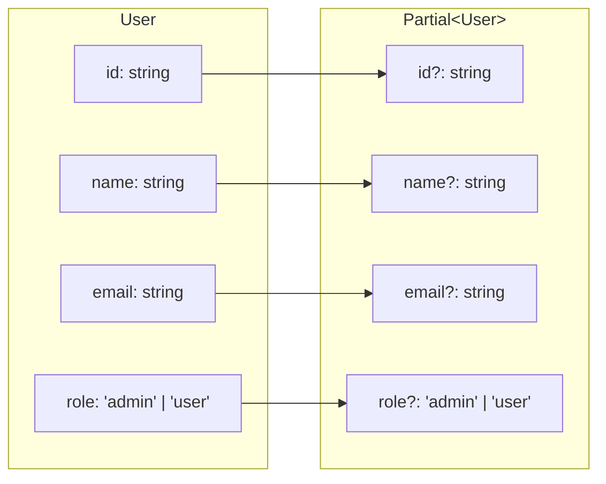
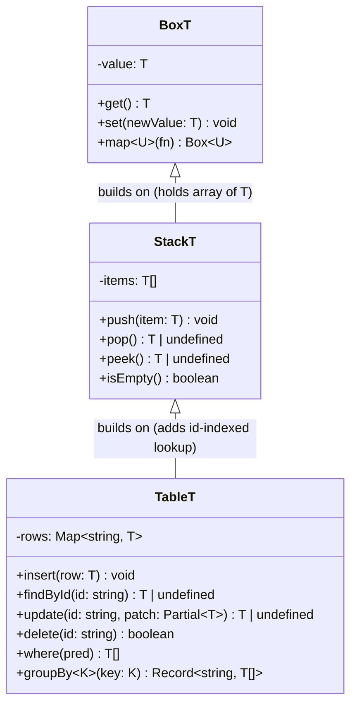

# Day 2 — Generics & Utility Types

## What you already know that applies here

- Day 1: types, interfaces, unions, narrowing, readonly — generics build directly on all of these.
- `noUncheckedIndexedAccess` still applies: generic array access is still `T | undefined`.
- The `const` vs `let` widening rules from day 1 explain why `identity("hello")` infers `string` (the param is `let`-like) but `as const` narrows it.

---

## Table of Contents

1. [Why Generics?](#1-why-generics)
2. [Generic Functions](#2-generic-functions)
3. [Generic Constraints (`extends`)](#3-generic-constraints-extends)
4. [The `keyof` Operator](#4-the-keyof-operator)
5. [The `typeof` Type Operator](#5-the-typeof-type-operator)
6. [Indexed Access Types](#6-indexed-access-types)
7. [Utility Types Deep Dive](#7-utility-types-deep-dive)
8. [Mapped Types Basics](#8-mapped-types-basics)
9. [Generic Classes](#9-generic-classes)
10. [Common Pitfalls](#10-common-pitfalls)
11. [Mental-model summary](#11-mental-model-summary)
12. [Check your understanding](#12-check-your-understanding)
13. [Mini Q&A](#13-mini-qa)

---

## 1. Why Generics?

**The mental model**

A generic is a type-level function. You pass in a type, you get back a new type that remembers what you passed. Like `Array` isn't really useful on its own — `Array<number>` is. The `<number>` is the argument. Generics let you write one piece of logic that remains precise for every type you feed it, instead of writing the same logic over and over for each type, or giving up and using `any`.

**I do**

Consider a simple function: return the first item of an array. In plain JavaScript you might write:

```ts
function first(arr: any[]): any {
  return arr[0];
}
```

This compiles, but you've thrown away all type information. The caller gets `any` back regardless of what they put in:

```ts
const n = first([1, 2, 3]); // n: any  — TypeScript can't help you here
const s = first(["a", "b"]); // s: any  — same problem
```

You can't call `.toFixed()` on `n` without a cast, and autocomplete is useless. One attempted fix is overloads:

```ts
function first(arr: number[]): number | undefined;
function first(arr: string[]): string | undefined;
function first(arr: unknown[]): unknown {
  return arr[0];
}
```

That only works for types you explicitly list. If someone passes a `User[]` you're back to `unknown`.

**Generics solve this.** A generic function is parameterised over a type, the same way a normal function is parameterised over a value:

```ts
function first<T>(arr: T[]): T | undefined {
  return arr[0];
}

const n = first([1, 2, 3]); // n: number | undefined
const s = first(["a", "b"]); // s: string | undefined

interface User {
  id: string;
  name: string;
}
const u = first<User>([{ id: "1", name: "Alice" }]); // u: User | undefined
```

TypeScript infers `T` from the argument — you don't usually need to write `<User>` manually. The return type automatically tracks the element type of the input array. This is the core value proposition: **write once, stay type-safe for all types**.

**Generic type-parameter inference flow**



**We do**

Given this signature, what does TypeScript infer for `result`?

```ts
function wrap<T>(value: T): { data: T } {
  return { data: value };
}

const result = wrap(42);
```

<details><summary>Reveal</summary>

`result` has type `{ data: number }`. TypeScript infers `T = number` from the argument `42`, and substitutes it into the return type `{ data: T }`.

</details>

**You do**

Write a generic `last<T>(arr: T[]): T | undefined` function in a scratch file. Then try calling it with a `number[]`, a `string[]`, and a custom interface. Verify the inferred return types match the element type.

---

## 2. Generic Functions

**The mental model**

Think of the angle brackets `<T>` as declaring a variable at the type level. Just as a regular parameter like `x: number` gives a name to a value passed at runtime, `<T>` gives a name to a type passed at the call site. Everything that follows can use `T` as a concrete type — and TypeScript fills it in differently at each call.

**I do**

### Basic Syntax

```ts
function identity<T>(x: T): T {
  return x;
}
```

The angle brackets `<T>` declare a **type parameter** — a placeholder that TypeScript replaces with a concrete type at each call site. You can name it anything, but single-letter names (`T`, `U`, `K`, `V`) are conventional.

Arrow function equivalent:

```ts
const identity = <T>(x: T): T => x;
```

### Type Parameter Inference

TypeScript infers type parameters from the arguments:

```ts
identity(42); // T inferred as number
identity("hello"); // T inferred as string
identity({ x: 1 }); // T inferred as { x: number }
```

You only need to provide the type parameter explicitly when inference fails or you want to constrain the inference:

```ts
identity<string>("hello"); // explicit — rarely needed
```

### Multiple Type Parameters

A function can have multiple type parameters:

```ts
function pair<A, B>(a: A, b: B): [A, B] {
  return [a, b];
}

const p = pair(1, "one"); // [number, string]
const q = pair(true, { x: 0 }); // [boolean, { x: number }]
```

### Default Type Parameters

Type parameters can have defaults, similar to default function arguments:

```ts
function createArray<T = string>(length: number, fill: T): T[] {
  return Array.from({ length }, () => fill);
}

createArray(3, 0); // T inferred as number
createArray(3, "x"); // T inferred as string
createArray(3); // Error: fill is required, but T defaults to string
```

Default type parameters are more useful in generic interfaces and types than in functions where inference usually handles things.

**We do**

What is the type of `result` here?

```ts
function merge<A, B>(a: A, b: B): A & B {
  return { ...a, ...b } as A & B;
}

const result = merge({ x: 1 }, { y: "hello" });
```

<details><summary>Reveal</summary>

`result` has type `{ x: number } & { y: string }`. TypeScript infers `A = { x: number }` and `B = { y: string }`, and the return type `A & B` becomes their intersection. You can access both `result.x` and `result.y` safely.

</details>

**You do**

Write a generic `zip<A, B>(as: A[], bs: B[]): [A, B][]` that pairs elements by index. Try it with arrays of different types and verify the tuple output type.

---

## 3. Generic Constraints (`extends`)

**The mental model**

An unconstrained `<T>` knows nothing about `T` — you can't access any property on it. Constraints are how you tell TypeScript: "I know T won't be just anything — it must at least have this shape." Think of a constraint as a gate: if the candidate type passes the gate, the function compiles; if it doesn't, TypeScript stops you at the call site.

**Constraint checking gate diagram**



**I do**

### Constraining to an Object Shape

```ts
function getLength<T extends { length: number }>(x: T): number {
  return x.length;
}

getLength("hello"); // string has .length
getLength([1, 2, 3]); // array has .length
getLength({ length: 5 }); // plain object works too
getLength(42); // Error: number has no .length
```

`T extends { length: number }` means "T must have at least a `length` property that is a number." T can have other properties too.

### Constraining with `keyof`

The most important constraint pattern in TypeScript:

```ts
function pluck<T, K extends keyof T>(obj: T, key: K): T[K] {
  return obj[key];
}

const user = { id: 1, name: "Alice", email: "alice@example.com" };
const name = pluck(user, "name"); // string
const id = pluck(user, "id"); // number
pluck(user, "age"); // Error: "age" is not keyof typeof user
```

`K extends keyof T` means "K must be one of the property names of T". The return type `T[K]` is the _indexed access type_ — the type of `T` at property `K`. TypeScript tracks this precisely.

### Constraining to a Union

```ts
type Direction = "north" | "south" | "east" | "west";

function move<T extends Direction>(dir: T, steps: number): string {
  return `Moving ${steps} steps ${dir}`;
}

move("north", 5); // ok
move("up", 5); // Error: "up" is not assignable to Direction
```

**We do**

Fix the type error in this function:

```ts
function getProperty<T>(obj: T, key: string): unknown {
  return obj[key]; // Error: Element implicitly has an 'any' type
}
```

<details><summary>Reveal</summary>

Add a constraint so `key` must be a key of `T`:

```ts
function getProperty<T, K extends keyof T>(obj: T, key: K): T[K] {
  return obj[key]; // Safe — T[K] is the precise return type
}
```

Now the return type is exact, not `unknown`.

</details>

**You do**

Write a `clamp<T extends number>(value: T, min: T, max: T): T` function. Try calling it with values outside the range and verify TypeScript tracks the type correctly through the return.

---

## 4. The `keyof` Operator

**The mental model**

`keyof T` is a lens that looks at a type and extracts its property names as a union of string literals. If `User` has `id`, `email`, and `name`, then `keyof User` is `"id" | "email" | "name"`. It's the type-level equivalent of `Object.keys()`, but instead of giving you an array at runtime, it gives you a union type at compile time that TypeScript can reason about precisely.

**`keyof` and indexed-access pipeline**



**I do**

```ts
interface User {
  id: number;
  name: string;
  email: string;
  role: "admin" | "user";
}

type UserKeys = keyof User;
// "id" | "name" | "email" | "role"
```

### Worked Example: Typed `pluck`

```ts
function pluck<T, K extends keyof T>(obj: T, key: K): T[K] {
  return obj[key];
}

const user: User = {
  id: 1,
  name: "Alice",
  email: "alice@example.com",
  role: "admin",
};

const name = pluck(user, "name"); // type: string
const id = pluck(user, "id"); // type: number
const role = pluck(user, "role"); // type: "admin" | "user"
```

Notice the return types are exact — not just `string | number | "admin" | "user"`, but the _specific_ type for each key.

### `keyof` with Index Signatures

```ts
interface StringMap {
  [key: string]: number;
}

type K = keyof StringMap; // string | number
// (number is included because array indices are coerced to strings in JS)
```

### `keyof` with `typeof`

You can combine both operators:

```ts
const config = {
  host: "localhost",
  port: 5432,
  ssl: false,
};

type ConfigKey = keyof typeof config; // "host" | "port" | "ssl"
```

**We do**

What does TypeScript infer for `keys` here?

```ts
interface Product {
  sku: string;
  price: number;
  inStock: boolean;
}

type ProductKeys = keyof Product;
```

<details><summary>Reveal</summary>

`ProductKeys` is `"sku" | "price" | "inStock"`. `keyof` collects all property names of the interface as a string literal union.

</details>

**You do**

Create a `freeze<T>(obj: T): Readonly<T>` wrapper and experiment with `keyof typeof someObject` to build a typed key-array. Verify that TypeScript rejects keys not in the object.

---

## 5. The `typeof` Type Operator

**The mental model**

JavaScript's `typeof` is a runtime operator that gives you a string like `"number"` or `"object"`. TypeScript's type-level `typeof` is different: it takes a variable or expression you have in scope and derives its full static type. The primary use case is avoiding duplication — if you have a complex object defined in code, you can derive its type directly instead of writing a separate interface that could drift out of sync.

**I do**

```ts
const point = { x: 10, y: 20 };

type Point = typeof point;
// { x: number; y: number }
```

### Deriving Types from Runtime Config

This is the primary use case: you have a complex runtime value and want a type from it without duplicating the shape in a separate interface.

```ts
const CONFIG = {
  apiUrl: "https://api.example.com",
  timeout: 5000,
  retries: 3,
  auth: {
    type: "bearer" as const,
    tokenKey: "Authorization",
  },
} as const;

type Config = typeof CONFIG;
/*
{
  readonly apiUrl: "https://api.example.com";
  readonly timeout: 5000;
  readonly retries: 3;
  readonly auth: {
    readonly type: "bearer";
    readonly tokenKey: "Authorization";
  };
}
*/
```

The `as const` assertion makes every value a literal type. Without it, `"https://api.example.com"` would be widened to `string`.

### `typeof` with Functions

```ts
function add(a: number, b: number): number {
  return a + b;
}

type AddFn = typeof add;
// (a: number, b: number) => number
```

This is a building block for `ReturnType` and `Parameters` (covered below).

### `typeof` in Variable Declarations

```ts
let x = 5;
let y: typeof x; // y: number
```

**We do**

Given this runtime value, what is `typeof ROLES`?

```ts
const ROLES = {
  admin: "ADMIN",
  user: "USER",
  guest: "GUEST",
} as const;
```

<details><summary>Reveal</summary>

```ts
type ROLES_TYPE = typeof ROLES;
/*
{
  readonly admin: "ADMIN";
  readonly user: "USER";
  readonly guest: "GUEST";
}
*/
```

With `as const`, every string value becomes a narrow literal type (`"ADMIN"` not `string`), and all properties become `readonly`. You can then do `type RoleValue = typeof ROLES[keyof typeof ROLES]` to get `"ADMIN" | "USER" | "GUEST"`.

</details>

**You do**

Define a runtime `THEME` config object with `as const`. Derive a `ThemeKey` type using `keyof typeof THEME` and a `ThemeValue` type using indexed access. Confirm the types are narrow literals.

---

## 6. Indexed Access Types

**The mental model**

An indexed access type `T[K]` is the type-level equivalent of `obj[key]`. Just as `user["email"]` at runtime gives you the email string, `User["email"]` at the type level gives you the type of that property — `string`. This is what makes `pluck` and similar utilities return precise types instead of wide unions.

**I do**

```ts
interface Product {
  id: string;
  name: string;
  price: number;
  tags: string[];
}

type PriceType = Product["price"]; // number
type TagsType = Product["tags"]; // string[]
type TagType = Product["tags"][number]; // string (element type)
```

### Union of Keys

You can pass a union as the index to get a union of types:

```ts
type NameOrPrice = Product["name" | "price"]; // string | number
```

### `keyof` + Indexed Access

Together they let you write very precise signatures:

```ts
function getAttribute<T, K extends keyof T>(obj: T, key: K): T[K] {
  return obj[key];
}
```

The return type `T[K]` is never widened to a union — it's the exact type for that specific key at each call site.

### Array Element Types

```ts
type Users = User[];
type SingleUser = Users[number]; // User
```

This is useful when you have a type that is an array and you want the element type.

**We do**

What is the type of `result`?

```ts
interface ApiResponse {
  status: number;
  data: { users: { id: string; name: string }[] };
  errors: string[];
}

type UserEntry = ApiResponse["data"]["users"][number];
```

<details><summary>Reveal</summary>

`UserEntry` is `{ id: string; name: string }`. The chain `["data"]` → `["users"]` → `[number]` drills down through the nested type: `ApiResponse["data"]` gives `{ users: ... }`, then `["users"]` gives the array type, then `[number]` gives the element type.

</details>

**You do**

Given an interface with a nested union, use indexed access to extract just the nested union without re-declaring it. Confirm you get the same type by hovering in your editor.

---

## 7. Utility Types Deep Dive

TypeScript ships a set of built-in generic types that transform other types. They are implemented using mapped types and conditional types under the hood, but you use them like functions on types.

**Utility-type family tree**



---

### `Partial<T>` — Making a Patch Object

**The mental model**

`Partial<T>` takes every property of `T` and makes it optional. It's like saying "I might have any of these fields, but I don't have to have all of them." This is the shape of an HTTP PATCH body: you only send what changed.

**I do**

**Problem:** You want to update some fields of an object without requiring all of them.

```ts
interface User {
  id: string;
  name: string;
  email: string;
  role: "admin" | "user";
}

// All fields become optional
type UserPatch = Partial<User>;
/*
{
  id?: string;
  name?: string;
  email?: string;
  role?: "admin" | "user";
}
*/

function patchUser(user: User, patch: Partial<User>): User {
  return { ...user, ...patch };
}

patchUser(user, { name: "Bob" }); // ok
patchUser(user, { name: "Bob", role: "admin" }); // ok
patchUser(user, { age: 30 }); // Error: unknown field
```

**When to use:** HTTP PATCH bodies, update functions, partial configuration.

**We do**

What would `Partial<Required<User>>` produce if `User` already has some optional fields?

```ts
interface User {
  id: string;
  name?: string;
  email?: string;
}
```

<details><summary>Reveal</summary>

`Required<User>` first makes all fields required: `{ id: string; name: string; email: string }`. Then `Partial<...>` makes them all optional again: `{ id?: string; name?: string; email?: string }`. The composition round-trips the optionality, ending up with the same shape as the original — but it's a useful pattern when you want to explicitly document "all optional".

</details>

**You do**

In `exercises/03_pick_omit_partial.ts`, use `Partial<T>` as the parameter type for an update function. Merge the patch with the original using spread and return the full updated object.

---

### `Required<T>` — All Fields Must Be Present

**The mental model**

`Required<T>` is the mirror of `Partial`. It strips the `?` from every property. Use it after you've validated or defaulted all optional fields and need to hand off an object where everything is guaranteed present.

**I do**

**Problem:** A type has optional fields but in a specific context they must all exist.

```ts
interface Config {
  host?: string;
  port?: number;
  ssl?: boolean;
}

type ResolvedConfig = Required<Config>;
/*
{
  host: string;
  port: number;
  ssl: boolean;
}
*/

function startServer(config: ResolvedConfig) {
  // safe to access config.host without undefined check
  console.log(`${config.host}:${config.port}`);
}
```

**When to use:** After validation/defaulting, when asserting a config is fully resolved.

**We do**

How would you write a `withDefaults` function that takes a `Partial<Config>` and returns a `Required<Config>`?

<details><summary>Reveal</summary>

```ts
const DEFAULTS: Required<Config> = {
  host: "localhost",
  port: 3000,
  ssl: false,
};

function withDefaults(partial: Partial<Config>): Required<Config> {
  return { ...DEFAULTS, ...partial };
}
```

The spread merges the defaults with any provided values. TypeScript checks that `DEFAULTS` satisfies `Required<Config>` — you'll get an error if you forget a field.

</details>

**You do**

Write a `resolveConfig` function for any generic `T` that takes `Partial<T>` and a defaults object of type `T`, and returns `T`. Verify the return type is not `Partial<T>`.

---

### `Readonly<T>` — Immutable Wrappers

**The mental model**

`Readonly<T>` adds the `readonly` modifier to every property. TypeScript will reject any attempt to assign to those properties after construction. It's a compile-time guarantee — the JavaScript object is still mutable at runtime, but your code can't accidentally mutate it.

**I do**

**Problem:** You want to prevent mutation of an object after construction.

```ts
interface Point {
  x: number;
  y: number;
}

const origin: Readonly<Point> = { x: 0, y: 0 };
origin.x = 1; // Error: Cannot assign to 'x' because it is a read-only property
```

Note `Readonly<T>` is _shallow_ — nested objects are still mutable. For deep immutability, you'd need a recursive mapped type.

**When to use:** Function parameters you don't want mutated, cached values, configuration snapshots.

**We do**

Why does this still mutate despite `Readonly`?

```ts
interface Nested {
  user: { name: string };
}

const obj: Readonly<Nested> = { user: { name: "Alice" } };
obj.user = { name: "Bob" }; // Error — caught
obj.user.name = "Bob"; // ???
```

<details><summary>Reveal</summary>

The second line compiles with no error. `Readonly<Nested>` makes the `user` property itself readonly (you can't replace `obj.user`), but the object that `user` points to is still a plain mutable `{ name: string }`. `Readonly` is shallow. To protect nested fields, you'd need `{ user: Readonly<{ name: string }> }` or a deep-readonly recursive type.

</details>

**You do**

Write a `freeze<T>(obj: T): Readonly<T>` utility function. Use it to wrap a config object and verify that TypeScript rejects assignments to its properties.

---

### `Pick<T, K>` — Projecting a DTO

**The mental model**

`Pick<T, K>` keeps only the fields you name and drops everything else. It's a type-level projection — like `SELECT id, name, email FROM users` in SQL. Use it to create a safe public view of a richer internal type.

**I do**

**Problem:** You want a subset of a type's fields — a "projection" or DTO (Data Transfer Object).

```ts
interface User {
  id: string;
  name: string;
  email: string;
  passwordHash: string;
  role: "admin" | "user";
}

// Only safe to expose publicly
type PublicUser = Pick<User, "id" | "name" | "email">;
/*
{
  id: string;
  name: string;
  email: string;
}
*/

function toPublicUser(user: User): PublicUser {
  return { id: user.id, name: user.name, email: user.email };
}
```

**When to use:** API responses (strip internal fields), form state (only editable fields), serialization.

**We do**

What happens if you pass a key to `Pick` that doesn't exist on `T`?

```ts
type Bad = Pick<User, "id" | "avatar">; // "avatar" doesn't exist on User
```

<details><summary>Reveal</summary>

TypeScript raises a compile error: `Type '"avatar"' does not satisfy the constraint 'keyof User'`. The second type parameter of `Pick` is constrained to `keyof T`, so any key you list must actually exist on the type. This is a safety guarantee — you can't accidentally reference a field that was renamed or removed.

</details>

**You do**

In `exercises/03_pick_omit_partial.ts`, create a `toSummary<T extends { id: string; name: string }>(item: T): Pick<T, "id" | "name">` function. Think about whether `Pick` on a generic is correctly constrained.

---

### `Omit<T, K>` — Stripping Internal Fields

**The mental model**

`Omit<T, K>` keeps everything _except_ the fields you name. It's the complement of `Pick`. Use it when it's easier to say what you're dropping than what you're keeping — usually when you want almost all fields but need to exclude one or two internal ones.

**I do**

**Problem:** You want everything _except_ certain fields.

```ts
// Exclude the generated field 'id' for creation input
type CreateUserInput = Omit<User, "id">;
/*
{
  name: string;
  email: string;
  passwordHash: string;
  role: "admin" | "user";
}
*/

// Or exclude the sensitive field
type SafeUser = Omit<User, "passwordHash">;
```

**`Pick` vs `Omit`:** Use `Pick` when the _kept_ fields are few. Use `Omit` when the _excluded_ fields are few. Both are equivalent in power.

**Important gotcha:** `Omit` has historically been less precise with union types. For simple object types it works perfectly.

**We do**

You have an `AdminUser` that extends `User` with extra fields. Does `Omit<AdminUser, "passwordHash">` work as expected?

<details><summary>Reveal</summary>

Yes for simple cases. `Omit<AdminUser, "passwordHash">` will keep all fields of `AdminUser` except `passwordHash`. However, if `AdminUser` is a union type, `Omit` may not distribute correctly over each union member — in that case, use a distributive conditional type or `Pick` explicitly on each member.

</details>

**You do**

In `exercises/03_pick_omit_partial.ts`, define a `CreateInput<T>` type alias using `Omit<T, "id" | "createdAt">`. Apply it to two different entity types and verify the resulting shapes.

---

### `Record<K, V>` — Typed Dictionaries / Lookup Tables

**The mental model**

`Record<K, V>` constructs an object type where every key is of type `K` and every value is of type `V`. When `K` is a string literal union, TypeScript requires you to provide all keys — it's an exhaustive lookup table. When `K` is `string`, it's an open dictionary.

**I do**

**Problem:** You want a typed dictionary where keys and values have specific types.

```ts
// Count word occurrences
const counts: Record<string, number> = {};
counts["hello"] = 1;
counts["world"] = 2;

// Lookup table from string literal union
type Status = "active" | "inactive" | "banned";
type StatusConfig = Record<Status, { label: string; color: string }>;

const statusConfig: StatusConfig = {
  active: { label: "Active", color: "green" },
  inactive: { label: "Inactive", color: "gray" },
  banned: { label: "Banned", color: "red" },
};

// TypeScript will error if you miss a key:
// banned: ... // Error if you remove this line
```

**When to use:** Lookup tables, frequency maps, grouping results, enum-keyed configs.

**We do**

How would you use `Record` with `keyof` to build a type that maps each field of `User` to a validation function?

<details><summary>Reveal</summary>

```ts
type UserValidators = Record<keyof User, (value: unknown) => boolean>;

const validators: UserValidators = {
  id: (v) => typeof v === "string",
  name: (v) => typeof v === "string" && v.length > 0,
  email: (v) => typeof v === "string" && v.includes("@"),
  role: (v) => v === "admin" || v === "user",
};
```

`keyof User` gives `"id" | "name" | "email" | "role"`, and `Record` requires a value for each. TypeScript errors if any key is missing.

</details>

**You do**

In `exercises/04_record_and_keyof.ts`, build a `groupBy<T, K extends keyof T>(items: T[], key: K): Record<string, T[]>` function. Think about whether `Record<T[K], T[]>` would be more precise.

---

### `ReturnType<F>` — Inferring a Return Type

**The mental model**

`ReturnType<F>` asks TypeScript: "what does this function return?" It uses conditional types under the hood to infer the return type without you having to declare it twice. The primary value is the single-source-of-truth principle: the function is the source, and `ReturnType` derives the type from it. If the function changes, the derived type updates automatically.

**I do**

**Problem:** You have a function and want to derive the type of what it returns, without duplicating it.

```ts
function createUser(name: string, email: string) {
  return {
    id: crypto.randomUUID(),
    name,
    email,
    createdAt: new Date(),
  };
}

type NewUser = ReturnType<typeof createUser>;
/*
{
  id: string;
  name: string;
  email: string;
  createdAt: Date;
}
*/
```

**When to use:** When a function's return type is complex or inferred (no explicit annotation), and you want to derive it for use elsewhere. Avoids the "single source of truth" problem where the type and function get out of sync.

**We do**

What is `ReturnType<typeof fetch>`?

<details><summary>Reveal</summary>

`Promise<Response>`. The global `fetch` function returns a `Promise<Response>`. So `ReturnType<typeof fetch>` is `Promise<Response>`, and `Awaited<ReturnType<typeof fetch>>` would be `Response`.

</details>

**You do**

In `exercises/05_returntype_and_parameters.ts`, apply `ReturnType` to a factory function and use the resulting type to annotate a cache map. Verify the cache value type matches the factory output.

---

### `Parameters<F>` — Inferring a Parameter Tuple

**The mental model**

`Parameters<F>` extracts the argument types of a function as a tuple. It's the input counterpart of `ReturnType`. The main use case is building wrappers, decorators, or middleware that need to accept the same arguments as the wrapped function, without duplicating the type annotation.

**I do**

**Problem:** You want to derive the argument types of a function.

```ts
function fetchUser(id: string, options: { timeout: number }): Promise<User> {
  // ...
  return Promise.resolve({
    id,
    name: "Alice",
    email: "a@b.com",
    role: "user" as const,
  });
}

type FetchUserParams = Parameters<typeof fetchUser>;
// [id: string, options: { timeout: number }]

// Use it to build a wrapper:
function cachedFetchUser(...args: Parameters<typeof fetchUser>): Promise<User> {
  const [id] = args;
  // check cache first...
  return fetchUser(...args);
}
```

**When to use:** Building decorators, wrappers, middleware, logging layers where you pass arguments through unchanged.

**We do**

How would you use `Parameters` to write a generic `memoize` wrapper?

<details><summary>Reveal</summary>

```ts
function memoize<T extends (...args: any[]) => any>(
  fn: T,
): (...args: Parameters<T>) => ReturnType<T> {
  const cache = new Map<string, ReturnType<T>>();
  return (...args: Parameters<T>) => {
    const key = JSON.stringify(args);
    if (cache.has(key)) return cache.get(key)!;
    const result = fn(...args);
    cache.set(key, result);
    return result;
  };
}
```

`Parameters<T>` ensures the wrapper accepts exactly the same arguments as the original function. `ReturnType<T>` ensures the return type matches too.

</details>

**You do**

In `exercises/05_returntype_and_parameters.ts`, write a `withLogging<T extends (...args: any[]) => any>(fn: T)` wrapper that logs arguments before calling `fn` and returns the result, using `Parameters<T>` and `ReturnType<T>`.

---

### `Awaited<P>` — Unwrapping a Promise

**The mental model**

`Awaited<P>` does at the type level what `await` does at runtime: it unwraps a `Promise<T>` to `T`. It's recursive, so `Awaited<Promise<Promise<string>>>` gives you `string`. The most common use is combining it with `ReturnType` to get the resolved value type of an async function.

**I do**

**Problem:** You have a `Promise<T>` and want `T`.

```ts
type NumberPromise = Promise<number>;
type N = Awaited<NumberPromise>; // number

// Works with nested promises:
type DeepPromise = Promise<Promise<string>>;
type S = Awaited<DeepPromise>; // string

// Works with async functions:
async function loadUser(id: string): Promise<User> {
  /* ... */ return {} as User;
}
type LoadedUser = Awaited<ReturnType<typeof loadUser>>; // User
```

**When to use:** When you have a `Promise<T>` type in hand and want the resolved value type. Common when working with `ReturnType` of async functions.

**We do**

What is `Awaited<ReturnType<typeof fetch>>`?

<details><summary>Reveal</summary>

`Response`. `ReturnType<typeof fetch>` is `Promise<Response>`, and `Awaited<Promise<Response>>` is `Response`. This pattern — `Awaited<ReturnType<...>>` — is one of the most common combinations when working with async APIs.

</details>

**You do**

Write a type alias `Resolved<F extends (...args: any[]) => Promise<any>>` that gives the resolved value of an async function. Apply it to a couple of your own async functions.

---

### `NonNullable<T>` — Stripping `null | undefined`

**The mental model**

`NonNullable<T>` removes `null` and `undefined` from a union type. It's the type-level assertion that corresponds to a runtime null check. After you've verified a value is not null, `NonNullable` expresses that certainty in the type.

**I do**

**Problem:** You have a type that might be `null` or `undefined` but at a certain point you've validated it's present.

```ts
type MaybeUser = User | null | undefined;

type DefiniteUser = NonNullable<MaybeUser>; // User

function requireUser(user: MaybeUser): DefiniteUser {
  if (user == null) throw new Error("User required");
  return user; // TypeScript now knows this is User
}
```

**When to use:** After guard checks, when feeding nullable data into non-nullable APIs.

**We do**

How does `NonNullable` differ from casting with `!`?

<details><summary>Reveal</summary>

The non-null assertion `user!` tells TypeScript "trust me, this is not null" at a specific expression — it's an escape hatch. `NonNullable<T>` is a type transformation — it produces a new type that structurally excludes null and undefined. `NonNullable` is better for type aliases and function signatures; `!` is a per-expression override that bypasses checks rather than satisfying them.

</details>

**You do**

Write a `compact<T>(arr: (T | null | undefined)[]): T[]` function that filters out nullish values. Use `NonNullable<T>` as the return element type and verify TypeScript accepts the narrowed array.

---

## 8. Mapped Types Basics

**The mental model**

A mapped type is a loop over the keys of a type. Just as `Array.map` transforms every element of an array, a mapped type transforms every property of an object type. You define the transformation once, and it applies to every key. All the utility types in the previous section are implemented as mapped types.

**Mapped-type transformation diagram**



**I do**

### The Shape

```ts
type MyMapped<T> = {
  [K in keyof T]: SomeTransformation;
};
```

- `[K in keyof T]` iterates over all keys of `T`
- The value type can reference `K` and `T[K]`

### How Utility Types Are Implemented

```ts
// Partial<T> — add ? to every property
type Partial<T> = {
  [K in keyof T]?: T[K];
};

// Required<T> — remove ? from every property
type Required<T> = {
  [K in keyof T]-?: T[K];
};

// Readonly<T> — add readonly to every property
type Readonly<T> = {
  readonly [K in keyof T]: T[K];
};

// Record<K, V> — create an object type
type Record<K extends string | number | symbol, V> = {
  [P in K]: V;
};
```

The `-?` modifier removes optionality. You can also use `-readonly` to remove the `readonly` modifier.

### Writing Your Own Mapped Type

```ts
// Convert all properties to strings
type Stringified<T> = {
  [K in keyof T]: string;
};

interface Config {
  host: string;
  port: number;
  ssl: boolean;
}

type StringConfig = Stringified<Config>;
/*
{
  host: string;
  port: string;
  ssl: string;
}
*/
```

Another useful pattern — nullable version:

```ts
type Nullable<T> = {
  [K in keyof T]: T[K] | null;
};
```

### Visualising `Partial<User>`



**We do**

Write a mapped type `Optional<T, K extends keyof T>` that makes only the keys in `K` optional, leaving the rest required.

<details><summary>Reveal</summary>

```ts
type Optional<T, K extends keyof T> = Omit<T, K> & Partial<Pick<T, K>>;
```

`Pick<T, K>` selects the fields you want to make optional, `Partial` makes them optional, `Omit<T, K>` gets the remaining required fields, and `&` intersects them back together. This is a common real-world pattern for things like "id is required, everything else is optional in an update".

</details>

**You do**

Write a `DeepReadonly<T>` mapped type that recursively makes all nested properties readonly. Hint: you'll need a conditional branch to check if `T[K]` is an object before recursing.

---

## 9. Generic Classes

**The mental model**

A generic class is a blueprint for objects where the contained type is a parameter, not a hardcoded type. The same way `Array<number>` and `Array<string>` share one implementation but behave differently, your `Box<number>` and `Box<User>` share one class definition but hold different types. The type parameter is resolved when you call `new Box(42)` — TypeScript infers `T = number` from the constructor argument.

**`Box<T>` to `Stack<T>` to `Table<T>` progression**



**I do**

### A Simple `Box<T>`

```ts
class Box<T> {
  private value: T;

  constructor(initial: T) {
    this.value = initial;
  }

  get(): T {
    return this.value;
  }

  set(newValue: T): void {
    this.value = newValue;
  }

  map<U>(fn: (value: T) => U): Box<U> {
    return new Box(fn(this.value));
  }
}

const numBox = new Box(42);
numBox.get(); // number
numBox.set(100); // ok
numBox.set("hello"); // Error

const strBox = numBox.map((n) => n.toFixed(2));
strBox.get(); // string
```

### A Generic `Stack<T>`

A more practical example — a type-safe stack:

```ts
class Stack<T> {
  private items: T[] = [];

  push(item: T): void {
    this.items.push(item);
  }

  pop(): T | undefined {
    return this.items.pop();
  }

  peek(): T | undefined {
    return this.items[this.items.length - 1];
  }

  get size(): number {
    return this.items.length;
  }

  isEmpty(): boolean {
    return this.items.length === 0;
  }
}

const numStack = new Stack<number>();
numStack.push(1);
numStack.push(2);
numStack.pop(); // number | undefined
```

### Generic Constraints on Classes

Classes can constrain their type parameters:

```ts
interface HasId {
  id: string;
}

class Repository<T extends HasId> {
  private store = new Map<string, T>();

  add(item: T): void {
    this.store.set(item.id, item);
  }

  findById(id: string): T | undefined {
    return this.store.get(id);
  }
}
```

The constraint `T extends HasId` guarantees that every `T` has an `.id` property, which the `add` method can safely access.

### The Project: `Table<T extends { id: string }>`

The project in `project/in-memory-table/` builds on this pattern with a richer `Table<T>` class. The constraint `T extends { id: string }` is the same as `HasId` above — it guarantees that every row has a string `id` that can be used as the map key.

```ts
class Table<T extends { id: string }> {
  private rows = new Map<string, T>();

  insert(row: T): void {
    this.rows.set(row.id, row);
  }

  findById(id: string): T | undefined {
    return this.rows.get(id);
  }

  update(id: string, patch: Partial<T>): T | undefined {
    const existing = this.rows.get(id);
    if (!existing) return undefined;
    const updated = { ...existing, ...patch };
    this.rows.set(id, updated);
    return updated;
  }

  delete(id: string): boolean {
    return this.rows.delete(id);
  }

  where(predicate: (row: T) => boolean): T[] {
    return [...this.rows.values()].filter(predicate);
  }

  groupBy<K extends keyof T>(key: K): Record<string, T[]> {
    const result: Record<string, T[]> = {};
    for (const row of this.rows.values()) {
      const k = String(row[key]);
      (result[k] ??= []).push(row);
    }
    return result;
  }
}
```

Note how `update` uses `Partial<T>` — everything from the utility types section comes together here. The constraint on `groupBy`'s `K extends keyof T` means you can only group by a real field of `T`.

**We do**

What would happen if you removed the `T extends { id: string }` constraint from `Table<T>`?

<details><summary>Reveal</summary>

The `insert` method calls `row.id` — without the constraint, TypeScript would error because `T` could be anything and there's no guarantee it has an `id` property. The constraint is load-bearing: it's what lets the class body access `row.id` safely. Removing it would require you to either pass the key separately (making the API less ergonomic) or cast to `any`.

</details>

**You do**

In `exercises/06_generic_classes.ts`, implement a generic `Queue<T>` class (FIFO) using an array. Then extend it with a `PriorityQueue<T extends { priority: number }>` that always dequeues the item with the lowest `priority` number first.

---

## 10. Common Pitfalls

### 1. Over-constraining with `extends`

```ts
// BAD: Too specific — only works with objects that have exactly these fields
function process<T extends { name: string; age: number }>(items: T[]): T[] {
  return items;
}

// GOOD: Only constrain what you actually need
function process<T extends { name: string }>(items: T[]): T[] {
  return items;
}
```

Constrain to the _minimum_ shape needed for the function body to compile.

### 2. Using Generics When a Union Would Do

```ts
// BAD: Generic parameter T is never used structurally — it's just a union
function format<T extends string | number>(value: T): string {
  return String(value);
}

// GOOD: A union is clearer and simpler
function format(value: string | number): string {
  return String(value);
}
```

Use generics when the _relationship between types_ matters (input type = output type). Use unions when you just have a set of allowed types.

### 3. `any` in Generic Position

```ts
// BAD: defeats the purpose
function wrap<T>(x: T): any {
  return { value: x };
}

// GOOD: preserve the type
function wrap<T>(x: T): { value: T } {
  return { value: x };
}
```

If you find yourself writing `any` as the return type of a generic function, the generic isn't doing its job.

### 4. Losing Inference by Specifying Type Params Manually

```ts
function identity<T>(x: T): T {
  return x;
}

// BAD: you've widened the type unnecessarily
const n = identity<number | string>(42); // n: number | string

// GOOD: let TypeScript infer
const n = identity(42); // n: number
```

Only provide explicit type parameters when inference fails, not as a matter of habit.

### 5. `noUncheckedIndexedAccess` and Array/Record Access

Under `noUncheckedIndexedAccess: true`, accessing an array by index or a `Record` by key returns `T | undefined`:

```ts
const arr: number[] = [1, 2, 3];
const x = arr[0]; // number | undefined (not number!)

// Must handle the undefined:
if (x !== undefined) {
  console.log(x.toFixed(2)); // safe
}
```

This is a source of confusion but it's correct — arrays can have gaps and Records can miss keys. Handle the `undefined` explicitly.

### 6. Generic Classes and `this`

When extending a generic class, the subclass must pass the type parameter through:

```ts
class Container<T> {
  /* ... */
}

// BAD — T is no longer generic
class StringContainer extends Container<string> {}

// GOOD — if you want to keep it generic
class LimitedContainer<T extends string | number> extends Container<T> {}
```

---

## 11. Mental-model summary

```mermaid
mindmap
  root((Day 2: Generics & Utility Types))
    Generics basics
      Type parameter syntax T
      Inference from arguments
      Multiple type params A B
      Default type params
      Arrow function generics
    Constraints
      extends object shape
      extends keyof T
      extends union
      Minimum constraint principle
    keyof and typeof
      keyof T produces union of keys
      typeof derives type from value
      as const for literal narrowing
      Combining keyof typeof
    Indexed access
      T[K] is type of property K
      Union of keys gives union of types
      Array[number] for element type
      Deep chaining T[K][number]
    Utility types
      Partial makes fields optional
      Required strips optionality
      Readonly prevents mutation
      Pick projects a subset
      Omit drops named fields
      Record builds from keys
      ReturnType infers return
      Parameters infers args tuple
      Awaited unwraps Promise
      NonNullable strips null undefined
    Mapped types
      Iterate K in keyof T
      Modify with question mark
      Remove with minus modifier
      Custom transformations
    Generic classes
      Box T simple container
      Stack T push pop peek
      Table T extends id string
      Constraint enables id access
```

---

## 12. Check your understanding

**Q1: What is the inferred type of `result` and why?**

```ts
function first<T>(arr: T[]): T | undefined {
  return arr[0];
}

const result = first(["alpha", "beta", "gamma"]);
```

<details><summary>Reveal</summary>

`result` is `string | undefined`. TypeScript infers `T = string` from the array literal `["alpha", "beta", "gamma"]` (whose type is `string[]`), then substitutes into the return type `T | undefined` to get `string | undefined`. The `| undefined` accounts for an empty array where `arr[0]` would be `undefined`.

</details>

---

**Q2: Why does this function compile without error, and what is the return type?**

```ts
function pluck<T, K extends keyof T>(obj: T, key: K): T[K] {
  return obj[key];
}

const user = { id: 1, name: "Alice", active: true };
const val = pluck(user, "active");
```

<details><summary>Reveal</summary>

`val` is `boolean`. TypeScript infers `T = { id: number; name: string; active: boolean }` from `user`, and `K = "active"` from the string literal `"active"`. The return type `T[K]` becomes `{ id: number; name: string; active: boolean }["active"]` which resolves to `boolean`. The constraint `K extends keyof T` ensures only valid keys are accepted — passing `"missing"` would be a compile error.

</details>

---

**Q3: What is the difference between `Partial<Pick<T, K>>` and `Pick<Partial<T>, K>`? Are they always equivalent?**

<details><summary>Reveal</summary>

In most cases they produce the same type — a subset of `T`'s keys, all made optional. However, the order of operations matters conceptually: `Partial<Pick<T, K>>` first selects fields then makes them optional; `Pick<Partial<T>, K>` first makes all fields optional then selects. For plain object types, they are structurally equivalent. The difference would surface with more complex mapped types or if you were composing them in conditional types where distribution behavior differs.

</details>

---

**Q4 (gotcha): Under `noUncheckedIndexedAccess`, what is the type of `first` here, and what would happen at runtime if the array is empty?**

```ts
const arr: string[] = [];
const first = arr[0];
```

<details><summary>Reveal</summary>

`first` is `string | undefined`. Under `noUncheckedIndexedAccess: true`, any array index access returns `T | undefined` — TypeScript does not trust that the index exists. At runtime, `arr[0]` on an empty array is `undefined`. Without the compiler flag, `first` would be typed as `string` (falsely confident), and calling `.toUpperCase()` would throw at runtime. The flag makes the type honest.

</details>

---

**Q5 (application): How would you type a function that accepts any async function and returns the resolved value type of its first call?**

<details><summary>Reveal</summary>

```ts
async function callOnce<F extends (...args: any[]) => Promise<any>>(
  fn: F,
  ...args: Parameters<F>
): Promise<Awaited<ReturnType<F>>> {
  return fn(...args);
}
```

`Parameters<F>` captures the argument types. `ReturnType<F>` gives `Promise<something>`. `Awaited<ReturnType<F>>` unwraps that to the resolved value type. This is a realistic pattern for typed wrappers around async APIs.

</details>

---

## 13. Mini Q&A

**Q1: What is the difference between `T extends U` in a constraint and `T extends U` in a conditional type?**

In a generic constraint (`function foo<T extends U>`), `extends` means "T must be assignable to U — T can be a subtype of U but must have at least U's shape." In a conditional type (`T extends U ? A : B`), `extends` is a boolean check — it evaluates to `A` if `T` is assignable to `U`, otherwise `B`. The syntax looks the same but the context (constraint position vs. conditional type expression) determines the meaning.

---

**Q2: When should I use `Omit<T, K>` vs `Pick<T, K>`?**

A rule of thumb: if you're keeping _most_ fields and dropping a few, use `Omit`. If you're keeping _few_ fields and dropping most, use `Pick`. They're logically equivalent — `Omit<User, "id">` and `Pick<User, "name" | "email" | "role">` could produce the same type. Choose whichever makes the _intent_ more legible at the call site.

---

**Q3: Why does TypeScript infer `string` instead of `"hello"` for a `const` variable?**

```ts
const x = "hello"; // type: "hello" (literal type — it can't change)
let y = "hello"; // type: string (can be reassigned)
```

`const` implies the value won't change, so TypeScript narrows to the literal type. With `let`, the value could be reassigned to any string, so TypeScript widens to `string`. Use `as const` to force literal inference on complex objects and arrays.

---

**Q4: What does `Awaited<T>` do that `ReturnType` doesn't?**

`ReturnType<typeof asyncFn>` gives you `Promise<User>` — the raw return type including the `Promise` wrapper. `Awaited<ReturnType<typeof asyncFn>>` unwraps it to `User`. `Awaited` recursively unwraps nested Promises too, which `ReturnType` alone cannot do.

---

**Q5: Is `Record<string, number>` the same as `{ [key: string]: number }`?**

Functionally yes — they both represent an object with string keys and number values. `Record<string, number>` is just syntactic sugar. The index signature form `{ [key: string]: number }` is slightly more flexible (you can add named required properties alongside it), but for pure dictionaries, `Record` is more concise and idiomatic. Under `noUncheckedIndexedAccess`, both will give you `number | undefined` on access.
