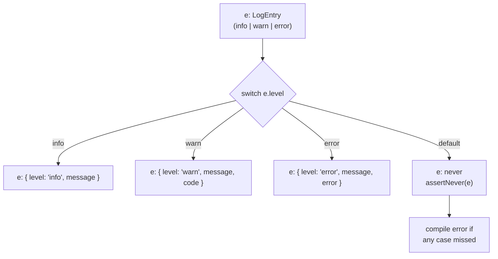
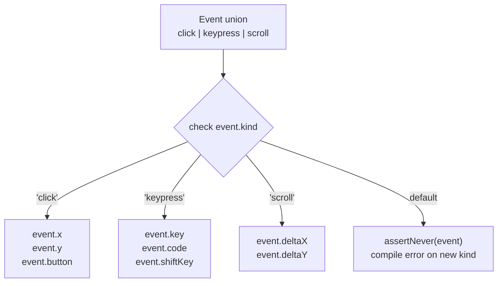
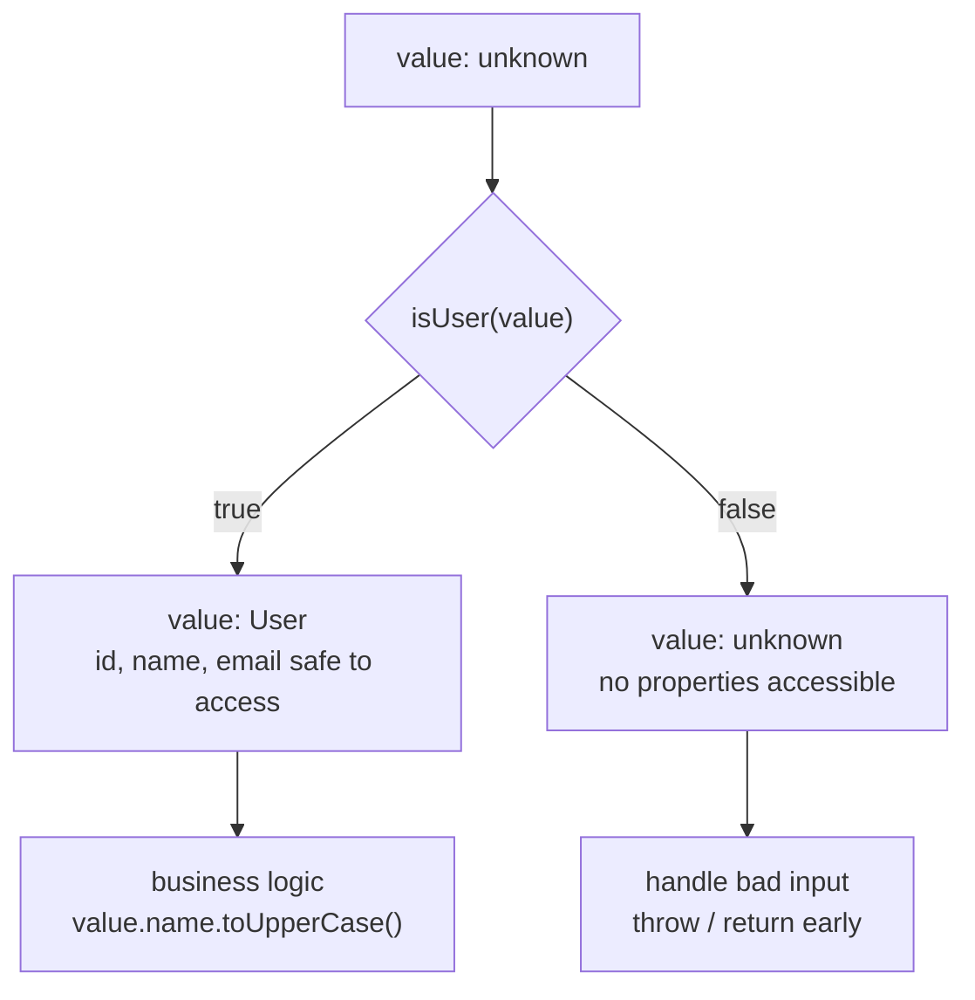
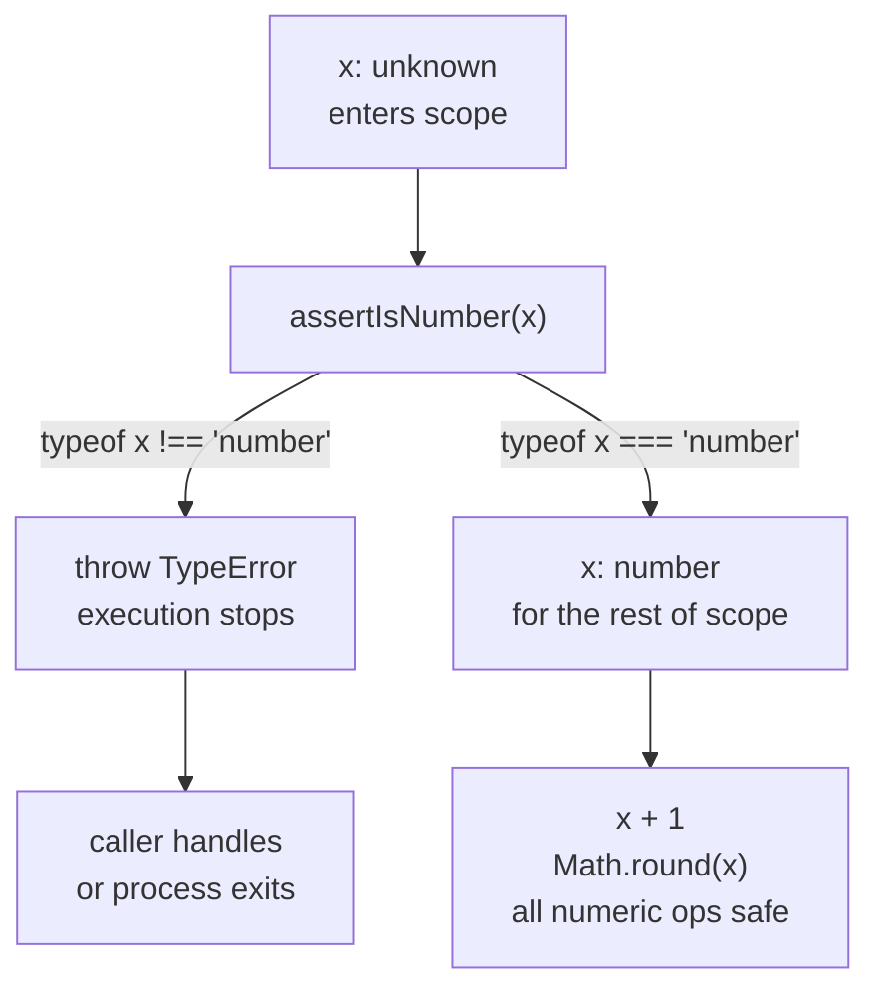
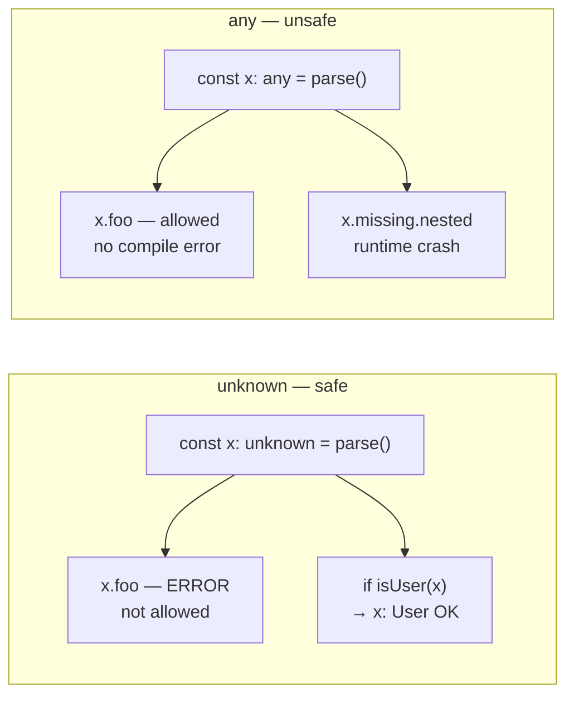
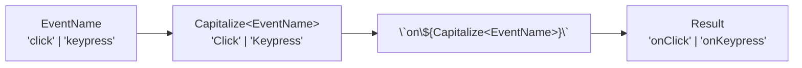
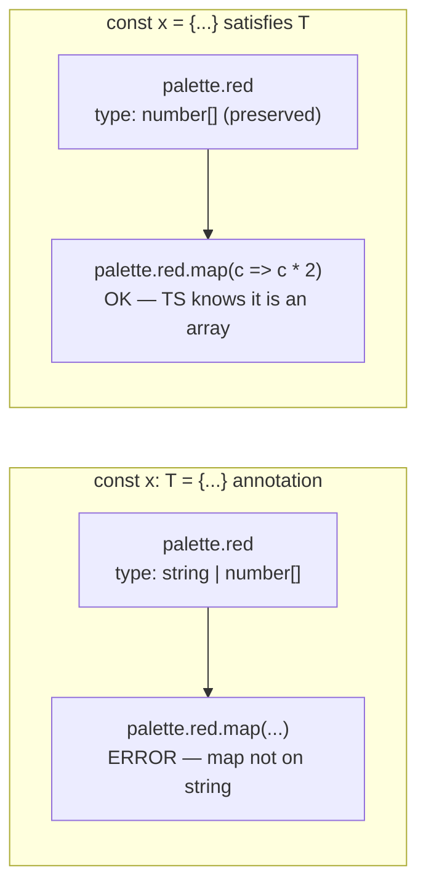
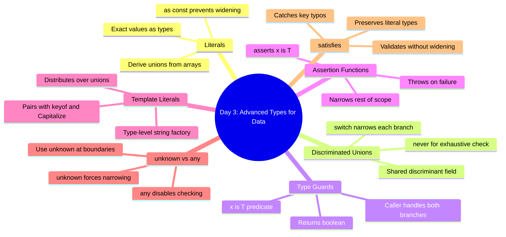

# Day 3 — Advanced Types for Data

## What you already know that applies here

- Day 1: union types and narrowing via `typeof`/`in`. Discriminated unions are the power-user version of this.
- Day 2: `keyof`, indexed access, mapped types. Template literal types pair with `keyof` to build typed event names.
- `noUncheckedIndexedAccess` still in effect — when you narrow `unknown`, undefined is still lurking.

---

## The Real World Is Heterogeneous

When you write a function that processes data from a file, a network request, or a
message queue, you rarely get one uniform shape back. A log stream might carry request
entries, database query records, cache hits, errors, and metric samples — all mixed
together. An API might return `{ status: "ok", data: User }` or
`{ status: "error", message: string }`. A user action can be a click, a keypress, or
a form submission.

TypeScript's basic types — `string`, `number`, `object` — are not enough here.
You need types that model the *variation itself*.

This day covers the tools TypeScript gives you for exactly that:

- **Literal types** — exact values as types
- **Discriminated unions** — modeling "one of several shapes"
- **Type guards** — narrowing `unknown` to specific types at runtime
- **Assertion functions** — crashing fast when types don't match
- **`unknown` vs `any`** — why the boundary matters
- **Template literal types** — pattern-matched string types
- **Conditional types (intro)** — computing types from other types
- **`in` operator narrowing** — checking property existence
- **The `satisfies` operator** — constraint without widening

---

## Literal Types

**The mental model**

A literal type is a type whose only inhabitant is one exact value — like a wax seal
that only fits one envelope. Where `string` accepts any sequence of characters,
`"pending"` accepts only the three-character word "pending". Think of literal types
as constants promoted to the type level: they appear in code where types appear, they
compose with unions, and the compiler checks them at every assignment.

### `as const` and Widening

**I do**

```ts
// Without as const, TypeScript widens the inferred type
const config = {
  method: "GET",   // inferred as string, not "GET"
  timeout: 5000,   // inferred as number, not 5000
};

// With as const, every value is frozen at its literal type
const configConst = {
  method: "GET",
  timeout: 5000,
} as const;
// configConst.method : "GET"
// configConst.timeout : 5000

// Derive a union type from an array of values — the canonical pattern
const ROLES = ["admin", "editor", "viewer"] as const;
type Role = typeof ROLES[number]; // "admin" | "editor" | "viewer"
// Adding a value to the array automatically expands the type.
```

**We do**

Fill in the blank so that `HttpMethod` is derived from `METHODS` without
repeating the values:

```ts
const METHODS = ["GET", "POST", "PUT", "DELETE", "PATCH"] as const;
type HttpMethod = _______________; // should be "GET" | "POST" | ...
```

<details><summary>Reveal</summary>

```ts
type HttpMethod = typeof METHODS[number];
```

`typeof METHODS` is `readonly ["GET", "POST", ...]`. Indexing that tuple type
with `number` yields the union of all element types.

</details>

**You do**

In a scratch file, create a `DIRECTIONS` array with `"north"`, `"south"`, `"east"`,
`"west"` using `as const`, derive a `Direction` type, then write a function that
accepts only `Direction` and returns the opposite direction.

### Numeric and Boolean Literals

```ts
type Dice = 1 | 2 | 3 | 4 | 5 | 6;
type Flag = true | false; // redundant with boolean, but shows the concept

function rollDice(): Dice {
  return (Math.floor(Math.random() * 6) + 1) as Dice;
}
```

Numeric literals are useful for discriminating enum-like values without the verbosity
of TypeScript's `enum` keyword.

---

## Discriminated (Tagged) Unions

**The mental model**

A discriminated union is a tagged envelope. Every shape in the union carries a label
(the discriminant), and you can only open the envelope after checking the label.
TypeScript enforces that you handle every possible label. Think of a post room that
sorts envelopes by a color-coded sticker — once you read the sticker, you know
exactly what paperwork is inside. The compiler plays the role of the post-room manager:
if you forget a color, it refuses to let the mail go out.

### Narrowing via the Discriminant

**I do**

```ts
type LogEntry =
  | { level: "info";  message: string }
  | { level: "warn";  message: string; code: number }
  | { level: "error"; message: string; error: Error };

function formatEntry(e: LogEntry): string {
  switch (e.level) {
    case "info":
      // e is narrowed to { level: "info"; message: string }
      return `[INFO] ${e.message}`;
    case "warn":
      // e.code is now available — compiler confirmed it exists here
      return `[WARN] ${e.message} (${e.code})`;
    case "error":
      // e.error is now available
      return `[ERROR] ${e.message}: ${e.error.message}`;
  }
}
```

### Exhaustive Switch with `never`

```ts
function assertNever(x: never): never {
  throw new Error(`Unhandled case: ${JSON.stringify(x)}`);
}

function formatEntry(e: LogEntry): string {
  switch (e.level) {
    case "info":  return `[INFO] ${e.message}`;
    case "warn":  return `[WARN] ${e.message} (${e.code})`;
    case "error": return `[ERROR] ${e.message}: ${e.error.message}`;
    default:      return assertNever(e); // compile error if a case is missing
  }
}
```

If you add a new `level` variant to `LogEntry` and forget to handle it in `switch`,
the compiler will flag the `default` branch: `e` would no longer be `never` there,
it would be the unhandled variant type.

### Mermaid: Exhaustive Narrowing



### Mermaid: Discriminated-Union Dispatch Tree



**We do**

Add a `"metric"` variant to `LogEntry` with `{ level: "metric"; name: string; value: number }`.
Then update `formatEntry` so the `default: assertNever(e)` line still compiles.

<details><summary>Reveal</summary>

```ts
type LogEntry =
  | { level: "info";   message: string }
  | { level: "warn";   message: string; code: number }
  | { level: "error";  message: string; error: Error }
  | { level: "metric"; name: string;   value: number }; // new

function formatEntry(e: LogEntry): string {
  switch (e.level) {
    case "info":   return `[INFO] ${e.message}`;
    case "warn":   return `[WARN] ${e.message} (${e.code})`;
    case "error":  return `[ERROR] ${e.message}: ${e.error.message}`;
    case "metric": return `[METRIC] ${e.name}=${e.value}`; // new case
    default:       return assertNever(e);
  }
}
```

Without the new `case "metric"`, the `default` branch gets a compile error because
`e` is no longer assignable to `never` — it still has the unhandled `"metric"` branch.

</details>

**You do**

Model a UI event system with a discriminated union covering `click`, `keypress`, and
`scroll`. Write a function `describeEvent` that returns a human-readable summary and
use `assertNever` to make it exhaustive.

### Worked Example: Reducer Action Union

Redux-style reducers are the canonical use case for discriminated unions:

```ts
type Action =
  | { type: "INCREMENT"; amount: number }
  | { type: "DECREMENT"; amount: number }
  | { type: "RESET" };

type State = { count: number };

function reducer(state: State, action: Action): State {
  switch (action.type) {
    case "INCREMENT":
      return { count: state.count + action.amount };
    case "DECREMENT":
      return { count: state.count - action.amount };
    case "RESET":
      return { count: 0 };
    default:
      return assertNever(action);
  }
}
```

---

## Type Guards

**The mental model**

A type guard is a passport control checkpoint. You hand the guard an unknown traveller
(`unknown` value), the guard runs their checks, and if they stamp it "approved" the
rest of the code knows exactly what country the traveller is from. The `x is T`
return annotation is the stamp: the compiler reads it and propagates the narrowed type
into every branch that follows. Unlike a bare `typeof` check, a guard function can
bundle arbitrarily complex checks behind a single readable name.

### Mermaid: Type-Guard Narrowing Flow



**I do**

```ts
type User = { id: number; name: string; email: string };

function isUser(x: unknown): x is User {
  // Step 1: rule out non-objects and null
  if (typeof x !== "object" || x === null) return false;
  // Step 2: cast to an indexable shape so we can inspect fields
  const obj = x as Record<string, unknown>;
  // Step 3: verify every field the type promises
  return (
    typeof obj["id"] === "number" &&
    typeof obj["name"] === "string" &&
    typeof obj["email"] === "string"
  );
}

// Usage
const raw: unknown = JSON.parse(responseText);
if (isUser(raw)) {
  console.log(raw.name.toUpperCase()); // safe — raw is User here
} else {
  console.error("Unexpected shape", raw); // raw is still unknown here
}
```

### Filtering with Type Guards

Type guards work with `Array.prototype.filter`, but you need a cast:

```ts
const raw: unknown[] = [/* mixed data */];

// Without the predicate, filter returns unknown[]
const users = raw.filter(isUser); // now User[]
```

TypeScript 5.5+ infers the narrowed type automatically from predicate functions used
in `filter`. In earlier versions you may need an explicit overload.

### Writing Thorough Guards

A guard that only checks `typeof x === "object"` is not good enough. You must check
every property your code depends on:

```ts
// Too shallow — will accept any object
function isUserBad(x: unknown): x is User {
  return typeof x === "object" && x !== null;
}

// Correct — checks structure and field types
function isUser(x: unknown): x is User {
  if (typeof x !== "object" || x === null) return false;
  const obj = x as Record<string, unknown>;
  return (
    typeof obj["id"] === "number" &&
    typeof obj["name"] === "string" &&
    typeof obj["email"] === "string"
  );
}
```

The rule: **a guard must verify everything the narrowed type promises**.

**We do**

Write a type guard `isProduct` for `type Product = { sku: string; price: number; inStock: boolean }`.
What is the minimum number of checks required?

<details><summary>Reveal</summary>

```ts
type Product = { sku: string; price: number; inStock: boolean };

function isProduct(x: unknown): x is Product {
  if (typeof x !== "object" || x === null) return false;
  const obj = x as Record<string, unknown>;
  return (
    typeof obj["sku"] === "number" &&    // check 1
    typeof obj["price"] === "number" &&  // check 2
    typeof obj["inStock"] === "boolean"  // check 3
  );
}
```

Wait — `sku` should be `string`, not `number`. The minimum is one check per field
(3 checks), plus the null/object guard at the top. Miss any field and the guard lies.

</details>

**You do**

Write a `isPaginatedResponse` type guard for a generic wrapper
`type PaginatedResponse<T> = { items: T[]; total: number; page: number }`.
How would you handle the fact that you cannot check `T` at runtime?

---

## Assertion Functions

**The mental model**

An assertion function is a bouncer at the door. Instead of returning `true` or `false`,
it either waves you through silently or throws you out. Once you pass the bouncer,
everyone behind the rope knows who you are — no branching needed. The `asserts x is T`
signature is the bouncer's nod: the compiler treats everything after the call as if
`x` has already been narrowed to `T`, for the rest of the current scope.

### Mermaid: Assertion-Function Control Flow



**I do**

```ts
// Form 1: asserts x is T — narrows the type of x after the call
function assertIsNumber(x: unknown): asserts x is number {
  if (typeof x !== "number") {
    throw new TypeError(`Expected number, got ${typeof x}`);
  }
}

// Form 2: asserts condition — narrows based on a boolean expression
function assert(cond: boolean, msg: string): asserts cond {
  if (!cond) throw new Error(msg);
}

// Usage — no if/else needed
const raw: unknown = getConfigValue("port");
assertIsNumber(raw);
console.log(raw + 1); // raw is number here — no branch required

// Generic form
const value: unknown = parseInput();
assert(typeof value === "string", "value must be a string");
console.log(value.toUpperCase()); // value is string here
```

### Two Forms

```ts
// Form 1: asserts x is T  — narrows the type of x
function assertIsString(x: unknown): asserts x is string {
  if (typeof x !== "string") throw new TypeError("Not a string");
}

// Form 2: asserts condition  — narrows based on a boolean
function assert(cond: boolean, msg: string): asserts cond {
  if (!cond) throw new Error(msg);
}
assert(typeof value === "string", "value must be a string");
// value is string after this line
```

### When to Use Guards vs Assertions

| | Type Guard | Assertion Function |
|---|---|---|
| Return type | `boolean` | `void` (throws) |
| Use case | filter, conditional flow | pre-condition, invariant |
| After call | branches narrow separately | everything after is narrow |
| Error handling | caller decides | function throws |

Use a guard when the caller needs to handle both the `true` and `false` case.
Use an assertion when a failed check is always a bug and you want to crash fast.

### Extracting a Nested Value

```ts
function assertHasKey<K extends string>(
  obj: unknown,
  key: K
): asserts obj is Record<K, unknown> {
  if (typeof obj !== "object" || obj === null || !(key in obj)) {
    throw new TypeError(`Expected object with key "${key}"`);
  }
}

const raw: unknown = JSON.parse('{"user": {"id": 42}}');
assertHasKey(raw, "user");             // raw is Record<"user", unknown>
assertHasKey(raw["user"], "id");       // raw["user"] is Record<"id", unknown>
const id = raw["user"]["id"];          // unknown — still need one more check
assertIsNumber(id);                    // id is number
console.log(id + 1);                   // 43
```

**We do**

Given `assertIsString` and `assertIsNumber`, write `assertIsUser` that asserts
`x is User` using the two simpler assertions. What is the control flow if `x.name` is
a number instead of a string?

<details><summary>Reveal</summary>

```ts
function assertIsUser(x: unknown): asserts x is User {
  if (typeof x !== "object" || x === null) {
    throw new TypeError("Expected object");
  }
  const obj = x as Record<string, unknown>;
  assertIsNumber(obj["id"]);    // throws if not number
  assertIsString(obj["name"]);  // throws if not string — catches the bad name
  assertIsString(obj["email"]); // throws if not string
}
```

If `x.name` is a number, `assertIsString(obj["name"])` throws `TypeError: Not a string`
before the rest of the function runs. The caller gets the error; `x` is never treated
as `User`.

</details>

**You do**

Write `assertNonEmpty<T>(arr: T[], label: string): asserts arr is [T, ...T[]]` — an
assertion that throws if the array is empty and narrows to a non-empty tuple type
after the call.

---

## `unknown` vs `any`

**The mental model**

`any` is a skeleton key that opens every lock — convenient but dangerous, because it
bypasses all the locks that protect your code. `unknown` is a locked box: you can put
anything in, but you cannot take anything out until you prove what's inside. Treat
`unknown` as the honest version of "I don't know the type yet" and `any` as the
emergency escape hatch you seal behind glass labeled "break only if no alternative."

### Mermaid: `unknown` vs `any` Comparison



**I do**

```ts
// any — the hole in the type system
const bad: any = JSON.parse('{"name": "Alice"}');
console.log(bad.nme.toUpperCase()); // compiles fine, crashes at runtime

// unknown — forces narrowing before use
const safe: unknown = JSON.parse('{"name": "Alice"}');
// console.log(safe.nme); // compile error: Object is of type 'unknown'

if (typeof safe === "object" && safe !== null && "name" in safe) {
  const obj = safe as Record<string, unknown>;
  if (typeof obj["name"] === "string") {
    console.log(obj["name"].toUpperCase()); // provably safe
  }
}
```

### The Parse-Then-Narrow Flow

```
JSON.parse()        → unknown   (always use this return type)
type guard / assert → T         (narrow to your domain type)
business logic      → uses T    (fully typed, safe)
```

```ts
function parseTransaction(raw: unknown): Transaction {
  if (!isTransaction(raw)) {
    throw new TypeError("Invalid transaction");
  }
  return raw; // Transaction here
}
```

**Rule of thumb**: use `unknown` at all external boundaries (JSON, API responses,
`catch` blocks, user input). Use `any` only when you are wrapping a third-party
library that has no types and there is no other option — and even then, contain it
behind a typed wrapper.

**We do**

Rewrite this function replacing `any` with `unknown` and adding a guard:

```ts
function extractId(data: any): number {
  return data.id;
}
```

<details><summary>Reveal</summary>

```ts
function extractId(data: unknown): number {
  if (
    typeof data === "object" &&
    data !== null &&
    "id" in data &&
    typeof (data as Record<string, unknown>)["id"] === "number"
  ) {
    return (data as Record<string, unknown>)["id"] as number;
  }
  throw new TypeError("data.id is not a number");
}
```

The original `any` version silently returned `undefined` when `data.id` was missing.
The `unknown` version fails loudly at the boundary, not three stack frames later.

</details>

**You do**

Wrap `JSON.parse` in a function called `safeParse` that returns `unknown` and
accepts a fallback value. If parsing throws, return the fallback. Write it so that
callers are always forced to narrow before using the result.

---

## Template Literal Types

**The mental model**

Template literal types are a string factory at the type level. Just as a JavaScript
template literal builds a string at runtime by interpolating variables, a TypeScript
template literal type builds a union of strings at compile time by interpolating
other types. Feed it a union and it distributes: `\`on${A | B}\`` expands to
`\`onA\` | \`onB\``. The compiler tracks every possible combination.

### Mermaid: Template-Literal Type Construction



**I do**

```ts
// Basic interpolation
type Greeting = `Hello, ${string}`;
const g1: Greeting = "Hello, Alice";   // OK
const g2: Greeting = "Hi, Bob";        // Error

// Deriving event handler names from event names
type EventName = "click" | "focus" | "blur";
type HandlerName = `on${Capitalize<EventName>}`;
// "onClick" | "onFocus" | "onBlur"

// Union distribution — every combination is generated
type Axis = "x" | "y";
type Side = "start" | "end";
type AxisSide = `${Axis}-${Side}`;
// "x-start" | "x-end" | "y-start" | "y-end"

// Constraining string shapes
type Path = `/${string}`;
function createUrl(base: string, path: Path): string {
  return base + path;
}
createUrl("https://api.example.com", "/users");   // OK
createUrl("https://api.example.com", "users");    // Error: missing leading slash
```

### Intrinsic String Manipulation Types

TypeScript ships four intrinsic utility types for string manipulation:

| Type | Effect |
|---|---|
| `Uppercase<S>` | `"hello"` → `"HELLO"` |
| `Lowercase<S>` | `"HELLO"` → `"hello"` |
| `Capitalize<S>` | `"hello"` → `"Hello"` |
| `Uncapitalize<S>` | `"Hello"` → `"hello"` |

These are computed at the type level, not at runtime.

### Worked Example: Typed Redux Action Creators

```ts
type ActionType = "increment" | "decrement" | "reset";
type ActionCreatorName = `create${Capitalize<ActionType>}`;
// "createIncrement" | "createDecrement" | "createReset"

type ActionCreators = {
  [K in ActionCreatorName]: () => { type: string };
};
```

This is where template literal types meet mapped types — a powerful combination
you will explore further on Day 4.

**We do**

Given `type HttpMethod = "get" | "post" | "put" | "delete"`, derive a type for
function names like `"getUser"`, `"postUser"` etc., combined with
`type Resource = "User" | "Post" | "Comment"`.

<details><summary>Reveal</summary>

```ts
type HttpMethod = "get" | "post" | "put" | "delete";
type Resource   = "User" | "Post" | "Comment";
type MethodName = `${HttpMethod}${Resource}`;
// "getUser" | "getPost" | "getComment"
// | "postUser" | "postPost" | "postComment"
// | "putUser" | ... | "deleteComment"
// TypeScript computes all 12 combinations automatically.
```

</details>

**You do**

Create a `CSSProperty` type that covers `margin-top`, `margin-bottom`,
`padding-top`, `padding-bottom` using template literal types and two union
sub-types. Then write a function that accepts only `CSSProperty` values.

---

## Conditional Types — A Taste

Conditional types let you compute a type from another type, using the same `?:` syntax
as JavaScript ternaries:

```ts
type IsString<T> = T extends string ? true : false;

type A = IsString<"hello">; // true
type B = IsString<42>;      // false
```

### Simple Example: NonEmpty

```ts
type NonEmpty<T extends unknown[]> = T extends [] ? never : T;

type A = NonEmpty<[1, 2, 3]>; // [1, 2, 3]
type B = NonEmpty<[]>;         // never
```

This is useful when you want to express "this function only works on arrays that
have at least one element."

### `infer` — Extracting Inner Types

The `infer` keyword lets you declare a type variable *inside* the `extends` clause
and capture it:

```ts
type ReturnType<T> = T extends (...args: never[]) => infer R ? R : never;

type F = (x: number) => string;
type R = ReturnType<F>; // string
```

This is how TypeScript's built-in `ReturnType<T>` utility is implemented. Day 4 and 5
will go deeper into conditional types. For now, understand that they are types that
branch based on a `T extends U` condition.

---

## `in` Operator Narrowing

The `in` operator checks whether a property exists on an object. TypeScript uses it
as a type narrowing cue:

```ts
type Circle = { kind: "circle"; radius: number };
type Square = { kind: "square"; side: number };
type Shape = Circle | Square;

function area(shape: Shape): number {
  if ("radius" in shape) {
    return Math.PI * shape.radius ** 2; // shape is Circle here
  }
  return shape.side ** 2; // shape is Square here
}
```

The `in` check is most useful for shape-only unions (ones without a dedicated
discriminant field). For unions with a discriminant, prefer the `switch` pattern —
it is more explicit.

You can also use `in` inside type guards to check for properties on `unknown`:

```ts
function hasId(x: unknown): x is { id: unknown } {
  return typeof x === "object" && x !== null && "id" in x;
}
```

---

## The `satisfies` Operator

**The mental model**

`satisfies` is a proofreader, not an editor. A type annotation rewrites what the
compiler thinks the type is — widening, flattening details. `satisfies` says "check
that this value fits the constraint, but let me keep all the specific type information
I already have." Think of the difference between submitting a form (the form dictates
the fields, losing your nuance) versus having a reviewer approve your document
(they confirm it meets the rules, but your original text is preserved).

### Mermaid: `satisfies` vs Annotation



**I do**

```ts
type ColorMap = Record<string, string | [number, number, number]>;

// Using annotation — widened to ColorMap, loses specific type info
const palette: ColorMap = {
  red: [255, 0, 0],
  green: "#00ff00",
};
// palette.red is: string | [number, number, number]
// palette.red.map(...)  → compile error, map not on string

// Using satisfies — keeps the specific inferred types
const palette2 = {
  red: [255, 0, 0],
  green: "#00ff00",
} satisfies ColorMap;

palette2.red.map((c) => c * 2); // OK — TypeScript knows red is number[]
palette2.green.toUpperCase();   // OK — TypeScript knows green is string
```

`satisfies` is ideal when you want the compiler to verify a value against a constraint
but still preserve the precise inferred type for downstream use.

**We do**

Would `satisfies` catch a typo in a key? Given `type Routes = Record<"/home" | "/about" | "/contact", string>`,
does `{ "/home": "...", "/abotu": "..." } satisfies Routes` compile?

<details><summary>Reveal</summary>

Yes, `satisfies` catches the typo. The object `{ "/home": ..., "/abotu": ... }` does
not satisfy `Routes` because `"/abotu"` is not a key in `"/home" | "/about" | "/contact"`.
TypeScript reports: *Object literal may only specify known properties, and '"/abotu"'
does not exist in type 'Routes'*. The annotation form would catch this too, but
`satisfies` catches it while still preserving the individual string literal types of
each value.

</details>

**You do**

Build a `CONFIG` object with `satisfies` for a type that requires `port: number`,
`host: string`, and `debug: boolean`. Then verify that downstream code can still
infer the literal type of `CONFIG.debug` (i.e., `true`, not just `boolean`).

---

## Gotchas

### 1. Forgetting the `never` Exhaustiveness Check

If you write a `switch` without a `default: return assertNever(e)`, TypeScript will
not warn you when you add a new variant. The function will silently return `undefined`
at runtime for the unhandled case.

**Fix**: always end discriminated union switches with `default: return assertNever(e)`.

### 2. Shape-Only Unions Without a Discriminant

```ts
type Result =
  | { data: User }
  | { error: string };
```

Both branches are objects. There is no single field that distinguishes them. You
have to use `in` checks:

```ts
if ("data" in result) { /* ... */ }
else { /* ... */ }
```

This works but is more error-prone. If possible, add a discriminant:

```ts
type Result =
  | { status: "ok";    data: User }
  | { status: "error"; error: string };
```

### 3. Using `any` as "I'll Figure It Out Later"

`any` is contagious. Once a value is `any`, every derivative of it is also `any`.
That silently disables checking across the codebase. Use `unknown` instead — it
forces you to narrow before you use, keeping the bug surface at the boundary.

### 4. Shallow Guards

A guard that returns `x is User` but only checks `typeof x === "object"` is
dishonest. If an object comes in with missing or wrong-typed fields, the guard says
"yep, it's a User" and your code later throws trying to call `.toUpperCase()` on
`undefined`. Always check every field the type declares.

### 5. `as const` Doesn't Deep-Freeze at Runtime

`as const` is a type-level construct. At runtime, the object is still mutable. If
you need runtime immutability too, use `Object.freeze`.

---

## Mental-model summary



---

## Check your understanding

**Q1: You add a new variant `| { level: "debug"; message: string }` to `LogEntry`.
Where does the compiler first tell you something is wrong?**

<details><summary>Reveal</summary>

In the `default` branch of every `switch (e.level)` that ends with `assertNever(e)`.
Because `e` is no longer `never` — it can now be `{ level: "debug"; message: string }`
— TypeScript reports that `e` is not assignable to `never`. That pinpoints every
handler that needs updating.

</details>

**Q2: What is the difference between `x is T` and `asserts x is T`, and which
would you choose to implement `Array.filter` narrowing?**

<details><summary>Reveal</summary>

`x is T` returns `boolean` — the caller branches on it, and the two branches get
different types. `asserts x is T` returns `void` (or throws) — after the call,
everything in scope is narrowed, no branching.

For `Array.filter` you need `x is T` because `filter` expects a boolean-returning
predicate and uses the return value to decide which elements stay. `asserts x is T`
would not work in a `filter` callback because the throw semantics are wrong.

</details>

**Q3: Why is `const data: any = JSON.parse(text)` considered a code smell, and
what is the correct replacement?**

<details><summary>Reveal</summary>

`any` propagates: every expression derived from `data` is also `any`, silently
disabling type-checking for all downstream code. The correct replacement is
`const data: unknown = JSON.parse(text)`. Then use a type guard or assertion to
narrow `data` before accessing any property. This confines the unsafe boundary to
one line and keeps the rest of the code fully checked.

</details>

**Q4: Given `type EventName = "click" | "keypress"`, what is the result of
`type H = \`on${Capitalize<EventName>}\``?**

<details><summary>Reveal</summary>

`"onClick" | "onKeypress"`. Template literal types distribute over unions:
TypeScript applies the template to each member of the union independently and
collects the results. `Capitalize<"click">` is `"Click"`, so `\`on${"Click"}\``
is `"onClick"`. Same for `"keypress"` → `"Keypress"` → `"onKeypress"`.

</details>

**Q5: When should you use `satisfies` instead of a type annotation?**

<details><summary>Reveal</summary>

Use `satisfies` when you need both (a) compile-time validation that the value fits
a constraint and (b) the precise inferred literal types of each field preserved for
downstream code. The classic case is a configuration or palette object where some
values are arrays and others are strings — a type annotation widens all of them to
`string | number[]`, losing the distinction. `satisfies` keeps each field at its
specific inferred type while still checking the overall shape.

</details>

---

## Mini Q&A

**Q1: When should I use a discriminated union vs a class hierarchy?**

Prefer discriminated unions when data is plain objects (from JSON, databases, APIs)
and logic is spread across many functions. Prefer classes when you have encapsulated
state, methods that change state, or you need inheritance. In most TypeScript data
pipelines, discriminated unions are simpler and safer.

**Q2: What's the difference between `x is T` and `asserts x is T`?**

`x is T` is a *predicate* — the function returns `boolean` and the narrowing only
applies inside the `if` branch. `asserts x is T` is an *assertion* — the function
returns `void` (or throws), and the narrowing applies to all code after the call
in the current scope. Use predicates when the caller needs both branches. Use
assertions when failure is always a bug.

**Q3: Can I use conditional types to filter a union?**

Yes. `type OnlyStrings<T> = T extends string ? T : never`. When `T` is a union,
TypeScript distributes the conditional across each member and collects the results.
This is called *distributive conditional types* and is covered in depth on Day 4.

**Q4: Why does `JSON.parse` return `any` in TypeScript?**

Historically, `any` was the only option for "I don't know this type yet." Modern
TypeScript best practice is to immediately assign the result to `unknown`:
`const data: unknown = JSON.parse(text)`. This forces you to narrow before using.
Some projects use a lint rule (`@typescript-eslint/no-unsafe-assignment`) to
enforce this.

**Q5: When would I reach for `satisfies` instead of a type annotation?**

Use `satisfies` when you want to validate structure but also need the compiler to
remember the specific shape of each property. The classic case is a configuration
object where some values are strings and others are arrays — annotating loses the
distinction, but `satisfies` keeps it while still checking the overall constraint.
