# Day 4 — Nested Data Transformations

> **Goal**: Given a deeply nested API or database response, reshape it into flat tables, grouped aggregates, pivoted views, and joined datasets — all with pure, immutable, typed TypeScript.

---

## What you already know that applies here

- Day 1: basic types, `readonly` — pure transforms never mutate their input.
- Day 2: generics, `keyof`, `Record<K, V>` — the typed signatures for groupBy, pivot, join.
- Day 3: discriminated unions — helpful for describing heterogeneous tree nodes.
- This is the centerpiece day. Everything you've learned becomes a tool for reshaping data.

---

## Table of Contents

1. [The Problem](#1-the-problem)
2. [Recursive Types](#2-recursive-types)
3. [Flatten Nested Objects](#3-flatten-nested-objects)
4. [Unflatten](#4-unflatten)
5. [groupBy / countBy / indexBy](#5-groupby--countby--indexby)
6. [Pivot — Rows to Columns](#6-pivot--rows-to-columns)
7. [Joins — Left and Inner](#7-joins--left-and-inner)
8. [Walking Trees](#8-walking-trees)
9. [Denormalizing Nested Arrays](#9-denormalizing-nested-arrays)
10. [Immutability Patterns](#10-immutability-patterns)
11. [Map vs Record](#11-map-vs-record)
12. [Complexity Notes](#12-complexity-notes)
13. [Composing Pipelines](#13-composing-pipelines)
14. [Mini Q&A](#14-mini-qa)

---

## 1. The Problem

You ask your API for customer data. You get back this:

```json
{
  "customers": [
    {
      "id": "C001",
      "name": "Ava Martin",
      "tier": "gold",
      "orders": [
        {
          "orderId": "O100",
          "placedAt": "2024-01-15T09:30:00Z",
          "status": "shipped",
          "items": [
            { "sku": "WIDGET-A", "name": "Widget Alpha", "qty": 2, "unitPrice": 29.99 },
            { "sku": "GADGET-B", "name": "Gadget Beta",  "qty": 1, "unitPrice": 49.99 }
          ]
        },
        {
          "orderId": "O101",
          "placedAt": "2024-02-03T14:00:00Z",
          "status": "delivered",
          "items": [
            { "sku": "WIDGET-A", "name": "Widget Alpha", "qty": 3, "unitPrice": 29.99 }
          ]
        }
      ]
    }
  ]
}
```

The shape is three levels deep: **customer → order → line item**. What you actually need are three very different things:

### Target Shape 1 — Flat CSV (one row per line item)

| customerId | customerName | orderId | placedAt | sku | itemName | qty | unitPrice | lineTotal |
|---|---|---|---|---|---|---|---|---|
| C001 | Ava Martin | O100 | 2024-01-15 | WIDGET-A | Widget Alpha | 2 | 29.99 | 59.98 |
| C001 | Ava Martin | O100 | 2024-01-15 | GADGET-B | Gadget Beta | 1 | 49.99 | 49.99 |
| C001 | Ava Martin | O101 | 2024-02-03 | WIDGET-A | Widget Alpha | 3 | 29.99 | 89.97 |

This is the **denormalization** operation. Every ancestor's fields are copied down to each leaf row.

### Target Shape 2 — Per-customer aggregate

| customerId | name | orderCount | itemCount | totalSpend |
|---|---|---|---|---|
| C001 | Ava Martin | 2 | 3 | 199.94 |

This is **groupBy + reduce** over the flat rows.

### Target Shape 3 — Monthly pivot by category

| month | electronics | accessories | clothing |
|---|---|---|---|
| 2024-01 | 1249.00 | 89.99 | 0.00 |
| 2024-02 | 340.00 | 0.00 | 129.95 |

This is **pivot** — rows become column headers, values are aggregated.

All three shapes come from one nested source. The goal of Day 4 is mastering the transformations that connect them.

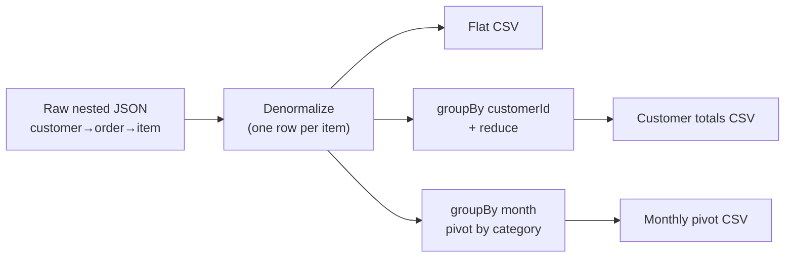

### Visualising the three target shapes

The diagram below anchors the whole day: one source, three radically different consumers.

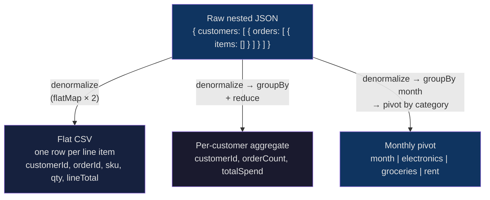

---

## 2. Recursive Types

**The mental model**

A recursive type is a type that mentions itself in its own definition — exactly like a Russian nesting doll. Each doll contains either a smaller doll of the same kind, or nothing (the base case). In TypeScript, this works as long as the self-reference sits inside a container (`[]` or `{}`) rather than directly, because the container breaks the infinite expansion.

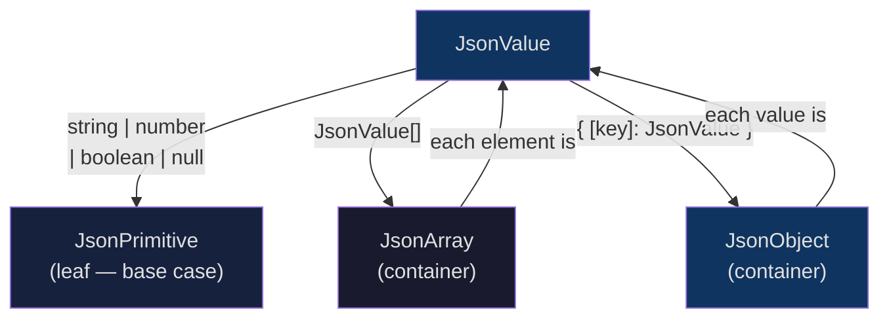

**Exercise**: `exercises/01_recursive_tree_types.ts`

### I do — JSON as a type

JSON has no single TypeScript type in the standard library. Define it yourself:

```typescript
type JsonPrimitive = string | number | boolean | null;
type JsonArray    = JsonValue[];
type JsonObject   = { [key: string]: JsonValue };
type JsonValue    = JsonPrimitive | JsonArray | JsonObject;
```

This is recursive: `JsonValue` references `JsonArray` which references `JsonValue`. TypeScript handles this because the recursion only occurs inside a container (array or object), not as a direct self-reference that would be infinite.

You can use this anywhere you need to accept arbitrary JSON:

```typescript
function prettyPrint(val: JsonValue, indent = 0): string {
  if (val === null)          return "null";
  if (typeof val === "string")  return `"${val}"`;
  if (typeof val !== "object")  return String(val);
  if (Array.isArray(val)) {
    const items = val.map(v => prettyPrint(v, indent + 2)).join(", ");
    return `[${items}]`;
  }
  const pairs = Object.entries(val)
    .map(([k, v]) => `${" ".repeat(indent + 2)}${k}: ${prettyPrint(v, indent + 2)}`);
  return `{\n${pairs.join(",\n")}\n${" ".repeat(indent)}}`;
}
```

### Recursive domain types — file system tree

```typescript
type FSNode = {
  name: string;
  type: "file" | "directory";
  size?: number;          // files only
  children?: FSNode[];    // directories only
};
```

Count total nodes:

```typescript
function countNodes(node: FSNode): number {
  if (!node.children || node.children.length === 0) return 1;
  return 1 + node.children.reduce((sum, child) => sum + countNodes(child), 0);
}
```

Depth of the tree:

```typescript
function depth(node: FSNode): number {
  if (!node.children || node.children.length === 0) return 1;
  return 1 + Math.max(...node.children.map(depth));
}
```

Notice the pattern: check for the base case (leaf node) first, then recurse over children. Every tree algorithm follows this two-part structure.

### We do — sum of all file sizes

Partially complete. What should the base case return for a directory with no children?

```typescript
function totalSize(node: FSNode): number {
  if (node.type === "file") return node.size ?? 0;
  // What do you return when node.children is empty or undefined?
  return (node.children ?? []).reduce((sum, child) => sum + totalSize(child), /* ??? */);
}
```

<details>
<summary>Answer</summary>

```typescript
function totalSize(node: FSNode): number {
  if (node.type === "file") return node.size ?? 0;
  return (node.children ?? []).reduce((sum, child) => sum + totalSize(child), 0);
}
```

The accumulator starts at `0`. An empty children array produces `0`, which is correct — a directory with no files has size zero.
</details>

### You do

Write a `paths` function that returns all root-to-leaf paths as strings (e.g. `"src/utils/helpers.ts"`). Use the same base-case / recurse pattern. Hint: thread a `prefix` parameter down the recursion.

### Why `noUncheckedIndexedAccess` matters here

With `noUncheckedIndexedAccess: true`, array indexing returns `T | undefined`. This forces you to guard against empty arrays:

```typescript
// Bad — TypeScript will error: children[0] is FSNode | undefined
const first = node.children[0].name;

// Good
const first = node.children[0]?.name ?? "(empty)";
```

---

## 3. Flatten Nested Objects

**The mental model**

Flattening an object is like reading every leaf of a tree and writing down the path you took to get there. `{ a: { b: { c: 1 } } }` becomes `{ "a.b.c": 1 }` — the nested path collapsed into a single string key separated by dots. Unflattening reverses the walk: split on the separator, create intermediate objects, set the leaf.

**Exercise**: `exercises/02_flatten_nested_objects.ts`

### The goal

Turn:
```json
{ "address": { "city": "London", "zip": { "code": "EC1A" } }, "name": "Ava" }
```

Into:
```json
{ "address.city": "London", "address.zip.code": "EC1A", "name": "Ava" }
```

This is called **dot-path flattening**. It is invaluable for CSV export, diff tools, and search indexing.

### Implementation

```typescript
function flatten(
  obj: Record<string, unknown>,
  sep = ".",
  prefix = ""
): Record<string, unknown> {
  const result: Record<string, unknown> = {};
  for (const [key, value] of Object.entries(obj)) {
    const fullKey = prefix ? `${prefix}${sep}${key}` : key;
    if (
      value !== null &&
      typeof value === "object" &&
      !Array.isArray(value)
    ) {
      // Recurse into plain objects only
      const nested = flatten(value as Record<string, unknown>, sep, fullKey);
      Object.assign(result, nested);
    } else {
      result[fullKey] = value;
    }
  }
  return result;
}
```

**Arrays**: This implementation leaves arrays in-place (does not recurse into them). This is the right default for most ETL tasks — arrays usually represent collections, not structured sub-objects. If you need `items[0].sku` style keys, change the array branch to iterate `value.forEach((v, i) => ...)`.

### Template literal types for the key shape

You can express the flattened key type using TypeScript's template literal types. This is more a demonstration of the type system's power than a daily tool:

```typescript
type Flatten<T, Sep extends string = "."> = {
  [K in keyof T & string]:
    T[K] extends Record<string, unknown>
      ? { [SK in keyof Flatten<T[K], Sep> & string as `${K}${Sep}${SK}`]: Flatten<T[K], Sep>[SK] }
      : { [_ in K]: T[K] };
}[keyof T & string];
```

This distributes over every key, recursing into nested objects and prepending parent keys. At depth > 2 it becomes unwieldy. In practice you use `Record<string, unknown>` for runtime flattening and the type above only to impress your colleagues.

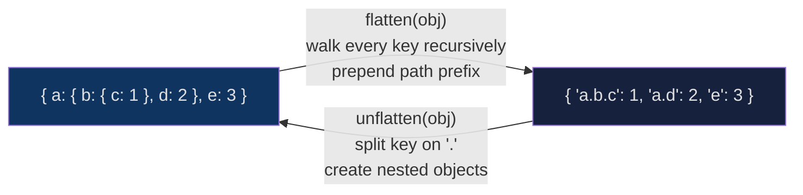

Round-trip guarantee: `unflatten(flatten(obj))` deep-equals `obj` as long as no keys contain the separator and no arrays are present at intermediate nodes.

### We do — flatten with custom separator

The implementation below uses `"."` hardcoded. Extend it to accept a `sep` parameter, defaulting to `"."`.

```typescript
function flatten(
  obj: Record<string, unknown>,
  prefix = ""
): Record<string, unknown> {
  const result: Record<string, unknown> = {};
  for (const [key, value] of Object.entries(obj)) {
    const fullKey = prefix ? `${prefix}.${key}` : key;
    if (value !== null && typeof value === "object" && !Array.isArray(value)) {
      Object.assign(result, flatten(value as Record<string, unknown>, fullKey));
    } else {
      result[fullKey] = value;
    }
  }
  return result;
}
```

<details>
<summary>Answer — add sep parameter</summary>

```typescript
function flatten(
  obj: Record<string, unknown>,
  sep = ".",
  prefix = ""
): Record<string, unknown> {
  const result: Record<string, unknown> = {};
  for (const [key, value] of Object.entries(obj)) {
    const fullKey = prefix ? `${prefix}${sep}${key}` : key;
    if (value !== null && typeof value === "object" && !Array.isArray(value)) {
      Object.assign(result, flatten(value as Record<string, unknown>, sep, fullKey));
    } else {
      result[fullKey] = value;
    }
  }
  return result;
}
```
</details>

### You do

Write a `flattenWithArrays` variant that also recurses into arrays, producing keys like `"items.0.sku"`. What edge case arises when the array is empty?

---

## 4. Unflatten

**The mental model**

Unflattening is like following directions: given `"address.city.postcode"`, you walk into `address`, then `city`, create each room if it doesn't exist yet, and place the value in `postcode`. A cursor pointer tracks where you are as you descend.

The inverse operation. Split each dot-path key, create nested objects as needed, and set the value at the leaf.

```typescript
function unflatten(
  flat: Record<string, unknown>,
  sep = "."
): Record<string, unknown> {
  const result: Record<string, unknown> = {};
  for (const [key, value] of Object.entries(flat)) {
    const parts = key.split(sep);
    let cursor: Record<string, unknown> = result;
    for (let i = 0; i < parts.length - 1; i++) {
      const part = parts[i];
      if (part === undefined) continue;
      if (!(part in cursor) || typeof cursor[part] !== "object" || cursor[part] === null) {
        cursor[part] = {};
      }
      cursor = cursor[part] as Record<string, unknown>;
    }
    const lastPart = parts[parts.length - 1];
    if (lastPart !== undefined) {
      cursor[lastPart] = value;
    }
  }
  return result;
}
```

**Round-trip guarantee**: `unflatten(flatten(obj))` deep-equals `obj` as long as `obj` contains no arrays and no keys that contain the separator character.

**Edge cases to handle**:
- Keys containing the separator itself (e.g. key `"a.b"` at top level) — use a different separator or escape it.
- Conflicting paths: `{ "a": 1, "a.b": 2 }` — the unflatten will overwrite `a`. Document and avoid.

### We do — detect conflicting paths before unflattening

Given `flat: Record<string, unknown>`, write a guard that throws if any key is a prefix of another key.

```typescript
function assertNoPrefixConflicts(flat: Record<string, unknown>, sep = "."): void {
  const keys = Object.keys(flat);
  for (const key of keys) {
    // Check if any other key starts with `key + sep`
    if (keys.some(other => other !== key && /* ??? */)) {
      throw new Error(`Conflicting paths: "${key}" is a prefix of another key`);
    }
  }
}
```

<details>
<summary>Answer</summary>

```typescript
function assertNoPrefixConflicts(flat: Record<string, unknown>, sep = "."): void {
  const keys = Object.keys(flat);
  for (const key of keys) {
    if (keys.some(other => other !== key && other.startsWith(key + sep))) {
      throw new Error(`Conflicting paths: "${key}" is a prefix of another key`);
    }
  }
}
```
</details>

### You do

Write a `diffFlat` function that takes two flat objects and returns three groups: keys only in `a`, keys only in `b`, and keys in both where the value changed. This is the core of a JSON diff tool.

---

## 5. groupBy / countBy / indexBy

**The mental model**

`groupBy` is the opposite of flatten — instead of spreading things out, you bucket them. Think of a coat check: every coat gets a numbered hook based on a key you pick. `countBy` is the same coat check, but you only write down how many coats are on each hook. `indexBy` is the coat check where you trust that each person brought exactly one coat, so you just write down that one coat per hook with no array wrapper.

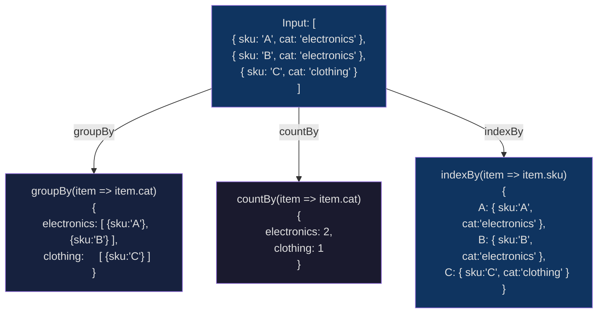

**Exercise**: `exercises/03_groupby_and_countby.ts`

Three helpers that look similar but serve distinct purposes.

### groupBy

Partitions an array into groups. Each group is an array of all matching items.

```typescript
function groupBy<T, K extends string>(
  arr: readonly T[],
  fn: (item: T) => K
): Record<K, T[]> {
  const result = {} as Record<K, T[]>;
  for (const item of arr) {
    const key = fn(item);
    if (result[key] === undefined) {
      result[key] = [];
    }
    result[key]!.push(item);
  }
  return result;
}
```

Use when: you need all items in a group (e.g., all orders for a customer).

```typescript
const byCustomer = groupBy(orders, o => o.customerId);
// { "C001": [...orders], "C002": [...orders] }
```

### countBy

Like groupBy but stores counts instead of item arrays.

```typescript
function countBy<T, K extends string>(
  arr: readonly T[],
  fn: (item: T) => K
): Record<K, number> {
  const result = {} as Record<K, number>;
  for (const item of arr) {
    const key = fn(item);
    result[key] = (result[key] ?? 0) + 1;
  }
  return result;
}
```

Use when: you only need "how many" and don't need the items themselves. More memory-efficient than `groupBy` + `Object.values(...).map(v => v.length)`.

### indexBy

Like groupBy but assumes each key maps to exactly one item. Returns the item directly (not an array). Throws (or overwrites) on duplicates.

```typescript
function indexBy<T, K extends string>(
  arr: readonly T[],
  fn: (item: T) => K
): Record<K, T> {
  const result = {} as Record<K, T>;
  for (const item of arr) {
    result[fn(item)] = item;
  }
  return result;
}
```

Use when: building a lookup table by unique key (e.g., users by id), which you'll then use for O(1) joins.

```typescript
const userById = indexBy(users, u => u.id);
// { "U1": { id: "U1", name: "Ava" }, ... }
```

### Comparison table

| Helper | Result value | Use case |
|--------|-------------|----------|
| `groupBy` | `T[]` | All items matching a key |
| `countBy` | `number` | Frequency distribution |
| `indexBy` | `T` | O(1) lookup by unique key |

### We do — groupBy then reduce

Using `groupBy`, compute the total `amount` per `category` for this array:

```typescript
type Sale = { category: string; amount: number };

function totalByCategory(sales: readonly Sale[]): Record<string, number> {
  const groups = groupBy(sales, s => s.category);
  // Complete this: for each group, reduce to its sum
  return ???;
}
```

<details>
<summary>Answer</summary>

```typescript
function totalByCategory(sales: readonly Sale[]): Record<string, number> {
  const groups = groupBy(sales, s => s.category);
  const result: Record<string, number> = {};
  for (const [cat, items] of Object.entries(groups)) {
    result[cat] = items.reduce((sum, s) => sum + s.amount, 0);
  }
  return result;
}
```

You could also do `Object.fromEntries(Object.entries(groups).map(([k, v]) => [k, v.reduce(...)]))` — same idea.
</details>

### You do

Implement `mostFrequent<T>(arr: T[], fn: (item: T) => string): string` — the key that appears most often according to `fn`. Use `countBy` internally, then find the max.

---

## 6. Pivot — Rows to Columns

**The mental model**

Pivot is a rotation. Before the pivot, category is a cell value in a column called `category`. After the pivot, each distinct category becomes its own column header and the values inside those columns are the aggregated amounts. Think of rotating a table 90 degrees and collapsing duplicates by summing.

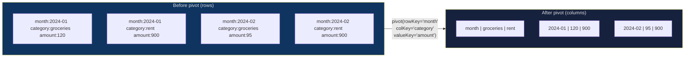

**Exercise**: `exercises/04_pivot_rows_to_columns.ts`

Pivot transforms a flat table where categories are values into a table where categories are column headers. This is the TypeScript equivalent of a SQL `PIVOT` or a spreadsheet's pivot table.

### Input

```typescript
type Transaction = {
  month: string;    // "2024-01"
  category: string; // "electronics" | "accessories" | ...
  amount: number;
};
```

### Output

```typescript
// { month: "2024-01", electronics: 1249, accessories: 89.99 }
type PivotRow = { month: string } & Record<string, number>;
```

### Implementation

```typescript
function pivot(
  rows: readonly Transaction[],
  rowKey: keyof Transaction,      // "month"
  colKey: keyof Transaction,      // "category"
  valueKey: keyof Transaction,    // "amount"
  agg: (acc: number, val: number) => number = (a, b) => a + b
): PivotRow[] {
  // Step 1: discover all column values
  const cols = [...new Set(rows.map(r => String(r[colKey])))];

  // Step 2: group by rowKey
  const groups = groupBy(rows, r => String(r[rowKey]));

  // Step 3: for each group, sum values per column
  return Object.entries(groups).map(([rowVal, groupRows]) => {
    const row: PivotRow = { [rowKey]: rowVal } as PivotRow;
    for (const col of cols) {
      const matching = groupRows.filter(r => String(r[colKey]) === col);
      row[col] = matching.reduce((acc, r) => agg(acc, Number(r[valueKey])), 0);
    }
    return row;
  });
}
```

The resulting array is sorted by insertion order of `groupBy`, which mirrors the input's natural order. Sort explicitly if you need chronological order.

**Aggregation strategies**:
- Sum: `(a, b) => a + b` (default, good for revenue)
- Count: ignore `b` and add 1: `(a, _) => a + 1`
- Max: `Math.max`
- Average: requires two-pass or carry a `{sum, count}` object — the simple `agg` signature above forces sum then divide separately

### We do — pivot with percentage columns

After running `pivot(rows, "month", "category", "amount")`, add a `total` column and a `groceriesPct` column showing groceries as a percentage of the total for that month.

```typescript
function enrichPivotRow(row: PivotRow, categories: string[]): PivotRow {
  const total = categories.reduce((sum, cat) => sum + (row[cat] as number ?? 0), 0);
  return {
    ...row,
    total,
    // How do you compute groceriesPct?
    groceriesPct: ???,
  };
}
```

<details>
<summary>Answer</summary>

```typescript
function enrichPivotRow(row: PivotRow, categories: string[]): PivotRow {
  const total = categories.reduce((sum, cat) => sum + ((row[cat] as number) ?? 0), 0);
  return {
    ...row,
    total,
    groceriesPct: total === 0 ? 0 : ((row["groceries"] as number ?? 0) / total) * 100,
  };
}
```

Guard against division by zero — a month with no transactions has `total === 0`.
</details>

### You do

Write `unpivot(rows: PivotRow[], rowKey: string, categories: string[]): Transaction[]` — the inverse of pivot. Each column value becomes a row again.

---

## 7. Joins — Left and Inner

**The mental model**

A join is a way to answer the question: "for each row on the left, what does the matching row on the right say?" The naive way is to search the entire right side for every left row (O(n × m)). The smart way is to build a lookup table (hash map) of the right side once, then look up each left row in O(1). Two steps: build, then scan.

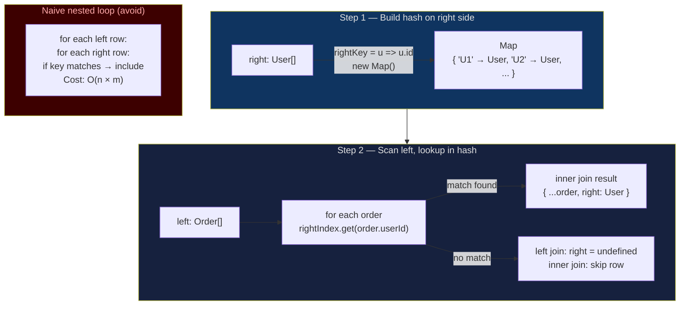

**Exercise**: `exercises/05_join_two_datasets.ts`

Two datasets, a shared key. Classic relational join — implemented over in-memory arrays using a hash map on the inner side for O(n + m) performance.

### Left join

Every row from `left` appears in the output. If no match exists in `right`, the `right` property is `undefined`.

```typescript
function leftJoin<L, R>(
  left: readonly L[],
  right: readonly R[],
  leftKey:  (l: L) => string,
  rightKey: (r: R) => string
): Array<L & { right: R | undefined }> {
  // Hash the right side for O(1) lookup
  const rightIndex = new Map<string, R>();
  for (const r of right) {
    rightIndex.set(rightKey(r), r);
  }
  return left.map(l => ({
    ...l,
    right: rightIndex.get(leftKey(l)),
  }));
}
```

### Inner join

Only rows that match on both sides are included.

```typescript
function innerJoin<L, R>(
  left: readonly L[],
  right: readonly R[],
  leftKey:  (l: L) => string,
  rightKey: (r: R) => string
): Array<L & { right: R }> {
  const rightIndex = new Map<string, R>();
  for (const r of right) {
    rightIndex.set(rightKey(r), r);
  }
  return left.flatMap(l => {
    const match = rightIndex.get(leftKey(l));
    return match !== undefined ? [{ ...l, right: match }] : [];
  });
}
```

**Multiple matches**: These implementations assume one-to-one or many-to-one joins. If `right` can have multiple rows per key (one-to-many), use `groupBy` on the right side and return an array of matches.

**Why hash the inner side?** A naive nested loop is O(n × m). Hashing the smaller dataset (usually `right`) brings it to O(n + m). Always hash the smaller side.

### We do — one-to-many join

Extend `leftJoin` to handle the case where `right` has multiple rows per key. Instead of `right: R | undefined`, return `right: R[]`.

```typescript
function leftJoinMany<L, R>(
  left: readonly L[],
  right: readonly R[],
  leftKey:  (l: L) => string,
  rightKey: (r: R) => string
): Array<L & { right: R[] }> {
  // Hint: use groupBy on the right side first
  const rightGroups = /* ??? */;
  return left.map(l => ({
    ...l,
    right: /* ??? */,
  }));
}
```

<details>
<summary>Answer</summary>

```typescript
function leftJoinMany<L, R>(
  left: readonly L[],
  right: readonly R[],
  leftKey:  (l: L) => string,
  rightKey: (r: R) => string
): Array<L & { right: R[] }> {
  const rightGroups = groupBy([...right], rightKey);
  return left.map(l => ({
    ...l,
    right: rightGroups[leftKey(l)] ?? [],
  }));
}
```
</details>

### You do

Write `antiJoin<L, R>(left, right, leftKey, rightKey)` — return only the left rows that have **no** match on the right. This is the set-difference operation.

---

## 8. Walking Trees

**The mental model**

Walking a tree is like navigating a filing cabinet with drawers inside drawers. You have to decide: do you process the drawer before you open it (pre-order), or after you've gone through all its contents (post-order)? Or do you work level by level, like reading floors of a building (BFS)? The choice determines which nodes you see first and therefore which result you get.

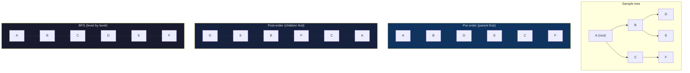

Use pre-order when parents determine the context for children (e.g., inheriting CSS values). Use post-order when children must be resolved before parents (e.g., computing directory sizes). Use BFS when you want the shallowest result first (e.g., finding the nearest ancestor).

**Exercise**: `exercises/06_walk_and_transform_tree.ts`

When your data has arbitrary depth — category trees, folder hierarchies, org charts, ASTs — you need to walk and transform without knowing the depth upfront.

### mapTree — apply a function to every node

```typescript
type TreeNode = {
  id: string;
  value: unknown;
  children?: TreeNode[];
};

function mapTree(
  node: TreeNode,
  fn: (node: TreeNode) => TreeNode
): TreeNode {
  const transformed = fn(node);
  if (!transformed.children || transformed.children.length === 0) {
    return transformed;
  }
  return {
    ...transformed,
    children: transformed.children.map(child => mapTree(child, fn)),
  };
}
```

Note: `fn` is applied to the node **before** recursing. This is a pre-order traversal (parent before children). For post-order (children first), recurse before applying `fn`.

### findInTree — search without full traversal

```typescript
function findInTree(
  node: TreeNode,
  predicate: (node: TreeNode) => boolean
): TreeNode | undefined {
  if (predicate(node)) return node;
  for (const child of node.children ?? []) {
    const found = findInTree(child, predicate);
    if (found !== undefined) return found;
  }
  return undefined;
}
```

This is depth-first search. It returns as soon as it finds the first matching node — no need to explore the full tree. For breadth-first, use a queue (array with `shift`).

### reduce over a tree — flatten all values

```typescript
function reduceTree<A>(
  node: TreeNode,
  fn: (acc: A, node: TreeNode) => A,
  initial: A
): A {
  const acc = fn(initial, node);
  return (node.children ?? []).reduce(
    (a, child) => reduceTree(child, fn, a),
    acc
  );
}

// Example: collect all IDs
const allIds = reduceTree(root, (acc, node) => [...acc, node.id], [] as string[]);
```

### We do — BFS instead of DFS

`findInTree` above uses DFS. Convert it to BFS using a queue (array with `push`/`shift`):

```typescript
function findBFS(
  root: TreeNode,
  predicate: (node: TreeNode) => boolean
): TreeNode | undefined {
  const queue: TreeNode[] = [root];
  while (queue.length > 0) {
    const node = queue.shift()!;
    if (predicate(node)) return node;
    // What do you enqueue next?
    queue.push(/* ??? */);
  }
  return undefined;
}
```

<details>
<summary>Answer</summary>

```typescript
function findBFS(
  root: TreeNode,
  predicate: (node: TreeNode) => boolean
): TreeNode | undefined {
  const queue: TreeNode[] = [root];
  while (queue.length > 0) {
    const node = queue.shift()!;
    if (predicate(node)) return node;
    queue.push(...(node.children ?? []));
  }
  return undefined;
}
```

BFS guarantees you find the shallowest match. `shift()` dequeues the front; `push(...children)` enqueues at the back.
</details>

### You do

Write `treeToList(root: TreeNode): TreeNode[]` using post-order traversal. Each node's children appear before the node itself. This ordering is useful for dependency resolution (children = dependencies).

---

## 9. Denormalizing Nested Arrays

**The mental model**

Denormalization is the inverse of database normalization. Where a relational database stores customers, orders, and items in separate tables to avoid redundancy, a flat CSV file needs every piece of ancestor context repeated on every row. Each leaf (line item) gets a copy of everything above it stamped onto it.

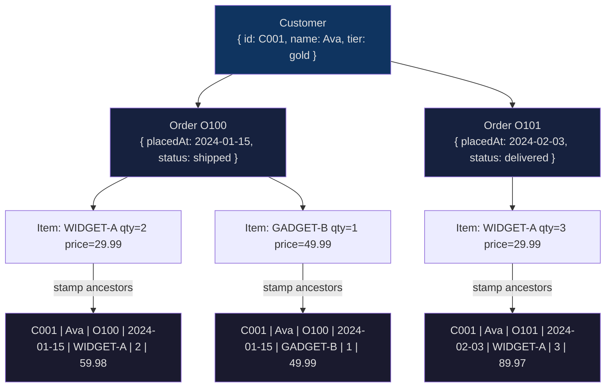

**Exercise**: `exercises/07_denormalize_nested_arrays.ts`

This is the most common ETL transformation in practice. You have one-to-many (to-many) relationships and need one flat row per leaf.

### The operation

```
customer
  └─ orders[]
       └─ items[]
```

Becomes:

```
{ customerId, customerName, orderId, sku, qty, unitPrice, lineTotal }
```

One row per item. Every ancestor's fields are copied onto every descendant row.

### Implementation

```typescript
type Customer = {
  customerId: string;
  name: string;
  orders: Order[];
};

type Order = {
  orderId: string;
  placedAt: string;
  items: LineItem[];
};

type LineItem = {
  sku: string;
  qty: number;
  unitPrice: number;
};

type FlatRow = {
  customerId: string;
  customerName: string;
  orderId: string;
  placedAt: string;
  sku: string;
  qty: number;
  unitPrice: number;
  lineTotal: number;
};

function denormalize(customers: readonly Customer[]): FlatRow[] {
  return customers.flatMap(customer =>
    customer.orders.flatMap(order =>
      order.items.map(item => ({
        customerId:   customer.customerId,
        customerName: customer.name,
        orderId:      order.orderId,
        placedAt:     order.placedAt,
        sku:          item.sku,
        qty:          item.qty,
        unitPrice:    item.unitPrice,
        lineTotal:    item.qty * item.unitPrice,
      }))
    )
  );
}
```

`Array.flatMap` is the key: it maps then flattens one level. Two nested `flatMap` calls plus an inner `map` handle three levels of nesting.

**Empty arrays**: If a customer has no orders, `customer.orders.flatMap(...)` returns `[]`. If an order has no items, `order.items.map(...)` returns `[]`. Both produce no rows in the output — correct behavior, no crash.

### We do — four levels deep

Extend `denormalize` to handle a fourth level: each `LineItem` has a `promotions: Promotion[]` array where `Promotion = { code: string; discount: number }`. Produce one flat row per (customer, order, item, promotion).

```typescript
type Promotion = { code: string; discount: number };
type LineItemWithPromo = LineItem & { promotions: Promotion[] };

// What does the innermost flatMap look like?
function denormalizeWithPromo(customers: readonly Customer[]): FlatRow[] {
  return customers.flatMap(customer =>
    customer.orders.flatMap(order =>
      (order.items as LineItemWithPromo[]).flatMap(item =>
        item.promotions./* ??? */(promo => ({
          customerId:   customer.customerId,
          orderId:      order.orderId,
          sku:          item.sku,
          promoCode:    promo.code,
          discount:     promo.discount,
        }))
      )
    )
  );
}
```

<details>
<summary>Answer</summary>

Replace `/* ??? */` with `.map` — three `flatMap` and one inner `map` for four levels. If you used `flatMap` on the innermost level, you would need to wrap each result in an array, which is unnecessary complexity.

```typescript
item.promotions.map(promo => ({ ... }))
```
</details>

### You do

Write a `reNormalize(flat: FlatRow[]): Customer[]` function that reconstructs the nested structure from flat rows. Use `groupBy` at each level (by customerId, then by orderId). This is the inverse of `denormalize` — often needed when you receive CSV data and need to call an API that expects nested JSON.

---

## 10. Immutability Patterns

**The mental model**

Immutability means every function returns a new value and never modifies what was handed to it. Think of a photocopier: you hand it the original document, it gives you a new copy with your changes, and the original is untouched. In a pipeline where three different functions all receive the same flat rows array, any mutation in one function breaks all the others downstream.

Never mutate inputs. This is not just a style preference — mutating inputs makes functions unpredictable, causes bugs in pipelines where the same data flows through multiple transforms, and breaks memoization.

### Spread for shallow copies

```typescript
// Object
const updated = { ...original, name: "New Name" };

// Array
const appended = [...arr, newItem];
const withoutFirst = arr.slice(1);
const sorted = [...arr].sort((a, b) => a.value - b.value); // sort mutates! always spread first
```

### Nested immutability with spread

Spread is shallow — it only copies the top level:

```typescript
const customer = { id: "C1", address: { city: "London" } };
const updated = { ...customer, address: { ...customer.address, city: "Paris" } };
// customer.address is unchanged
```

For deeply nested updates, spread each level that changes.

### structuredClone — deep clone

When you need a full independent copy:

```typescript
const deep = structuredClone(original);
// deep is a completely new object tree — no references shared
```

`structuredClone` is available natively in Node 17+ and all modern browsers. It handles dates, arrays, nested objects, and Sets/Maps. It does **not** handle functions, class instances, or circular references involving non-serializable values.

### Object.freeze — shallow enforcement

```typescript
const config = Object.freeze({ host: "localhost", port: 5432 });
config.port = 9999; // TypeError in strict mode — cannot assign to read-only property
```

`Object.freeze` is shallow: nested objects are still mutable unless you recursively freeze them. Use it for config objects and constants.

### Pure function checklist

- No side effects (no `console.log`, no file I/O, no globals mutated)
- Same input → same output, always
- Does not modify its parameters — spread or clone if you need to alter a copy
- Returns a new value; does not modify a shared structure

### We do — spot the mutation bug

```typescript
function addField(rows: FlatRow[], field: string, value: string): FlatRow[] {
  return rows.map(row => {
    row.customerId = field === "customerId" ? value : row.customerId; // bug?
    return row;
  });
}
```

What is wrong with this function, and how do you fix it?

<details>
<summary>Answer</summary>

The function mutates `row` in-place before returning it. Because `map` passes references to the original objects, the originals are modified. Fix: return a new object with spread.

```typescript
function addField(rows: FlatRow[], field: string, value: string): FlatRow[] {
  return rows.map(row => ({
    ...row,
    [field]: value,
  }));
}
```
</details>

### You do

Write `deepFreeze<T extends object>(obj: T): Readonly<T>` — recursively freeze every nested plain object. Make sure it handles arrays and skips non-object values.

---

## 11. Map vs Record

**The mental model**

`Record<K, V>` is a plain JavaScript object with typed keys — it belongs to your data model and travels through JSON, database calls, and API responses. `Map<K, V>` is a runtime data structure built for algorithmic work — it lives inside a function and usually does not leave it. Use `Record` to describe data; use `Map` to compute over it.

Both store key-value pairs. When do you choose each?

### Record\<K, V\>

```typescript
type Status = "open" | "closed" | "pending";
const counts: Record<Status, number> = { open: 3, closed: 10, pending: 1 };
```

- Keys are a known, fixed union type
- JSON-serializable out of the box (`JSON.stringify`)
- TypeScript ensures all keys are present (when using a union key)
- Iteration via `Object.entries`, `Object.keys`, `Object.values`
- Property access is direct and fast
- No insertion-order guarantee in older ECMAScript, though V8 maintains string key order in practice

Use `Record` when: the set of keys is statically known or derivable from a union type, you need JSON serialization, or you're working with TypeScript's mapped type machinery.

### Map\<K, V\>

```typescript
const userIndex = new Map<string, User>();
userIndex.set("U1", { id: "U1", name: "Ava" });
userIndex.get("U1"); // User | undefined
```

- Keys can be any type — objects, numbers, symbols, even functions
- Guaranteed insertion-order iteration
- `.size` property
- `.has()`, `.delete()`, `.forEach()`, `.entries()`, `.keys()`, `.values()`
- Does not JSON-serialize directly (need `[...map.entries()]` or similar)
- Marginally faster than plain objects for very large key sets with frequent insertion/deletion

Use `Map` when: keys are dynamic strings (user input, computed at runtime), you need insertion-order iteration, keys are non-string types, or you're building a hash-map lookup table inside an algorithm.

### Summary

| | Record | Map |
|---|---|---|
| Key type | `string \| number \| symbol` | any |
| JSON-serializable | Yes | No (manual) |
| Static key type | Yes (union) | No |
| Insertion order | Implementation-defined | Guaranteed |
| Built-in `.size` | No (`Object.keys(r).length`) | Yes |
| Best for | Config, groupBy results, DTOs | Indexes, lookup tables, algorithms |

### We do — convert Map to Record

After building a `Map<string, number>` inside an algorithm, you need to return it as `Record<string, number>` for the caller. Complete the conversion:

```typescript
function mapToRecord<V>(m: Map<string, V>): Record<string, V> {
  // ???
}
```

<details>
<summary>Answer</summary>

```typescript
function mapToRecord<V>(m: Map<string, V>): Record<string, V> {
  return Object.fromEntries(m.entries()) as Record<string, V>;
}
```

`Object.fromEntries` accepts any iterable of `[key, value]` pairs, making it the canonical way to convert a Map to a plain object.
</details>

### You do

Write `recordToMap<K extends string, V>(r: Record<K, V>): Map<K, V>`. Then write a `mergeRecords` function that merges two `Record<string, number>` by summing values for duplicate keys — use `Map` internally, return a `Record`.

---

## 12. Complexity Notes

Understanding the cost of these operations helps you avoid accidentally writing O(n²) code on production data.

### groupBy — O(n)

One pass over the array. Each item is inserted into the result once. The hash insertion is O(1) amortized. Overall: **O(n)**.

```
n = 1,000,000 rows → fast, done in milliseconds
```

### Naive nested join — O(n × m)

```typescript
// DO NOT DO THIS
const joined = left.map(l => ({
  ...l,
  right: right.find(r => r.id === l.rightId) // O(m) per left row
}));
// Total: O(n × m)
```

For `n = m = 10,000`, this is 100 million comparisons. With the hash-map approach, it is 20,000 operations.

### Hash-map join — O(n + m)

Build the index once (O(m)), then do O(1) lookups for each left row (O(n)). Overall: **O(n + m)**.

Always hash the **smaller** of the two datasets.

### Pivot — O(n × c)

Where `n` is rows and `c` is number of distinct column values. Usually `c` is small (a handful of categories), so this is effectively O(n).

### Tree walk — O(n)

Where `n` is the total number of nodes. Each node is visited once. Depth does not affect the per-node cost, only the call stack depth. For very deep trees (>10,000 levels), convert to an iterative algorithm with an explicit stack to avoid stack overflow.

### Flatten — O(n × d)

Where `n` is the number of leaf values and `d` is the maximum depth. For typical payloads (depth ≤ 5), this is effectively O(n).

---

## 13. Composing Pipelines

**The mental model**

A pipeline is an assembly line. Each station (function) receives the output of the previous station and produces output for the next one. No station reaches back to change what a previous station already did. The type at each handoff is the contract — if you change a station's output type, TypeScript will immediately flag every downstream station that assumed the old type.

**Exercise**: `project/orders-to-csv/` — the project applies this full pipeline: read raw JSON, parse and validate, denormalize, group, summarize, and emit CSV and per-customer totals.

The most maintainable data transformation code is built from small, pure functions composed in sequence. No single function does everything.

### Anti-pattern — the mega-transformer

```typescript
// 200-line function that parses, validates, groups, pivots, and formats
function transformEverything(raw: unknown): FinalReport {
  // impossible to test individual steps
  // impossible to reuse individual steps
  // impossible to debug which step produced wrong output
}
```

### Pattern — pipeline of small functions

```typescript
// Each function does one thing and is independently testable
const parse      = (raw: unknown): Customer[]   => { /* validate and cast */ };
const denormalize = (customers: Customer[]): FlatRow[] => { /* one row per item */ };
const enrich     = (rows: FlatRow[]): EnrichedRow[] => { /* add computed fields */ };
const aggregate  = (rows: FlatRow[]): CustomerTotal[] => { /* groupBy + sum */ };
const format     = (totals: CustomerTotal[]): string => { /* CSV string */ };

// A simple pipe utility
function pipe<A, B, C, D, E>(
  a: A,
  ab: (a: A) => B,
  bc: (b: B) => C,
  cd: (c: C) => D,
  de: (d: D) => E
): E {
  return de(cd(bc(ab(a))));
}

// Usage reads like a sentence
const csvOutput = pipe(rawData, parse, denormalize, aggregate, format);
```

The TypeScript overloads for `pipe` get verbose at many arguments. In practice, chain with intermediate variables:

```typescript
const customers  = parse(rawData);
const flat       = denormalize(customers);
const totals     = aggregate(flat);
const csvOutput  = format(totals);
```

This is just as composable and far more debuggable — you can inspect each intermediate value.

```mermaid
flowchart LR
    RAW["unknown\n(raw JSON string)"]
    PARSED["Customer[]\n(validated domain types)"]
    FLAT["FlatRow[]\n(one row per line item)"]
    ENRICHED["EnrichedRow[]\n(computed fields added)"]
    GROUPED["Record&#60;string, FlatRow[]&#62;\n(grouped by customerId)"]
    TOTALS["CustomerTotal[]\n(aggregated sums)"]
    CSV["string\n(CSV output)"]

    RAW -->|"parse\nJSON.parse + validate"| PARSED
    PARSED -->|"denormalize\nflatMap × 2"| FLAT
    FLAT -->|"enrich\nadd lineTotal, month"| ENRICHED
    ENRICHED -->|"groupBy\ncustomerId"| GROUPED
    GROUPED -->|"aggregate\nreduce each group"| TOTALS
    TOTALS -->|"format\njoin rows with commas"| CSV

    style RAW fill:#3d0000,color:#ffaaaa
    style PARSED fill:#0f3460,color:#e0e0e0
    style FLAT fill:#16213e,color:#e0e0e0
    style ENRICHED fill:#1a1a2e,color:#e0e0e0
    style GROUPED fill:#0f3460,color:#e0e0e0
    style TOTALS fill:#16213e,color:#e0e0e0
    style CSV fill:#1a1a2e,color:#e0e0e0
```

### Benefits of pipeline composition

1. **Testability**: test each step independently with simple inputs and outputs
2. **Reusability**: `denormalize` and `groupBy` appear in multiple pipelines
3. **Debuggability**: log intermediate values between steps
4. **Readability**: the data flow is visible in the code structure
5. **Replaceability**: swap one step without touching others

### We do — add a validation step

Insert a `validate` step between `parse` and `denormalize` that throws on invalid customers (missing `customerId` or empty `orders`).

```typescript
function validate(customers: Customer[]): Customer[] {
  for (const c of customers) {
    if (!c.customerId) throw new Error(`Missing customerId`);
    if (/* ??? */) throw new Error(`Customer ${c.customerId} has no orders`);
  }
  return customers;
}
```

<details>
<summary>Answer</summary>

```typescript
function validate(customers: Customer[]): Customer[] {
  for (const c of customers) {
    if (!c.customerId) throw new Error(`Missing customerId`);
    if (c.orders.length === 0) throw new Error(`Customer ${c.customerId} has no orders`);
  }
  return customers;
}
```

Returning `customers` (same reference) is fine here — validate is a guard, not a transform. It produces no new values, just throws or passes through.
</details>

### You do

Write a generic `tap<T>(fn: (val: T) => void): (val: T) => T` utility — it calls `fn` for its side effect (logging, metrics) and returns the value unchanged. This lets you insert debug logging into a pipeline without changing any step's input/output type.

---

## Mental-model summary

The diagram below shows the full pipeline from raw input to three different outputs, with the transformation concept that connects each stage.

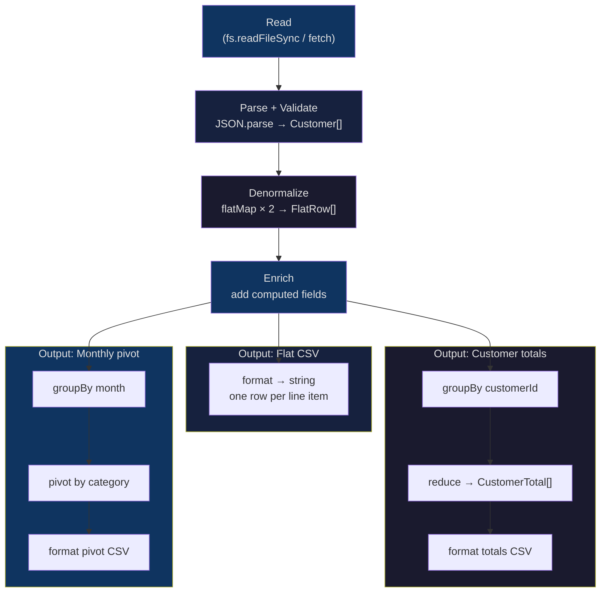

---

## Check your understanding

<details>
<summary>1. You call <code>flatten({ a: { b: 1 }, c: [1, 2] })</code>. What is the output, and why is <code>c</code> treated differently from <code>a</code>?</summary>

Output: `{ "a.b": 1, "c": [1, 2] }`. The flatten implementation only recurses into plain objects (`typeof value === "object" && !Array.isArray(value)`). Arrays are not plain objects under this check, so `c` is left as-is. This is intentional — arrays represent collections, not structured sub-objects, and recursing into them would produce surprising keys like `c.0`, `c.1`.
</details>

<details>
<summary>2. You have 500,000 orders and 10,000 customers. You want to join each order to its customer. Which side do you hash, and why?</summary>

Hash the customers (the smaller dataset, 10,000 entries). Build `Map<customerId, Customer>` once in O(10,000), then look up each of the 500,000 orders in O(1) per lookup. Total: O(510,000). A nested loop would be O(500,000 × 10,000) = O(5,000,000,000) — five billion comparisons.
</details>

<details>
<summary>3. What is the difference between pre-order and post-order tree traversal, and when do you need each?</summary>

Pre-order visits a node before its children. Use it when a parent's context determines how children are processed — for example, passing inherited CSS properties down a component tree. Post-order visits children before the parent. Use it when children's results are needed to compute the parent's result — for example, computing a directory's total file size from its children's sizes, or resolving dependencies before the module that requires them.
</details>

<details>
<summary>4. <code>groupBy</code> returns <code>Record&lt;K, T[]&gt;</code>. With <code>noUncheckedIndexedAccess</code> on, what type does <code>groups["nonexistent"]</code> have, and what should you do?</summary>

It has type `T[] | undefined`. Even though the declared type is `Record<K, T[]>`, runtime access can return `undefined` for keys that were never inserted. The compiler flag surfaces this. Always guard: `groups["nonexistent"] ?? []` or check `"nonexistent" in groups` first.
</details>

<details>
<summary>5. Your pivot has 12 months as row keys but the columns appear in a random order. What causes this, and how do you fix it?</summary>

The columns are discovered by scanning the input array and collecting distinct `category` values with `new Set(rows.map(...))`. The Set's iteration order reflects first-seen order in the input, which may not match alphabetical or chronological order. Fix: sort the columns after collection — `const cols = [...new Set(rows.map(r => String(r[colKey])))].sort()`. For month columns, sort chronologically. For category columns, sort alphabetically or by a fixed predefined order.
</details>

---

## 14. Mini Q&A

**Q1: When I flatten an object that contains arrays, what happens to the array elements?**

It depends on your implementation. The standard approach in this course is to leave arrays in-place — `flatten({ tags: ["a", "b"] })` produces `{ tags: ["a", "b"] }` (the value is unchanged). If you need array elements as indexed keys (`tags.0`, `tags.1`), add a branch in the loop that iterates `Array.isArray(value)` and recurses with `${fullKey}${sep}${i}`. Pick one approach and document it — mixing them causes surprise in round-trips.

**Q2: `groupBy` returns `Record<K, T[]>`. But TypeScript says the result might not have a key I expect. Why?**

Because `Record<K, T[]>` only guarantees the type shape — it does not guarantee runtime presence. At runtime, `result["nonexistent"]` is `undefined` even though the type says `T[]`. With `noUncheckedIndexedAccess: true`, TypeScript widens the access type to `T[] | undefined`, forcing you to guard: `groups["Q1"] ?? []`. This is the correct behavior — the type system is telling you the truth.

**Q3: My pivot produces columns in a different order each time. Why?**

JavaScript object keys have a defined but sometimes surprising iteration order: integer-like keys first (ascending numeric), then string keys in insertion order. If your column values are month strings like `"2024-01"`, they will iterate in insertion order (the order first seen in the input array). Sort the input rows by date before pivoting to get consistent column order.

**Q4: Why is `innerJoin` implemented with `flatMap` instead of `filter` + `map`?**

`flatMap` lets us return either `[]` (no match — skip this left row) or `[mergedRow]` (match — include it) in a single pass, without a separate filter step. The result is the same but more idiomatic. `filter(l => !!rightIndex.get(...)).map(...)` reads the key twice; `flatMap` reads it once per item.

**Q5: When should I use `structuredClone` vs spread?**

Use **spread** for shallow copies — when you only need independence at one level deep, or when you are updating a specific nested path (spreading each changed level). Use **`structuredClone`** when you need a fully independent copy and cannot guarantee the nesting depth — for example, when storing a snapshot of a user-provided object for later comparison. `structuredClone` is ~10x slower than spread for large objects, so avoid it in hot loops.
