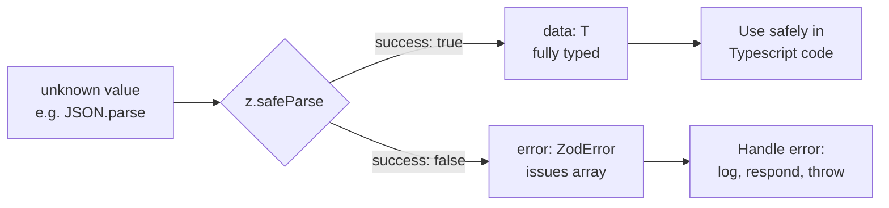
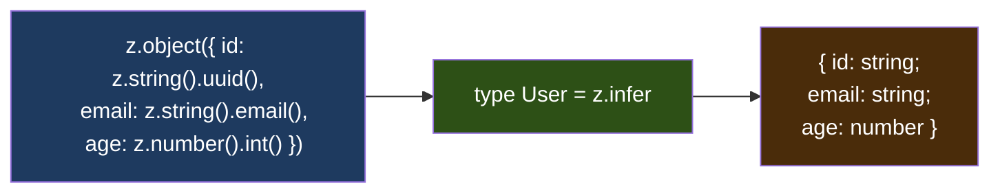
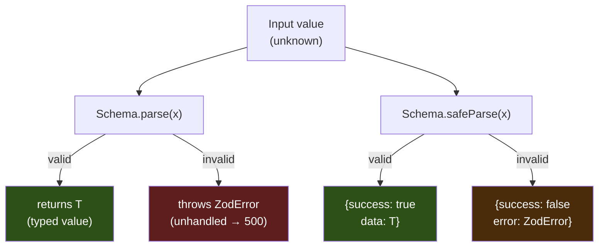
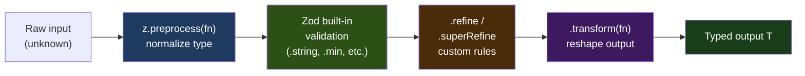
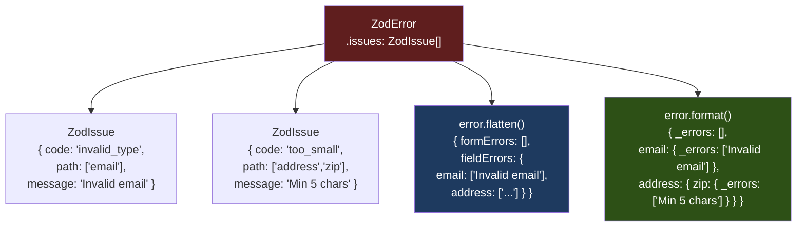
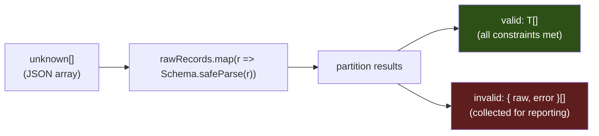
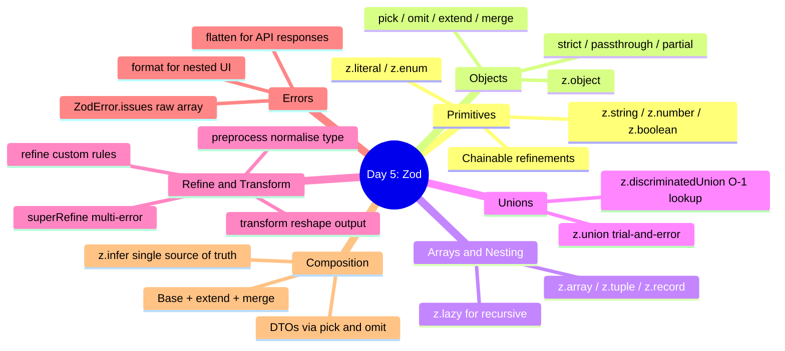
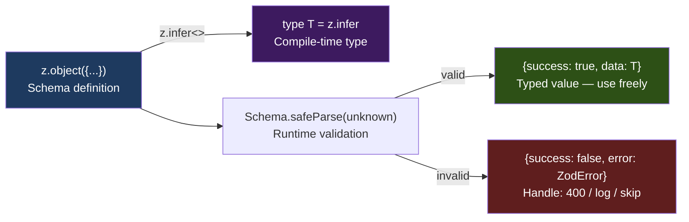

# Day 5 — Runtime Validation with Zod

## What you already know that applies here

- Day 1: basic types are what Zod types produce via `z.infer`. When you write `z.string()`, the inferred TypeScript type is `string` — the same primitive you learned on day 1.
- Day 3: discriminated unions — Zod's `z.discriminatedUnion` is the runtime twin of the pattern you learned on day 3. Same mental model: a shared literal field narrows to a single branch.
- Day 3: `unknown` vs `any` — Zod parses `unknown` into a typed value, which is why it is the safe entry point at every data boundary. `z.unknown()` accepts anything but keeps the type opaque; `z.any()` accepts anything and widens to `any` — avoid it.
- Day 2: utility types like `Pick`/`Omit` — Zod schemas have `.pick`/`.omit` methods that mirror them. The same conceptual operation (slicing a type to a subset) works at runtime on the schema, not just at compile time on the type.

---

## Table of Contents

1. [Why Runtime Validation?](#1-why-runtime-validation)
2. [Schema-First Design](#2-schema-first-design)
3. [Zod Primitives](#3-zod-primitives)
4. [Object Schemas](#4-object-schemas)
5. [Arrays and Nesting](#5-arrays-and-nesting)
6. [`parse` vs `safeParse`](#6-parse-vs-safeparse)
7. [`z.infer` — Types from Schemas](#7-zinfer--types-from-schemas)
8. [Refinements](#8-refinements)
9. [Transforms and Preprocessing](#9-transforms-and-preprocessing)
10. [Unions and Discriminated Unions](#10-unions-and-discriminated-unions)
11. [Schema Composition](#11-schema-composition)
12. [Error Reporting](#12-error-reporting)
13. [Validating Environment Variables](#13-validating-environment-variables)
14. [Common Pitfalls](#14-common-pitfalls)
15. [Mental-Model Summary](#15-mental-model-summary)
16. [Check Your Understanding](#16-check-your-understanding)
17. [Mini Q&A](#17-mini-qa)

---

## 1. Why Runtime Validation?

TypeScript gives you a tremendous amount of safety — but only at compile time. The moment your code runs, every type annotation is gone. The JavaScript runtime has no idea that `user.email` is supposed to be a string. It just knows it's a property on an object.

This matters enormously in practice. Consider everything that arrives as `unknown` at runtime:

- **`JSON.parse(text)`** — returns `any`. Your editor won't warn you if the field is missing or the wrong type.
- **`process.env`** — every value is `string | undefined`. Env vars don't come with schemas.
- **HTTP responses** — the API contract might drift, or you might be calling a third-party endpoint that changes without notice.
- **Database rows** — ORMs give you typed results, but raw query results are untyped, and schema migrations can temporarily break assumptions.
- **User-uploaded files** — JSON files, CSVs, anything the user provides.

A common mistake is to cast aggressively: `const data = JSON.parse(text) as MyType`. This compiles cleanly but is a lie. If `text` doesn't conform to `MyType`, you get silent `undefined` values or runtime errors deep in your call stack, far from where the bad data entered.

**The correct approach**: validate the data at the boundary where it enters your system, and only use it once it has been confirmed to match your schema. Zod is one of the most popular libraries for this in the TypeScript ecosystem.

```
                    ┌─────────────────────────────────────────────────────┐
                    │ Your TypeScript Code                                │
                    │                                                     │
  HTTP / File /     │   ┌───────────────┐    ┌──────────────────────┐   │
  Env / DB  ───────►│   │  unknown data │───►│ Zod safeParse/parse  │   │
                    │   └───────────────┘    └─────────┬────────────┘   │
                    │                                   │                │
                    │                           success │ failure        │
                    │                                ┌──┴──┐            │
                    │                                │     │            │
                    │                              data   error         │
                    │                            (typed)  (ZodError)    │
                    └─────────────────────────────────────────────────────┘
```

### The Mermaid View



---

## 2. Schema-First Design

**The mental model**

A Zod schema is a runtime type — it exists at runtime and can actually inspect a value, unlike a TypeScript type which is erased after compilation. Think of it as a border-control officer: it examines every incoming value and either stamps it "valid `T`" or rejects it with a structured reason. Once a value is stamped, you have a fully-typed value the compiler trusts completely.

The other half of schema-first design is that the TypeScript type is *derived* from the schema automatically via `z.infer`. You never write a matching interface by hand. The schema is the single source of truth.



The key insight of Zod (and similar libraries like Valibot, Arktype) is that the **schema is the single source of truth**. You write the schema once; the TypeScript type is derived from it automatically.

Compare two approaches:

**Approach A — type first, validate separately (fragile)**

```typescript
interface User {
  id: string;
  email: string;
  age: number;
}

function validateUser(raw: unknown): User {
  // manual checks — easy to forget a field, easy to drift from the interface
  if (typeof (raw as any).email !== "string") throw new Error("bad email");
  return raw as User; // still a lie!
}
```

**Approach B — schema first, type derived (robust)**

```typescript
import { z } from "zod";

const UserSchema = z.object({
  id: z.string().uuid(),
  email: z.string().email(),
  age: z.number().int().min(0),
});

type User = z.infer<typeof UserSchema>; // { id: string; email: string; age: number }

const result = UserSchema.safeParse(rawData);
if (result.success) {
  // result.data is fully typed as User
}
```

With approach B, the type and the validator are always in sync because they are the same thing. You cannot add a field to the schema without it appearing in the type, and vice versa.

**I do** — schema-first for a product entity

```ts
import { z } from "zod";

// 1. Define the schema (runtime)
const ProductSchema = z.object({
  id: z.string().uuid(),       // must be a valid UUID string
  name: z.string().min(1),     // non-empty string
  price: z.number().positive(), // number > 0
  inStock: z.boolean(),
});

// 2. Derive the TypeScript type (compile time) — no interface needed
type Product = z.infer<typeof ProductSchema>;
// => { id: string; name: string; price: number; inStock: boolean }

// 3. Validate at the boundary
const raw: unknown = JSON.parse(responseText);
const result = ProductSchema.safeParse(raw);
if (result.success) {
  // result.data is fully typed as Product
  console.log(result.data.name.toUpperCase()); // safe — TS knows it is a string
}
```

**We do** — spot the drift

Below is a hand-written interface and a Zod schema that are supposed to match. What is wrong?

```ts
interface Order {
  orderId: string;
  total: number;
  placedAt: Date;
}

const OrderSchema = z.object({
  id: z.string().uuid(),       // field name mismatch: "id" vs "orderId"
  total: z.number().positive(),
  placedAt: z.string().datetime(), // type mismatch: produces string, not Date
});
```

<details>
<summary>Answer</summary>

Two mismatches:
1. `orderId` in the interface vs `id` in the schema — the schema strips `orderId` from incoming data and does not populate it.
2. `placedAt` in the interface is `Date`, but `z.string().datetime()` produces `string`. The compiler would catch this only if you explicitly annotate `type Order = z.infer<typeof OrderSchema>` — at which point you would see the drift immediately. This is why you should *only* use `z.infer` and never maintain a parallel interface.
</details>

**You do** — open `exercises/01_zod_basics.ts`. Before reading the solutions, write a `UserSchema` from scratch with `id` (UUID), `email`, `age` (integer, 0–120), and an `active` boolean. Derive `type User` from it and parse a raw object.

---

## 3. Zod Primitives

**The mental model**

Zod primitive builders are thin wrappers around `typeof` checks, but with chainable refinement methods. Think of them as composable rules: `z.string()` says "must be a string", and each chained method adds one more rule to the pipeline. All rules must pass for the parse to succeed.

Zod has a builder for every primitive TypeScript type, plus some useful extras.

### Basic Primitives

```typescript
const str = z.string();
const num = z.number();
const bool = z.boolean();
const bigint = z.bigint();
const date = z.date();           // expects a JS Date object
const sym = z.symbol();
const undef = z.undefined();
const nul = z.null();
const unk = z.unknown();         // anything passes, but stays unknown
const any = z.any();             // anything passes, becomes any — avoid
const never = z.never();         // nothing passes
```

### String Refinements

```typescript
z.string().min(1)                // at least 1 character
z.string().max(255)              // at most 255 characters
z.string().length(10)            // exactly 10 characters
z.string().email()               // valid email format
z.string().url()                 // valid URL
z.string().uuid()                // valid UUID
z.string().cuid()                // Cuid format
z.string().regex(/^\d{5}$/)      // US ZIP code pattern
z.string().startsWith("usr_")    // prefix check
z.string().endsWith(".ts")       // suffix check
z.string().includes("@")         // substring check
z.string().trim()                // preprocess: trims whitespace before validating
z.string().toLowerCase()         // preprocess: lowercases before validating
z.string().toUpperCase()         // preprocess: uppercases before validating
z.string().datetime()            // ISO 8601 datetime string
z.string().ip()                  // IPv4 or IPv6
```

**I do** — a realistic password schema

```ts
// Chain rules left-to-right; each one adds a constraint
const PasswordSchema = z
  .string()
  .min(8, "At least 8 characters")          // length check
  .refine((s) => /[A-Z]/.test(s), "Needs uppercase")   // custom rule
  .refine((s) => /\d/.test(s), "Needs a digit");        // second custom rule

// The inferred type is still just: string
// The extra rules only affect what values are accepted at runtime
type Password = z.infer<typeof PasswordSchema>; // string

PasswordSchema.parse("SecurePass1"); // ok
PasswordSchema.parse("short");       // throws: "At least 8 characters"
PasswordSchema.parse("alllowercase1"); // throws: "Needs uppercase"
```

**We do** — fix the broken schema

```ts
// This schema should accept US ZIP codes ("90210" or "10001-1234")
// but it currently accepts anything. What is missing?
const ZipSchema = z.string();
```

<details>
<summary>Answer</summary>

Add a regex refinement:

```ts
const ZipSchema = z.string().regex(/^\d{5}(-\d{4})?$/, "Invalid US ZIP code");
```

`/^\d{5}(-\d{4})?$/` anchors the pattern at both ends, requires exactly 5 digits, then optionally accepts a hyphen followed by 4 more digits.
</details>

**You do** — open `exercises/01_zod_basics.ts` and inspect `PasswordSchema`. Then try adding a third `.refine` that rejects passwords containing the word "password" (case-insensitive).

### Number Refinements

```typescript
z.number().min(0)
z.number().max(100)
z.number().int()                  // must be an integer
z.number().positive()             // > 0
z.number().nonnegative()          // >= 0
z.number().negative()             // < 0
z.number().nonpositive()          // <= 0
z.number().multipleOf(5)          // divisible by 5
z.number().finite()               // not Infinity or -Infinity
z.number().safe()                 // within Number.MAX_SAFE_INTEGER
```

### Literals and Enums

```typescript
z.literal("admin")                // only the exact value "admin"
z.literal(42)
z.literal(true)

z.enum(["red", "green", "blue"])  // string enum — Zod-native
// The enum values are accessible as .enum: { red: "red", ... }

// Wrapping a TypeScript const enum or as-const array:
const COLORS = ["red", "green", "blue"] as const;
z.enum(COLORS);
```

---

## 4. Object Schemas

**The mental model**

`z.object({...})` is the core of schema-first design. It maps field names to sub-schemas, just like an interface maps property names to types. But unlike an interface, it runs at runtime and has three behaviours for unknown keys: strip (default), reject (`.strict()`), or pass through (`.passthrough()`). The default is strip — a safe, forgiving default that discards unexpected data rather than erroring.

`.partial()`, `.pick()`, `.omit()`, and `.extend()` mirror TypeScript's built-in utility types (`Partial`, `Pick`, `Omit`, intersection) but operate on the schema object, keeping runtime and compile-time in sync automatically.

### Basic Object

```typescript
const PersonSchema = z.object({
  name: z.string(),
  age: z.number(),
});
```

By default, Zod **strips** unknown keys — they are silently removed from the parsed result. This is usually what you want (defence in depth), but you can change it.

### `.strict()` — reject unknown keys

```typescript
const StrictPerson = PersonSchema.strict();
// { name: "Alice", age: 30, extra: true } → error: unrecognized keys
```

### `.passthrough()` — keep unknown keys

```typescript
const PassPerson = PersonSchema.passthrough();
// { name: "Alice", age: 30, extra: true } → { name: "Alice", age: 30, extra: true }
// Type is still { name: string; age: number } but the object passes through intact
```

### `.partial()` — make all fields optional

```typescript
const PartialPerson = PersonSchema.partial();
// { name?: string; age?: number }
```

### `.required()` — undo partial

```typescript
const RequiredPerson = PartialPerson.required();
```

### `.pick()` and `.omit()` — shape slicing

```typescript
const NameOnly = PersonSchema.pick({ name: true });
// { name: string }

const NoAge = PersonSchema.omit({ age: true });
// { name: string }
```

### `.extend()` — add fields

```typescript
const EmployeeSchema = PersonSchema.extend({
  employeeId: z.string(),
  department: z.string(),
});
```

### Optional and Nullable Fields

```typescript
z.object({
  nickname: z.string().optional(),    // string | undefined
  bio: z.string().nullable(),         // string | null
  photo: z.string().nullish(),        // string | null | undefined
})
```

**I do** — a nested User schema with real-world shape

```ts
const AddressSchema = z.object({
  street: z.string().min(1),
  city: z.string().min(1),
  state: z.string().length(2),   // 2-letter state code
  zip: z.string().regex(/^\d{5}$/),
  country: z.string().default("US"), // default applied if field is absent
});

const UserSchema = z.object({
  id: z.string().uuid(),
  email: z.string().email(),
  age: z.number().int().min(0).max(150).optional(), // may be absent
  address: AddressSchema,          // nested — errors bubble up with full path
  tags: z.array(z.string()).default([]),
});

// When parsing fails inside a nested schema, the path is fully qualified:
// e.g. [ "address", "state" ] tells you exactly where the error is
const r = UserSchema.safeParse({
  id: "550e8400-e29b-41d4-a716-446655440000",
  email: "alice@example.com",
  address: { street: "1 Main St", city: "Springfield", state: "ILLINOIS", zip: "62701" },
});
// r.success === false
// r.error.issues[0].path === ["address", "state"]
// r.error.issues[0].message === "String must contain exactly 2 character(s)"
```

**We do** — unknown-key behaviour

```ts
const Schema = z.object({ name: z.string() });
const input = { name: "Alice", secret: "injected" };

Schema.parse(input);              // => { name: "Alice" }  — secret stripped
Schema.strict().parse(input);     // => throws ZodError: unrecognized key: secret
Schema.passthrough().parse(input); // => { name: "Alice", secret: "injected" }
```

Which mode should you use for a config file that you control? Which for a third-party API response?

<details>
<summary>Answer</summary>

Config file you control: use `.strict()` — extra keys likely mean a typo and you want to know immediately.

Third-party API response: use the default (strip) or `.passthrough()`. APIs add new fields over time; stripping keeps your type clean without breaking; passthrough lets you forward the full payload if needed.
</details>

**You do** — in `exercises/02_object_schemas_and_nesting.ts`, find `PatchUserSchema`. Explain why `.partial().required({ id: true })` is the right pattern for a PATCH endpoint.

---

## 5. Arrays and Nesting

**The mental model**

Arrays and nesting are how schemas compose. `z.array(SomeSchema)` applies `SomeSchema` to every element and collects all errors (with index paths like `["tags", 2]`). Nesting is just using a schema as a field value in another schema — Zod recursively validates and reports errors at the full path.

`z.lazy` is the escape hatch for self-referential data (trees, graphs). TypeScript cannot infer circular types, so you provide the type annotation explicitly and wrap the schema in a thunk (`() => ...`) to delay evaluation.

### Arrays

```typescript
z.array(z.string())               // string[]
z.string().array()                // same, chained syntax
z.array(z.number()).min(1)        // non-empty array
z.array(z.string()).max(10)       // at most 10 elements
z.array(z.string()).length(3)     // exactly 3 elements
z.array(z.string()).nonempty()    // at least 1; type is [string, ...string[]]
```

### Nested Objects

```typescript
const AddressSchema = z.object({
  street: z.string(),
  city: z.string(),
  country: z.string().length(2), // ISO country code
});

const UserSchema = z.object({
  id: z.string().uuid(),
  email: z.string().email(),
  address: AddressSchema,         // nested — works exactly as expected
  tags: z.array(z.string()),
});
```

### Tuples

```typescript
z.tuple([z.string(), z.number()])              // [string, number]
z.tuple([z.string(), z.number()]).rest(z.boolean())  // [string, number, ...boolean[]]
```

### Records

```typescript
z.record(z.string())              // { [key: string]: string }
z.record(z.string(), z.number())  // { [key: string]: number }
```

### Recursive Schemas with `z.lazy`

For tree-shaped data (e.g., a comment with replies, a file-system node), you need a self-referential schema. TypeScript's type inference can't handle simple circular references, so you must use `z.lazy` and provide an explicit type annotation.

```typescript
type TreeNode = {
  value: string;
  children: TreeNode[];
};

const TreeNodeSchema: z.ZodType<TreeNode> = z.lazy(() =>
  z.object({
    value: z.string(),
    children: z.array(TreeNodeSchema),
  })
);
```

**I do** — validating a collection and partitioning results

```ts
// Suppose you receive an array of unknown records from a CSV import
const rawRecords: unknown[] = JSON.parse(fileContents);

const results = rawRecords.map((raw, i) => {
  const r = UserSchema.safeParse(raw);
  return r.success
    ? { index: i, valid: true as const, data: r.data }
    : { index: i, valid: false as const, raw, error: r.error };
});

const valid = results.filter((r) => r.valid);       // typed as valid records
const invalid = results.filter((r) => !r.valid);    // typed as error records

console.log(`Imported ${valid.length} records, rejected ${invalid.length}`);
```

**We do** — array error paths

Given `z.array(z.string())`, what path does the error have when the third element is a number?

<details>
<summary>Answer</summary>

`[2]` — the path is the zero-based index of the failing element. For a nested array inside an object (`users: z.array(UserSchema)`), the path would be `["users", 2, "email"]` — fully qualified from root to the failing leaf.
</details>

**You do** — in `project/config-and-api-loader/`, find where the code maps over an array of unknown records. Trace how the invalid ones are partitioned out and what happens to their errors.

---

## 6. `parse` vs `safeParse`

**The mental model**

`parse` and `safeParse` do the same validation. The difference is the error contract. `parse` surfaces failures as exceptions — useful when you want the program to halt (startup, config). `safeParse` surfaces failures as data — useful when you want to handle them gracefully (request handlers, batch jobs).



### `parse` — throws on failure

```typescript
const user = UserSchema.parse(rawData);
// If valid: returns the validated, typed value
// If invalid: throws a ZodError
```

Use `parse` when:
- You are in a context where an exception is appropriate (e.g., startup config loading — if your config is invalid, you *want* to crash hard).
- You are already inside a try/catch.

### `safeParse` — returns a result object

```typescript
const result = UserSchema.safeParse(rawData);

if (result.success) {
  console.log(result.data); // typed as User
} else {
  console.error(result.error); // ZodError
}
```

The result discriminated union shape:

```typescript
// On success:
{ success: true; data: T }

// On failure:
{ success: false; error: ZodError }
```

Use `safeParse` when:
- You are processing multiple records (e.g., a JSON array) and want to collect errors rather than abort.
- You are in a request handler where you want to return a 400 with structured errors rather than throw a 500.
- You are building a UI form validator.

### `parseAsync` / `safeParseAsync`

If your schema uses `.refine` with an async predicate (e.g., checking database uniqueness), you must use the async variants.

```typescript
const result = await UserSchema.safeParseAsync(rawData);
```

**I do** — choosing the right parse method

```ts
// At startup: use parse — bad config should crash loudly
const env = EnvSchema.parse(process.env);

// In a request handler: use safeParse — return 400, not 500
app.post("/users", async (req, res) => {
  const result = CreateUserSchema.safeParse(req.body);
  if (!result.success) {
    return res.status(400).json({ errors: result.error.flatten().fieldErrors });
  }
  const user = await db.users.create(result.data); // result.data is typed
  res.status(201).json(user);
});

// Batch processing: use safeParse to collect all errors
const outcomes = rows.map((row) => UserSchema.safeParse(row));
const failures = outcomes.filter((r) => !r.success);
```

**We do** — what happens to `result.data` when `success` is `false`?

```ts
const result = UserSchema.safeParse(badInput);
// Can you access result.data here? Is it typed?
```

<details>
<summary>Answer</summary>

When `result.success` is `false`, the TypeScript type of `result` is `{ success: false; error: ZodError }`. The `data` property does not exist on this branch — TypeScript will error if you try to access it without checking `result.success` first. This is the discriminated union at work: the `success` field narrows the type.
</details>

**You do** — in `exercises/01_zod_basics.ts`, look at how `successResult` and `failureResult` are used. Try intentionally calling `successResult.data` without the `if (successResult.success)` guard and observe the TypeScript error.

---

## 7. `z.infer` — Types from Schemas

**The mental model**

`z.infer<typeof Schema>` is a TypeScript conditional type that asks: "what shape of value does this schema produce if it succeeds?" The answer is the TypeScript type. You use it in place of a hand-written `interface` or `type` alias — it is always exactly in sync with the schema because it *is* derived from the schema.

`z.infer<typeof Schema>` extracts the TypeScript type that the schema produces. This is the central promise of Zod.

```typescript
const ProductSchema = z.object({
  id: z.string().uuid(),
  name: z.string().min(1),
  price: z.number().positive(),
  category: z.enum(["electronics", "clothing", "food"]),
  inStock: z.boolean(),
});

type Product = z.infer<typeof ProductSchema>;
// Equivalent to:
// type Product = {
//   id: string;
//   name: string;
//   price: number;
//   category: "electronics" | "clothing" | "food";
//   inStock: boolean;
// }
```

You never need to write a separate `interface Product`. The schema *is* the type definition.

### Input vs Output types

When you use `.transform`, the input type (what you feed in) and the output type (what you get back) can differ.

```typescript
z.infer<typeof Schema>             // output type (after transforms)
z.input<typeof Schema>             // input type (before transforms)
```

**I do** — demonstrating input vs output divergence

```ts
const ApiDateSchema = z
  .string()                          // input: string (what the API sends)
  .datetime()
  .transform((s) => new Date(s));    // output: Date (what your code uses)

type Input  = z.input<typeof ApiDateSchema>;  // string
type Output = z.infer<typeof ApiDateSchema>;  // Date — same as z.output<...>

const d: Output = ApiDateSchema.parse("2024-06-15T00:00:00Z"); // Date instance
```

**We do** — which type do you want?

You are writing a function that accepts an already-validated `Product`. Should the parameter type be `z.infer<typeof ProductSchema>` or `z.input<typeof ProductSchema>`?

<details>
<summary>Answer</summary>

`z.infer<typeof ProductSchema>` (the output type). Inside your application you work with validated, possibly transformed values. `z.input` is the shape of raw data *before* it goes through the schema — you only need it when writing code that accepts pre-validation data (e.g., a test helper that generates raw fixtures).
</details>

**You do** — in `exercises/04_transforms_and_refinements.ts`, find `EnrichedScoreSchema`. What are `z.input<typeof EnrichedScoreSchema>` and `z.infer<typeof EnrichedScoreSchema>`? How do they differ?

---

## 8. Refinements

**The mental model**

Built-in methods (`.min`, `.email`, `.uuid`) cover common patterns. `.refine` is the escape hatch for anything else: a custom predicate that must return `true` for the value to be accepted. `.superRefine` is `.refine` with superpowers: it gives you a `ctx` object to push multiple errors with different paths — critical for cross-field validation where one logical check can produce errors on several fields.

Refinements add arbitrary validation logic that can't be expressed with Zod's built-in methods.

### `.refine(predicate, message)`

```typescript
const EvenNumberSchema = z.number().refine(
  (n) => n % 2 === 0,
  { message: "Must be an even number" }
);

const PasswordSchema = z.string().min(8).refine(
  (s) => /[A-Z]/.test(s),
  { message: "Must contain at least one uppercase letter" }
);
```

The second argument can be a string or an options object:

```typescript
z.number().refine(n => n > 0, {
  message: "Must be positive",
  path: ["amount"],   // where the error appears in the issues list
});
```

### Cross-field refinement with `.superRefine`

`.refine` on a primitive works for single-field logic. For multi-field validation (e.g., `endDate > startDate`), use `.superRefine` on the object schema:

```typescript
const DateRangeSchema = z.object({
  startDate: z.date(),
  endDate: z.date(),
}).superRefine((data, ctx) => {
  if (data.endDate <= data.startDate) {
    ctx.addIssue({
      code: z.ZodIssueCode.custom,
      message: "endDate must be after startDate",
      path: ["endDate"],
    });
  }
});
```

`ctx.addIssue` adds structured issues. You can call it multiple times for multiple errors, which is the advantage over `.refine` (which only produces one error and short-circuits).

### Async refinements

```typescript
const UniqueEmailSchema = z.string().email().refine(
  async (email) => {
    const exists = await db.users.findUnique({ where: { email } });
    return !exists;
  },
  { message: "Email already in use" }
);
// Must use parseAsync / safeParseAsync
```

**I do** — cross-field date range validation

```ts
const BookingSchema = z.object({
  checkIn: z.coerce.date(),
  checkOut: z.coerce.date(),
  guests: z.number().int().min(1).max(10),
}).superRefine((data, ctx) => {
  // Rule 1: checkout must be after checkin
  if (data.checkOut <= data.checkIn) {
    ctx.addIssue({
      code: z.ZodIssueCode.custom,
      message: "checkOut must be after checkIn",
      path: ["checkOut"],          // error appears on the checkOut field
    });
  }
  // Rule 2: cannot book more than 30 nights (separate error, same pass)
  const nights =
    (data.checkOut.getTime() - data.checkIn.getTime()) / 86_400_000;
  if (nights > 30) {
    ctx.addIssue({
      code: z.ZodIssueCode.custom,
      message: "Cannot book more than 30 nights",
      path: ["checkOut"],
    });
  }
  // If checkIn is invalid, both issues are skipped — superRefine
  // still runs but the first issue already covers it
});
```

**We do** — `.refine` vs `.superRefine`

What is the key difference in how many errors each can produce per invocation?

<details>
<summary>Answer</summary>

`.refine` produces at most one error — if the predicate returns `false`, one issue is added and Zod short-circuits. `.superRefine` receives `ctx` and can call `ctx.addIssue` any number of times, so a single superRefine call can surface multiple distinct errors with different paths. Use `.superRefine` whenever you need to report more than one error from a single validation rule.
</details>

**You do** — in `exercises/04_transforms_and_refinements.ts`, find `DateRangeSchema`. Add a third rule to `superRefine` that rejects ranges longer than 365 days, placing the error on the `endDate` path.

---

## 9. Transforms and Preprocessing

**The mental model**

Validation, refinements, and transforms run in a fixed order. Understanding that order prevents subtle bugs.



The key rule: **preprocess before validate, transform after validate, refine after validate but before transform**.

### `.transform(fn)` — reshape the output

`.transform` runs *after* validation. It converts the validated value into a different shape or type.

```typescript
const StringToNumberSchema = z.string().transform((s) => parseInt(s, 10));
type Out = z.infer<typeof StringToNumberSchema>; // number

const TrimEmailSchema = z.string().email().transform((s) => s.toLowerCase().trim());
```

You can also transform objects:

```typescript
const UserSchema = z.object({
  firstName: z.string(),
  lastName: z.string(),
}).transform((u) => ({
  ...u,
  fullName: `${u.firstName} ${u.lastName}`,
}));
```

### `z.preprocess(fn, schema)` — normalize before validating

`.preprocess` runs *before* validation. Use it to coerce or normalize data into the form the schema expects.

```typescript
// Parse a date string into a Date object before validating
const DateSchema = z.preprocess(
  (val) => (typeof val === "string" ? new Date(val) : val),
  z.date()
);

// Coerce a stringified number (from env or query param)
const NumericStringSchema = z.preprocess(
  (val) => (typeof val === "string" ? Number(val) : val),
  z.number().positive()
);
```

### When to use which

| Situation | Use |
|-----------|-----|
| The data is already the right type but wrong shape/value | `.transform` |
| The data arrives in the wrong type (string vs number) | `.preprocess` or `z.coerce` |
| You want to normalize before standard Zod refinements run | `.preprocess` |
| You want to enrich or reshape after validation | `.transform` |

### `z.coerce` — built-in type coercion

Zod 3 added `z.coerce.*` which wraps the value in the constructor before parsing.

```typescript
z.coerce.number()   // calls Number(value) first
z.coerce.string()   // calls String(value)
z.coerce.boolean()  // calls Boolean(value)
z.coerce.date()     // calls new Date(value)
```

Be careful: `z.coerce.number()` accepts `"abc"` and produces `NaN` (which passes `typeof` as a number). Use `z.coerce.number().finite()` or a `.refine(!isNaN)` to guard against that.

**I do** — a complete preprocess → validate → transform pipeline

```ts
// Goal: accept a score as either a string ("87") or a number,
// validate it is 0–100, and enrich it with a letter grade.
const ScoreSchema = z.preprocess(
  // Step 1 — preprocess: coerce string to number
  (val) => (typeof val === "string" ? Number(val) : val),
  // Step 2 — validate: must be a number in range
  z.number().min(0).max(100)
    // Step 3 — refine: reject NaN (Number("abc") === NaN)
    .refine((n) => !isNaN(n), "Not a valid number")
    // Step 4 — transform: enrich output
    .transform((n) => ({
      score: n,
      grade: n >= 90 ? "A" : n >= 80 ? "B" : n >= 70 ? "C" : n >= 60 ? "D" : "F",
      passed: n >= 60,
    }))
);

ScoreSchema.parse("87");  // => { score: 87, grade: "B", passed: true }
ScoreSchema.parse(42);    // => { score: 42, grade: "F", passed: false }
ScoreSchema.parse("abc"); // => throws — refine catches NaN
```

**We do** — which step catches what?

For `ScoreSchema.parse("150")`, which step fails and why?

<details>
<summary>Answer</summary>

Step 2 — the built-in validation `.max(100)` fails. The preprocess step converts `"150"` to `150` successfully, but then `z.number().max(100)` rejects `150` because it exceeds 100. The refine and transform never run.
</details>

**You do** — in `exercises/04_transforms_and_refinements.ts`, look at `FlexibleDateSchema`. Why is `z.preprocess` used instead of `z.coerce.date()`? What edge case does the preprocess handle that `z.coerce.date()` does not?

---

## 10. Unions and Discriminated Unions

**The mental model**

`z.union` is trial-and-error: it tries each schema in sequence and returns on the first success. `z.discriminatedUnion` is a lookup table: it reads the discriminant field first, finds the matching variant in O(1), and validates only that variant. Prefer discriminated unions whenever your data has a shared tag field — they are faster and produce errors that point at the right variant.

```mermaid
flowchart TD
    Input["Input: { kind: 'click', x: 10, y: 20 }"]
    DU["z.discriminatedUnion('kind', [...])"]
    Input --> DU
    DU -- "kind === 'click'" --> Click["z.object({ kind: literal('click'),\n x: number, y: number })"]
    DU -- "kind === 'keypress'" --> Key["z.object({ kind: literal('keypress'),\n key: string })"]
    DU -- "kind === 'scroll'" --> Scroll["z.object({ kind: literal('scroll'),\n delta: number })"]
    DU -- "no match" --> Err["ZodError:\nInvalid discriminator value"]
    Click --> Out["{ kind: 'click'; x: number; y: number }"]
    style Click fill:#2d5016,color:#fff
    style Err fill:#5f1e1e,color:#fff
    style Out fill:#1a3d1a,color:#fff
```



### `z.union([...])` — generic union

```typescript
const StringOrNumber = z.union([z.string(), z.number()]);
const MaybeUser = z.union([UserSchema, z.null()]);
```

`z.union` tries each schema in order and returns on the first match. This can be slow for large unions and produces confusing errors when all options fail.

### `z.discriminatedUnion("field", [...])` — tagged unions

When each variant has a shared field with a unique literal value, use `z.discriminatedUnion`. Zod jumps directly to the matching variant using the discriminant field — much faster and errors point to the right variant.

```typescript
const EventSchema = z.discriminatedUnion("kind", [
  z.object({ kind: z.literal("click"), x: z.number(), y: z.number() }),
  z.object({ kind: z.literal("keypress"), key: z.string() }),
  z.object({ kind: z.literal("scroll"), delta: z.number() }),
]);

type Event = z.infer<typeof EventSchema>;
// type Event =
//   | { kind: "click"; x: number; y: number }
//   | { kind: "keypress"; key: string }
//   | { kind: "scroll"; delta: number }
```

At runtime you can switch on `kind` with full type narrowing:

```typescript
function handleEvent(event: Event) {
  switch (event.kind) {
    case "click":
      console.log(`Click at ${event.x}, ${event.y}`); // x, y are available
      break;
    case "keypress":
      console.log(`Key: ${event.key}`); // key is available
      break;
    case "scroll":
      console.log(`Scroll delta: ${event.delta}`);
      break;
  }
}
```

### Prefer discriminated unions over generic unions when possible

- Better error messages (Zod points to the right variant)
- Faster parsing (O(1) lookup vs O(n) trial-and-error)
- Better TypeScript narrowing in switch statements

**I do** — the full discriminated union + handler pattern (from `exercises/03_unions_and_discriminated.ts`)

```ts
const EventSchema = z.discriminatedUnion("kind", [
  z.object({ kind: z.literal("click"), x: z.number(), y: z.number() }),
  z.object({ kind: z.literal("keypress"), key: z.string() }),
  z.object({ kind: z.literal("scroll"), delta: z.number() }),
]);

type Event = z.infer<typeof EventSchema>;

function handleEvent(event: Event): string {
  switch (event.kind) {
    // TypeScript narrows to exactly the right variant in each branch
    case "click":   return `click at (${event.x}, ${event.y})`; // x, y safe here
    case "keypress": return `key: ${event.key}`;                 // key safe here
    case "scroll":  return `scroll by ${event.delta}`;           // delta safe here
  }
}
```

**We do** — `z.union` error message quality

Given `z.union([z.string(), z.number()])`, what error does `safeParse(true)` produce vs `z.discriminatedUnion("type", [...])` when the discriminant is wrong?

<details>
<summary>Answer</summary>

`z.union` tries both schemas, both fail, and you get a combined error listing all the reasons each branch failed. The message is generic and often hard to read. `z.discriminatedUnion` reads `type` first, finds no matching variant, and produces a single targeted error: "Invalid discriminator value. Expected 'click' | 'keypress' | 'scroll', received 'hover'". Much clearer.
</details>

**You do** — in `exercises/03_unions_and_discriminated.ts`, add a sixth variant `{ kind: "hover", x: number, y: number }` to `EventSchema`. Add a matching `case` to `handleEvent` and write an assert that parses and handles a hover event correctly.

---

## 11. Schema Composition

**The mental model**

Schema composition is the runtime analog of TypeScript's structural type system. Just as you can build types from other types with `Pick`, `Omit`, `Partial`, and intersections, you can build schemas from other schemas with `.pick`, `.omit`, `.partial`, `.extend`, and `.merge`. The schemas stay in sync automatically — change the base schema and every derived schema updates.

### `.merge(other)` — combine two object schemas

```typescript
const TimestampsSchema = z.object({
  createdAt: z.date(),
  updatedAt: z.date(),
});

const UserSchema = z.object({
  id: z.string().uuid(),
  email: z.string().email(),
}).merge(TimestampsSchema);
// equivalent to extending with all fields from TimestampsSchema
```

Note: `.merge` and `.extend` behave similarly but `.extend` is generally preferred for adding fields to an existing schema because it takes a plain object of new fields, which is terser.

### `.extend(fields)` — add new fields

```typescript
const BaseEntitySchema = z.object({
  id: z.string().uuid(),
  createdAt: z.date(),
});

const ProductSchema = BaseEntitySchema.extend({
  name: z.string(),
  price: z.number().positive(),
});

const UserSchema = BaseEntitySchema.extend({
  email: z.string().email(),
  role: z.enum(["admin", "user", "moderator"]),
});
```

### Building a DTO (Data Transfer Object)

DTOs are shapes you expose over an API — often a subset of your internal model.

```typescript
// Full internal model
const InternalUserSchema = z.object({
  id: z.string().uuid(),
  email: z.string().email(),
  passwordHash: z.string(),
  role: z.enum(["admin", "user"]),
  createdAt: z.date(),
});

// Public DTO — omit the password hash
const PublicUserSchema = InternalUserSchema.omit({ passwordHash: true });
type PublicUser = z.infer<typeof PublicUserSchema>;
// { id: string; email: string; role: "admin" | "user"; createdAt: Date }

// Create DTO — only the fields the client must supply
const CreateUserSchema = InternalUserSchema.pick({ email: true }).extend({
  password: z.string().min(8),
});
```

**I do** — mixin-style composition from `exercises/06_schema_composition.ts`

```ts
// Base: every entity has id + timestamps
const EntitySchema = z.object({
  id: z.string().uuid(),
  createdAt: z.coerce.date(),
  updatedAt: z.coerce.date(),
});

// Mixin: soft-delete support (nullable deletedAt)
const SoftDeletableSchema = z.object({
  deletedAt: z.coerce.date().nullable().default(null),
});

// Compose: User extends Entity and merges the mixin
const UserSchema = EntitySchema
  .extend({ email: z.string().email(), role: z.enum(["admin", "user"]) })
  .merge(SoftDeletableSchema);  // adds deletedAt field

// DTOs derived from the composed schema
const CreateUserSchema  = UserSchema.omit({ id: true, createdAt: true, updatedAt: true, deletedAt: true });
const PatchUserSchema   = UserSchema.partial().required({ id: true });
const UserListItemSchema = UserSchema.pick({ id: true, email: true, role: true });
```

**We do** — `.extend` vs `.merge`

When would you choose `.merge` over `.extend`?

<details>
<summary>Answer</summary>

Use `.extend` when you have a plain object of new field definitions to add inline. Use `.merge` when you have an existing `z.object(...)` schema elsewhere in your codebase (a mixin or shared schema) and you want to compose it in. `.merge` takes a `ZodObject`, `.extend` takes a raw shape object — they are otherwise equivalent for additive composition.
</details>

**You do** — look at `exercises/06_schema_composition.ts`. The `AuditedUserSchema` uses `.merge(AuditFieldsSchema)`. Could you rewrite it with `.extend`? What would the `.extend` version look like?

---

## 12. Error Reporting

**The mental model**

A `ZodError` is a container of `issues`. Each issue is a plain object with three mandatory fields: `code` (what kind of error), `path` (where in the data), and `message` (human-readable). The three reporting APIs — `.issues`, `.flatten()`, `.format()` — are different views of the same data. Choose based on your consumer: raw for programmatic processing, flatten for API responses, format for nested UI forms.



A `ZodError` has an `issues` array. Each issue has:

- `code` — a ZodIssueCode string (e.g., `"invalid_type"`, `"too_small"`, `"custom"`)
- `path` — an array of string/number keys pointing to where the error occurred
- `message` — a human-readable description

### `error.format()`

Returns a nested object mirroring the schema shape, where each leaf has a `_errors` string array.

```typescript
const result = UserSchema.safeParse({ email: "not-an-email", age: -1 });
if (!result.success) {
  console.log(result.error.format());
  // {
  //   _errors: [],
  //   email: { _errors: ["Invalid email"] },
  //   age: { _errors: ["Number must be greater than or equal to 0"] }
  // }
}
```

### `error.flatten()`

Returns a flat structure with `formErrors` (top-level errors) and `fieldErrors` (per-field errors as string arrays). This is often the most useful for API responses.

```typescript
const flat = result.error.flatten();
// {
//   formErrors: [],
//   fieldErrors: {
//     email: ["Invalid email"],
//     age: ["Number must be greater than or equal to 0"]
//   }
// }
```

### `error.issues`

The raw array — useful when you want to iterate programmatically.

```typescript
result.error.issues.forEach((issue) => {
  const field = issue.path.join(".");
  console.log(`${field}: ${issue.message}`);
});
```

### Producing user-friendly messages

```typescript
function formatErrors(error: z.ZodError): string {
  return error.flatten().fieldErrors
    ? Object.entries(error.flatten().fieldErrors)
        .map(([field, msgs]) => `  ${field}: ${(msgs ?? []).join(", ")}`)
        .join("\n")
    : error.message;
}
```

**I do** — the three APIs side by side (from `exercises/05_error_reporting.ts`)

```ts
const result = UserSchema.safeParse(badInput);
if (!result.success) {
  const err = result.error;

  // 1. Raw issues — programmatic access
  err.issues.forEach((issue) => {
    console.log(issue.path.join("."), ":", issue.message, `[${issue.code}]`);
  });

  // 2. flatten() — best for API 400 responses
  const flat = err.flatten();
  // flat.formErrors — top-level errors (not tied to a field)
  // flat.fieldErrors — { fieldName: string[] }
  res.status(400).json(flat.fieldErrors);

  // 3. format() — best for nested UI form field mapping
  const formatted = err.format();
  // formatted.address.zip._errors is the array of messages for that path
}
```

**We do** — which API, which consumer?

Match the error API to its best consumer:

| Consumer | API |
|---|---|
| REST API returning a 400 body | ? |
| React Hook Form field-level errors | ? |
| Logger that needs the raw `code` and `path` | ? |

<details>
<summary>Answer</summary>

| Consumer | API |
|---|---|
| REST API returning a 400 body | `.flatten()` — flat `fieldErrors` object maps cleanly to JSON |
| React Hook Form field-level errors | `.format()` — nested object mirrors the form field hierarchy |
| Logger that needs the raw `code` and `path` | `.issues` — raw array with every field including `code`, `path`, and the original value |
</details>

**You do** — in `exercises/05_error_reporting.ts`, extend `formatNestedErrors` to print the `code` alongside the message for each issue.

---

## 13. Validating Environment Variables

**The mental model**

`process.env` is a `Record<string, string | undefined>` — every value is an untyped string or missing. By running a Zod schema against `process.env` at startup and exporting the typed result, every other module in your app gets an `env` object where `PORT` is a `number`, `NODE_ENV` is a union, and required secrets are guaranteed to be present. If anything is wrong, the process crashes immediately with a clear message — far better than a mysterious `undefined` error deep in the request path.

This is one of Zod's killer use-cases. Environment variables arrive as `string | undefined`. With Zod you validate them once at startup and get a typed `env` object everywhere else.

```typescript
import { z } from "zod";

const EnvSchema = z.object({
  NODE_ENV: z.enum(["development", "production", "test"]),
  PORT: z.coerce.number().int().min(1).max(65535).default(3000),
  DATABASE_URL: z.string().url(),
  JWT_SECRET: z.string().min(32),
  REDIS_URL: z.string().url().optional(),
  LOG_LEVEL: z.enum(["debug", "info", "warn", "error"]).default("info"),
});

// Parse once at startup — throw if invalid (crash fast, crash loud)
const env = EnvSchema.parse(process.env);

export type Env = z.infer<typeof EnvSchema>;
export { env };
```

Usage elsewhere:

```typescript
import { env } from "./env.ts";

// env.PORT is number (not string)
// env.NODE_ENV is "development" | "production" | "test"
// env.REDIS_URL is string | undefined
```

Key techniques used above:
- `z.coerce.number()` to convert the string `"3000"` to a number
- `.default(3000)` so missing `PORT` gets a sensible default
- `z.enum(...)` to restrict `NODE_ENV` to known values
- Throwing (using `parse`) because a misconfigured server should not start

**I do** — the validation pipeline for a collection (project pattern)

The `project/config-and-api-loader/` project loads a config file, a users JSON array, and an API response. Users and API records are validated per-element with `safeParse` so invalid records are collected rather than crashing the loader.



**We do** — why `parse` for config but `safeParse` for records?

<details>
<summary>Answer</summary>

Config is loaded once at startup. If it is invalid, the process cannot function at all — a loud crash with a clear Zod error message is exactly right. User/API records are processed in bulk: one bad record should not abort the entire import. Collecting errors per-record lets you report which rows failed and why, then continue processing the rest.
</details>

**You do** — open `project/config-and-api-loader/src/load.ts`. Find the loop that partitions valid and invalid records. What does it do with the invalid ones? How could you extend it to write the invalid records to a separate error log file?

---

## 14. Common Pitfalls

**The mental model**

Zod's defaults are designed to be safe, but several sharp edges appear when you first start using it. The pitfalls below are ordered by how often they burn people in production.

### Pitfall 1 — `z.coerce.number()` accepts `NaN`

`Number("abc")` is `NaN`. `typeof NaN === "number"` is `true`. So:

```typescript
z.coerce.number().parse("abc"); // => NaN — no error!
```

Fix: add `.finite()` or `.refine((n) => !isNaN(n), "Not a valid number")`.

### Pitfall 2 — Forgetting `.strict()` accepts unknown keys silently

```typescript
const Schema = z.object({ name: z.string() });
Schema.parse({ name: "Alice", extraField: "injected" }); // succeeds, strips extraField
```

If you want to catch extra keys (e.g., to detect typos in config files), use `.strict()`.

### Pitfall 3 — Using `z.any()` or `z.unknown()` and not narrowing

`z.any()` defeats the purpose of Zod — the output type is `any`. `z.unknown()` is safer (you must narrow it before use) but still defers validation. Use specific schemas wherever possible.

### Pitfall 4 — Calling `.parse` in a loop and crashing on first error

If you are validating an array of records from a file, calling `parse` per record throws on the first bad one and you lose errors for the rest. Use `safeParse` to collect all errors.

### Pitfall 5 — Schema and type drift when you do define both

If you write both `interface User { ... }` and `UserSchema`, they will drift. Don't define both. Use `z.infer`.

### Pitfall 6 — `z.date()` does not parse strings

`z.date()` validates that the input is already a `Date` object. `"2024-01-01"` fails.

```typescript
z.date().parse("2024-01-01"); // throws!

// Fix:
z.preprocess((v) => (typeof v === "string" ? new Date(v) : v), z.date());
// or:
z.string().datetime().transform((s) => new Date(s));
// or:
z.coerce.date(); // calls new Date(value)
```

### Pitfall 7 — `.optional()` vs `.nullable()` confusion

```typescript
z.string().optional()   // string | undefined
z.string().nullable()   // string | null
z.string().nullish()    // string | null | undefined
```

JSON doesn't have `undefined` — if a JSON field is absent, the key is missing (becomes `undefined` in JS), not `null`. `null` in JSON is an explicit value. Use `.nullable()` for nullable JSON fields, `.optional()` for fields that may be absent, `.nullish()` when both are possible.

---

## 15. Mental-Model Summary

Everything in Day 5 connects through a single pipeline: a Zod schema defines the shape, `z.infer` derives the TypeScript type, `safeParse` or `parse` runs the validation at runtime, and the result is either a fully-typed value or a structured error.



The pipeline in one diagram:



---

## 16. Check Your Understanding

<details>
<summary>1. What is the difference between z.unknown() and z.any() as a schema type? When would you use each?</summary>

`z.unknown()` accepts any input and produces a value typed as `unknown` — you must narrow it before use. `z.any()` accepts any input and produces `any` — TypeScript stops checking. Use `z.unknown()` as a placeholder schema when you plan to replace it with something specific later or when you genuinely do not care about the shape but still want to avoid `any` spreading through your types. Never use `z.any()` in production schemas; it defeats the purpose of Zod.
</details>

<details>
<summary>2. You have a schema with a .transform that converts a string to a Date. A colleague writes `type Input = z.infer<typeof Schema>`. Is this right? What should they use instead?</summary>

`z.infer` gives the *output* type — after transforms. If the schema takes a string and transforms it to a `Date`, `z.infer` produces `Date`, not `string`. If the colleague wants the input type (the raw data shape before transforms), they should use `z.input<typeof Schema>` which gives `string`. Use `z.infer` for consuming code that works with validated values; use `z.input` for code that generates raw fixture data.
</details>

<details>
<summary>3. You call safeParse on 1000 records and collect the failures. The invalid records have ZodErrors. How do you produce a human-readable report showing which field failed on each record?</summary>

Use `error.flatten().fieldErrors` per record. It produces `{ [fieldName]: string[] }` which is easy to iterate and format. For a CSV-style report:

```ts
invalids.forEach(({ index, error }) => {
  const fields = Object.entries(error.flatten().fieldErrors)
    .map(([f, msgs]) => `${f}: ${(msgs ?? []).join("; ")}`)
    .join(" | ");
  console.log(`Row ${index}: ${fields}`);
});
```

For deeply nested errors (e.g., `address.state`), `.flatten()` collapses nested paths into flat field names, which may lose the nesting. Use `error.issues` with `issue.path.join(".")` if you need the full path.
</details>

<details>
<summary>4. What happens when you call Schema.parse() on valid input that also contains extra unknown keys?</summary>

By default, `z.object` strips unknown keys — they are silently removed from the returned value. The parse succeeds and only the declared keys are present in `result`. The original input object is not mutated; Zod returns a new object. To change this behaviour: `.strict()` throws on unknown keys, `.passthrough()` keeps them in the output (though TypeScript still only knows about the declared keys).
</details>

<details>
<summary>5. You need a schema that accepts either { type: "email", address: string } or { type: "phone", number: string }. Should you use z.union or z.discriminatedUnion? Write the schema.</summary>

Use `z.discriminatedUnion` — both variants share a `type` field with distinct literals.

```ts
const ContactSchema = z.discriminatedUnion("type", [
  z.object({ type: z.literal("email"), address: z.string().email() }),
  z.object({ type: z.literal("phone"), number: z.string().regex(/^\+?\d{7,15}$/) }),
]);
type Contact = z.infer<typeof ContactSchema>;
```

`z.union` would also work but is slower and produces worse error messages when both branches fail.
</details>

---

## 17. Mini Q&A

**Q1: When should I use `parse` and when `safeParse`?**

Use `parse` (throws) when failure should be loud and immediate — typically at application startup for config/env validation. Use `safeParse` (returns a result) when you want to handle failures gracefully, like in a request handler returning a 400, or when processing a batch where some records may be invalid.

**Q2: My API returns a different shape than my schema. Should I change the schema?**

Usually no. Instead use `.transform` to reshape the API response into the canonical shape your application expects. This decouples your internal types from the external API contract. If the API changes, you update the transform, not the rest of your code.

**Q3: What is the difference between `.refine` and `.superRefine`?**

`.refine` is simpler — it takes a predicate and adds a single error if it fails. `.superRefine` gives you a `ctx` object so you can call `ctx.addIssue` multiple times with different paths and messages. Use `.superRefine` for cross-field validation or when you need to report multiple errors from a single validation pass.

**Q4: Why are discriminated unions faster and better than regular unions?**

`z.union` tries each schema in order and returns on the first success. For N schemas, worst case is N parse attempts. `z.discriminatedUnion` reads the discriminant field first, then jumps directly to the matching schema — O(1) lookup. It also produces better error messages because it knows exactly which variant was intended.

**Q5: Can I reuse parts of a schema for different purposes (e.g., create vs update)?**

Yes, this is one of Zod's strengths. Given a full schema, use `.omit({ id: true })` to get a create schema (no ID yet), `.partial()` to get a patch schema (all fields optional), `.pick({ id: true, name: true })` for a specific DTO. All derived schemas stay in sync with the base schema automatically.
