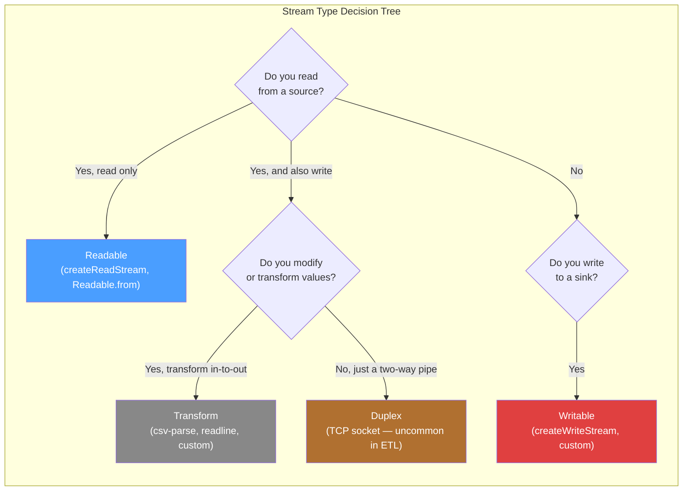
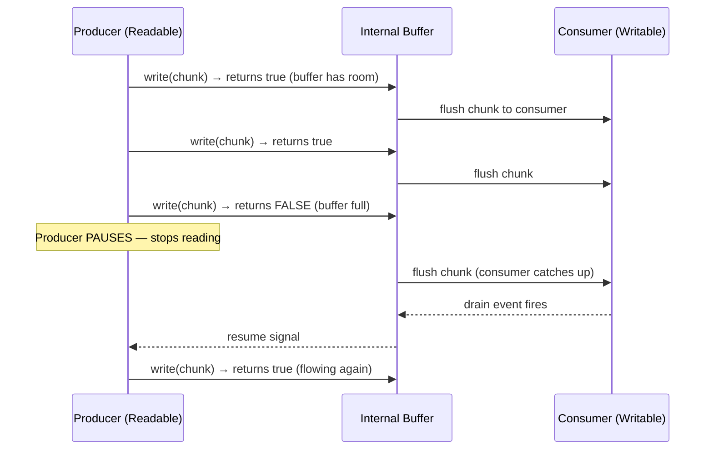
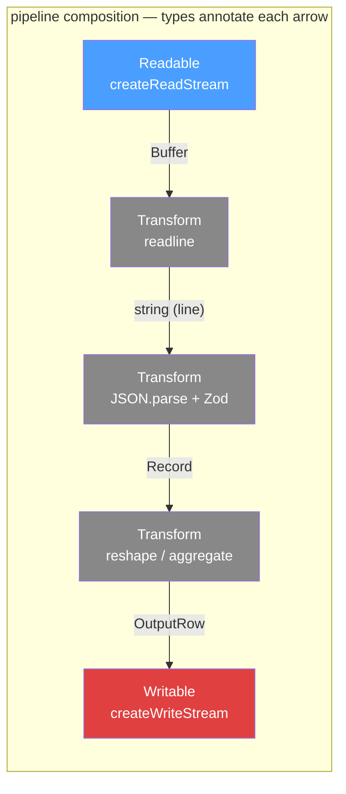
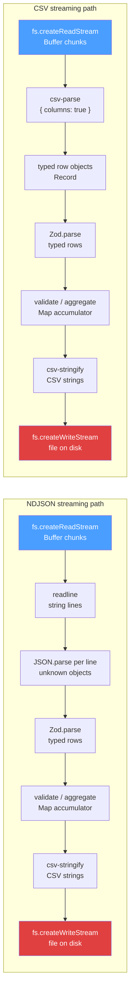
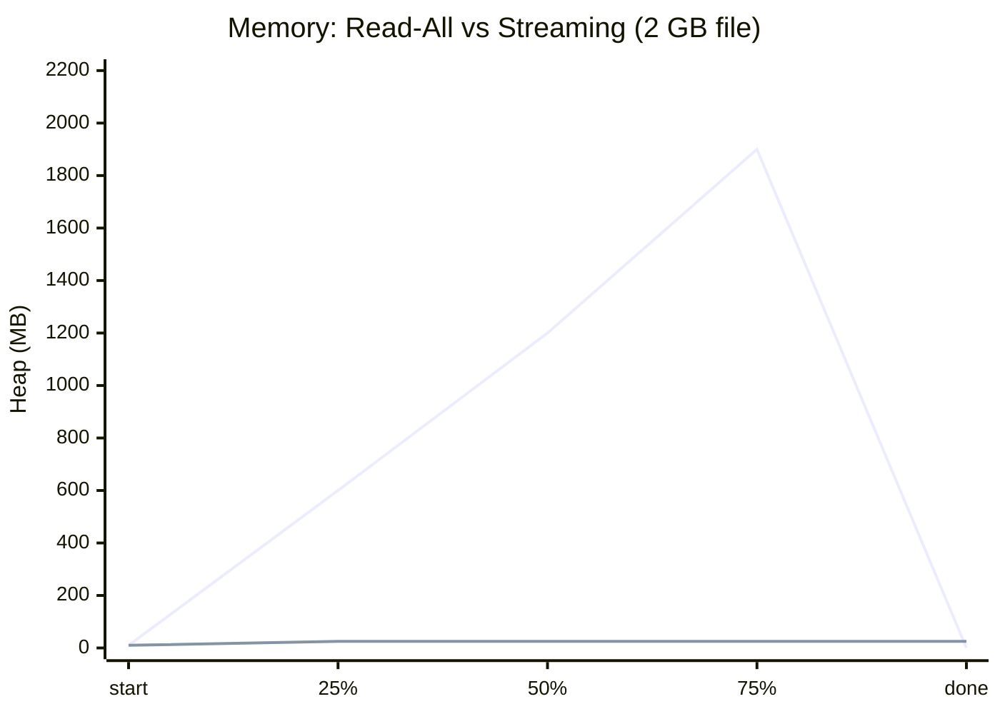

# Day 6 — Streams & Large Data

## What you already know that applies here

- Day 4: groupBy / aggregation — streaming aggregation is the same idea but the array stays abstract (you see one row at a time).
- Day 5: Zod validation — each streamed row is validated the same way, one at a time.
- Day 2: generics — async iterators are typed `AsyncGenerator<T>`, so your pipeline stays typed end to end.
- From Node basics: you know `fs.readFileSync` reads the whole file. Streams are what you use when that no longer fits in memory.

---

## Why Streams? The Motivating Problem

Imagine you receive a 2 GB NDJSON log file from production. Your first instinct:

```ts
import { readFileSync } from "node:fs";
const raw = readFileSync("events.ndjson", "utf8"); // 2 GB lands in RAM
const lines = raw.split("\n");
for (const line of lines) {
  const obj = JSON.parse(line);
  // process...
}
```

This crashes your Node.js process. Why? `readFileSync` reads the entire file into a single `Buffer` / `string` in memory. With a 2 GB file and a V8 heap limit of ~1.5 GB (default), you get `FATAL ERROR: Reached heap limit Allocation failed - JavaScript heap out of memory`.

The fix is to **never hold the whole thing at once**. Instead, process the file in small, bounded chunks that flow through your program and get garbage-collected after use. This is the stream model.

A stream is an abstraction over a sequence of data that arrives (or is consumed) over time. You process piece 1, throw it away, then process piece 2. Memory stays flat regardless of file size.

```
File on disk  →  [chunk 1]  →  process  →  done  →  [chunk 2]  →  process  ...
                                                       ↑ chunk 1 is GC'd
```

---

## The Three Stream Types

### The mental model

Think of a city's water infrastructure. The reservoir is a **Readable** — a source that produces water on demand. A filtration plant is a **Transform** — water flows in dirty, flows out clean. Your home tap filling a bathtub is a **Writable** — a sink that consumes. A **Duplex** is a two-way radio pipe (TCP socket) — data flows in both directions independently.



Node.js has four stream classes. Three of them you will use constantly:

| Type | Purpose in one sentence |
|------|-------------------------|
| **Readable** | A source of data you can read from (a file, an HTTP response, a generator). |
| **Writable** | A sink that accepts data you write to it (a file, stdout, an HTTP request body). |
| **Transform** | A processing step that sits between a Readable and a Writable — it reads chunks in and writes (possibly different) chunks out. |
| **Duplex** | Both readable and writable independently (e.g., a TCP socket). Uncommon in ETL work. |

A **pipeline** is just Readable → Transform → Transform → ... → Writable.

**I do**

```ts
// Readable: source
import { createReadStream } from "node:fs";
const src = createReadStream("data.ndjson", { encoding: "utf8" });
// src is a Readable — it produces string chunks

// Transform: processing step
import { Transform } from "node:stream";
const upper = new Transform({
  objectMode: false,
  transform(chunk: string, _enc, cb) {
    this.push(chunk.toUpperCase()); // push the transformed value downstream
    cb();                          // signal "ready for next chunk"
  },
});

// Writable: sink
import { createWriteStream } from "node:fs";
const dest = createWriteStream("out.txt");
```

**We do**

What stream type would you use for each of these?

1. `fs.createReadStream` — ?
2. `csv-parse` — ?
3. `fs.createWriteStream` — ?
4. A TCP socket — ?

<details>
<summary>Answer</summary>

1. Readable
2. Transform (reads bytes/strings, emits objects)
3. Writable
4. Duplex

</details>

**You do**

Write a one-sentence description (no code needed) of what a Transform stream that validates each row with Zod would do. What goes in? What comes out? What happens to invalid rows?

---

## Events vs Async Iteration

### The mental model

The event API is like subscribing to push notifications — the producer calls you whenever it has data, and you have no way to say "hold on, I'm busy." The async iteration API is like pulling items off a shelf one at a time — you control the pace, and the shelf waits if you're not ready.

```mermaid
flowchart TB
    subgraph "Event API (old)"
        direction TB
        E1[stream.on\('data'\, cb\)] --> E2["cb called whenever\nproducer has a chunk"]
        E2 --> E3["No built-in pause\n— you must manage\nbackpressure manually"]
        E3 --> E4["Error via stream.on\('error'\, cb\)"]
    end

    subgraph "Async Iteration (modern)"
        direction TB
        A1["for await (const chunk of stream)"] --> A2["Loop body runs,\nthen pulls next chunk"]
        A2 --> A3["Stream pauses while\nloop body runs\n— backpressure free"]
        A3 --> A4["Error via try/catch\naround the loop"]
    end
```

### The Old Way: Events

Node streams are `EventEmitter`s. The original API:

```ts
const stream = fs.createReadStream("big.ndjson", { encoding: "utf8" });

stream.on("data", (chunk: string) => {
  // chunk arrives here
});
stream.on("end", () => {
  console.log("done");
});
stream.on("error", (err) => {
  console.error(err);
});
```

This works, but it's callback-based, hard to reason about, and very easy to get wrong (especially backpressure — more on that below). Error handling is manual. Composing multiple transforms is messy.

### The Modern Way: Async Iteration

Since Node.js 10, Readable streams implement the `AsyncIterable` protocol. That means you can use `for await...of`:

```ts
const stream = fs.createReadStream("big.ndjson", { encoding: "utf8" });

for await (const chunk of stream) {
  // chunk is a string (because encoding: "utf8")
  // the loop pauses while you process, handling backpressure automatically
}
```

**Always prefer `for await...of` over the event API.** Reasons:

1. Linear, top-to-bottom control flow.
2. Error handling uses normal `try/catch`.
3. Backpressure is automatic.
4. You can `break` out of the loop and the stream is destroyed cleanly.

**I do**

```ts
import { createReadStream } from "node:fs";

async function countBytes(path: string): Promise<number> {
  let total = 0;
  // for await: linear flow, try/catch handles errors, backpressure is free
  for await (const chunk of createReadStream(path)) {
    // chunk is a Buffer when no encoding is set
    total += (chunk as Buffer).length;
  }
  return total;
}
```

**We do**

Convert this event-based snippet to `for await...of`:

```ts
const rl = createInterface({ input: createReadStream("log.txt") });
let count = 0;
rl.on("line", (line) => { if (line.includes("ERROR")) count++; });
rl.on("close", () => console.log(count));
rl.on("error", (e) => console.error(e));
```

<details>
<summary>Answer</summary>

```ts
const rl = createInterface({ input: createReadStream("log.txt") });
let count = 0;
try {
  for await (const line of rl) {
    if (line.includes("ERROR")) count++;
  }
  console.log(count);
} catch (e) {
  console.error(e);
}
```

</details>

**You do**

Write a function `firstNLines(path: string, n: number): Promise<string[]>` using `for await...of` and `readline`. It should return without reading the rest of the file after collecting `n` lines.

---

## Backpressure

### The mental model

Backpressure is a conveyor belt with a speed limit. If the downstream worker can't keep up, they raise a hand, the belt slows down, and the supplier pauses until the worker gives the green light. Without this, the buffer between them fills up and crashes the factory.



### Why ignoring it crashes your process

```ts
// DANGEROUS — no backpressure
readable.on("data", (chunk) => {
  writable.write(chunk); // write returns false when the internal buffer is full
                         // but we ignore the return value and keep calling write()
});
```

When `writable.write()` returns `false`, the writable's internal buffer is full. The writable is signaling: "stop sending me data until I drain." If you keep calling `write()`, the buffer grows unboundedly — heap explosion.

### How pipeline and async iteration handle it for free

When you use `for await...of` on a Readable, or use `stream.pipeline`, Node automatically pauses the upstream Readable whenever the downstream buffer fills, and resumes it when the downstream drains. You never think about it.

```ts
import { pipeline } from "node:stream/promises";

// pipeline handles all backpressure internally
await pipeline(readable, transform1, transform2, writable);
```

This is the single biggest reason to use `pipeline` and async iteration instead of manual `.pipe()` or `.on('data')`.

**I do**

```ts
// Manual backpressure (educational — use pipeline in practice)
import { createReadStream, createWriteStream } from "node:fs";

const src = createReadStream("huge.bin");
const dest = createWriteStream("copy.bin");

src.on("data", (chunk) => {
  const ok = dest.write(chunk); // returns false when buffer full
  if (!ok) {
    src.pause();                // stop reading
    dest.once("drain", () => src.resume()); // resume when consumer catches up
  }
});
src.on("end", () => dest.end());
```

**We do**

Why does this two-liner work safely even on a 10 GB file?

```ts
await pipeline(createReadStream("10gb.bin"), createWriteStream("copy.bin"));
```

<details>
<summary>Answer</summary>

`pipeline` watches the return value of every `write()` call. When the Writable signals full (returns `false`), pipeline pauses the Readable. When the Writable fires `drain`, pipeline resumes the Readable. Backpressure is fully managed — the buffer stays bounded no matter how large the file is.

</details>

**You do**

In the event API example above, what happens if you remove the `src.pause()` and `dest.once('drain', ...)` lines but keep the `ok` check? Describe the symptom.

---

## `stream.pipeline` from `node:stream/promises`

### The mental model

Think of `pipeline` as a general contractor who wires subcontractors together, makes sure each one passes work to the next, and — crucially — fires everyone and cleans up the job site the moment any one subcontractor makes a serious mistake.



`pipeline` wires streams together safely:

```ts
import { pipeline } from "node:stream/promises";
import { createReadStream, createWriteStream } from "node:fs";
import { createGzip } from "node:zlib";

await pipeline(
  createReadStream("input.txt"),
  createGzip(),
  createWriteStream("output.txt.gz")
);
```

Key properties:
- Returns a `Promise` that resolves when the pipeline finishes, or rejects on the first error.
- On error, **all streams in the pipeline are destroyed** — no dangling open file handles or zombie transforms.
- Manages backpressure between every pair of stages.

### Why `.pipe()` is legacy

The old `.pipe()` method does not handle errors from downstream. If a writable errors, the readable keeps reading and you leak the file descriptor. You have to manually attach error listeners to every stream. `pipeline` does all of this for you.

```ts
// Legacy — do not use
readable.pipe(transform).pipe(writable); // no error propagation

// Modern — use this
await pipeline(readable, transform, writable);
```

**I do**

```ts
import { pipeline } from "node:stream/promises";
import { createReadStream, createWriteStream } from "node:fs";
import { parse } from "csv-parse";
import { stringify } from "csv-stringify";
import { Transform } from "node:stream";

// A Transform that uppercases the "name" field of each CSV row
const upperName = new Transform({
  objectMode: true,
  transform(row: Record<string, string>, _enc, cb) {
    this.push({ ...row, name: row.name.toUpperCase() });
    cb();
  },
});

await pipeline(
  createReadStream("input.csv", { encoding: "utf8" }),
  parse({ columns: true, trim: true }),   // Buffer → object
  upperName,                              // object → object
  stringify({ header: true }),            // object → string
  createWriteStream("output.csv")
);
// Promise resolves when all rows are written and file is flushed.
// If any stage throws, all streams are destroyed automatically.
```

**We do**

What does `pipeline` do differently from `.pipe()` when the Writable (file system) runs out of disk space mid-write?

<details>
<summary>Answer</summary>

`pipeline` attaches an error listener to every stage. When the Writable emits an `'error'` event (e.g., `ENOSPC`), `pipeline` calls `.destroy(err)` on every other stream in the chain — the Readable and all Transforms stop immediately. The returned Promise rejects with the error. With `.pipe()`, only the Writable closes; the Readable and Transforms keep running (leaking file descriptors) and the error is silently lost unless you manually wired `'error'` listeners.

</details>

**You do**

Add a `createGzip()` stage between the CSV stringify and the file write in the "I do" example. What import do you need and where exactly does it go?

---

## Async Iterators and Generators

### The mental model

An async generator is a lazy factory. Call it and you get a conveyor belt. Items appear on the belt only when you request them (`yield`). The factory does not produce everything up front — it waits until the caller is ready for the next item. This is exactly how streaming works.

### The `async function*` syntax

An async generator is a function that can `yield` values asynchronously:

```ts
async function* range(start: number, end: number): AsyncGenerator<number> {
  for (let i = start; i <= end; i++) {
    await new Promise((r) => setTimeout(r, 0)); // simulate async work
    yield i;
  }
}

for await (const n of range(1, 5)) {
  console.log(n); // 1, 2, 3, 4, 5
}
```

### Writing a custom async generator that yields parsed records

This is the key pattern for streaming file processing:

```ts
import { createReadStream } from "node:fs";
import { createInterface } from "node:readline";

async function* readNdjson<T>(path: string): AsyncGenerator<T> {
  const fileStream = createReadStream(path, { encoding: "utf8" });
  const rl = createInterface({ input: fileStream, crlfDelay: Infinity });

  for await (const line of rl) {
    const trimmed = line.trim();
    if (!trimmed) continue;
    try {
      yield JSON.parse(trimmed) as T;
    } catch {
      // skip malformed line
    }
  }
}
```

The `readline.createInterface` turns a readable into an async iterable of lines. You never hold more than one line in memory at a time.

### Higher-order async iterator utilities

```ts
async function* take<T>(iter: AsyncIterable<T>, n: number): AsyncGenerator<T> {
  let count = 0;
  for await (const item of iter) {
    yield item;
    if (++count >= n) break;
  }
}

async function* map<T, U>(
  iter: AsyncIterable<T>,
  fn: (item: T) => U | Promise<U>
): AsyncGenerator<U> {
  for await (const item of iter) {
    yield await fn(item);
  }
}
```

These let you build a composable pipeline using only generator functions, without Transform streams.

**I do**

```ts
// A filter utility — typed with generics like Day 2
async function* filter<T>(
  iter: AsyncIterable<T>,
  predicate: (item: T) => boolean | Promise<boolean>
): AsyncGenerator<T> {
  for await (const item of iter) {
    if (await predicate(item)) {
      yield item;            // only forward items that pass
    }
    // items that fail the predicate are dropped; they get GC'd immediately
  }
}

// Usage: stream only "click" events from a huge log
interface Event { type: string; ts: number; userId: string }

for await (const ev of filter(readNdjson<Event>("log.ndjson"), (e) => e.type === "click")) {
  console.log(ev.userId);
}
```

**We do**

What does `AsyncGenerator<T>` mean as a return type? Why is `T` defined at the call site rather than inside the function?

<details>
<summary>Answer</summary>

`AsyncGenerator<T>` is the type of an object that implements the async iterator protocol: it has a `.next()` method that returns `Promise<{ value: T; done: boolean }>`. The `T` is a generic parameter — the caller supplies the concrete type (`Event`, `Row`, etc.) at the call site because the generator itself does not know what shape the data will be. This is the same Day 2 generic pattern: the function is reusable across any type, and TypeScript enforces consistency at the call site.

</details>

**You do**

Write a signature (no body) for `flatMap<T, U>(iter: AsyncIterable<T>, fn: (item: T) => AsyncIterable<U>): AsyncGenerator<U>`. When would you use it in a streaming ETL?

---

## Reading a File as a Stream

### The mental model

`createReadStream` is a tap on a pipe from disk. You open the tap (create the stream), and data flows out in configurable-size chunks. The disk does not dump the whole file into RAM first — it reads a chunk, hands it to you, reads the next chunk, and so on. You are in control of how big each chunk is.

**I do**

```ts
import { createReadStream } from "node:fs";

// With encoding — chunks are strings
const textStream = createReadStream("data.txt", { encoding: "utf8" });

// Without encoding — chunks are Buffer objects
const binaryStream = createReadStream("image.png");
```

**Always set `encoding: "utf8"` when processing text files.** Without it, you get `Buffer` objects. A `Buffer` chunk may split a multi-byte UTF-8 character at a boundary, corrupting it. The `encoding` option handles this correctly.

You can also control chunk size:
```ts
createReadStream("big.csv", { encoding: "utf8", highWaterMark: 64 * 1024 }) // 64 KB chunks
```

**We do**

If you set `highWaterMark: 1` on a text stream reading a 1 MB file, what happens to performance and why?

<details>
<summary>Answer</summary>

Performance degrades dramatically. The stream will make one syscall per byte — roughly 1,000,000 `read()` syscalls instead of ~16 (at 64 KB default). Each syscall has overhead. The default 64 KB gives a good balance between fewer syscalls and not occupying too much RAM per chunk. Tuning `highWaterMark` up can help throughput when the downstream is fast; tuning it down helps when the downstream is slow and you want to return memory to the GC sooner.

</details>

**You do**

When would you NOT set `encoding: "utf8"` on a `createReadStream` call? Name a real use case.

---

## Line-by-Line Reading

### The mental model

`readline` is an adapter: it takes a stream of bytes (possibly arriving mid-line) and stitches them together until it finds a newline, then emits the complete line. It buffers only the current incomplete line — not the entire file.

**I do**

```ts
import { createInterface } from "node:readline";
import { createReadStream } from "node:fs";

const rl = createInterface({
  input: createReadStream("data.txt", { encoding: "utf8" }),
  crlfDelay: Infinity, // handle \r\n line endings on Windows
});

for await (const line of rl) {
  console.log(line);
}
```

`crlfDelay: Infinity` tells readline to treat `\r\n` as a single newline regardless of the delay between the `\r` and `\n` characters arriving in separate chunks. Always set it.

**We do**

A chunk boundary falls in the middle of a line: chunk 1 ends with `...{"id":1,"na` and chunk 2 starts with `me":"Alice"}\n`. What does `readline` do with this?

<details>
<summary>Answer</summary>

`readline` buffers the partial content from chunk 1. When chunk 2 arrives, it appends it to the buffer, finds the `\n`, and emits the complete line `{"id":1,"name":"Alice"}` as a single `line` event. The partial-line buffer is then cleared. You never see a split line in your `for await` loop.

</details>

**You do**

Rewrite the `readNdjson` generator from the "Async Iterators" section using `readline`, making it generic and skipping blank lines.

---

## NDJSON Processing

### The mental model

NDJSON is a log file format where each line is a self-contained JSON document. Unlike a single large JSON array (which forces you to parse the whole thing before you can use any of it), NDJSON lets you process row 1 before row 1,000,000 even exists.



NDJSON (Newline-Delimited JSON) is the de facto format for large JSON datasets. Each line is a complete, self-contained JSON value:

```
{"id":1,"event":"click","ts":1700000000}
{"id":2,"event":"view","ts":1700000001}
{"id":3,"event":"click","ts":1700000002}
```

Processing strategy:
1. Read the file line by line (never `.split('\n')` on a big file).
2. Parse each line individually with `JSON.parse`.
3. Skip malformed lines (log them but don't crash).
4. Optionally validate with Zod.

```ts
async function* readNdjson<T>(
  path: string,
  onMalformed?: (line: string, err: unknown) => void
): AsyncGenerator<T> {
  const rl = createInterface({
    input: createReadStream(path, { encoding: "utf8" }),
    crlfDelay: Infinity,
  });

  for await (const line of rl) {
    const trimmed = line.trim();
    if (!trimmed) continue;
    try {
      yield JSON.parse(trimmed) as T;
    } catch (err) {
      onMalformed?.(trimmed, err);
    }
  }
}
```

**I do**

```ts
import { z } from "zod";

const EventSchema = z.object({
  id: z.number(),
  event: z.string(),
  ts: z.number(),
});
type Event = z.infer<typeof EventSchema>;

async function* readValidatedNdjson(path: string): AsyncGenerator<Event> {
  for await (const raw of readNdjson<unknown>(path)) {
    const result = EventSchema.safeParse(raw);
    if (result.success) {
      yield result.data;         // only typed, validated rows flow downstream
    } else {
      console.warn("Invalid row skipped:", result.error.issues);
    }
  }
}
```

**We do**

Why do we pass `unknown` as the generic argument to `readNdjson` in the validated version, rather than `Event`?

<details>
<summary>Answer</summary>

`JSON.parse` always returns `any` — TypeScript cannot know the shape of data from disk at compile time. Passing `Event` as the generic would be a lie to the compiler: we would be asserting the shape is correct before we have checked it. We pass `unknown` to be honest: the raw parsed value is unknown, and we use Zod's `safeParse` to narrow it to `Event` only after validation succeeds.

</details>

**You do**

Write a one-line change to `readNdjson` that counts and returns the number of malformed lines at the end, without breaking the generator contract.

---

## CSV Streaming with `csv-parse`

### The mental model

A CSV file is just a text file with commas. `csv-parse` is a Transform stream that reads text chunks, finds column boundaries and row boundaries, and emits one plain object per row. The first row becomes the key names. You never parse the whole file at once.

`csv-parse` ships as a Transform stream. Use it with `pipeline`:

```ts
import { parse } from "csv-parse";
import { createReadStream } from "node:fs";
import { pipeline } from "node:stream/promises";
import { Writable } from "node:stream";

interface Row {
  name: string;
  amount: string;
}

const rows: Row[] = [];

await pipeline(
  createReadStream("data.csv", { encoding: "utf8" }),
  parse({ columns: true, trim: true }),
  new Writable({
    objectMode: true,
    write(row: Row, _enc, cb) {
      rows.push(row);
      cb();
    },
  })
);
```

Key options:
- `columns: true` — uses the first line as header names, yields plain objects.
- `trim: true` — strips whitespace from values.
- `cast: true` — auto-casts numbers and booleans (careful: all numbers become JS numbers).
- `skip_empty_lines: true` — ignores blank lines.

`csv-parse` operates in **object mode** after the header line. Object mode streams pass arbitrary JS objects chunk-to-chunk instead of `Buffer`/`string`. Note that `objectMode: true` must be set on any Writable that consumes object-mode output.

### Async iteration with csv-parse

```ts
const parser = createReadStream("data.csv", { encoding: "utf8" }).pipe(
  parse({ columns: true })
);

for await (const row of parser) {
  // row is typed as unknown — cast or validate with Zod
}
```

**I do**

```ts
import { parse } from "csv-parse";
import { createReadStream } from "node:fs";
import { z } from "zod";

const RowSchema = z.object({
  product: z.string(),
  revenue: z.string().transform(Number), // CSV values are always strings; cast here
  region: z.string(),
});

async function* streamCsv(path: string) {
  const parser = createReadStream(path, { encoding: "utf8" }).pipe(
    parse({ columns: true, trim: true, skip_empty_lines: true })
  );

  for await (const raw of parser) {
    const result = RowSchema.safeParse(raw);
    if (result.success) yield result.data;
    else console.warn("Skipped row:", result.error.issues);
  }
}
```

**We do**

Why must the Writable in the `pipeline` example have `objectMode: true`? What error do you get if you omit it?

<details>
<summary>Answer</summary>

`csv-parse` with `columns: true` emits plain JS objects, not Buffers or strings. A Writable with `objectMode: false` (the default) only accepts `string`, `Buffer`, or `Uint8Array`. Passing an object to it throws `TypeError [ERR_INVALID_ARG_TYPE]: The "chunk" argument must be an instance of Buffer or string`.

</details>

**You do**

Add a `cast: true` option to the `parse()` call in the "I do" example. What happens to the `revenue` field in the Zod schema — do you still need `.transform(Number)`?

---

## Writing Large Files

### The mental model

Writing is just the mirror of reading. Instead of pulling chunks off a source, you push chunks into a sink. `csv-stringify` turns objects into CSV text chunks. `createWriteStream` funnels those chunks to disk one at a time, backpressure managed by `pipeline`.

**I do**

```ts
import { createWriteStream } from "node:fs";
import { stringify } from "csv-stringify";
import { pipeline } from "node:stream/promises";
import { Readable } from "node:stream";

const rows = [
  { name: "Alice", score: 42 },
  { name: "Bob", score: 88 },
];

await pipeline(
  Readable.from(rows),          // wraps any iterable as a Readable
  stringify({ header: true }),  // csv-stringify Transform
  createWriteStream("out.csv")
);
```

`Readable.from(iterable)` is extremely useful: it turns any sync or async iterable into a Readable stream. This lets you compose generator pipelines with stream pipelines.

**We do**

`Readable.from` accepts both sync iterables (arrays) and async iterables (generators). In an ETL that streams 100k rows through a generator, why is `Readable.from(myAsyncGenerator())` better than `Readable.from(await collectAll(myAsyncGenerator()))`?

<details>
<summary>Answer</summary>

`collectAll` would accumulate all 100k rows into memory before starting to write — defeating the point of streaming. `Readable.from(myAsyncGenerator())` pulls one row at a time from the generator as the downstream Writable is ready. Memory stays bounded to one row at a time (plus the small internal buffer).

</details>

**You do**

Write the `pipeline` call that streams from an async generator `aggregatedRows(): AsyncGenerator<OutputRow>` through `csv-stringify` to a file `results.csv`, with gzip compression in between.

---

## Memory Profile

### The mental model

Reading a whole file is like ordering a truckload of bricks delivered to your living room — the truck dumps everything at once and your house collapses. Streaming is like a conveyor belt through a window: one brick arrives, you place it, the brick slot is freed, the next brick arrives.



Why streaming keeps memory flat:

```
Time  →→→→→→→→→→→→→→→→→→→→→→→→
       [reading chunk 1]
              [processing chunk 1]
                      [GC frees chunk 1]
                      [reading chunk 2]
                             [processing chunk 2]
                                     [GC frees chunk 2]

Heap:  ____/‾\_____/‾\_____/‾\____   (stays bounded)

vs. read-all-first:
       [reading ██████████████████████] OOM crash
```

The key insight: **chunks are short-lived objects**. They are allocated, processed, and become eligible for GC almost immediately. The GC doesn't need to hold the entire dataset alive to process it.

Your aggregation data structures (Maps, counters) live in memory for the duration, but they are bounded by design — a Map with 20 category keys uses negligible memory even when processing 1M rows.

**I do**

```ts
// Measure peak heap during a stream
import { createReadStream } from "node:fs";

let peakHeap = 0;
for await (const chunk of createReadStream("2gb.ndjson")) {
  const used = process.memoryUsage().heapUsed;
  if (used > peakHeap) peakHeap = used;
}
console.log(`Peak heap: ${(peakHeap / 1024 / 1024).toFixed(1)} MB`);
// Typically stays under 100 MB even for a 2 GB file
```

**We do**

If your aggregation Map grows to 500k entries (high-cardinality key), does streaming still help? Why or why not?

<details>
<summary>Answer</summary>

Streaming still helps: the raw row data is not held in memory (chunks are GC'd). But the Map itself could use significant memory — a Map with 500k string-key, number-value entries is roughly 40–80 MB in V8. That is manageable. The real danger is when you store the entire row object as the map value (e.g., `Map<string, Row[]>`) — then you're back to holding the dataset in RAM. Design aggregations to accumulate only scalars (counts, sums) not full rows.

</details>

**You do**

Describe a scenario where streaming does NOT reduce memory usage at all, no matter how carefully you code it.

---

## Aggregation Over Streams

### The mental model

A streaming aggregation is a running tally. You walk through a crowd and count hands raised by category, updating your notepad as you go. At the end you have the totals. You never needed to remember everyone — just the running count per category.

```ts
const counts = new Map<string, number>();

for await (const event of readNdjson<Event>(path)) {
  const key = event.category;
  counts.set(key, (counts.get(key) ?? 0) + 1);
}

// counts is now the full aggregation
```

The Map lives in memory, but it only holds one entry per unique key. If key cardinality is bounded (e.g., 20 product categories), memory is bounded regardless of row count.

**Unbounded aggregation = unbounded memory.** If you `groupBy` a UUID field, your Map will have one entry per row and you have the same problem as loading the whole file. Design your schemas so the aggregation keys are finite.

**I do**

```ts
// Full streaming groupBy-sum example (Day 4 groupBy — now one row at a time)
interface SaleRow { region: string; revenue: number }

async function aggregateSales(path: string): Promise<Map<string, number>> {
  const totals = new Map<string, number>(); // lives in memory — bounded by region count

  for await (const row of readValidatedNdjson(path)) {
    totals.set(row.region, (totals.get(row.region) ?? 0) + row.revenue);
  }
  return totals;
}
```

**We do**

Adapt the above to also track `count` per region (not just total revenue). What data structure do you use?

<details>
<summary>Answer</summary>

```ts
const totals = new Map<string, { sum: number; count: number }>();

for await (const row of readValidatedNdjson(path)) {
  const prev = totals.get(row.region) ?? { sum: 0, count: 0 };
  totals.set(row.region, { sum: prev.sum + row.revenue, count: prev.count + 1 });
}
```

A `Map<string, { sum: number; count: number }>` — same bounded cardinality, just a richer value.

</details>

**You do**

Write a streaming function that finds the single row with the maximum `revenue` without storing all rows. What is the memory complexity?

---

## Error Handling in Pipelines

### The mental model

`pipeline` is an error bus. Any stage can throw — a corrupt chunk, a disk write failure, a Zod validation error that you forgot to catch internally. The moment one stage fails, pipeline calls `.destroy(err)` on every other stage (closing file handles, stopping reads), then rejects the promise. Your `catch` block is the single point of recovery.

```ts
import { pipeline } from "node:stream/promises";

try {
  await pipeline(readable, transform, writable);
} catch (err) {
  console.error("Pipeline failed:", err);
  // All streams are already destroyed by pipeline — no cleanup needed
}
```

Key points:
1. `pipeline` rejects on the first error from any stage.
2. On rejection, all other streams are destroyed (no leaks).
3. Partial output **has already been written** to the Writable. If you write to a file and fail midway, the output file is incomplete. Consider writing to a temp file and renaming it atomically on success.
4. Always `await pipeline(...)` — fire-and-forget leaves dangling streams.

```ts
// Atomic write pattern
import { rename } from "node:fs/promises";

const tmpPath = `${outputPath}.tmp`;
try {
  await pipeline(readable, transform, createWriteStream(tmpPath));
  await rename(tmpPath, outputPath); // atomic on most filesystems
} catch (err) {
  await unlink(tmpPath).catch(() => {}); // clean up partial file
  throw err;
}
```

**I do**

```ts
// Propagating a per-row validation error through the pipeline
import { Transform } from "node:stream";

const validateTransform = new Transform({
  objectMode: true,
  transform(row: unknown, _enc, cb) {
    const result = RowSchema.safeParse(row);
    if (result.success) {
      this.push(result.data);
      cb();
    } else {
      // cb(err) signals an error to pipeline — it will destroy all stages
      cb(new Error(`Invalid row: ${JSON.stringify(result.error.issues)}`));
    }
  },
});
```

**We do**

Why is the atomic write pattern (write to `.tmp`, then `rename`) important, even though `pipeline` cleans up streams?

<details>
<summary>Answer</summary>

`pipeline` destroys streams and closes file handles, but it cannot un-write bytes that already landed on disk. If the pipeline fails after writing 50k of 100k rows, the output file contains incomplete data. If another process is reading that output file (e.g., downstream ETL), it will silently process a truncated dataset. Writing to a `.tmp` file ensures the final path only ever contains fully-written output: `rename` is atomic on POSIX systems (either the old file or the new file is visible, never a partial state).

</details>

**You do**

How would you handle per-row validation errors gracefully (log and skip) rather than crashing the whole pipeline? Sketch the change to `validateTransform`.

---

## Windowing / Batching

### The mental model

Batching is a dishwasher heuristic. Running the dishwasher for one plate is wasteful. Waiting until it is completely full before running also fails if plates keep arriving. A batch of N is the sweet spot: collect N items, flush, repeat. The remainder flush at the end handles the last partial batch.

```ts
async function* batch<T>(
  iter: AsyncIterable<T>,
  size: number
): AsyncGenerator<T[]> {
  let buf: T[] = [];
  for await (const item of iter) {
    buf.push(item);
    if (buf.length >= size) {
      yield buf;
      buf = [];
    }
  }
  if (buf.length > 0) yield buf; // flush remainder
}

// Usage
for await (const rows of batch(readNdjson<Row>(path), 1000)) {
  await db.insertMany(rows); // 1000-row batches
}
```

The `flushEvery` pattern is similar — yield after N items, or after N milliseconds (whichever comes first), useful for near-real-time dashboards.

**I do**

```ts
// Time-based flush: yield a batch after N items OR after N ms, whichever is first
async function* batchWithTimeout<T>(
  iter: AsyncIterable<T>,
  size: number,
  ms: number
): AsyncGenerator<T[]> {
  let buf: T[] = [];
  let deadline = Date.now() + ms;

  for await (const item of iter) {
    buf.push(item);
    if (buf.length >= size || Date.now() >= deadline) {
      yield buf;
      buf = [];
      deadline = Date.now() + ms;
    }
  }
  if (buf.length > 0) yield buf;
}
```

**We do**

In the `batch` generator, what happens if the input iterator has exactly `size` items? Does the `if (buf.length > 0) yield buf` at the end run?

<details>
<summary>Answer</summary>

The `if (buf.length >= size)` branch runs on the last item, yielding the full batch and resetting `buf = []`. After the loop ends, `buf.length` is 0, so the final `if (buf.length > 0) yield buf` does NOT run. The final flush only matters for the remainder (e.g., 1050 items with batch size 1000: one batch of 1000, then the final flush of 50).

</details>

**You do**

Write a `batchByKey<T>(iter: AsyncIterable<T>, key: (item: T) => string, size: number): AsyncGenerator<T[]>` that yields batches only when N items share the same key. Describe the data structure you would use.

---

## Mermaid Pipeline Diagram


Each box is a stage. Data flows left to right as chunks. Memory at any point = one chunk's worth of data per in-flight stage.

---

## Gotchas

### Holding the whole stream in an array defeats the point

```ts
const allRows: Row[] = [];
for await (const row of readNdjson<Row>(path)) {
  allRows.push(row); // ← you just loaded 2 GB into memory
}
```

If you need to accumulate, accumulate an **aggregation** (a Map of counts), not the raw rows.

### Forgetting `await` on pipeline leaves dangling streams

```ts
pipeline(readable, transform, writable); // ← BUG: no await
// function returns, streams keep running in the background
// errors are unhandled, file handles never close
```

Always `await pipeline(...)`.

### Not setting `encoding` gives you Buffers

```ts
const stream = createReadStream("data.txt"); // no encoding
for await (const chunk of stream) {
  console.log(chunk); // Buffer <48 65 6c 6c 6f ...>
  JSON.parse(chunk.toString()); // manual conversion, error-prone
}
```

Set `encoding: "utf8"` and get strings directly.

### `objectMode` mismatch

If a Transform writes plain objects but you pipe to a Writable with `objectMode: false` (the default), Node throws. Make sure all stages that pass objects have `objectMode: true`.

### readline does not emit the last line if it lacks a trailing newline

Tested in practice: `readline` will emit the last line even without a trailing newline. But be aware that some text editors add trailing newlines and some don't — the behavior is consistent, but something to keep in mind when generating NDJSON programmatically.

---

## Mental-model summary

```mermaid
flowchart TD
    subgraph "Full ETL pipeline — types annotated"
        SRC["Source file on disk\n(100k-row NDJSON)"]
        RS["fs.createReadStream\nReadable\nBuffer chunks"]
        RL["readline.createInterface\nTransform\nBuffer → string lines"]
        JP["JSON.parse per line\nTransform\nstring → unknown"]
        ZV["Zod.safeParse\nTransform\nunknown → ValidatedRow"]
        TR["reshape / transform\nTransform\nValidatedRow → OutputRow"]
        AG["groupBy / aggregate\naccumulator Map in memory\nOutputRow → summary"]
        CS["csv-stringify\nTransform\nsummary entries → CSV string"]
        WS["fs.createWriteStream\nWritable\nCSV string → file on disk"]
        DST["Destination file\n(result.csv)"]

        SRC --> RS
        RS -->|"Buffer"| RL
        RL -->|"string"| JP
        JP -->|"unknown"| ZV
        ZV -->|"ValidatedRow"| TR
        TR -->|"OutputRow"| AG
        AG -->|"[region, total][]"| CS
        CS -->|"CSV string"| WS
        WS --> DST
    end

    style SRC fill:#555,color:#fff
    style DST fill:#555,color:#fff
    style RS fill:#4a9eff,color:#fff
    style WS fill:#e04040,color:#fff
    style RL fill:#888,color:#fff
    style JP fill:#888,color:#fff
    style ZV fill:#888,color:#fff
    style TR fill:#888,color:#fff
    style AG fill:#b07030,color:#fff
    style CS fill:#888,color:#fff
```



Keep this diagram in your head when writing any file-processing ETL. Every box is a small, testable unit. Types flow left to right and narrow from `unknown` to `ValidatedRow`. The aggregation map (orange) is the only thing that lives in memory across the whole run.

---

## Check your understanding

<details>
<summary>1. A colleague writes: <code>const lines = (await readFile('big.ndjson', 'utf8')).split('\n')</code>. What is the first thing you say?</summary>

`readFile` reads the entire file into a single string before returning. For anything over a few MB this wastes memory; for files larger than the V8 heap (~1.5 GB default) it crashes the process. Replace with `readline` + `createReadStream` to process one line at a time. Memory stays bounded regardless of file size.

</details>

<details>
<summary>2. Your pipeline fails midway through writing a 1M-row CSV. The destination file now exists but has only 400k rows. How do you prevent downstream consumers from using the incomplete file?</summary>

Use the atomic write pattern: write to a `.tmp` file, then `rename` to the final path only after `pipeline` resolves. `rename` is atomic on POSIX — the final path either has the old complete file or the new complete file, never a partial state. Clean up the `.tmp` file in the `catch` block.

</details>

<details>
<summary>3. You add a groupBy on `userId` (a UUID) to your streaming aggregation. Memory usage climbs linearly with row count and eventually OOMs. Why, and what is the fix?</summary>

UUIDs are high-cardinality: one unique key per row. A Map with 1M UUID entries, each holding a row's worth of data, approaches 1M × row_size in memory — the same as loading the file. The fix: either pre-aggregate to a bounded key (e.g., prefix of UUID, or a different dimension like `region`), use an external store (Redis, SQLite) for the Map, or restructure the pipeline to sort-and-merge externally (multi-pass).

</details>

<details>
<summary>4. What is the difference between <code>highWaterMark</code> on a Readable and a Writable?</summary>

On a Readable, `highWaterMark` is the amount of data (bytes or objects) the internal read buffer holds before the stream pauses its underlying source (e.g., stops issuing `fs.read` syscalls). On a Writable, it is the threshold at which `write()` starts returning `false`, signaling backpressure to the upstream. They are independent knobs. The defaults (16 KB for byte streams, 16 objects for object mode) suit most ETL workloads.

</details>

<details>
<summary>5. You want to write a typed Transform using only async generators, without touching the <code>Transform</code> class. Show the pattern and how you connect it to <code>pipeline</code>.</summary>

```ts
async function* myTransform(source: AsyncIterable<string>): AsyncGenerator<MyType> {
  for await (const chunk of source) {
    yield parseChunk(chunk);
  }
}

await pipeline(
  createReadStream("data.txt", { encoding: "utf8" }),
  (source) => Readable.from(myTransform(source as AsyncIterable<string>)),
  createWriteStream("out.txt")
);
```

`pipeline` accepts a function that takes the upstream iterable and returns a new iterable. `Readable.from` wraps the async generator so `pipeline` can wire it correctly. TypeScript infers the type of each stage from the generator's return annotation.

</details>

---

## Mini Q&A

**Q1: When should I NOT use streams?**

When the file is small (under a few MB) and you want simplicity. `readFile` + `JSON.parse` is fine for a 10 KB config file. Streams add code complexity — only pay that cost when the data size demands it.

**Q2: Can I use `for await...of` on a Transform stream directly?**

Yes. Transform streams implement `AsyncIterable`. You can write:
```ts
for await (const row of createReadStream("data.csv").pipe(parse({ columns: true }))) {
  // ...
}
```
Note that `.pipe()` is used here just to connect the streams for iteration — error handling is still manual in this form. For production pipelines with error handling, prefer `pipeline`.

**Q3: What is the difference between `highWaterMark` on a Readable vs a Writable?**

On a Readable, `highWaterMark` controls how many bytes (or objects) the internal buffer holds before the stream pauses its source. On a Writable, it controls how many bytes buffer before `write()` returns `false` (signaling backpressure). They are independent tunable knobs; the defaults (16 KB for byte streams, 16 objects for object mode) are usually fine.

**Q4: How do I type a Transform stream strictly in TypeScript?**

Use the generic `Transform` class approach or, more commonly, write an async generator and use `Readable.from()`:
```ts
async function* myTransform(input: AsyncIterable<string>): AsyncGenerator<MyType> {
  for await (const chunk of input) {
    yield parseChunk(chunk);
  }
}

await pipeline(
  createReadStream("data.txt", { encoding: "utf8" }),
  (source) => Readable.from(myTransform(source as AsyncIterable<string>)),
  createWriteStream("out.txt")
);
```

**Q5: Why does `pipeline` clean up streams on error, but `.pipe()` doesn't?**

`.pipe()` was designed in the early Node.js era before error propagation conventions were established. It only listens for `close` and `end` events, not `error`. `pipeline` was designed specifically to fix this — it attaches error listeners to every stream in the chain and calls `.destroy()` on all of them when any one fails.
