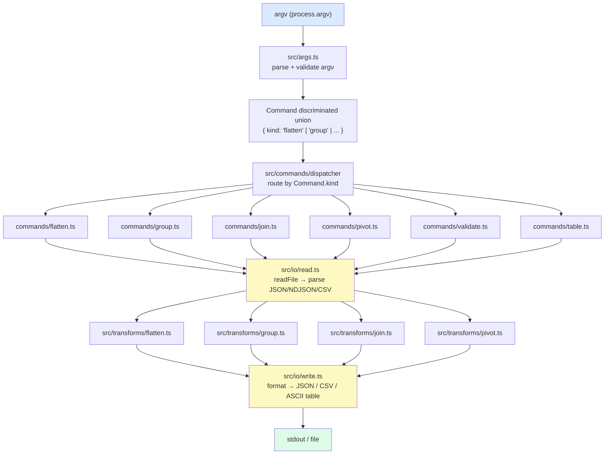
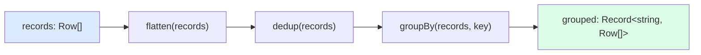
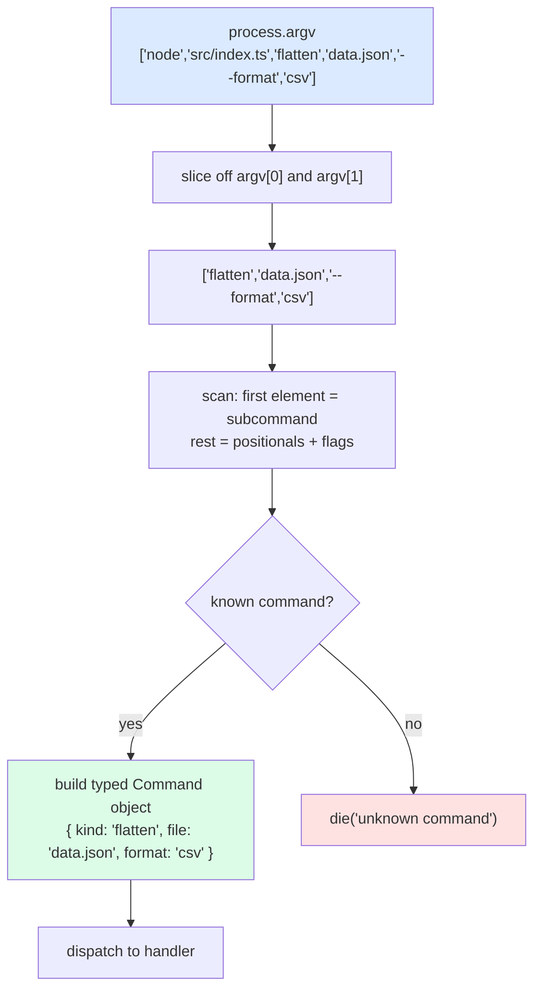
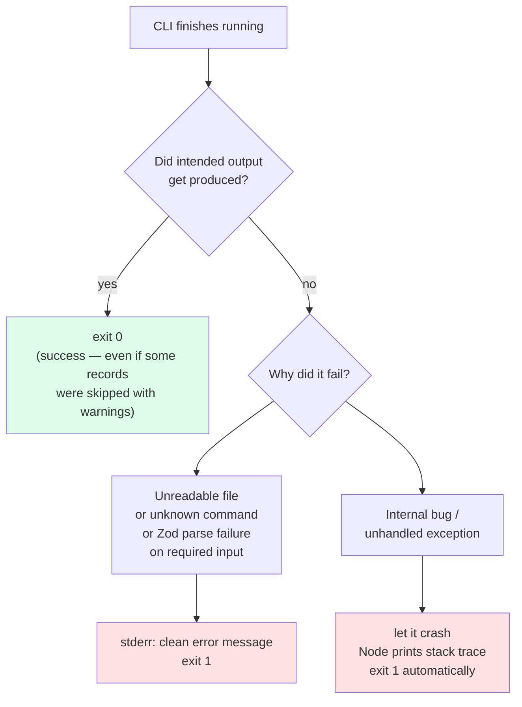
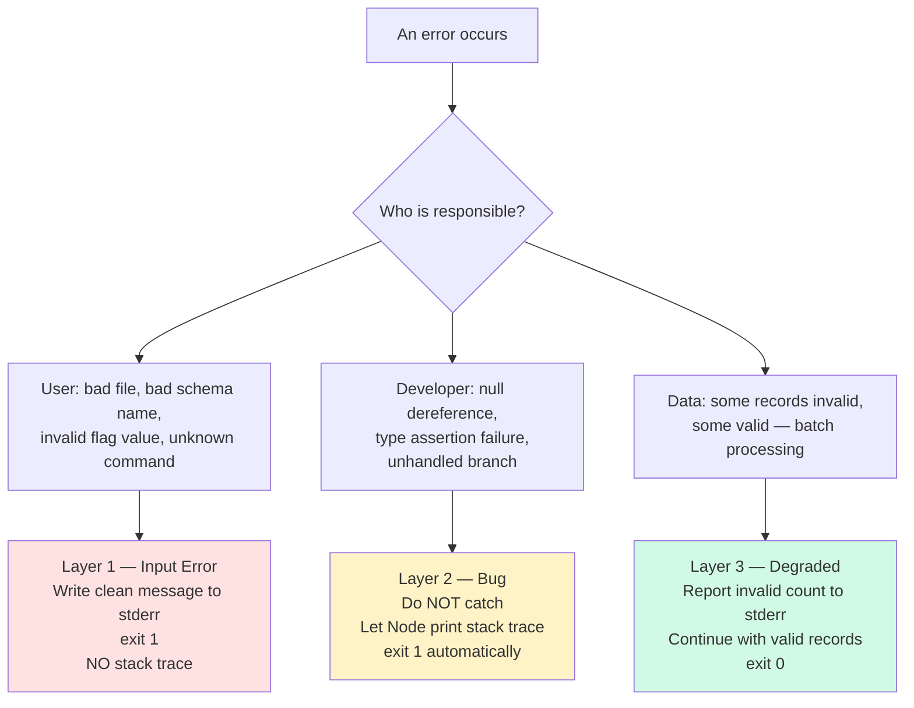
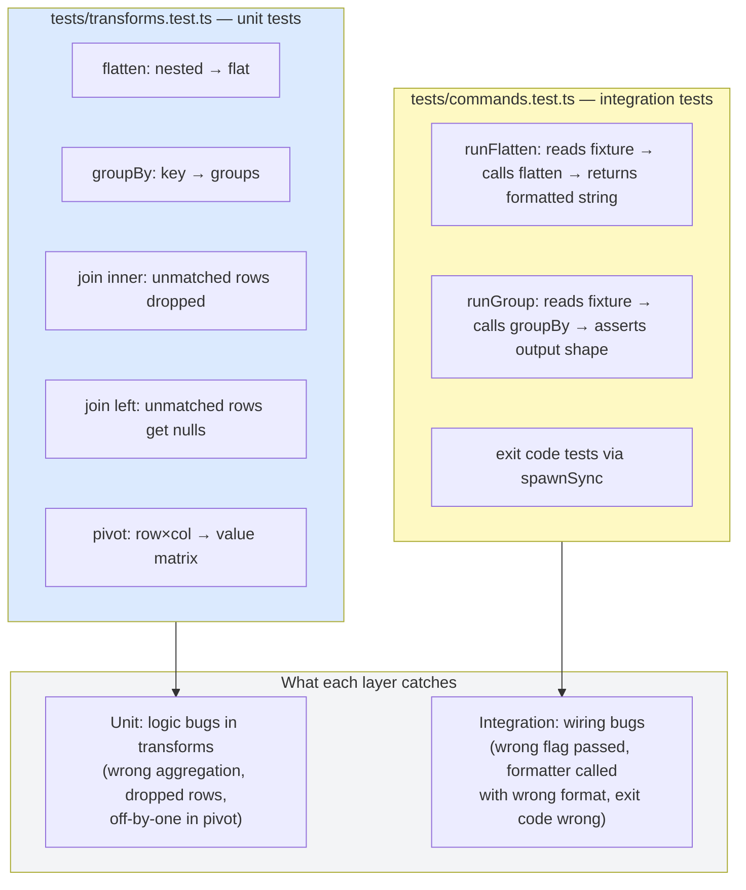
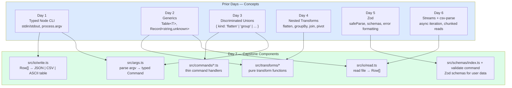

# Day 7 — Capstone: Data Toolkit CLI

## What you already know that applies here

- Day 1: typed Node CLI (ledger) — you've read stdin/files and printed output before.
- Day 2: generic `Table<T>` — the mental model of typed data containers.
- Day 3: discriminated unions — used here to type the `Command` variants in args.ts.
- Day 4: flatten, groupBy, join, pivot — these ARE the transforms the capstone exposes.
- Day 5: Zod — the `validate` subcommand and schema library.
- Day 6: streaming reads — the `csv-parse` integration uses what you learned yesterday.
- Day 7 is pure composition. You're not learning new mechanics — you're wiring the
  previous six days into one CLI with tests.

---

## What a Capstone Does for You

A capstone is not a test. It is a synthesis. After six days of learning individual techniques in isolation — type narrowing on day 1, generics on day 2, advanced types on day 3, nested transforms on day 4, Zod validation on day 5, streams on day 6 — the capstone asks: can you compose these ideas into something that behaves like real software?

The answer matters more than the code itself. Real software has layers. There is an I/O layer that reads and writes. There is a transformation layer that processes data. There is a presentation layer that formats results. There is an entry point that stitches everything together. When those layers are clean and decoupled, you can test each one independently, swap implementations without rewriting callers, and add a new subcommand in under 30 minutes.

When those layers are tangled — when your transform logic is littered with `console.log`, when your I/O code parses argv, when your main function is 400 lines long — the project becomes brittle. Adding a feature requires understanding everything at once. A bug in one place can silently corrupt another.

The capstone forces you to think in layers before you write a single line of code. The diagram is simple:

```
stdin / file
    ↓
  read.ts          ← I/O: parse text into typed arrays
    ↓
transform/*.ts     ← pure functions: flatten, group, join, pivot
    ↓
  write.ts         ← I/O: format typed arrays into text
    ↓
stdout / file
```

The commands in `src/commands/` are thin coordinators. Each command reads its specific options from the parsed argv, calls the right transform, and calls the right writer. The command should not contain transform logic. The transform should not contain I/O. This discipline pays off immediately when you write tests: transforms take plain objects and return plain objects. No mocks needed. No temp files needed.

---

## Layered Architecture

**The mental model**

Think of the capstone as a factory assembly line. Raw material (JSON/CSV text) enters at one end, passes through a series of specialized stations (parse → transform → format), and finished product (text output) exits at the other end. Each station has one job. The supervisor (`src/commands/*.ts`) decides which stations to activate and in what order, but does not perform the work itself.



The yellow boxes are the I/O boundary. Everything between them (the command handlers and transforms) should be pure and testable without touching the filesystem.

**I do**

```ts
// src/commands/flatten.ts — the full handler is thin on purpose
import { readRecords } from "../io/read.js";
import { flattenRecords } from "../transforms/flatten.js";
import { writeOutput } from "../io/write.js";
import type { FlattenCommand } from "../args.js";

export async function runFlatten(cmd: FlattenCommand): Promise<void> {
  // Step 1: I/O — read raw records from disk
  const records = await readRecords(cmd.file, cmd.input);

  // Step 2: pure transform — no side effects, fully testable
  const flat = flattenRecords(records, cmd.depth);

  // Step 3: I/O — format and emit
  await writeOutput(flat, cmd.format, cmd.output);
}
```

Notice: the handler contains zero business logic. It is an orchestrator. If you find yourself doing conditional branching or data manipulation inside a command handler, that logic belongs in a transform.

**We do**

Fill in the blank: the `runGroup` handler follows the same three-step pattern. What argument does it pass to the transform that `runFlatten` does not?

<details>
<summary>Answer</summary>

`runGroup` passes `cmd.by` (the grouping key) and optionally `cmd.agg` (the aggregation config) to `groupRecords`. `runFlatten` has no such keys — flattening is unconditional. The I/O steps are identical.

</details>

**You do**

Sketch a `runPivot` handler in a scratch file. Its signature accepts a `PivotCommand` with `.rowKey`, `.colKey`, `.valueKey`. Follow the three-step pattern exactly.

---

## Composition: Pipes and Pure Functions

**The mental model**

Composition is the Unix philosophy in TypeScript. Each function does one thing, takes typed data in, returns typed data out. You wire them together at the top, like pipes in a shell: `cat file | parse | filter | format > out`. The wiring is trivial when the pieces are pure.

A **pure function** has two properties: it always returns the same output for the same input, and it has no side effects. It does not read files, write to stdout, mutate shared state, or throw non-deterministic errors. Given the same array of records, `groupBy(records, "category")` always returns the same grouped result.



Each arrow is a function call. No I/O occurs. You can test any step by calling the function directly with a plain array.

**I do**

```ts
// A simple pipe utility — no library needed
function pipe<T>(value: T, ...fns: Array<(v: T) => T>): T {
  return fns.reduce((acc, fn) => fn(acc), value);
}

// Usage: chain transforms without intermediate variables
const result = pipe(
  records,
  flatten,                         // (rows: Row[]) => Row[]
  dedup,                           // (rows: Row[]) => Row[]
  r => groupBy(r, "type")          // (rows: Row[]) => Record<string, Row[]>
);
// ↑ works because each function's output type matches the next's input type
```

A more flexible pipe handles different input and output types:

```ts
function pipe<A, B>(a: A, ab: (a: A) => B): B;
function pipe<A, B, C>(a: A, ab: (a: A) => B, bc: (b: B) => C): C;
// ... overloads up to N stages
```

TypeScript's function overloads let you encode the types of each stage, so the compiler catches you if you wire an incompatible transform into the pipeline.

The key insight: keep your transforms pure, keep your I/O at the edges, and composition becomes natural.

**We do**

Given these two pure functions:

```ts
function normalize(rows: Row[]): Row[];       // lowercase all string values
function filterEmpty(rows: Row[]): Row[];     // remove rows where all values are null/""
```

Write a one-liner using `pipe` that normalizes then filters an array called `raw`.

<details>
<summary>Answer</summary>

```ts
const clean = pipe(raw, normalize, filterEmpty);
```

</details>

**You do**

Write a `pipe3` function with overloads for 2- and 3-stage pipelines where each stage can change the type. Test it with `pipe3("hello", s => s.length, n => n > 3)`.

---

## CLI Ergonomics with `process.argv`

**The mental model**

`process.argv` is just a string array. Think of it as a raw command the user typed, split on spaces and handed to your program. Your parser's job is to turn that bag of strings into a well-typed, validated `Command` object. Once you have the `Command`, you never look at raw strings again.



**I do**

```ts
// src/args.ts — stdlib-only argv parsing
const args = process.argv.slice(2);       // drop "node" and script path
const subcommand = args[0];               // first token is always the subcommand
const positionals: string[] = [];
const flags: Record<string, string | boolean> = {};

for (let i = 1; i < args.length; i++) {
  const arg = args[i];
  if (arg.startsWith("--")) {
    const key = arg.slice(2);             // "--format" → "format"
    const next = args[i + 1];
    if (next !== undefined && !next.startsWith("--")) {
      flags[key] = next;                  // --format csv → flags.format = "csv"
      i++;                                // skip the value token on next iteration
    } else {
      flags[key] = true;                  // --verbose (no value) → flags.verbose = true
    }
  } else {
    positionals.push(arg);                // bare tokens after the subcommand
  }
}
```

This handles `--flag value` and boolean `--flag` patterns. It does not handle short flags (`-f`), grouped flags (`-abc`), or `--flag=value`. For this capstone, that is enough.

**When does a library earn its keep?** Libraries like `yargs`, `commander`, or `meow` earn their place when you need:
- Auto-generated help text (`--help`)
- Shell completion
- Short aliases (`-f` for `--format`)
- Complex subcommand trees with inherited options
- Validation with descriptive error messages

For a learning project or an internal tool with one developer, stdlib argv parsing is fine. The moment you ship to users who expect `--help` to work and tab completion to exist, reach for a library. The key test: if your argv code exceeds 50 lines or you are handling edge cases in your parser that have nothing to do with your business logic, a library is warranted.

**We do**

Your parser currently handles `--on left.id=right.id` for the `join` subcommand by treating the whole string `"left.id=right.id"` as the flag value. Add two lines after the loop to split it into `leftKey` and `rightKey`.

<details>
<summary>Answer</summary>

```ts
const onRaw = flags["on"] as string | undefined;
const [leftKey, rightKey] = onRaw?.split("=") ?? [];
```

</details>

**You do**

Write a 10-line `parseArgs` function that accepts `string[]` and returns `{ subcommand: string; positionals: string[]; flags: Record<string, string | boolean> }`. It should be pure (no `process.argv` inside).

---

## Exit Codes and stderr

**The mental model**

Exit codes are the API your CLI exposes to the shell. When a human runs your CLI interactively, they see the output. When a script runs it, the script sees only the exit code. Getting exit codes right means your CLI composes cleanly with `&&`, `||`, and CI pipelines.



**I do**

```ts
// process.exit(0) — success (also the default when main() returns normally)
process.exit(0);

// process.exit(1) — general failure
process.exit(1);

// Errors go to stderr so they never corrupt stdout piping
process.stderr.write(`Error: unknown command "${subcommand}"\n`);

// A convenient helper — return type `never` tells TS that code after this is unreachable
function die(message: string): never {
  process.stderr.write(`Error: ${message}\n`);
  process.exit(1);
}
```

Why does `never` matter? If `die` returned `void`, TypeScript would think execution continues afterward and flag missing return statements. `never` makes the control-flow graph correct.

```ts
// With void return: TS thinks execution continues → error on missing return
function runCommand(cmd: Command): string {
  if (cmd.kind === "flatten") return runFlatten(cmd);
  if (cmd.kind === "group")   return runGroup(cmd);
  die("unknown command");
  // TS says: "missing return statement" ← wrong, we never get here
}

// With never return: TS understands die() is a terminal call → no error
```

**We do**

A teammate wrote this code. What is wrong with it and how do you fix it?

```ts
try {
  const text = fs.readFileSync(path, "utf8");
} catch (err) {
  console.log(`could not read ${path}`);
}
```

<details>
<summary>Answer</summary>

Two bugs: (1) `console.log` goes to stdout, not stderr — it will corrupt piped output. (2) after logging, execution continues with `text` undefined, causing a downstream crash with a confusing error. Fix:

```ts
let text: string;
try {
  text = fs.readFileSync(path, "utf8");
} catch (err) {
  die(`cannot read "${path}": ${(err as NodeJS.ErrnoException).message}`);
}
```

`die` exits immediately, so `text` is always initialized after the try/catch block.

</details>

**You do**

Write a `dieIfMissing(value: string | undefined, flag: string): string` helper that calls `die` with a descriptive message if `value` is undefined, and returns `value` (narrowed to `string`) otherwise.

---

## Error Strategy: Three Layers

**The mental model**

Errors in a CLI fall into three categories, and each needs a different response. Mixing the categories is one of the most common mistakes in CLI design — crashing with a stack trace on bad user input, or silently ignoring a bug that should have been fixed.



**I do**

```ts
// Layer 1 — input error: Zod validation failure from user-supplied file
const result = schema.safeParse(data);
if (!result.success) {
  const formatted = result.error.issues
    .map(i => `  [${i.path.join(".")}] ${i.message}`)
    .join("\n");
  die(`Validation failed:\n${formatted}`);  // clean message, no stack trace
}

// Layer 2 — bug: do not catch this, let it propagate
// (Example: TypeScript told you this was never null, but it is)
const row = rows[0];   // if rows is empty, row is undefined — unchecked access = bug

// Layer 3 — degraded: batch processing, report and continue
const valid: Row[] = [];
const invalid: Array<{ index: number; error: string }> = [];

for (const [i, row] of rows.entries()) {
  const result = RowSchema.safeParse(row);
  if (result.success) {
    valid.push(result.data);
  } else {
    invalid.push({ index: i, error: result.error.message });
  }
}

// Report to stderr (doesn't corrupt stdout), exit 0 (valid output was produced)
if (invalid.length > 0) {
  process.stderr.write(`Warning: ${invalid.length} record(s) skipped\n`);
}
// emit valid to stdout, exit 0
```

**We do**

Which layer applies here, and what should the correct fix be?

```ts
const format = flags["format"] as "json" | "csv" | "table";
// user passed "--format xlsx" — this assertion is now wrong at runtime
```

<details>
<summary>Answer</summary>

Layer 1 — input error. The user passed an invalid value. Fix with an explicit check before asserting:

```ts
const VALID_FORMATS = ["json", "csv", "table"] as const;
type Format = typeof VALID_FORMATS[number];

const rawFormat = flags["format"];
if (!VALID_FORMATS.includes(rawFormat as Format)) {
  die(`--format must be one of: ${VALID_FORMATS.join(", ")}`);
}
const format = rawFormat as Format;
```

</details>

**You do**

Write the `validate` command's error strategy in plain English: what does it print on stderr for each of the three layers? When does it exit 0 vs exit 1?

---

## Testing Data Transformations with `node:test`

**The mental model**

Tests are the mirror image of your architecture. Because transforms are pure, their tests are just function calls with assertions — no mocks, no temp files, no async setup. Because command handlers are thin orchestrators, their tests only need to verify that the right transform was called with the right args and the right writer was called with the result. The two test files (`transforms.test.ts` and `commands.test.ts`) map directly to two architectural layers.



**I do**

```ts
import { describe, it } from "node:test";
import assert from "node:assert/strict";
import { groupBy } from "../src/transforms/group.js";

describe("groupBy", () => {
  it("groups records by a string key", () => {
    const records = [
      { type: "A", value: 1 },
      { type: "B", value: 2 },
      { type: "A", value: 3 },
    ];
    // call the pure function directly — no setup, no teardown
    const result = groupBy(records, "type");
    assert.deepEqual(Object.keys(result).sort(), ["A", "B"]);
    assert.equal(result["A"]?.length, 2);
  });

  it("returns empty object for empty input", () => {
    assert.deepEqual(groupBy([], "type"), {});
  });

  it("puts records with missing key into a special bucket", () => {
    const records = [{ value: 1 }, { type: "A", value: 2 }];
    const result = groupBy(records, "type");
    // design decision: missing key → grouped under "" or "undefined" — test enforces it
    assert.ok("" in result || "undefined" in result);
  });
});
```

Run with:

```bash
npx tsx --test tests/*.test.ts
```

Or with native Node (no tsx needed for plain TS with `--experimental-strip-types`):

```bash
node --test --experimental-strip-types tests/*.test.ts
```

The `--test` flag makes Node collect all test files matching the pattern, run them, and output a TAP-formatted report. The process exits with code 1 if any test fails, which works correctly in CI.

**Testing philosophy for transforms**: each pure transform function should have at least:
- A happy-path test with typical input
- An edge case (empty array, missing key, zero values)
- A test for the specific behavior you might accidentally break (e.g., `inner` join drops unmatched rows; `left` join keeps them with nulls)

Keeping transforms pure means you never need `beforeEach` to reset a database or create temp files. The test IS the documentation of what the function does.

**We do**

Write the two missing test cases for `flattenRecords`:

```ts
describe("flattenRecords", () => {
  it("flattens one level of nesting", () => { /* fill in */ });
  it("does not mutate the original records", () => { /* fill in */ });
});
```

<details>
<summary>Answer</summary>

```ts
import { flattenRecords } from "../src/transforms/flatten.js";

describe("flattenRecords", () => {
  it("flattens one level of nesting", () => {
    const input = [{ a: { b: 1, c: 2 }, d: 3 }];
    const result = flattenRecords(input, 1);
    assert.deepEqual(result, [{ "a.b": 1, "a.c": 2, d: 3 }]);
  });

  it("does not mutate the original records", () => {
    const input = [{ a: { b: 1 } }];
    const copy = JSON.parse(JSON.stringify(input));
    flattenRecords(input, 1);
    assert.deepEqual(input, copy);  // input unchanged
  });
});
```

</details>

**You do**

Write a test for the `inner` vs `left` join behavior: use a fixture where one left record has no match in the right table. Assert that `inner` drops it and `left` keeps it with null values in the right-side columns.

---

## Golden Tests

A golden test captures the output of a function in a file and compares future runs against it. They are cheap to write and reliable for catching regressions in formatting or complex transforms.

Pattern:

```ts
import { readFileSync } from "node:fs";

it("renders ASCII table matching golden fixture", () => {
  const rows = [{ name: "Alice", age: 30 }, { name: "Bob", age: 25 }];
  const actual = renderTable(rows);
  const expected = readFileSync("tests/fixtures/table.golden.txt", "utf8");
  assert.equal(actual, expected);
});
```

To update a golden file: run the transform, inspect the output, save it as the fixture. Commit the fixture. Future runs compare against it.

Golden tests catch: column alignment bugs, header capitalization changes, extra whitespace, missing newlines. They do not tell you what went wrong — only that something changed. For complex output, they are a complement to, not a replacement for, targeted assertions.

For this capstone, the command integration tests use golden patterns: serialize the output of each command handler and compare it to a known-good string or check for structural properties.

---

## Formatting Output: JSON, CSV, ASCII Table

### JSON

Use `JSON.stringify(data, null, 2)` for human-readable output. Use `JSON.stringify(data)` for machine output or when size matters. JSON is the best format when the consumer is another program — it preserves types, handles nesting, and is universally supported.

### CSV

CSV is for spreadsheet users and data analysts. It is flat — nesting is lost. Use `csv-stringify` from the shared `package.json`:

```ts
import { stringify } from "csv-stringify/sync";

const csv = stringify(rows, { header: true });
```

CSV edge cases: values with commas must be quoted, values with quotes need escaping, newlines in values need careful handling. Use the library — do not hand-roll CSV serialization.

### ASCII Table

ASCII tables are for humans looking at a terminal. They are readable, require no external viewer, and work well for small-to-medium row counts (up to a few hundred rows before the terminal becomes unwieldy).

Building one with only stdlib:

1. Collect all column names from the first row
2. For each column, compute `max(header.length, max(row[col].toString().length))`
3. Build a separator row: `+--col1--+--col2--+`
4. Build header and data rows: `| val1   | val2   |`
5. Pad each cell to the column width with spaces

```ts
function renderTable(rows: Record<string, unknown>[]): string {
  if (rows.length === 0) return "(empty)\n";

  const cols = Object.keys(rows[0] ?? {});
  const widths = cols.map(col =>
    Math.max(col.length, ...rows.map(r => String(r[col] ?? "").length))
  );

  const sep = "+" + widths.map(w => "-".repeat(w + 2)).join("+") + "+";
  const header = "|" + cols.map((c, i) => ` ${c.padEnd(widths[i] ?? 0)} `).join("|") + "|";
  const dataRows = rows.map(
    r => "|" + cols.map((c, i) => ` ${String(r[c] ?? "").padEnd(widths[i] ?? 0)} `).join("|") + "|"
  );

  return [sep, header, sep, ...dataRows, sep].join("\n") + "\n";
}
```

---

## Anti-Patterns to Avoid

### 500-line `main`

When `main` grows beyond ~50 lines, it is doing too much. Extract: the argv parser into `args.ts`, each subcommand into its own handler, the output writer into `write.ts`. `main` should read like a table of contents, not a novel.

### Untyped `options` object

Avoid passing `options: Record<string, unknown>` between layers. Define an interface:

```ts
interface FlattenOptions {
  file: string;
  format: "json" | "csv" | "table";
  input: "json" | "ndjson" | "csv";
}
```

This catches typos at compile time and documents what each command accepts.

### Mixing I/O with transforms

If your `groupBy` function calls `fs.readFileSync` or `process.stdout.write`, it is impossible to unit test without temp files and output capture. Keep transforms pure. Call I/O in the command handler, pass the result to the transform, pass the result to the writer.

### Silently ignoring errors

```ts
// Bad:
try {
  doSomething();
} catch (_) {}

// Bad:
const result = maybeNull ?? doSomethingElse();  // never checked why it was null
```

If you catch an error, either handle it meaningfully or re-throw it. If you use a fallback, document why.

### Using `any` to escape type problems

Every `any` is a hole in your type safety. Use `unknown` and narrow it:

```ts
function isRecord(v: unknown): v is Record<string, unknown> {
  return typeof v === "object" && v !== null && !Array.isArray(v);
}
```

---

## Mental-model summary

This is how the six prior days compose into the capstone's layers. Every component in the project maps back to a concept you already know.



---

## Check your understanding

<details>
<summary>1. Why does mixing I/O into a transform make it harder to test?</summary>

A pure transform accepts plain data and returns plain data. Tests call it directly with a literal array — no setup needed. Once you add `fs.readFileSync` inside the transform, every test needs either a real file on disk or a mock of the `fs` module. That adds setup complexity, makes tests slower, and couples tests to the filesystem. Keep I/O at the edges (command handlers, `read.ts`, `write.ts`) and transforms in the middle.

</details>

<details>
<summary>2. You call `die()` inside a command handler. TypeScript still warns about a missing return statement. What is wrong?</summary>

`die` must be declared with return type `never`, not `void` or `undefined`. With `void`, TypeScript does not know that `die` terminates the process and continues to expect a return value. With `never`, TypeScript knows that any code after `die()` is unreachable and stops requiring a return.

</details>

<details>
<summary>3. A user runs your CLI and gets a Node.js stack trace instead of a clean error. Which error layer did you forget to handle, and what is the fix?</summary>

Layer 1 — input error. You forgot to catch and handle a foreseeable error condition (bad file path, unrecognized schema name, invalid flag value) and let it bubble up as an unhandled exception. The fix is to wrap the fallible I/O call in a try/catch and call `die()` with a descriptive message. Layer 2 errors (bugs) should crash with a stack trace — but those are your fault to fix, not the user's problem to see.

</details>

<details>
<summary>4. What is the practical difference between the two test files: `transforms.test.ts` and `commands.test.ts`?</summary>

`transforms.test.ts` contains unit tests over pure functions. Each test calls a transform directly with a literal array and asserts on the return value. No filesystem, no `process`, no child processes. `commands.test.ts` contains integration tests over command handlers. These tests either pass pre-parsed `Command` objects to handlers and assert on what they emit, or spawn the CLI as a child process via `spawnSync` and check the exit code and stdout/stderr. Unit tests catch logic bugs in transforms. Integration tests catch wiring bugs — wrong flag passed, formatter called with the wrong format, exit code not set correctly.

</details>

<details>
<summary>5. When should you exit 0 vs exit 1 in the `validate` subcommand specifically?</summary>

Exit 1 when the file is unreadable (Layer 1 input error) or the schema name is unrecognized (Layer 1). Exit 0 when the file is readable and the schema exists — even if some records fail validation. In the degraded path (Layer 3), you report invalid record counts to stderr and print valid/invalid summaries to stdout, then exit 0 because you successfully produced intended output. The caller can inspect the summary to decide whether to proceed. If you exited 1 on the first invalid record, a batch pipeline would halt even though 99% of records were fine.

</details>

---

## Mini Q&A

**Q1: My transform is pure but it still fails in tests because the input shape changed. How do I catch this earlier?**

Parse all input through Zod schemas before it reaches the transform. The schema is the contract. If the input does not match the contract, fail loudly at the boundary with a clear message. The transform can then assume its input is valid and use non-null assertions safely.

**Q2: When should I use streams instead of reading the whole file into memory?**

If the file might exceed a few hundred MB, use streams (day 6). For typical CLI usage where files are small enough to fit in memory, reading the whole file at once is simpler and easier to test. The `read.ts` module in this capstone reads fully into memory — that is appropriate here. A production ETL pipeline would stream.

**Q3: How do I make `--help` output without a library?**

Print a hardcoded help string to stdout and exit 0:

```ts
if (flags["help"] === true || args.length === 0) {
  process.stdout.write(HELP_TEXT);
  process.exit(0);
}
```

`HELP_TEXT` is just a template literal at the top of `args.ts`. This is fine for small CLIs. For larger CLIs, the help text diverges from the actual parser and becomes stale — that is when you want a library that derives help text from your option definitions.

**Q4: How do I test that my CLI exits with code 1 on bad input?**

Spawn the CLI as a child process in a test:

```ts
import { spawnSync } from "node:child_process";

const result = spawnSync("npx", ["tsx", "src/index.ts", "unknowncmd"], {
  encoding: "utf8",
});
assert.equal(result.status, 1);
assert.match(result.stderr, /unknown command/i);
```

For unit tests of command handlers, you can refactor the handler to return an error object instead of calling `process.exit` directly, then test the returned object. The thin `main` calls `process.exit` based on the returned error, but tests never hit `main`.

**Q5: How do I handle the `noUncheckedIndexedAccess` flag when iterating with indexes?**

This flag makes `arr[i]` return `T | undefined` instead of `T`, forcing you to check before use. When you know the index is in range (inside a `for...of` with `entries()`), use a non-null assertion or a local variable:

```ts
for (const [i, col] of cols.entries()) {
  const width = widths[i] ?? 0;  // fallback satisfies the compiler
  // or:
  const width = widths[i]!;  // only safe when you are certain it exists
}
```

Prefer the nullish coalescing fallback — it is self-documenting and cannot panic.
